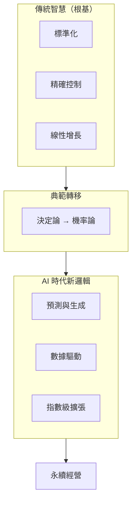

# 經營的本質：AI 時代的典範轉移

> **仿效拉姆·查蘭 (Ram Charan) 風格** —— 剝離複雜理論，直擊商業本質

---

## 書籍定位

經營的本質就是「商業的邏輯」。

在 AI 時代（特別是生成式 AI 普及後），企業的底層運作邏輯正在經歷一場從「決定論」向「機率論」的**典範轉移**。傳統工業時代的邏輯建立在「標準化、精確控制、線性增長」之上，而 AI 時代的新經營邏輯則轉向「預測、生成、指數級擴張」。

本書以經營的四大基本元素為經，以典範轉移為緯，幫助經營者在變局中掌握不變的本質。

---

## 四大元素的典範轉移

| 元素 | 傳統智慧（根基） | AI 時代新邏輯（演進） |
|------|------------------|------------------------|
| **顧客價值** | 提供標準化的優質產品 | 預測與生成個人化體驗 |
| **合理成本** | 供應鏈管理、勞動力套利 | 智力成本邊際歸零、API 經濟 |
| **有效規模** | 物理資產、人力規模擴張 | 數據飛輪、模型護城河 |
| **人性盈利** | 員工幸福、客戶滿意 | 生態協作、代理人經濟 |

---

## 章節結構

| 章節 | 標題 | 核心議題 | 狀態 |
|------|------|----------|------|
| 序 | 經營的邏輯 | 為何需要典範轉移？ | ⏳ 規劃中 |
| 第一章 | 經營的基本元素 | 四大元素的恆常與演進 | ⏳ 規劃中 |
| 第二章 | 策略的本質 | 從線性計畫到機率思維 | ⏳ 規劃中 |
| 第三章 | 行銷的本質 | 從理解消費者到預測需求 | ⏳ 規劃中 |
| 第四章 | 產品的本質 | 從製造到生成 | ⏳ 規劃中 |
| 第五章 | 服務的本質 | 從響應到預測 | ⏳ 規劃中 |
| 第六章 | 共享價值鏈 | 從通路到生態 | ⏳ 規劃中 |
| 第七章 | 品牌的本質 | 從體驗總和到算法信任 | ⏳ 規劃中 |
| 結語 | 誰會被拋棄 | 典範轉移中的生存法則 | ⏳ 規劃中 |

---

## 核心論述框架



---

## 寫作風格

### 拉姆·查蘭風格特點

1. **務實導向**：不談空洞理論，聚焦可執行的商業邏輯
2. **直擊本質**：剝離複雜現象，找出核心元素
3. **案例驅動**：用真實企業故事說明道理
4. **行動框架**：提供可操作的思考框架與檢核清單
5. **對話語氣**：如同顧問與 CEO 對談，簡潔有力

### 典範轉移寫作原則

- **不比較優劣**：傳統智慧是根基，AI 邏輯是演進
- **闡述連續性**：經營本質不變，表現形式在變
- **務實轉型**：幫助讀者理解「如何從這裡到那裡」

### 每章結構

```
1. 開場情境 —— 典範轉移中的真實困境
2. 傳統智慧 —— 這個領域的永恆本質
3. 新邏輯   —— AI 時代的演進方向
4. 轉型路徑 —— 從傳統到新邏輯的橋樑
5. 本章要點 —— 3-5 條核心觀點總結
```

---

## 核心問題

本書回應經營者在典範轉移中最關心的問題：

1. **經營的本質在 AI 時代是否改變？**
   → 本質不變（顧客價值、成本、規模、盈利），但表現形式正在演進

2. **傳統經營智慧還有價值嗎？**
   → 傳統智慧是根基，新邏輯是在此基礎上的演進

3. **如何在典範轉移中生存？**
   → 理解「什麼在變、什麼不變」，掌握轉型路徑

---

## 關鍵概念索引

| 概念 | 說明 | 章節 |
|------|------|------|
| 超個人化 | 千人千面的成本降至極低 | 第三章 |
| 預測性服務 | 在客戶意識到問題前解決 | 第五章 |
| 認知成本崩塌 | 初級認知勞動邊際成本趨零 | 第一章 |
| 數據飛輪 | 越用越聰明的指數級規模效應 | 第一章、第六章 |
| 專有數據護城河 | 私有數據成為核心資產 | 第二章 |
| A2A 商務 | AI 代理人之間的交易談判 | 第七章 |
| 超級個體 | 少數核心決策者指揮 AI Agents | 結語 |

---

## 目錄結構

```
essence-of-management/
├── README.md                    # 專案總覽（本文件）
├── manuscript/
│   └── chapters/
│       ├── 00-preface.md        # 序：經營的邏輯
│       ├── 01-basic-elements.md # 第一章：經營的基本元素
│       ├── 02-strategy.md       # 第二章：策略的本質
│       ├── 03-marketing.md      # 第三章：行銷的本質
│       ├── 04-product.md        # 第四章：產品的本質
│       ├── 05-service.md        # 第五章：服務的本質
│       ├── 06-value-chain.md    # 第六章：共享價值鏈
│       ├── 07-brand.md          # 第七章：品牌的本質
│       └── 08-epilogue.md       # 結語：誰會被拋棄
├── diagrams/                    # Mermaid 架構圖
└── resources/                   # 補充資源與研究
```

---

## 進度追蹤

- **總體狀態**：🔄 典範轉移架構設計中
- **目標字數**：約 8-10 萬字
- **預計章節**：9 篇（序 + 7章 + 結語）
