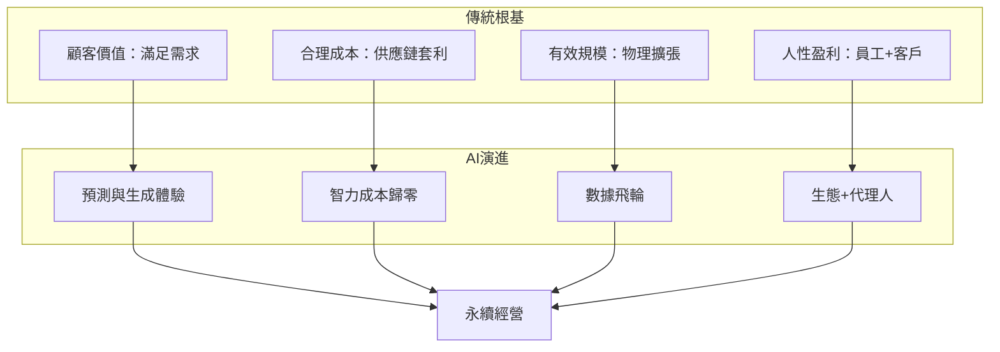

# 第一章：經營的基本元素

> 核心議題：四大元素的恆常與演進

---

## 寫作提示

> 本章定位：全書的理論基石，詳細闘述四大基本元素在傳統與 AI 時代的意涵。
>
> 核心任務：
> - 先建立傳統智慧的根基
> - 再闘述 AI 時代的演進方向
> - 強調連續性，而非斷裂

---

## 章節大綱

### 1. 開場情境：四大元素的永恆性

- 不論時代如何變化，成功企業都掌握了某些「基本」
- 這些基本是什麼？為何它們是「基本」？

### 2. 顧客價值：從滿足到預測

**傳統智慧（根基）**：
- 顧客價值是衡量所有商業行為的基本導向
- 理解顧客需求，提供標準化的優質產品

**AI 時代演進**：
- **超個人化 (Hyper-Personalization)**：千人千面的成本降至極低
- **預測性服務**：在客戶意識到問題前，AI 已預警或解決
- **生成的價值**：用戶從消費者變成共同創作者 (Co-creator)
- 價值不再來自產品本身，而來自產品**適應**用戶情境的能力

### 3. 合理成本：從套利到歸零

**傳統智慧（根基）**：
- 成本不是越低越好，而是「合理」
- 通過供應鏈管理和勞動力套利實現成本優勢

**AI 時代演進**：
- **認知成本崩塌**：閱讀、總結、翻譯、編寫基礎代碼等初級認知勞動，邊際成本趨近於零
- **固定成本 vs. 變動成本翻轉**：軟體開發從高固定成本（團隊）變成變動成本（按 Token 付費）
- **人效新定義**：從「人均產出」到「人均調用的算力與模型能力」

### 4. 有效規模：從物理到數據

**傳統智慧（根基）**：
- 規模要「有效」而非「最大」
- 依賴物理資產或人力規模的擴張

**AI 時代演進**：
- **數據飛輪 (Data Flywheel)**：越用越聰明，指數級而非線性的規模效應
- **專有數據護城河**：當通用大模型成為基礎設施，私有數據成為核心資產
- 規模不再是「越大越好」，而是「越用越聰明」

### 5. 人性盈利：從內部到生態

**傳統智慧（根基）**：
- 盈利要滿足組織發展、客戶需求、員工幸福
- 關注內部員工與外部客戶

**AI 時代演進**：
- **MaaS (Model as a Service)**：從銷售授權到銷售調用
- **A2A 商務**：AI 代理人之間的交易談判
- **超級個體**：少數核心決策者指揮大量 AI Agents
- 經營參與者不再只有「人」，還有「AI Agents」

### 6. 四大元素的整合框架

---

## 本章要點

- [ ] 經營的四大基本元素（顧客價值、成本、規模、盈利）在任何時代都是根基
- [ ] AI 時代不是否定這些元素，而是讓它們以新形式展現
- [ ] 認知成本崩塌和數據飛輪是 AI 時代最顯著的結構性變化
- [ ] 未來的經營參與者包括人與 AI Agents

---

## 正文

<!-- 在此開始撰寫正文 -->

