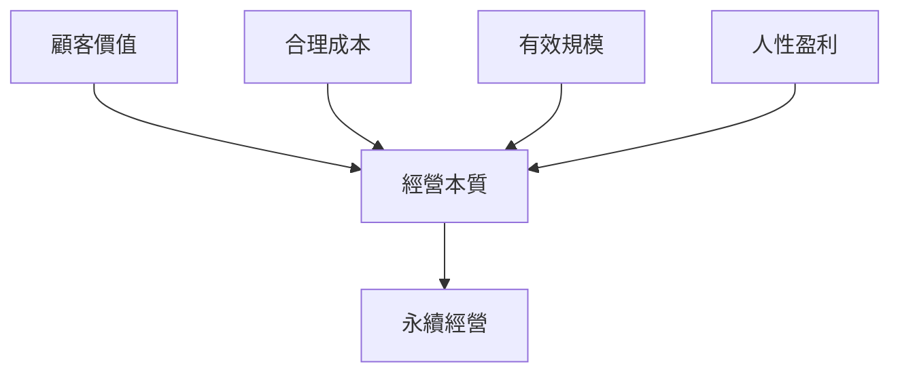

# 第一章：經營的基本元素

---

## 寫作提示

> 本章定位：全書的理論基石，詳細闡述四大基本元素。
>
> 拉姆·查蘭風格要點：
> - 每個元素用一個企業故事帶入
> - 提供可操作的檢核清單
> - 說明元素之間的相互關係

---

## 章節大綱

### 1. 顧客價值

- 什麼是真正的顧客價值？
- 顧客價值 vs 顧客需求的區別
- 案例：真正理解顧客價值的企業

### 2. 有競爭力的合理成本

- 成本不是越低越好
- 「合理」的定義
- 相對優勢的建立

### 3. 有效的規模

- 規模的陷阱
- 什麼是「有效」的規模？
- 永續經營的規模思維

### 4. 深具人性關懷的盈利

- 盈利的三重意涵
  - 組織的發展
  - 客戶的需求
  - 員工的幸福
- 人性盈利 vs 冷血利潤

### 5. 四大元素的整合框架

---

## 本章要點

- [ ] 顧客價值是衡量所有商業行為的基本導向
- [ ] 成本要「合理」而非「最低」
- [ ] 規模要「有效」而非「最大」
- [ ] 盈利要「人性」而非「冷血」

---

## 正文

<!-- 在此開始撰寫正文 -->

