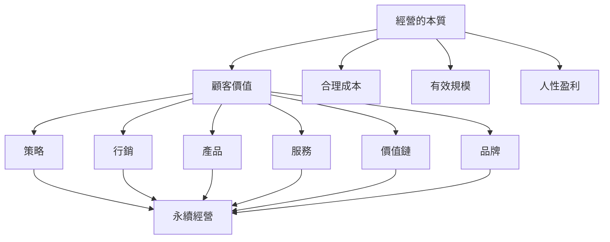

# 結語：誰會被拋棄

---

## 寫作提示

> 本章定位：全書收尾，以警示口吻提醒企業經營者，強化回歸本質的迫切性。
>
> 拉姆·查蘭風格要點：
> - 以被時代拋棄的企業案例開場
> - 總結全書核心觀點
> - 以行動呼籲收尾

---

## 章節大綱

### 1. 被拋棄的企業

- 案例回顧：曾經的巨頭為何消失
- 共同特徵：偏離經營本質
- 警示與反思

### 2. 不會被拋棄的企業

- 持續成功企業的共同特質
- 回歸四大基本元素
- 在變化中保持不變

### 3. 行動呼籲

- 檢視你的企業：是否偏離本質？
- 立即可做的三件事
- 經營者的自我提醒清單

---

## 全書核心觀點回顧

---

## 正文

<!-- 在此開始撰寫正文 -->

