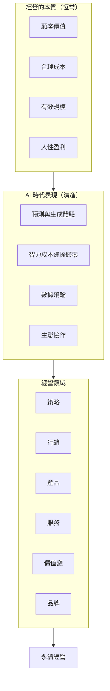

# 結語：誰會被拋棄

> 核心議題：典範轉移中的生存法則

---

## 寫作提示

> 本章定位：全書收尾，以前瞻視角提醒經營者典範轉移中的生存法則。
>
> 核心任務：
> - 不是恐嚇「不轉型就滅亡」
> - 而是幫助讀者理解「什麼在變、什麼不變」
> - 以行動呼籲收尾

---

## 章節大綱

### 1. 開場情境：典範轉移中的企業命運

- 回顧歷史上的典範轉移：誰存活、誰消失
- 工業革命、資訊革命、AI 革命的共同模式
- 被拋棄的從來不是「落後」的，而是「不適應」的

### 2. 會被拋棄的企業特徵

**不是因為不夠「新」，而是因為偏離「本質」**：

- 追逐技術熱潮，忘記顧客價值
- 只看短期成本，忽略長期能力建設
- 追求盲目擴張，忽視「有效」規模
- 只看財務數字，忽略人性關懷

**典範轉移中的致命錯誤**：
- 誤判變化速度（太快或太慢）
- 誤判變化方向（什麼在變、什麼不變）
- 缺乏適應能力（組織僵化）

### 3. 不會被拋棄的企業特徵

**掌握「恆常」與「演進」的平衡**：

| 恆常的本質 | 演進的表現 |
|------------|------------|
| 顧客價值為核心 | 預測與生成體驗 |
| 成本效率 | 智力成本邊際歸零 |
| 有效規模 | 數據飛輪 |
| 人性盈利 | 生態協作 |

**持續成功企業的共同特質**：
- 深刻理解經營本質，不被表象迷惑
- 適應能力強，能在變化中調整
- 長期主義，不追逐短期熱潮

### 4. 超級個體與組織扁平化

**AI 時代的組織形態**：
- 傳統：科層制 (Hierarchy)
- AI 時代：人機協作 (Centaur Teams)
- 超級個體：少數核心決策者指揮大量 AI Agents

**對經營者的啟示**：
- 個人能力的槓桿效應放大
- 核心能力更加重要
- 組織的價值在於「協作」而非「控制」

### 5. 行動呼籲：經營者的自我檢核

**檢視你的企業**：
- [ ] 我們的顧客價值是什麼？這在 AI 時代如何演進？
- [ ] 我們的成本結構是什麼？哪些可以用 AI 優化？
- [ ] 我們的規模優勢是什麼？數據飛輪在哪裡？
- [ ] 我們的盈利模式是什麼？生態協作的機會在哪裡？

**立即可做的三件事**：
1. 審視四大基本元素，確認沒有偏離本質
2. 識別 AI 可以創造價值的環節
3. 建立「實驗-學習-調整」的組織能力

---

## 全書核心觀點回顧

---

## 核心金句

> 「被時代拋棄的，從來不是『落後』的企業，而是偏離經營本質的企業。」

> 「經營的本質不會改變。改變的，是它在每個時代的表現形式。」

> 「理解什麼在變、什麼不變，才能在變局中生存。」

---

## 正文

<!-- 在此開始撰寫正文 -->

