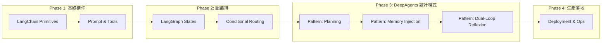

# LangChain 到 DeepAgents 實戰

**從鏈式調用到自主智能體的演進之路**

*LangChain to DeepAgents in Action: Building Autonomous AI Agents from Chain to Deep Intelligence*

---

## 書籍概述

本書定位為「AI 應用架構師」的進階實戰指南。有別於市面上僅介紹 LangChain API 用法的入門書籍，本書主張從「腳本思維 (Scripting)」轉向「系統思維 (Systems Thinking)」。

全書將引導讀者使用 Python 與 LangGraph，從零打造一個企業級智能助理系統「**TechAssist**」。核心策略在於將 DeepAgents 定義為一套通用的 **Agentic Design Patterns (智能體設計模式)**，而非封閉的程式庫。

---

## 技術演進路徑



---

## 核心專案：TechAssist

| 版本 | 階段 | 說明 |
|------|------|------|
| v0.1 | Scripting | 基於 Chain 的簡單問答機器人 |
| v0.5 | Workflow | 引入 LangGraph，具備狀態管理與工具調用 |
| v1.0 | Autonomous | 引入 DeepAgents 設計模式，自主規劃與自我修正 |
| v2.0 | Production | 完整可觀測性、安全性與 K8s 部署架構 |

---

## 技術棧

| 類別 | 技術 |
|------|------|
| 語言 | Python 3.11+ |
| 編排核心 | LangGraph (State Management), LangChain (Integrations) |
| 模型層 | Claude 3.5 Sonnet (Primary), OpenAI GPT-4o (Fallback) |
| 資料層 | PostgreSQL, Qdrant (Vector), Redis (Cache) |
| 維運層 | Docker, Kubernetes, OpenTelemetry |

---

## 章節大綱

### Part 1: LangChain 基礎——構件與工具 (Chapter 1-3)

| 章節 | 標題 | 狀態 |
|------|------|------|
| Ch 1 | 啟程——從 Chain 到 LCEL | ✅ 完成 |
| Ch 2 | Prompt 工程與結構化輸出 | ✅ 完成 |
| Ch 3 | Tool Use——賦予 AI 手腳 | ✅ 完成 |

### Part 2: LangGraph 編排——狀態與流程 (Chapter 4-6)

| 章節 | 標題 | 狀態 |
|------|------|------|
| Ch 4 | 狀態機思維——StateGraph 基礎 | ⏳ 規劃中 |
| Ch 5 | 路由模式與人機協作 (HITL) | ⏳ 規劃中 |
| Ch 6 | 多智能體協作——Supervisor 模式 | ⏳ 規劃中 |

### Part 3: DeepAgents 架構——高階設計模式 (Chapter 7-9)

| 章節 | 標題 | 狀態 |
|------|------|------|
| Ch 7 | 規劃模式 (The Planning Pattern) | ⏳ 規劃中 |
| Ch 8 | 記憶模式 (The Memory Pattern) | ⏳ 規劃中 |
| Ch 9 | 自我修正模式 (The Reflexion Pattern) | ⏳ 規劃中 |

### Part 4: 生產部署——從實驗室到企業 (Chapter 10-13)

| 章節 | 標題 | 狀態 |
|------|------|------|
| Ch 10 | 可觀測性 (Observability) | ⏳ 規劃中 |
| Ch 11 | 安全護欄 (Security & Guardrails) | ⏳ 規劃中 |
| Ch 12 | 效能與成本優化 | ⏳ 規劃中 |
| Ch 13 | 容器化與部署 | ⏳ 規劃中 |

---

## 目標讀者

| 讀者類型 | 技術背景 | 痛點與解決方案 |
|----------|----------|----------------|
| 後端工程師 | Python 中高級、API 開發經驗 | 掌握 LangGraph 狀態管理，提升系統確定性 |
| AI/ML 工程師 | 熟悉 LLM 基礎、Prompt Engineering | 學習將模型封裝進 Agent 架構，實現生產級部署 |
| 技術架構師 | 具備系統設計能力 | 獲得 DeepAgents 設計模式藍圖 |

---

## 專案結構

```
langchain-to-deepagents-in-action/
├── README.md                    # 本文件
├── manuscript/
│   └── chapters/                # 各章節 Markdown 文件
│       ├── ch01-chain-to-lcel.md
│       ├── ch02-prompt-engineering.md
│       └── ...
├── code-examples/               # 完整可運行程式碼
│   ├── part1-langchain-basics/  # Ch 1-3 範例
│   ├── part2-langgraph/         # Ch 4-6 範例
│   ├── part3-deepagents/        # Ch 7-9 範例
│   └── part4-production/        # Ch 10-13 範例
├── diagrams/                    # Mermaid 架構圖
└── resources/                   # 補充資源
```

---

## 寫作風格

本書遵循 **Manning "in Action" 系列** 風格：

1. **專案驅動**：每章以具體企業場景開始
2. **漸進式教學**：從基礎到進階，逐步增加複雜性
3. **完整可運行**：所有程式碼範例可直接執行
4. **詳細註解**：使用 ‹1›, ‹2› 標記關鍵程式碼
5. **解釋「為何」**：說明設計決策的原因
6. **第二人稱**：使用「你」、「我們」的親切語氣

---

## 進度追蹤

- **總章節數**: 13 章
- **已完成**: 3 章 (Part 1 完成)
- **進行中**: Part 2 (Ch 4-6)
- **預計完成**: 2026 Q4

---

*版本: v0.2 | 最後更新: 2026-01-18*
