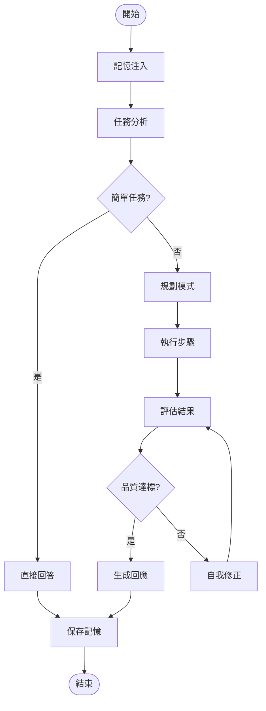

# TechAssist v1.0 - Part 3 程式碼範例

本目錄包含《LangChain 到 DeepAgents 實戰》Part 3（Chapter 7-9）的程式碼範例。

## DeepAgents 設計模式

TechAssist v1.0 整合了三大 DeepAgents 設計模式：

| 模式 | 章節 | 說明 |
|------|------|------|
| Planning Pattern | Ch7 | Planner-Executor-Replanner 動態規劃 |
| Memory Pattern | Ch8 | 三層記憶架構 + 語義注入 |
| Reflexion Pattern | Ch9 | Generator-Evaluator-Refiner 自我修正 |

## 專案結構

```
part3-deepagents/
├── requirements.txt           # 依賴套件
├── planning_agent.py          # 規劃模式範例 (Ch7)
├── memory_agent.py            # 記憶模式範例 (Ch8)
├── reflexion_agent.py         # 自我修正範例 (Ch9)
└── techassist_v10/            # TechAssist v1.0 完整實現
    ├── __init__.py
    ├── config.py              # 配置管理
    ├── state.py               # 統一狀態定義
    ├── planning/              # 規劃模組
    │   ├── __init__.py
    │   ├── planner.py         # 計劃生成器
    │   ├── executor.py        # 步驟執行器
    │   └── replanner.py       # 重規劃器
    ├── memory/                # 記憶模組
    │   ├── __init__.py
    │   ├── short_term.py      # 短期記憶
    │   ├── session.py         # 會話記憶
    │   ├── long_term.py       # 長期記憶
    │   └── semantic_injector.py  # 語義注入器
    ├── reflexion/             # 自我修正模組
    │   ├── __init__.py
    │   ├── generator.py       # 輸出生成器
    │   ├── evaluator.py       # 品質評估器
    │   └── refiner.py         # 修正器
    ├── graph.py               # 主圖組裝
    └── cli.py                 # CLI 介面
```

## 快速開始

### 1. 安裝依賴

```bash
pip install -r requirements.txt
```

### 2. 設定環境變數

```bash
export ANTHROPIC_API_KEY=your-api-key
export QDRANT_URL=http://localhost:6333  # 可選
```

### 3. 執行範例

```bash
# 規劃模式範例 (Chapter 7)
python planning_agent.py

# 記憶模式範例 (Chapter 8)
python memory_agent.py

# 自我修正範例 (Chapter 9)
python reflexion_agent.py

# TechAssist v1.0 完整體驗
python -m techassist_v10.cli
```

## 核心架構

### 統一狀態

```python
class TechAssistState(TypedDict):
    # 基礎狀態
    messages: Annotated[list, add_messages]
    user_id: str
    session_id: str

    # 規劃狀態
    task: str
    plan: Plan | None
    current_step_index: int
    step_results: list[StepResult]

    # 記憶狀態
    short_term_memory: list[dict]
    session_memory: SessionMemory | None
    injected_context: str | None

    # 自我修正狀態
    current_output: str | None
    evaluation: EvaluationResult | None
    reflections: list[str]
    iteration: int
```

### 主圖結構



## 版本演進

| 版本 | 特性 |
|------|------|
| v0.1 | 基本 Chain 問答 |
| v0.3 | Tool Calling |
| v0.5 | LangGraph 狀態管理 |
| v0.7 | 多 Agent 協作 |
| **v1.0** | **DeepAgents 三大模式整合** |

## 相關章節

- Chapter 7: 規劃模式 (The Planning Pattern)
- Chapter 8: 記憶模式 (The Memory Pattern)
- Chapter 9: 自我修正模式 (The Reflexion Pattern)
