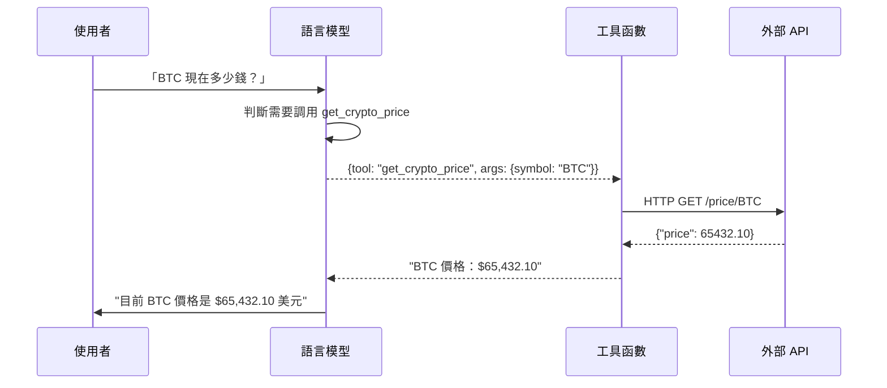

# Chapter 3: Tool Use——賦予 AI 手腳

> 「語言模型只會說話，但工具讓它能夠行動。」

---

## 本章學習目標

完成本章後，你將能夠：

- 理解 Tool Calling（Function Calling）的原理與機制
- 使用 LangChain 定義與綁定工具
- 開發自定義工具（搜尋、API 調用、計算）
- 優雅處理工具錯誤與邊界情況
- 完成 TechAssist v0.3：能夠搜尋文件與執行操作的助理

---

## 3.1 場景引入：當 AI 需要「做事」

TechAssist v0.2 已經能理解使用者意圖，但它有個根本性的限制：**它只能回答，不能行動**。

考慮這些場景：

| 使用者請求 | v0.2 的問題 | 我們期望的能力 |
|------------|------------|----------------|
| 「Python 3.12 有什麼新功能？」 | 只能根據訓練資料回答，可能過時 | 搜尋最新官方文件 |
| 「現在 BTC 價格是多少？」 | 無法存取即時資料 | 調用加密貨幣 API |
| 「幫我計算這個複雜公式」 | 數學運算容易出錯 | 使用計算器工具 |
| 「幫我在資料庫新增一筆記錄」 | 完全無法執行 | 操作資料庫 |

這就是 **Tool Use（工具使用）** 要解決的問題。

---

## 3.2 Tool Calling 原理

### 3.2.1 什麼是 Tool Calling？

Tool Calling（也稱 Function Calling）是讓 LLM 能夠調用外部函數的機制。

核心概念：
1. **LLM 不直接執行工具**——它只決定「要調用什麼工具」和「用什麼參數」
2. **程式負責執行**——你的程式碼接收 LLM 的指令，執行實際操作
3. **結果返回 LLM**——執行結果返回給 LLM，讓它繼續推理



### 3.2.2 Tool Calling vs RAG

Tool Calling 和 RAG（Retrieval-Augmented Generation）都是增強 LLM 能力的方式，但用途不同：

| 面向 | Tool Calling | RAG |
|------|-------------|-----|
| **目的** | 執行操作、獲取即時資料 | 提供相關上下文 |
| **資料類型** | 動態（API 調用結果） | 靜態（預先索引的文件） |
| **時機** | LLM 主動決定調用 | 每次查詢都檢索 |
| **適用場景** | 計算、API 調用、操作 | 知識庫問答、文件查詢 |

在實際應用中，兩者經常結合使用。

---

## 3.3 使用 LangChain 定義工具

### 3.3.1 最簡單的工具：@tool 裝飾器

```python
from langchain_core.tools import tool

@tool
def add_numbers(a: int, b: int) -> int:
    """將兩個數字相加。

    Args:
        a: 第一個數字
        b: 第二個數字

    Returns:
        兩數之和
    """
    return a + b

# 查看工具資訊
print(f"名稱：{add_numbers.name}")
print(f"描述：{add_numbers.description}")
print(f"參數：{add_numbers.args}")
```

輸出：

```
名稱：add_numbers
描述：將兩個數字相加。
參數：{'a': {'title': 'A', 'type': 'integer'}, 'b': {'title': 'B', 'type': 'integer'}}
```

**關鍵點**：
- 函數的 **docstring** 成為工具描述，LLM 用它來判斷何時使用
- **類型提示** 自動轉換為 JSON Schema
- 描述越清晰，LLM 的調用越準確

### 3.3.2 使用 Pydantic 定義複雜參數

當參數結構複雜時，使用 Pydantic：

```python
from langchain_core.tools import tool
from pydantic import BaseModel, Field

class SearchQuery(BaseModel):
    """搜尋查詢參數"""
    query: str = Field(description="搜尋關鍵字")
    max_results: int = Field(default=5, description="最大結果數量")
    language: str = Field(default="zh-TW", description="結果語言")

@tool(args_schema=SearchQuery)
def search_docs(query: str, max_results: int = 5, language: str = "zh-TW") -> str:
    """在技術文件中搜尋相關內容。

    用於查詢技術概念、API 文件、最佳實踐等。
    """
    # 實際的搜尋邏輯
    return f"搜尋 '{query}'，找到 {max_results} 個結果（{language}）"
```

### 3.3.3 使用 StructuredTool 類別

另一種定義工具的方式：

```python
from langchain_core.tools import StructuredTool
from pydantic import BaseModel, Field

class CalculatorInput(BaseModel):
    expression: str = Field(description="要計算的數學表達式，例如 '2 + 2 * 3'")

def calculate(expression: str) -> str:
    """計算數學表達式"""
    try:
        # 安全地計算表達式
        result = eval(expression, {"__builtins__": {}}, {})
        return f"計算結果：{result}"
    except Exception as e:
        return f"計算錯誤：{e}"

calculator = StructuredTool.from_function(
    func=calculate,
    name="calculator",
    description="計算數學表達式。用於需要精確計算時。",
    args_schema=CalculatorInput,
)
```

---

## 3.4 將工具綁定到 LLM

### 3.4.1 基本綁定

```python
from langchain_anthropic import ChatAnthropic
from langchain_core.tools import tool

@tool
def get_current_time() -> str:
    """獲取當前時間。"""
    from datetime import datetime
    return datetime.now().strftime("%Y-%m-%d %H:%M:%S")

@tool
def get_weather(city: str) -> str:
    """獲取指定城市的天氣。

    Args:
        city: 城市名稱
    """
    # 模擬天氣資料
    return f"{city} 目前天氣：晴，25°C"

# ‹1› 建立工具列表
tools = [get_current_time, get_weather]

# ‹2› 綁定工具到 LLM
llm = ChatAnthropic(model="claude-3-5-sonnet-20241022")
llm_with_tools = llm.bind_tools(tools)

# ‹3› 調用
response = llm_with_tools.invoke("現在幾點？台北天氣如何？")
print(response)
```

### 3.4.2 理解 Tool Calls 輸出

當 LLM 決定調用工具時，輸出會包含 `tool_calls`：

```python
response = llm_with_tools.invoke("台北天氣如何？")

print(f"內容：{response.content}")
print(f"工具調用：{response.tool_calls}")

# 輸出：
# 內容：
# 工具調用：[{'name': 'get_weather', 'args': {'city': '台北'}, 'id': 'toolu_01...'}]
```

**重要**：此時工具還沒有被執行！LLM 只是告訴你「我想調用這個工具」。

### 3.4.3 執行工具調用

```python
from langchain_core.messages import ToolMessage

# ‹1› 獲取 LLM 的工具調用請求
response = llm_with_tools.invoke("台北天氣如何？")

# ‹2› 如果有工具調用
if response.tool_calls:
    # ‹3› 執行每個工具調用
    for tool_call in response.tool_calls:
        tool_name = tool_call["name"]
        tool_args = tool_call["args"]
        tool_id = tool_call["id"]

        # 找到對應的工具
        tool_map = {t.name: t for t in tools}
        tool = tool_map[tool_name]

        # 執行工具
        result = tool.invoke(tool_args)

        print(f"工具：{tool_name}")
        print(f"參數：{tool_args}")
        print(f"結果：{result}")
```

---

## 3.5 自動化工具執行：ToolNode

手動執行工具很繁瑣，LangGraph 提供了 `ToolNode` 來自動化這個過程：

```python
from langgraph.prebuilt import ToolNode

# ‹1› 建立 ToolNode
tool_node = ToolNode(tools)

# ‹2› 傳入 LLM 的回應（包含 tool_calls）
response = llm_with_tools.invoke("台北天氣如何？")

# ‹3› ToolNode 自動執行工具並返回結果
tool_results = tool_node.invoke({"messages": [response]})
print(tool_results)
```

在下一章（LangGraph），我們會看到如何將 ToolNode 整合進完整的 Agent 流程。

---

## 3.6 實作企業級工具

### 3.6.1 文件搜尋工具

讓 TechAssist 能夠搜尋技術文件：

```python
# techassist/tools/doc_search.py
from langchain_core.tools import tool
from pydantic import BaseModel, Field
import httpx

class DocSearchInput(BaseModel):
    query: str = Field(description="搜尋關鍵字")
    source: str = Field(
        default="all",
        description="文件來源：python, javascript, docker, kubernetes, all"
    )

@tool(args_schema=DocSearchInput)
def search_documentation(query: str, source: str = "all") -> str:
    """搜尋技術文件庫。

    用於查詢程式語言文件、框架 API、最佳實踐等。
    當使用者詢問特定技術的用法或細節時使用。

    Returns:
        搜尋結果的摘要，包含相關文件片段
    """
    # 模擬文件搜尋（實際可接入 Elasticsearch 或向量資料庫）
    mock_results = {
        "python": {
            "list comprehension": "列表推導式是 Python 中創建列表的簡潔方式...",
            "async await": "Python 3.5+ 支援 async/await 語法進行異步編程...",
        },
        "docker": {
            "dockerfile": "Dockerfile 用於定義 Docker 映像的建置步驟...",
            "compose": "Docker Compose 用於定義多容器應用...",
        }
    }

    # 簡化的搜尋邏輯
    results = []
    for src, docs in mock_results.items():
        if source != "all" and src != source:
            continue
        for keyword, content in docs.items():
            if query.lower() in keyword.lower():
                results.append(f"[{src}] {content}")

    if results:
        return "\n\n".join(results)
    return f"未找到關於 '{query}' 的文件，建議檢查拼寫或嘗試其他關鍵字。"
```

### 3.6.2 API 調用工具

讓 TechAssist 能夠調用外部 API：

```python
# techassist/tools/api_client.py
from langchain_core.tools import tool
from pydantic import BaseModel, Field
import httpx
from typing import Literal

class APIRequestInput(BaseModel):
    method: Literal["GET", "POST"] = Field(description="HTTP 方法")
    url: str = Field(description="API 端點 URL")
    params: dict | None = Field(default=None, description="查詢參數")
    body: dict | None = Field(default=None, description="請求體（POST 時使用）")

@tool(args_schema=APIRequestInput)
def call_api(
    method: str,
    url: str,
    params: dict | None = None,
    body: dict | None = None
) -> str:
    """調用外部 API。

    用於獲取即時資料、與外部服務互動。
    注意：只能調用預先授權的 API 端點。

    Returns:
        API 回應的 JSON 字串
    """
    # 安全檢查：只允許調用白名單 API
    ALLOWED_DOMAINS = [
        "api.github.com",
        "api.coindesk.com",
        "api.openweathermap.org",
    ]

    from urllib.parse import urlparse
    domain = urlparse(url).netloc
    if domain not in ALLOWED_DOMAINS:
        return f"錯誤：不允許調用 {domain}，只能調用授權的 API。"

    try:
        with httpx.Client(timeout=10.0) as client:
            if method == "GET":
                response = client.get(url, params=params)
            else:
                response = client.post(url, json=body)

            response.raise_for_status()
            return response.text[:2000]  # 限制回應長度

    except httpx.TimeoutException:
        return "錯誤：API 請求超時"
    except httpx.HTTPStatusError as e:
        return f"錯誤：API 返回狀態碼 {e.response.status_code}"
    except Exception as e:
        return f"錯誤：{str(e)}"
```

### 3.6.3 安全計算工具

```python
# techassist/tools/calculator.py
from langchain_core.tools import tool
from pydantic import BaseModel, Field
import math

class CalculatorInput(BaseModel):
    expression: str = Field(
        description="數學表達式，支援 +, -, *, /, **, sqrt(), sin(), cos(), log()"
    )

@tool(args_schema=CalculatorInput)
def calculator(expression: str) -> str:
    """計算數學表達式。

    用於需要精確數值計算的場景，例如：
    - 複雜的數學運算
    - 單位轉換
    - 統計計算

    Returns:
        計算結果或錯誤訊息
    """
    # 安全的數學環境
    safe_dict = {
        "abs": abs,
        "round": round,
        "min": min,
        "max": max,
        "sum": sum,
        "pow": pow,
        "sqrt": math.sqrt,
        "sin": math.sin,
        "cos": math.cos,
        "tan": math.tan,
        "log": math.log,
        "log10": math.log10,
        "exp": math.exp,
        "pi": math.pi,
        "e": math.e,
    }

    try:
        # 移除危險的內建函數
        result = eval(expression, {"__builtins__": {}}, safe_dict)
        return f"計算結果：{result}"
    except ZeroDivisionError:
        return "錯誤：除以零"
    except (SyntaxError, NameError) as e:
        return f"錯誤：表達式無效 - {e}"
    except Exception as e:
        return f"計算錯誤：{e}"
```

### 3.6.4 程式碼執行工具（沙箱）

```python
# techassist/tools/code_runner.py
from langchain_core.tools import tool
from pydantic import BaseModel, Field
import subprocess
import tempfile
import os

class CodeInput(BaseModel):
    code: str = Field(description="要執行的 Python 程式碼")
    timeout: int = Field(default=5, description="執行超時秒數（最大 10 秒）")

@tool(args_schema=CodeInput)
def run_python_code(code: str, timeout: int = 5) -> str:
    """在安全沙箱中執行 Python 程式碼。

    用於：
    - 驗證程式碼是否能正確執行
    - 展示程式碼輸出
    - 進行簡單的資料處理

    限制：
    - 最長執行時間 10 秒
    - 無網路存取
    - 無檔案系統寫入權限

    Returns:
        程式碼的標準輸出或錯誤訊息
    """
    # 限制超時
    timeout = min(timeout, 10)

    # 禁止的模組和操作
    forbidden = ["os.system", "subprocess", "open(", "exec(", "eval("]
    for item in forbidden:
        if item in code:
            return f"錯誤：安全限制 - 不允許使用 {item}"

    try:
        # 建立臨時檔案
        with tempfile.NamedTemporaryFile(
            mode='w',
            suffix='.py',
            delete=False
        ) as f:
            f.write(code)
            temp_path = f.name

        # 在子程序中執行
        result = subprocess.run(
            ["python", temp_path],
            capture_output=True,
            text=True,
            timeout=timeout,
        )

        # 清理
        os.unlink(temp_path)

        if result.returncode == 0:
            output = result.stdout.strip() or "(無輸出)"
            return f"執行成功：\n{output}"
        else:
            return f"執行錯誤：\n{result.stderr}"

    except subprocess.TimeoutExpired:
        return f"錯誤：執行超時（超過 {timeout} 秒）"
    except Exception as e:
        return f"錯誤：{e}"
```

---

## 3.7 處理工具錯誤

### 3.7.1 錯誤處理最佳實踐

```python
from langchain_core.tools import tool
from pydantic import BaseModel, Field

class ToolResult(BaseModel):
    """標準化的工具結果"""
    success: bool
    data: str | None = None
    error: str | None = None
    suggestion: str | None = None

@tool
def robust_api_call(endpoint: str) -> str:
    """帶有完整錯誤處理的 API 調用。"""
    import httpx

    try:
        with httpx.Client(timeout=10.0) as client:
            response = client.get(endpoint)
            response.raise_for_status()

            result = ToolResult(
                success=True,
                data=response.text[:1000]
            )

    except httpx.ConnectError:
        result = ToolResult(
            success=False,
            error="無法連接到伺服器",
            suggestion="請檢查網路連線或 API 端點是否正確"
        )
    except httpx.TimeoutException:
        result = ToolResult(
            success=False,
            error="請求超時",
            suggestion="API 伺服器可能繁忙，請稍後重試"
        )
    except httpx.HTTPStatusError as e:
        result = ToolResult(
            success=False,
            error=f"HTTP 錯誤：{e.response.status_code}",
            suggestion="檢查 API 金鑰或請求參數"
        )
    except Exception as e:
        result = ToolResult(
            success=False,
            error=str(e),
            suggestion="發生未預期的錯誤"
        )

    return result.model_dump_json()
```

### 3.7.2 工具回退策略

當主要工具失敗時，嘗試備用方案：

```python
# techassist/tools/search_with_fallback.py
from langchain_core.tools import tool

@tool
def search_with_fallback(query: str) -> str:
    """搜尋技術資訊（帶備用方案）。

    依次嘗試：
    1. 官方文件搜尋
    2. GitHub 搜尋
    3. 網路搜尋

    Returns:
        搜尋結果或所有方案都失敗的提示
    """
    errors = []

    # 嘗試方案 1：官方文件
    try:
        result = _search_official_docs(query)
        if result:
            return f"[官方文件] {result}"
    except Exception as e:
        errors.append(f"官方文件搜尋失敗：{e}")

    # 嘗試方案 2：GitHub
    try:
        result = _search_github(query)
        if result:
            return f"[GitHub] {result}"
    except Exception as e:
        errors.append(f"GitHub 搜尋失敗：{e}")

    # 嘗試方案 3：網路搜尋
    try:
        result = _web_search(query)
        if result:
            return f"[網路搜尋] {result}"
    except Exception as e:
        errors.append(f"網路搜尋失敗：{e}")

    # 所有方案都失敗
    return f"搜尋失敗，嘗試的方案：\n" + "\n".join(errors)

def _search_official_docs(query: str) -> str | None:
    # 實作官方文件搜尋
    pass

def _search_github(query: str) -> str | None:
    # 實作 GitHub 搜尋
    pass

def _web_search(query: str) -> str | None:
    # 實作網路搜尋
    pass
```

---

## 3.8 工具選擇與路由

### 3.8.1 讓 LLM 選擇正確的工具

當有多個工具時，清晰的描述至關重要：

```python
# ❌ 不好的工具描述
@tool
def search(q: str) -> str:
    """搜尋。"""  # 太模糊
    pass

# ✅ 好的工具描述
@tool
def search_python_docs(query: str) -> str:
    """搜尋 Python 官方文件。

    用於：
    - 查詢 Python 內建函數用法
    - 查詢標準庫 API
    - 查詢語法規範

    不適用於：
    - 第三方套件文件（請使用 search_pypi）
    - 一般程式設計問題

    範例查詢：
    - "list append method"
    - "asyncio create_task"
    - "dataclass decorator"
    """
    pass
```

### 3.8.2 強制工具調用

有時你希望 LLM 必須調用工具：

```python
from langchain_anthropic import ChatAnthropic

llm = ChatAnthropic(model="claude-3-5-sonnet-20241022")

# 強制調用特定工具
llm_forced = llm.bind_tools(
    tools,
    tool_choice={"type": "tool", "name": "search_documentation"}
)

# 或者強制調用任一工具（不能不調用）
llm_any_tool = llm.bind_tools(
    tools,
    tool_choice="any"
)
```

### 3.8.3 並行工具調用

現代 LLM 支援一次調用多個工具：

```python
response = llm_with_tools.invoke(
    "同時告訴我台北和東京的天氣"
)

# response.tool_calls 可能包含兩個調用：
# [
#     {"name": "get_weather", "args": {"city": "台北"}, "id": "..."},
#     {"name": "get_weather", "args": {"city": "東京"}, "id": "..."},
# ]

# 可以並行執行
import asyncio

async def execute_tools_parallel(tool_calls: list):
    tasks = []
    for call in tool_calls:
        tool = tool_map[call["name"]]
        tasks.append(tool.ainvoke(call["args"]))
    return await asyncio.gather(*tasks)
```

---

## 3.9 實作：TechAssist v0.3

讓我們將工具整合到 TechAssist 中。

### 3.9.1 工具集合

```python
# techassist/tools/__init__.py
from .doc_search import search_documentation
from .calculator import calculator
from .api_client import call_api
from .code_runner import run_python_code

# 註冊所有可用工具
TECHASSIST_TOOLS = [
    search_documentation,
    calculator,
    call_api,
    run_python_code,
]
```

### 3.9.2 工具感知的助理

```python
# techassist/assistant_v3.py
from langchain_anthropic import ChatAnthropic
from langchain_core.prompts import ChatPromptTemplate, MessagesPlaceholder
from langchain_core.messages import HumanMessage, AIMessage, ToolMessage

from .tools import TECHASSIST_TOOLS

class TechAssistV3:
    """TechAssist v0.3 - 具備工具使用能力"""

    def __init__(self):
        self.llm = ChatAnthropic(model="claude-3-5-sonnet-20241022")
        self.llm_with_tools = self.llm.bind_tools(TECHASSIST_TOOLS)
        self.tool_map = {t.name: t for t in TECHASSIST_TOOLS}

        self.system_prompt = """你是 TechAssist，一個專業的技術助理。

你可以使用以下工具來幫助用戶：
1. search_documentation - 搜尋技術文件
2. calculator - 進行精確計算
3. call_api - 調用外部 API 獲取資料
4. run_python_code - 執行 Python 程式碼

使用工具的原則：
- 當需要最新資訊時，使用搜尋工具
- 當需要精確計算時，使用計算器
- 當用戶提供程式碼想要測試時，使用程式碼執行工具
- 如果不需要工具，直接回答即可

請用繁體中文回答。"""

        self.messages = []

    def chat(self, user_input: str) -> str:
        """處理使用者輸入並返回回應"""
        # 建立訊息列表
        messages = [
            {"role": "system", "content": self.system_prompt},
            *self.messages,
            {"role": "user", "content": user_input}
        ]

        # ‹1› 第一次調用：LLM 決定是否使用工具
        response = self.llm_with_tools.invoke(messages)

        # ‹2› 如果有工具調用
        while response.tool_calls:
            # 記錄 AI 的工具調用請求
            self.messages.append({"role": "assistant", "content": response})

            # ‹3› 執行所有工具調用
            for tool_call in response.tool_calls:
                tool_name = tool_call["name"]
                tool_args = tool_call["args"]
                tool_id = tool_call["id"]

                print(f"  🔧 調用工具：{tool_name}")
                print(f"     參數：{tool_args}")

                # 執行工具
                tool = self.tool_map[tool_name]
                result = tool.invoke(tool_args)

                print(f"     結果：{result[:100]}...")

                # 記錄工具結果
                self.messages.append({
                    "role": "tool",
                    "content": result,
                    "tool_call_id": tool_id
                })

            # ‹4› 再次調用 LLM，讓它處理工具結果
            messages = [
                {"role": "system", "content": self.system_prompt},
                *self.messages,
            ]
            response = self.llm_with_tools.invoke(messages)

        # ‹5› 最終回應
        final_response = response.content
        self.messages.append({"role": "user", "content": user_input})
        self.messages.append({"role": "assistant", "content": final_response})

        return final_response

    def clear_history(self):
        """清除對話歷史"""
        self.messages = []
```

### 3.9.3 更新 CLI

```python
# techassist/cli_v3.py
from .assistant_v3 import TechAssistV3

def run_cli_v3():
    """執行 TechAssist v0.3 CLI"""
    print("=" * 60)
    print("🤖 TechAssist v0.3 - 工具增強版")
    print("=" * 60)
    print("我現在可以搜尋文件、計算和執行程式碼了！")
    print("指令：'quit' 離開, 'clear' 清除對話歷史")
    print("-" * 60)

    assistant = TechAssistV3()

    while True:
        try:
            user_input = input("\n📝 你的問題：").strip()

            if not user_input:
                continue

            if user_input.lower() in ('quit', 'exit', 'q'):
                print("\n👋 感謝使用 TechAssist，再見！")
                break

            if user_input.lower() == 'clear':
                assistant.clear_history()
                print("✨ 對話歷史已清除")
                continue

            print("\n💭 處理中...\n")

            response = assistant.chat(user_input)

            print(f"\n📖 回答：\n{response}")

        except KeyboardInterrupt:
            print("\n\n👋 感謝使用 TechAssist，再見！")
            break
        except Exception as e:
            print(f"\n❌ 發生錯誤：{e}")
```

### 3.9.4 測試範例

```
📝 你的問題：計算 (2^10 + sqrt(144)) / 3.14

💭 處理中...

  🔧 調用工具：calculator
     參數：{'expression': '(2**10 + sqrt(144)) / 3.14'}
     結果：計算結果：329.9363057324841...

📖 回答：
計算結果是約 **329.94**。

詳細過程：
- 2^10 = 1024
- sqrt(144) = 12
- (1024 + 12) / 3.14 ≈ 329.94

--------------------------------------------------

📝 你的問題：搜尋 Python async await 的用法

💭 處理中...

  🔧 調用工具：search_documentation
     參數：{'query': 'async await', 'source': 'python'}
     結果：[python] Python 3.5+ 支援 async/await 語法進行異步編程......

📖 回答：
根據文件搜尋結果，Python 的 async/await 語法用於異步編程...
```

---

## 3.10 本章回顧

### 核心概念

| 概念 | 說明 |
|------|------|
| **Tool Calling** | LLM 決定調用什麼工具，程式執行工具 |
| **@tool 裝飾器** | 快速定義工具的方式 |
| **args_schema** | 使用 Pydantic 定義複雜參數 |
| **bind_tools** | 將工具綁定到 LLM |
| **tool_calls** | LLM 回應中的工具調用列表 |

### 設計原則

1. **清晰的工具描述**：描述越清楚，LLM 調用越準確
2. **優雅的錯誤處理**：工具應返回有意義的錯誤訊息
3. **安全限制**：限制工具的能力範圍，避免安全風險
4. **回退策略**：準備備用方案應對失敗情況

### TechAssist 里程碑

- ✅ v0.1：基於 Chain 的簡單問答
- ✅ v0.2：具備意圖分類與動態路由
- ✅ v0.3：具備工具使用能力（搜尋、計算、執行）

---

## 3.11 下一章預告

TechAssist v0.3 能夠使用工具了，但有個明顯的問題：**它是無狀態的**。每次處理完一個請求，就結束了。它無法：

- 記住使用者之前說過什麼
- 在多個步驟間保持上下文
- 根據之前的結果決定下一步

在下一章，我們將進入 **Part 2: LangGraph 編排**，學習：

- 為什麼需要狀態管理
- StateGraph 的核心概念
- 建立具有循環和條件分支的流程
- TechAssist v0.5：具備狀態管理的工作流

---

## 練習題

1. **基礎練習**：建立一個 `get_random_joke` 工具，調用笑話 API 返回一個笑話。

2. **進階練習**：實作一個 `file_reader` 工具，能讀取專案目錄中的檔案（注意安全限制）。

3. **挑戰練習**：實作工具調用的快取機制——如果相同的工具調用在 5 分鐘內已經執行過，直接返回快取結果。

---

## 延伸閱讀

- [LangChain：Tools 文件](https://python.langchain.com/docs/how_to/tools/)
- [Anthropic：Function Calling 指南](https://docs.anthropic.com/claude/docs/tool-use)
- [OWASP：LLM 應用安全指南](https://owasp.org/www-project-top-10-for-large-language-model-applications/)
