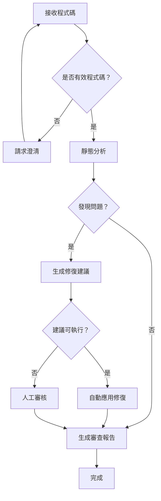
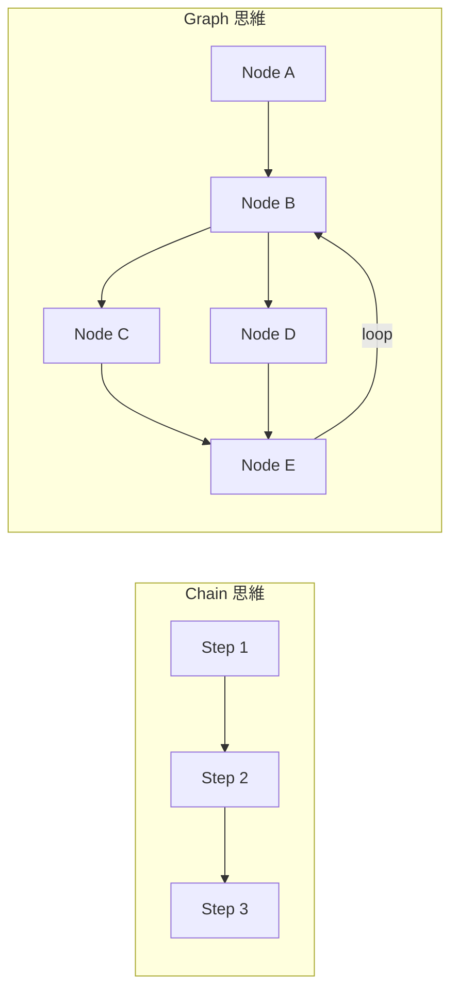
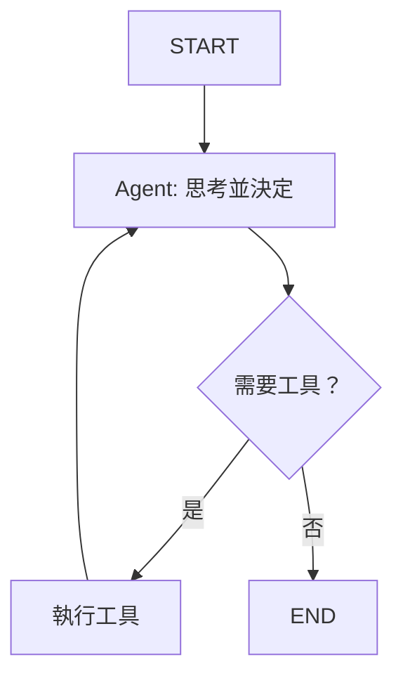

# Chapter 4: 狀態機思維——StateGraph 基礎

> 「複雜系統的關鍵不在於做什麼，而在於如何管理狀態。」

---

## 本章學習目標

完成本章後，你將能夠：

- 理解為什麼需要從 Chain 演進到 Graph
- 掌握 LangGraph 的核心概念：State、Node、Edge
- 設計可靠的狀態 Schema
- 實現循環、重試與錯誤恢復機制
- 完成 TechAssist v0.5：具備狀態管理的工作流

---

## 4.1 場景引入：當 Chain 不夠用時

TechAssist v0.3 能使用工具，但仔細觀察它的工作方式：

```python
# v0.3 的核心邏輯
response = llm_with_tools.invoke(messages)
while response.tool_calls:
    # 執行工具
    for tool_call in response.tool_calls:
        result = tool.invoke(tool_call["args"])
        messages.append(tool_message)
    # 再次調用 LLM
    response = llm_with_tools.invoke(messages)
```

這個 `while` 迴圈看起來簡單，但存在嚴重問題：

| 問題 | 說明 | 後果 |
|------|------|------|
| **無限循環** | 如果 LLM 一直調用工具呢？ | 系統崩潰或帳單爆炸 |
| **錯誤處理** | 工具執行失敗怎麼辦？ | 整個流程終止 |
| **狀態丟失** | 如果程序中斷？ | 必須從頭開始 |
| **可觀測性** | 現在執行到哪一步？ | 完全無法追蹤 |
| **測試困難** | 如何測試特定場景？ | 難以隔離測試 |

這些問題的根源在於：**Chain 是無狀態的線性執行，缺乏對執行流程的精細控制**。

### 4.1.1 真實場景：複雜的工作流

考慮這個真實需求——TechAssist 需要處理程式碼審查：



這個流程有：
- **條件分支**：根據結果走不同路徑
- **循環**：無效輸入需要重新開始
- **人機協作**：某些決策需要人工介入
- **狀態保持**：需要記住之前的分析結果

用 Chain 實現這個流程會變成一堆巢狀的 if-else，難以維護。

**這就是 LangGraph 要解決的問題。**

---

## 4.2 LangGraph 核心概念

### 4.2.1 從 Chain 到 Graph

LangGraph 將應用建模為**有向圖 (Directed Graph)**：

| 概念 | Chain 思維 | Graph 思維 |
|------|-----------|-----------|
| **結構** | 線性序列 | 有向圖 |
| **流程控制** | 固定順序 | 條件分支、循環 |
| **狀態** | 隱式傳遞 | 顯式定義 |
| **錯誤處理** | 拋出異常 | 可恢復的狀態 |
| **可觀測性** | 黑盒 | 每個節點可追蹤 |



### 4.2.2 三大核心元素

LangGraph 的三大核心：

```python
from langgraph.graph import StateGraph

# 1. State：定義資料結構
class MyState(TypedDict):
    messages: list
    current_step: str

# 2. Node：定義處理邏輯
def my_node(state: MyState) -> dict:
    # 處理邏輯
    return {"current_step": "next"}

# 3. Edge：定義流程走向
graph = StateGraph(MyState)
graph.add_node("my_node", my_node)
graph.add_edge("my_node", "next_node")
```

讓我們逐一深入。

---

## 4.3 State：顯式的狀態管理

### 4.3.1 TypedDict 定義狀態

LangGraph 使用 TypedDict 定義狀態結構：

```python
from typing import TypedDict, Annotated
from langgraph.graph.message import add_messages

class AgentState(TypedDict):
    """Agent 的狀態定義

    每個欄位代表狀態的一個面向。
    """
    # ‹1› 對話訊息列表
    messages: Annotated[list, add_messages]

    # ‹2› 當前處理階段
    current_phase: str

    # ‹3› 錯誤計數
    error_count: int

    # ‹4› 中間結果
    intermediate_results: dict
```

**關鍵點解析**：

- ‹1› `Annotated[list, add_messages]`：特殊標記，表示新訊息會**追加**而非覆蓋
- ‹2› 一般欄位：每次更新會**覆蓋**舊值
- ‹3› 計數器：用於追蹤重試次數
- ‹4› 中間結果：儲存處理過程中的資料

### 4.3.2 Reducer：狀態合併策略

當節點返回更新時，LangGraph 需要知道如何合併新舊狀態：

```python
from typing import Annotated
from operator import add

class CounterState(TypedDict):
    # 預設行為：覆蓋
    value: int  # 新值會覆蓋舊值

    # 使用 add reducer：累加
    total: Annotated[int, add]  # 新值會加到舊值上

    # 使用自訂 reducer：追加列表
    history: Annotated[list, lambda old, new: old + new]
```

常見的 Reducer：

| Reducer | 行為 | 使用場景 |
|---------|------|----------|
| `覆蓋（預設）` | 新值取代舊值 | 狀態標記、單一結果 |
| `add_messages` | 追加訊息 | 對話歷史 |
| `operator.add` | 數值累加 | 計數器、分數 |
| `lambda old, new: old + new` | 列表追加 | 日誌、步驟記錄 |

### 4.3.3 設計良好的狀態 Schema

**原則 1：最小化狀態**

```python
# ❌ 不好：狀態過於臃腫
class BadState(TypedDict):
    raw_input: str
    processed_input: str
    llm_response_1: str
    llm_response_2: str
    tool_result_1: str
    tool_result_2: str
    final_output: str
    # ... 更多

# ✅ 好：只保留必要資訊
class GoodState(TypedDict):
    messages: Annotated[list, add_messages]  # 包含所有對話
    phase: str                                # 當前階段
    result: dict | None                       # 最終結果
```

**原則 2：類型清晰**

```python
from enum import Enum

class Phase(str, Enum):
    INIT = "init"
    PROCESSING = "processing"
    REVIEW = "review"
    COMPLETE = "complete"

class TypedState(TypedDict):
    phase: Phase  # 使用 Enum 而非字串
    retry_count: int  # 明確的數值類型
    is_approved: bool  # 明確的布林
```

**原則 3：可序列化**

```python
# ❌ 不好：包含不可序列化的物件
class BadState(TypedDict):
    llm: ChatAnthropic  # LLM 實例不應放在狀態中
    connection: DatabaseConnection  # 連線物件

# ✅ 好：只保留可序列化的資料
class GoodState(TypedDict):
    llm_config: dict  # 配置字典
    query_results: list[dict]  # 純資料
```

---

## 4.4 Node：處理邏輯的封裝

### 4.4.1 節點函數的結構

每個節點是一個函數，接收狀態、返回更新：

```python
def my_node(state: AgentState) -> dict:
    """節點處理函數

    Args:
        state: 當前狀態（完整的 AgentState）

    Returns:
        要更新的狀態欄位（部分更新）
    """
    # 讀取當前狀態
    messages = state["messages"]
    current_phase = state["phase"]

    # 處理邏輯
    result = do_something(messages)

    # 返回要更新的欄位（只需返回要更新的部分）
    return {
        "messages": [result_message],  # 會追加（因為有 add_messages）
        "phase": "next_phase"          # 會覆蓋
    }
```

### 4.4.2 節點類型

**類型 1：處理節點**

```python
def process_node(state: AgentState) -> dict:
    """執行某種處理"""
    input_data = state["messages"][-1].content
    result = process(input_data)
    return {"result": result}
```

**類型 2：LLM 節點**

```python
def llm_node(state: AgentState) -> dict:
    """調用 LLM"""
    llm = ChatAnthropic(model="claude-3-5-sonnet-20241022")
    response = llm.invoke(state["messages"])
    return {"messages": [response]}
```

**類型 3：工具節點**

```python
from langgraph.prebuilt import ToolNode

# 使用預建的 ToolNode
tool_node = ToolNode(tools)
```

**類型 4：條件檢查節點**

```python
def check_node(state: AgentState) -> dict:
    """檢查並設置標記，供後續路由使用"""
    if some_condition(state):
        return {"should_continue": True}
    return {"should_continue": False}
```

### 4.4.3 節點的最佳實踐

**實踐 1：單一職責**

```python
# ❌ 不好：一個節點做太多事
def do_everything(state):
    # 驗證輸入
    # 調用 LLM
    # 執行工具
    # 格式化輸出
    pass

# ✅ 好：每個節點專注一件事
def validate_input(state): ...
def call_llm(state): ...
def execute_tools(state): ...
def format_output(state): ...
```

**實踐 2：冪等性**

```python
# ✅ 好：相同輸入產生相同輸出
def idempotent_node(state: AgentState) -> dict:
    # 基於狀態決定行為，不依賴外部可變狀態
    if state["processed"]:
        return {}  # 已處理過，不重複處理
    result = process(state["input"])
    return {"result": result, "processed": True}
```

**實踐 3：錯誤處理**

```python
def robust_node(state: AgentState) -> dict:
    """帶有錯誤處理的節點"""
    try:
        result = risky_operation(state)
        return {"result": result, "error": None}
    except ValueError as e:
        return {"error": f"驗證錯誤：{e}", "error_count": state["error_count"] + 1}
    except Exception as e:
        return {"error": f"未預期錯誤：{e}", "error_count": state["error_count"] + 1}
```

---

## 4.5 Edge：定義流程走向

### 4.5.1 普通邊 (Normal Edge)

固定的流程走向：

```python
from langgraph.graph import StateGraph, START, END

graph = StateGraph(AgentState)

# 添加節點
graph.add_node("step1", step1_func)
graph.add_node("step2", step2_func)
graph.add_node("step3", step3_func)

# 普通邊：固定走向
graph.set_entry_point("step1")  # START -> step1
graph.add_edge("step1", "step2")  # step1 -> step2
graph.add_edge("step2", "step3")  # step2 -> step3
graph.add_edge("step3", END)      # step3 -> END
```

### 4.5.2 條件邊 (Conditional Edge)

根據狀態決定走向：

```python
def route_function(state: AgentState) -> str:
    """路由函數：根據狀態返回下一個節點名稱"""
    if state.get("error"):
        return "error_handler"
    if state.get("needs_review"):
        return "human_review"
    return "continue"

# 添加條件邊
graph.add_conditional_edges(
    "check_node",      # 來源節點
    route_function,    # 路由函數
    {
        "error_handler": "error_handler",  # 路由結果 -> 目標節點
        "human_review": "human_review",
        "continue": "next_step",
    }
)
```

### 4.5.3 循環邊

創建循環結構：

```python
def should_continue(state: AgentState) -> str:
    """判斷是否繼續循環"""
    if state["iteration"] >= state["max_iterations"]:
        return "exit"
    if state["goal_achieved"]:
        return "exit"
    return "continue"

graph.add_conditional_edges(
    "process",
    should_continue,
    {
        "continue": "process",  # 循環回自己
        "exit": "finalize"
    }
)
```

### 4.5.4 路由模式大全

**模式 1：二元分支**

```python
def binary_route(state) -> str:
    return "yes" if state["condition"] else "no"

graph.add_conditional_edges("check", binary_route, {
    "yes": "path_a",
    "no": "path_b"
})
```

**模式 2：多路分支**

```python
def multi_route(state) -> str:
    intent = state["intent"]
    return {
        "question": "qa_handler",
        "command": "cmd_handler",
        "chat": "chat_handler"
    }.get(intent, "default_handler")
```

**模式 3：工具調用路由**

```python
def tools_condition(state) -> str:
    """檢查 LLM 是否要調用工具"""
    last_message = state["messages"][-1]
    if hasattr(last_message, "tool_calls") and last_message.tool_calls:
        return "tools"
    return "end"

graph.add_conditional_edges("agent", tools_condition, {
    "tools": "tool_executor",
    "end": END
})
```

---

## 4.6 組裝完整的 Graph

### 4.6.1 基本流程

```python
from typing import TypedDict, Annotated
from langgraph.graph import StateGraph, START, END
from langgraph.graph.message import add_messages

# ‹1› 定義狀態
class State(TypedDict):
    messages: Annotated[list, add_messages]
    step: str

# ‹2› 定義節點
def node_a(state: State) -> dict:
    return {"step": "a_done"}

def node_b(state: State) -> dict:
    return {"step": "b_done"}

# ‹3› 建立圖
graph = StateGraph(State)

# ‹4› 添加節點
graph.add_node("a", node_a)
graph.add_node("b", node_b)

# ‹5› 添加邊
graph.add_edge(START, "a")
graph.add_edge("a", "b")
graph.add_edge("b", END)

# ‹6› 編譯
app = graph.compile()

# ‹7› 執行
result = app.invoke({"messages": [], "step": "init"})
```

### 4.6.2 視覺化 Graph

```python
# 生成 Mermaid 圖表
print(app.get_graph().draw_mermaid())

# 或者保存為 PNG（需要 graphviz）
app.get_graph().draw_png("graph.png")
```

### 4.6.3 串流執行

```python
# 串流執行，觀察每一步
for event in app.stream({"messages": [], "step": "init"}):
    print(f"事件：{event}")

# 輸出：
# 事件：{'a': {'step': 'a_done'}}
# 事件：{'b': {'step': 'b_done'}}
```

---

## 4.7 實作：ReAct Agent

讓我們實作經典的 ReAct (Reasoning + Acting) Agent：

### 4.7.1 ReAct 架構



### 4.7.2 完整實現

```python
from typing import TypedDict, Annotated
from langchain_anthropic import ChatAnthropic
from langchain_core.messages import HumanMessage, AIMessage
from langgraph.graph import StateGraph, START, END
from langgraph.graph.message import add_messages
from langgraph.prebuilt import ToolNode

# ============================================================
# 1. 定義狀態
# ============================================================

class AgentState(TypedDict):
    """ReAct Agent 的狀態"""
    messages: Annotated[list, add_messages]
    iteration: int

# ============================================================
# 2. 定義工具
# ============================================================

from langchain_core.tools import tool

@tool
def search(query: str) -> str:
    """搜尋技術文件"""
    return f"搜尋結果：關於 '{query}' 的資訊..."

@tool
def calculator(expression: str) -> str:
    """計算數學表達式"""
    try:
        return f"計算結果：{eval(expression)}"
    except:
        return "計算錯誤"

tools = [search, calculator]

# ============================================================
# 3. 定義節點
# ============================================================

# LLM 節點
llm = ChatAnthropic(model="claude-3-5-sonnet-20241022")
llm_with_tools = llm.bind_tools(tools)

def agent_node(state: AgentState) -> dict:
    """Agent 思考節點：決定下一步行動"""
    response = llm_with_tools.invoke(state["messages"])
    return {
        "messages": [response],
        "iteration": state["iteration"] + 1
    }

# 工具執行節點（使用預建的 ToolNode）
tool_node = ToolNode(tools)

# ============================================================
# 4. 定義路由
# ============================================================

def should_continue(state: AgentState) -> str:
    """判斷是否繼續執行工具"""
    # 檢查迭代次數限制
    if state["iteration"] >= 10:
        return "end"

    # 檢查最後一條訊息是否有工具調用
    last_message = state["messages"][-1]
    if hasattr(last_message, "tool_calls") and last_message.tool_calls:
        return "tools"

    return "end"

# ============================================================
# 5. 組裝 Graph
# ============================================================

graph = StateGraph(AgentState)

# 添加節點
graph.add_node("agent", agent_node)
graph.add_node("tools", tool_node)

# 添加邊
graph.add_edge(START, "agent")
graph.add_conditional_edges(
    "agent",
    should_continue,
    {
        "tools": "tools",
        "end": END
    }
)
graph.add_edge("tools", "agent")  # 工具執行後回到 agent

# 編譯
react_agent = graph.compile()

# ============================================================
# 6. 執行
# ============================================================

def run_agent(question: str):
    """運行 ReAct Agent"""
    initial_state = {
        "messages": [HumanMessage(content=question)],
        "iteration": 0
    }

    print(f"問題：{question}\n")
    print("執行過程：")
    print("-" * 50)

    for event in react_agent.stream(initial_state):
        for node_name, output in event.items():
            print(f"[{node_name}]")
            if "messages" in output:
                for msg in output["messages"]:
                    if hasattr(msg, "tool_calls") and msg.tool_calls:
                        for tc in msg.tool_calls:
                            print(f"  調用工具：{tc['name']}({tc['args']})")
                    elif hasattr(msg, "content") and msg.content:
                        print(f"  {msg.content[:200]}...")
        print()

    # 獲取最終結果
    final_state = react_agent.invoke(initial_state)
    return final_state["messages"][-1].content

# 測試
if __name__ == "__main__":
    result = run_agent("搜尋 Python asyncio 的用法，然後計算 2^10")
    print("最終回答：")
    print(result)
```

---

## 4.8 實作：TechAssist v0.5

現在讓我們將 TechAssist 升級為基於 LangGraph 的版本。

### 4.8.1 設計狀態

```python
# techassist/state.py
from typing import TypedDict, Annotated, Literal
from langgraph.graph.message import add_messages
from enum import Enum

class Phase(str, Enum):
    """處理階段"""
    INIT = "init"
    CLASSIFYING = "classifying"
    PROCESSING = "processing"
    TOOL_EXECUTING = "tool_executing"
    REVIEWING = "reviewing"
    COMPLETE = "complete"
    ERROR = "error"

class TechAssistState(TypedDict):
    """TechAssist v0.5 狀態"""

    # 對話訊息
    messages: Annotated[list, add_messages]

    # 當前階段
    phase: Phase

    # 分類結果
    intent: str | None
    confidence: float

    # 工具執行
    pending_tools: list[dict]
    tool_results: list[dict]

    # 控制標記
    iteration: int
    max_iterations: int
    needs_human_review: bool

    # 錯誤處理
    error: str | None
    error_count: int
```

### 4.8.2 定義節點

```python
# techassist/nodes.py
from langchain_anthropic import ChatAnthropic
from langchain_core.messages import AIMessage, HumanMessage, SystemMessage

from .state import TechAssistState, Phase
from .tools import TECHASSIST_TOOLS

llm = ChatAnthropic(model="claude-3-5-sonnet-20241022")
llm_with_tools = llm.bind_tools(TECHASSIST_TOOLS)

# ------------------------------------------------------------
# 入口節點
# ------------------------------------------------------------

def entry_node(state: TechAssistState) -> dict:
    """入口節點：初始化狀態"""
    return {
        "phase": Phase.CLASSIFYING,
        "iteration": 0,
        "error_count": 0
    }

# ------------------------------------------------------------
# 意圖分類節點
# ------------------------------------------------------------

CLASSIFY_PROMPT = """分析用戶的輸入，判斷意圖：
- tech_question: 技術問題
- code_help: 程式碼相關
- general: 一般對話

只回覆意圖類型，不要其他內容。"""

def classify_node(state: TechAssistState) -> dict:
    """意圖分類節點"""
    messages = [
        SystemMessage(content=CLASSIFY_PROMPT),
        state["messages"][-1]
    ]

    response = llm.invoke(messages)
    intent = response.content.strip().lower()

    # 簡單的信心分數邏輯
    confidence = 0.9 if intent in ["tech_question", "code_help", "general"] else 0.5

    return {
        "intent": intent,
        "confidence": confidence,
        "phase": Phase.PROCESSING
    }

# ------------------------------------------------------------
# 主處理節點
# ------------------------------------------------------------

SYSTEM_PROMPT = """你是 TechAssist，專業的技術助理。
使用繁體中文回答。如需要外部資訊，使用提供的工具。"""

def process_node(state: TechAssistState) -> dict:
    """主處理節點：調用 LLM（可能調用工具）"""
    messages = [
        SystemMessage(content=SYSTEM_PROMPT),
        *state["messages"]
    ]

    response = llm_with_tools.invoke(messages)

    return {
        "messages": [response],
        "iteration": state["iteration"] + 1,
        "phase": Phase.TOOL_EXECUTING if response.tool_calls else Phase.COMPLETE
    }

# ------------------------------------------------------------
# 工具執行節點
# ------------------------------------------------------------

from langgraph.prebuilt import ToolNode

tool_executor = ToolNode(TECHASSIST_TOOLS)

def tool_node(state: TechAssistState) -> dict:
    """工具執行節點"""
    # ToolNode 會自動處理工具調用
    result = tool_executor.invoke(state)

    return {
        **result,
        "phase": Phase.PROCESSING  # 回到處理節點繼續
    }

# ------------------------------------------------------------
# 錯誤處理節點
# ------------------------------------------------------------

def error_node(state: TechAssistState) -> dict:
    """錯誤處理節點"""
    error_message = AIMessage(
        content=f"抱歉，處理過程中發生錯誤：{state['error']}\n請嘗試重新描述您的問題。"
    )

    return {
        "messages": [error_message],
        "phase": Phase.COMPLETE,
        "error_count": state["error_count"] + 1
    }

# ------------------------------------------------------------
# 完成節點
# ------------------------------------------------------------

def complete_node(state: TechAssistState) -> dict:
    """完成節點：最終處理"""
    return {"phase": Phase.COMPLETE}
```

### 4.8.3 定義路由

```python
# techassist/routing.py
from .state import TechAssistState, Phase

def route_after_process(state: TechAssistState) -> str:
    """處理節點後的路由"""
    # 檢查迭代限制
    if state["iteration"] >= state["max_iterations"]:
        return "complete"

    # 檢查是否有工具調用
    last_message = state["messages"][-1]
    if hasattr(last_message, "tool_calls") and last_message.tool_calls:
        return "tools"

    # 檢查是否需要人工審核
    if state.get("needs_human_review"):
        return "review"

    return "complete"

def route_after_classify(state: TechAssistState) -> str:
    """分類後的路由"""
    if state["confidence"] < 0.5:
        return "clarify"
    return "process"
```

### 4.8.4 組裝 Graph

```python
# techassist/graph.py
from langgraph.graph import StateGraph, START, END

from .state import TechAssistState, Phase
from .nodes import (
    entry_node,
    classify_node,
    process_node,
    tool_node,
    error_node,
    complete_node,
)
from .routing import route_after_process, route_after_classify

def create_techassist_graph():
    """建立 TechAssist v0.5 Graph"""

    graph = StateGraph(TechAssistState)

    # 添加節點
    graph.add_node("entry", entry_node)
    graph.add_node("classify", classify_node)
    graph.add_node("process", process_node)
    graph.add_node("tools", tool_node)
    graph.add_node("error", error_node)
    graph.add_node("complete", complete_node)

    # 添加邊
    graph.add_edge(START, "entry")
    graph.add_edge("entry", "classify")

    # 分類後的條件路由
    graph.add_conditional_edges(
        "classify",
        route_after_classify,
        {
            "process": "process",
            "clarify": "complete"  # 簡化：低信心直接完成
        }
    )

    # 處理後的條件路由
    graph.add_conditional_edges(
        "process",
        route_after_process,
        {
            "tools": "tools",
            "complete": "complete",
            "review": "complete"  # 簡化：人工審核暫時跳過
        }
    )

    # 工具執行後回到處理
    graph.add_edge("tools", "process")

    # 錯誤和完成都結束
    graph.add_edge("error", END)
    graph.add_edge("complete", END)

    return graph.compile()

# 建立應用實例
techassist_app = create_techassist_graph()
```

### 4.8.5 CLI 介面

```python
# techassist/cli_v5.py
from langchain_core.messages import HumanMessage

from .graph import techassist_app
from .state import Phase

def run_cli_v5():
    """執行 TechAssist v0.5 CLI"""
    print("=" * 60)
    print("🤖 TechAssist v0.5 - LangGraph 版本")
    print("=" * 60)
    print("現在使用 LangGraph 進行狀態管理！")
    print("輸入 'quit' 離開。")
    print("-" * 60)

    while True:
        try:
            user_input = input("\n📝 你的問題：").strip()

            if not user_input:
                continue

            if user_input.lower() in ('quit', 'exit', 'q'):
                print("\n👋 感謝使用 TechAssist，再見！")
                break

            print("\n💭 處理中...\n")

            # 初始狀態
            initial_state = {
                "messages": [HumanMessage(content=user_input)],
                "phase": Phase.INIT,
                "intent": None,
                "confidence": 0.0,
                "pending_tools": [],
                "tool_results": [],
                "iteration": 0,
                "max_iterations": 5,
                "needs_human_review": False,
                "error": None,
                "error_count": 0,
            }

            # 串流執行
            for event in techassist_app.stream(initial_state):
                for node_name, output in event.items():
                    if node_name == "classify":
                        print(f"📊 意圖：{output.get('intent')} (信心：{output.get('confidence', 0):.0%})")
                    elif node_name == "tools":
                        print("🔧 執行工具...")
                    elif node_name == "process":
                        msgs = output.get("messages", [])
                        for msg in msgs:
                            if hasattr(msg, "tool_calls") and msg.tool_calls:
                                for tc in msg.tool_calls:
                                    print(f"  → 調用：{tc['name']}")

            # 獲取最終結果
            final_state = techassist_app.invoke(initial_state)
            final_message = final_state["messages"][-1]

            print(f"\n📖 回答：\n{final_message.content}")

        except KeyboardInterrupt:
            print("\n\n👋 感謝使用 TechAssist，再見！")
            break
        except Exception as e:
            print(f"\n❌ 發生錯誤：{e}")

if __name__ == "__main__":
    run_cli_v5()
```

---

## 4.9 本章回顧

### 核心概念

| 概念 | 說明 | 關鍵方法 |
|------|------|----------|
| **State** | 顯式定義的狀態結構 | `TypedDict`, `Annotated` |
| **Node** | 處理邏輯的封裝 | 函數，接收 state 返回更新 |
| **Edge** | 流程走向定義 | `add_edge`, `add_conditional_edges` |
| **Reducer** | 狀態合併策略 | `add_messages`, `operator.add` |

### 設計原則

1. **顯式狀態**：所有重要資訊都在狀態中，不依賴隱式傳遞
2. **單一職責**：每個節點只做一件事
3. **可恢復性**：狀態可序列化，支援斷點恢復
4. **可觀測性**：每個節點的執行都可追蹤

### TechAssist 里程碑

- ✅ v0.1：基於 Chain 的簡單問答
- ✅ v0.2：具備意圖分類與動態路由
- ✅ v0.3：具備工具使用能力
- ✅ v0.5：基於 LangGraph 的狀態管理

---

## 4.10 下一章預告

TechAssist v0.5 有了狀態管理，但還缺少一些關鍵能力：

- **人機協作**：某些決策需要人工確認
- **動態路由**：根據信心分數選擇不同路徑
- **中斷與恢復**：長時間任務的斷點續傳

在下一章，我們將學習 **路由模式與人機協作 (HITL)**：

- 實現 Human-in-the-Loop 流程
- 使用 Checkpointer 保存狀態
- 建立中斷與恢復機制

---

## 練習題

1. **基礎練習**：為 ReAct Agent 添加一個 `get_time` 工具，讓它能回答當前時間。

2. **進階練習**：修改 TechAssist v0.5，當迭代次數超過限制時，返回一個友善的提示訊息而非直接結束。

3. **挑戰練習**：實現一個「代碼審查」Graph，包含：解析代碼 → 靜態分析 → 生成建議 → 格式化輸出 四個節點。

---

## 延伸閱讀

- [LangGraph 官方文件](https://langchain-ai.github.io/langgraph/)
- [LangGraph 概念指南](https://langchain-ai.github.io/langgraph/concepts/)
- [狀態機設計模式](https://refactoring.guru/design-patterns/state)
