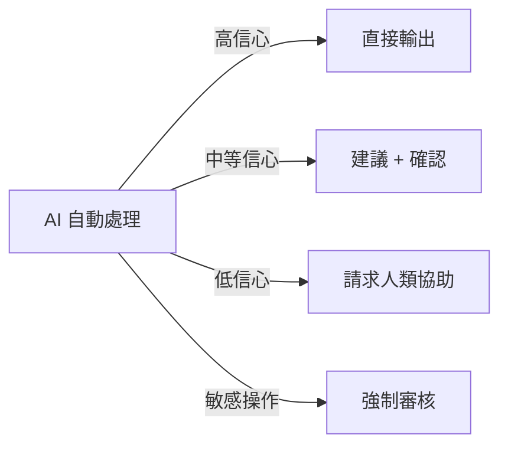
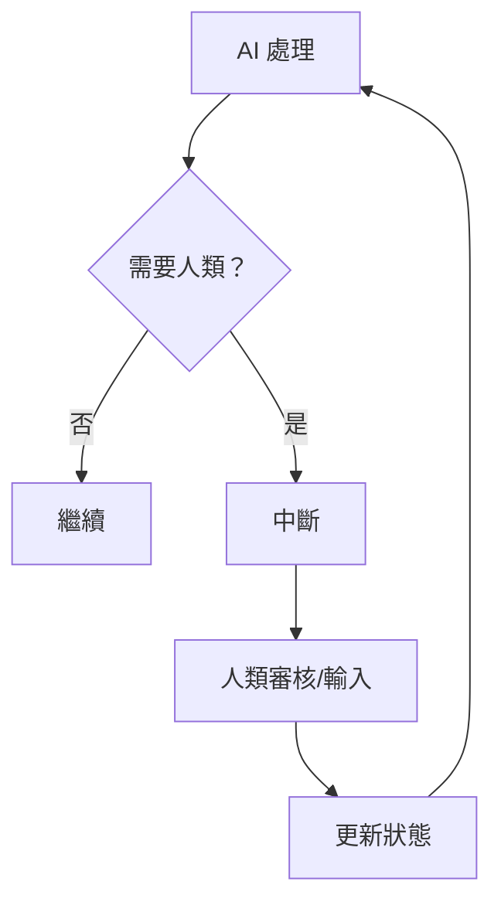

# Chapter 5: 路由模式與人機協作 (HITL)

> 「最好的 AI 系統知道何時該讓人類介入。」

---

## 本章學習目標

完成本章後，你將能夠：

- 掌握進階路由模式：基於信心分數、多條件、動態路由
- 實現 Human-in-the-Loop (HITL) 流程
- 使用 Checkpointer 保存與恢復狀態
- 設計中斷點與人工審核機制
- 完成 TechAssist v0.6：具備人機協作能力的助理

---

## 5.1 場景引入：為什麼需要人機協作？

TechAssist v0.5 能自動處理大多數請求，但有些場景需要人類介入：

| 場景 | 問題 | 解決方案 |
|------|------|----------|
| **低信心回答** | LLM 不確定時可能瞎猜 | 讓人類確認或補充 |
| **敏感操作** | 刪除資料、發送郵件 | 人工審批 |
| **資訊不足** | 缺少必要上下文 | 請求用戶澄清 |
| **高風險決策** | 金融、醫療建議 | 人類最終決定 |
| **學習改進** | 收集人類反饋 | 改善未來回答 |

這就是 **Human-in-the-Loop (HITL)** 的價值。

### 5.1.1 HITL 的設計原則

好的 HITL 系統應該：



**原則 1：漸進式介入**
- 不是所有請求都需要人類
- 只在必要時才中斷

**原則 2：保留上下文**
- 人類介入時能看到完整資訊
- 中斷後能無縫繼續

**原則 3：時間容忍**
- 長時間等待人類回應
- 狀態持久化

---

## 5.2 進階路由模式

### 5.2.1 基於信心分數的路由

```python
from typing import TypedDict, Literal

class RoutingState(TypedDict):
    query: str
    response: str
    confidence: float
    route_taken: str

def confidence_router(state: RoutingState) -> Literal["high", "medium", "low"]:
    """基於信心分數路由"""
    confidence = state["confidence"]

    if confidence >= 0.8:
        return "high"      # 直接輸出
    elif confidence >= 0.5:
        return "medium"    # 輸出但標記不確定
    else:
        return "low"       # 請求人類協助

# 在 Graph 中使用
graph.add_conditional_edges(
    "generate_response",
    confidence_router,
    {
        "high": "output",
        "medium": "add_disclaimer",
        "low": "request_human_help"
    }
)
```

### 5.2.2 多條件路由

當路由邏輯複雜時，使用結構化的判斷：

```python
from dataclasses import dataclass

@dataclass
class RoutingDecision:
    """路由決策"""
    destination: str
    reason: str
    priority: int

def complex_router(state: AgentState) -> str:
    """多條件路由器"""
    decisions = []

    # 條件 1：錯誤檢查（最高優先）
    if state.get("error"):
        decisions.append(RoutingDecision(
            destination="error_handler",
            reason="存在錯誤需要處理",
            priority=100
        ))

    # 條件 2：迭代限制
    if state["iteration"] >= state["max_iterations"]:
        decisions.append(RoutingDecision(
            destination="force_complete",
            reason="達到迭代上限",
            priority=90
        ))

    # 條件 3：敏感操作檢測
    if detect_sensitive_operation(state):
        decisions.append(RoutingDecision(
            destination="human_approval",
            reason="檢測到敏感操作",
            priority=80
        ))

    # 條件 4：工具調用
    last_msg = state["messages"][-1]
    if hasattr(last_msg, "tool_calls") and last_msg.tool_calls:
        decisions.append(RoutingDecision(
            destination="tools",
            reason="需要執行工具",
            priority=50
        ))

    # 條件 5：預設完成
    decisions.append(RoutingDecision(
        destination="complete",
        reason="預設路徑",
        priority=0
    ))

    # 選擇最高優先級
    best = max(decisions, key=lambda d: d.priority)
    return best.destination
```

### 5.2.3 動態路由表

有時路由目標本身是動態的：

```python
def dynamic_router(state: AgentState) -> str:
    """動態路由：根據意圖選擇處理器"""
    intent = state.get("intent", "unknown")

    # 動態路由表（可從配置或資料庫載入）
    routing_table = {
        "tech_question": "tech_qa_handler",
        "code_review": "code_review_handler",
        "code_generation": "code_gen_handler",
        "troubleshooting": "debug_handler",
        "comparison": "comparison_handler",
    }

    # 查找或使用預設
    return routing_table.get(intent, "default_handler")

# 動態目標需要在 Graph 中預先註冊
graph.add_conditional_edges(
    "classify",
    dynamic_router,
    {
        "tech_qa_handler": "tech_qa_handler",
        "code_review_handler": "code_review_handler",
        "code_gen_handler": "code_gen_handler",
        "debug_handler": "debug_handler",
        "comparison_handler": "comparison_handler",
        "default_handler": "default_handler",
    }
)
```

### 5.2.4 路由模式：分層決策

```python
def layered_router(state: AgentState) -> str:
    """分層路由：先檢查系統級，再檢查業務級"""

    # Layer 1: 系統級檢查
    system_route = check_system_conditions(state)
    if system_route:
        return system_route

    # Layer 2: 安全檢查
    security_route = check_security(state)
    if security_route:
        return security_route

    # Layer 3: 業務邏輯
    business_route = check_business_logic(state)
    if business_route:
        return business_route

    # Layer 4: 預設
    return "default"

def check_system_conditions(state) -> str | None:
    """系統級條件"""
    if state.get("error"):
        return "error_handler"
    if state["iteration"] >= 10:
        return "timeout_handler"
    return None

def check_security(state) -> str | None:
    """安全檢查"""
    if contains_pii(state["messages"]):
        return "pii_handler"
    if is_injection_attempt(state["messages"]):
        return "security_block"
    return None

def check_business_logic(state) -> str | None:
    """業務邏輯"""
    if state.get("needs_approval"):
        return "approval_flow"
    if state.get("is_premium_user"):
        return "premium_handler"
    return None
```

---

## 5.3 Checkpointer：狀態持久化

### 5.3.1 為什麼需要 Checkpointer？

HITL 流程可能持續很長時間：

1. 用戶提交請求
2. AI 處理並請求審核
3. **等待數小時**
4. 管理員審核通過
5. AI 繼續執行

在這個過程中，狀態必須持久化，否則：
- 程序重啟會丟失所有上下文
- 無法追蹤歷史狀態
- 無法實現斷點恢復

### 5.3.2 MemorySaver：記憶體 Checkpointer

最簡單的 Checkpointer，適合開發測試：

```python
from langgraph.checkpoint.memory import MemorySaver

# 建立 Checkpointer
memory = MemorySaver()

# 編譯時指定 Checkpointer
app = graph.compile(checkpointer=memory)

# 執行時指定 thread_id
config = {"configurable": {"thread_id": "user-123"}}

# 第一次執行
result1 = app.invoke(
    {"messages": [HumanMessage(content="你好")]},
    config=config
)

# 第二次執行（同一個 thread_id）會繼續之前的對話
result2 = app.invoke(
    {"messages": [HumanMessage(content="剛才說了什麼？")]},
    config=config
)
```

### 5.3.3 SqliteSaver：持久化 Checkpointer

生產環境使用 SQLite 或 PostgreSQL：

```python
from langgraph.checkpoint.sqlite import SqliteSaver

# 使用 SQLite
with SqliteSaver.from_conn_string(":memory:") as memory:
    app = graph.compile(checkpointer=memory)

    config = {"configurable": {"thread_id": "conversation-001"}}
    result = app.invoke(initial_state, config=config)

# 使用檔案持久化
import sqlite3

conn = sqlite3.connect("checkpoints.db", check_same_thread=False)
memory = SqliteSaver(conn)
app = graph.compile(checkpointer=memory)
```

### 5.3.4 查看歷史狀態

```python
# 獲取所有狀態快照
config = {"configurable": {"thread_id": "user-123"}}

for state in app.get_state_history(config):
    print(f"步驟：{state.step}")
    print(f"狀態：{state.values}")
    print(f"時間：{state.created_at}")
    print("-" * 40)

# 獲取特定檢查點的狀態
snapshot = app.get_state(config)
print(f"當前狀態：{snapshot.values}")
print(f"下一步：{snapshot.next}")  # 下一個要執行的節點
```

### 5.3.5 狀態回溯

```python
# 回到之前的狀態
config = {"configurable": {"thread_id": "user-123"}}

# 獲取歷史
history = list(app.get_state_history(config))

# 選擇要回溯的狀態（例如第 3 個）
target_state = history[2]

# 從該狀態繼續執行
result = app.invoke(
    None,  # 不提供新輸入，使用歷史狀態
    config={
        "configurable": {
            "thread_id": "user-123",
            "checkpoint_id": target_state.config["configurable"]["checkpoint_id"]
        }
    }
)
```

---

## 5.4 中斷機制：實現人機協作

### 5.4.1 interrupt_before：節點執行前中斷

```python
from langgraph.graph import StateGraph, START, END

graph = StateGraph(AgentState)
graph.add_node("classify", classify_node)
graph.add_node("sensitive_action", sensitive_action_node)
graph.add_node("execute", execute_node)

# 在 sensitive_action 節點**執行前**中斷
app = graph.compile(
    checkpointer=memory,
    interrupt_before=["sensitive_action"]
)
```

執行流程：

```python
config = {"configurable": {"thread_id": "task-001"}}

# 執行會在 sensitive_action 前停止
result = app.invoke(initial_state, config=config)

# 檢查狀態
snapshot = app.get_state(config)
print(f"下一步：{snapshot.next}")  # ['sensitive_action']

# 人類審核後繼續（或修改狀態後繼續）
final_result = app.invoke(None, config=config)
```

### 5.4.2 interrupt_after：節點執行後中斷

```python
# 在 generate_plan 節點**執行後**中斷
app = graph.compile(
    checkpointer=memory,
    interrupt_after=["generate_plan"]
)
```

這讓人類能夠：
- 查看 AI 生成的計劃
- 修改計劃後再繼續執行

### 5.4.3 動態中斷：NodeInterrupt

有時需要在節點內部決定是否中斷：

```python
from langgraph.errors import NodeInterrupt

def sensitive_operation(state: AgentState) -> dict:
    """可能需要中斷的敏感操作"""

    # 檢查是否已獲得批准
    if state.get("approved"):
        # 執行實際操作
        result = perform_operation()
        return {"result": result}

    # 未批准，主動中斷並請求審核
    raise NodeInterrupt(
        "此操作需要管理員批准。\n"
        f"操作類型：{state['operation_type']}\n"
        f"影響範圍：{state['scope']}"
    )
```

### 5.4.4 修改狀態後繼續

中斷後，人類可以修改狀態：

```python
config = {"configurable": {"thread_id": "task-001"}}

# 執行到中斷點
result = app.invoke(initial_state, config=config)

# 獲取當前狀態
snapshot = app.get_state(config)
print(f"等待審核：{snapshot.values}")

# 人類審核：批准
app.update_state(
    config,
    {"approved": True, "approver": "admin@company.com"}
)

# 繼續執行
final_result = app.invoke(None, config=config)
```

---

## 5.5 實作：審批工作流

讓我們實作一個完整的審批工作流：

### 5.5.1 場景定義

```
用戶請求 → AI 分析 → [敏感操作?]
                        ↓
                   是 → 等待審批 → [批准?]
                        ↓              ↓
                   否 → 執行      是 → 執行
                                      ↓
                                 否 → 拒絕
```

### 5.5.2 完整實現

```python
from typing import TypedDict, Annotated, Literal
from langchain_core.messages import HumanMessage, AIMessage, SystemMessage
from langchain_anthropic import ChatAnthropic
from langgraph.graph import StateGraph, START, END
from langgraph.graph.message import add_messages
from langgraph.checkpoint.memory import MemorySaver
from langgraph.errors import NodeInterrupt

# ============================================================
# 1. 狀態定義
# ============================================================

class ApprovalState(TypedDict):
    """審批工作流狀態"""
    messages: Annotated[list, add_messages]

    # 請求資訊
    request_type: str
    request_details: dict

    # 風險評估
    risk_level: Literal["low", "medium", "high"]
    is_sensitive: bool

    # 審批資訊
    approval_status: Literal["pending", "approved", "rejected"] | None
    approver: str | None
    approval_reason: str | None

    # 執行結果
    execution_result: str | None

# ============================================================
# 2. 節點實現
# ============================================================

llm = ChatAnthropic(model="claude-3-5-sonnet-20241022")

def analyze_request(state: ApprovalState) -> dict:
    """分析請求並評估風險"""
    user_request = state["messages"][-1].content

    # 使用 LLM 分析
    analysis_prompt = f"""分析以下請求的風險等級：

請求：{user_request}

回覆格式：
風險等級：[low/medium/high]
是否敏感：[yes/no]
原因：[簡短說明]
"""

    response = llm.invoke([HumanMessage(content=analysis_prompt)])
    content = response.content.lower()

    # 簡單解析
    risk_level = "high" if "high" in content else ("medium" if "medium" in content else "low")
    is_sensitive = "yes" in content or "敏感" in content or risk_level == "high"

    return {
        "request_type": "general",  # 簡化
        "risk_level": risk_level,
        "is_sensitive": is_sensitive,
        "messages": [AIMessage(content=f"風險評估完成：{risk_level} 風險")]
    }

def request_approval(state: ApprovalState) -> dict:
    """請求人工審批"""
    # 使用 NodeInterrupt 中斷執行
    raise NodeInterrupt(
        f"⚠️ 需要人工審批\n\n"
        f"風險等級：{state['risk_level']}\n"
        f"請求內容：{state['messages'][0].content}\n\n"
        f"請管理員審核後設置 approval_status 為 'approved' 或 'rejected'"
    )

def execute_request(state: ApprovalState) -> dict:
    """執行請求"""
    # 模擬執行
    result = f"已成功處理請求：{state['request_details']}"

    return {
        "execution_result": result,
        "messages": [AIMessage(content=f"✅ {result}")]
    }

def reject_request(state: ApprovalState) -> dict:
    """拒絕請求"""
    reason = state.get("approval_reason", "未提供原因")

    return {
        "execution_result": "rejected",
        "messages": [AIMessage(content=f"❌ 請求已被拒絕。原因：{reason}")]
    }

def auto_execute(state: ApprovalState) -> dict:
    """自動執行（低風險）"""
    return {
        "execution_result": "auto_executed",
        "messages": [AIMessage(content="✅ 低風險請求，已自動處理。")]
    }

# ============================================================
# 3. 路由函數
# ============================================================

def route_after_analysis(state: ApprovalState) -> str:
    """分析後路由"""
    if state["is_sensitive"]:
        return "request_approval"
    return "auto_execute"

def route_after_approval(state: ApprovalState) -> str:
    """審批後路由"""
    status = state.get("approval_status")
    if status == "approved":
        return "execute"
    elif status == "rejected":
        return "reject"
    # 仍在等待
    return "wait"

# ============================================================
# 4. 組裝 Graph
# ============================================================

def create_approval_workflow():
    graph = StateGraph(ApprovalState)

    # 添加節點
    graph.add_node("analyze", analyze_request)
    graph.add_node("request_approval", request_approval)
    graph.add_node("execute", execute_request)
    graph.add_node("reject", reject_request)
    graph.add_node("auto_execute", auto_execute)

    # 添加邊
    graph.add_edge(START, "analyze")

    graph.add_conditional_edges(
        "analyze",
        route_after_analysis,
        {
            "request_approval": "request_approval",
            "auto_execute": "auto_execute"
        }
    )

    # request_approval 會拋出 NodeInterrupt，
    # 恢復後根據 approval_status 路由
    graph.add_conditional_edges(
        "request_approval",
        route_after_approval,
        {
            "execute": "execute",
            "reject": "reject",
            "wait": "request_approval"  # 繼續等待
        }
    )

    graph.add_edge("execute", END)
    graph.add_edge("reject", END)
    graph.add_edge("auto_execute", END)

    return graph

# 編譯
memory = MemorySaver()
approval_app = create_approval_workflow().compile(checkpointer=memory)

# ============================================================
# 5. 使用範例
# ============================================================

def run_approval_demo():
    """演示審批流程"""
    thread_id = "approval-demo-001"
    config = {"configurable": {"thread_id": thread_id}}

    # 初始狀態
    initial = {
        "messages": [HumanMessage(content="請刪除所有用戶資料")],
        "request_type": "",
        "request_details": {"action": "delete_all_users"},
        "risk_level": "low",
        "is_sensitive": False,
        "approval_status": None,
        "approver": None,
        "approval_reason": None,
        "execution_result": None,
    }

    print("=" * 60)
    print("審批工作流演示")
    print("=" * 60)

    # 第一次執行：會在敏感操作處中斷
    try:
        result = approval_app.invoke(initial, config=config)
    except Exception as e:
        print(f"\n⏸️ 流程已中斷：\n{e}")

    # 檢查狀態
    snapshot = approval_app.get_state(config)
    print(f"\n當前狀態：")
    print(f"  風險等級：{snapshot.values.get('risk_level')}")
    print(f"  需要審批：{snapshot.values.get('is_sensitive')}")
    print(f"  下一步：{snapshot.next}")

    # 模擬管理員審批
    print("\n" + "-" * 40)
    print("管理員審批中...")
    approval_app.update_state(
        config,
        {
            "approval_status": "approved",
            "approver": "admin@company.com",
            "approval_reason": "已確認用戶身份，批准執行"
        }
    )

    # 繼續執行
    print("\n繼續執行...")
    final_result = approval_app.invoke(None, config=config)

    print(f"\n最終結果：")
    print(f"  執行狀態：{final_result.get('execution_result')}")
    print(f"  最後訊息：{final_result['messages'][-1].content}")

if __name__ == "__main__":
    run_approval_demo()
```

### 5.5.3 測試輸出

```
============================================================
審批工作流演示
============================================================

⏸️ 流程已中斷：
⚠️ 需要人工審批

風險等級：high
請求內容：請刪除所有用戶資料

請管理員審核後設置 approval_status 為 'approved' 或 'rejected'

當前狀態：
  風險等級：high
  需要審批：True
  下一步：['request_approval']

----------------------------------------
管理員審批中...

繼續執行...

最終結果：
  執行狀態：已成功處理請求：{'action': 'delete_all_users'}
  最後訊息：✅ 已成功處理請求：{'action': 'delete_all_users'}
```

---

## 5.6 實作：TechAssist v0.6

將 HITL 整合到 TechAssist：

### 5.6.1 增強狀態

```python
# techassist/state_v6.py
from typing import TypedDict, Annotated, Literal
from langgraph.graph.message import add_messages

class TechAssistStateV6(TypedDict):
    """TechAssist v0.6 狀態 - 支援 HITL"""

    # 基礎
    messages: Annotated[list, add_messages]
    phase: str

    # 分析結果
    intent: str | None
    confidence: float
    is_sensitive: bool

    # HITL 相關
    requires_confirmation: bool
    user_confirmed: bool | None
    confirmation_prompt: str | None

    # 控制
    iteration: int
    max_iterations: int

    # 執行結果
    final_response: str | None
```

### 5.6.2 確認節點

```python
# techassist/nodes_v6.py
from langgraph.errors import NodeInterrupt

def check_confidence(state: TechAssistStateV6) -> dict:
    """檢查信心分數，決定是否需要確認"""
    confidence = state["confidence"]

    if confidence < 0.6:
        return {
            "requires_confirmation": True,
            "confirmation_prompt": f"我的理解是：{state.get('intent', '未知意圖')}。這樣理解對嗎？"
        }

    return {"requires_confirmation": False}

def request_confirmation(state: TechAssistStateV6) -> dict:
    """請求用戶確認"""
    if state.get("user_confirmed") is not None:
        # 已經有確認結果
        return {}

    raise NodeInterrupt(
        f"需要確認\n\n"
        f"{state['confirmation_prompt']}\n\n"
        f"請設置 user_confirmed 為 true 或 false"
    )

def route_after_confidence_check(state: TechAssistStateV6) -> str:
    """信心檢查後路由"""
    if state["requires_confirmation"]:
        return "request_confirmation"
    return "process"

def route_after_confirmation(state: TechAssistStateV6) -> str:
    """確認後路由"""
    if state.get("user_confirmed") is True:
        return "process"
    elif state.get("user_confirmed") is False:
        return "clarify"
    return "wait"
```

### 5.6.3 完整 Graph

```python
# techassist/graph_v6.py
from langgraph.graph import StateGraph, START, END
from langgraph.checkpoint.memory import MemorySaver

def create_techassist_v6():
    graph = StateGraph(TechAssistStateV6)

    # 節點
    graph.add_node("classify", classify_node)
    graph.add_node("check_confidence", check_confidence)
    graph.add_node("request_confirmation", request_confirmation)
    graph.add_node("clarify", clarify_node)
    graph.add_node("process", process_node)
    graph.add_node("tools", tool_node)
    graph.add_node("output", output_node)

    # 邊
    graph.add_edge(START, "classify")
    graph.add_edge("classify", "check_confidence")

    graph.add_conditional_edges(
        "check_confidence",
        route_after_confidence_check,
        {
            "request_confirmation": "request_confirmation",
            "process": "process"
        }
    )

    graph.add_conditional_edges(
        "request_confirmation",
        route_after_confirmation,
        {
            "process": "process",
            "clarify": "clarify",
            "wait": "request_confirmation"
        }
    )

    graph.add_edge("clarify", END)

    graph.add_conditional_edges(
        "process",
        should_use_tools,
        {
            "tools": "tools",
            "output": "output"
        }
    )

    graph.add_edge("tools", "process")
    graph.add_edge("output", END)

    # 編譯
    memory = MemorySaver()
    return graph.compile(checkpointer=memory)

techassist_v6 = create_techassist_v6()
```

### 5.6.4 互動式 CLI

```python
# techassist/cli_v6.py

def run_cli_v6():
    """TechAssist v0.6 CLI - 支援 HITL"""
    print("=" * 60)
    print("🤖 TechAssist v0.6 - 人機協作版")
    print("=" * 60)

    session_id = f"session-{int(time.time())}"
    config = {"configurable": {"thread_id": session_id}}

    while True:
        user_input = input("\n📝 你的問題：").strip()
        if user_input.lower() in ('quit', 'exit'):
            break

        initial = create_initial_state(user_input)

        try:
            # 執行
            for event in techassist_v6.stream(initial, config=config):
                handle_event(event)

        except NodeInterrupt as interrupt:
            # 處理中斷
            print(f"\n⏸️ {interrupt}")

            # 獲取用戶確認
            confirm = input("\n確認？(y/n): ").strip().lower()
            techassist_v6.update_state(
                config,
                {"user_confirmed": confirm == 'y'}
            )

            # 繼續執行
            for event in techassist_v6.stream(None, config=config):
                handle_event(event)
```

---

## 5.7 本章回顧

### 核心概念

| 概念 | 說明 | 實現方式 |
|------|------|----------|
| **條件路由** | 根據狀態動態選擇路徑 | `add_conditional_edges` |
| **Checkpointer** | 狀態持久化 | `MemorySaver`, `SqliteSaver` |
| **中斷** | 暫停執行等待外部輸入 | `interrupt_before/after`, `NodeInterrupt` |
| **狀態更新** | 外部修改狀態 | `app.update_state()` |

### HITL 設計模式



### TechAssist 里程碑

- ✅ v0.5：基於 LangGraph 的狀態管理
- ✅ v0.6：具備人機協作 (HITL) 能力

---

## 5.8 下一章預告

TechAssist v0.6 能與人類協作，但它仍是單一 Agent。當任務複雜時，需要多個專業 Agent 協作：

- **Coder Agent**：專門寫程式碼
- **Reviewer Agent**：專門審查程式碼
- **Researcher Agent**：專門搜尋資料

在下一章，我們將學習 **多智能體協作——Supervisor 模式**：

- 理解 Multi-Agent 架構
- 實現 Supervisor Pattern
- 建立 Agent 團隊協作

---

## 練習題

1. **基礎練習**：實現一個「三級審批」流程：低風險自動通過、中風險主管審批、高風險總監審批。

2. **進階練習**：為 TechAssist v0.6 添加「超時機制」：如果等待用戶確認超過 5 分鐘，自動使用保守策略回答。

3. **挑戰練習**：實現「批次審批」：累積多個待審核請求，讓管理員一次審核。

---

## 延伸閱讀

- [LangGraph：Human-in-the-Loop](https://langchain-ai.github.io/langgraph/how-tos/human_in_the_loop/)
- [LangGraph：Persistence](https://langchain-ai.github.io/langgraph/how-tos/persistence/)
- [設計人機協作系統的最佳實踐](https://www.nngroup.com/articles/human-ai-collaboration/)
