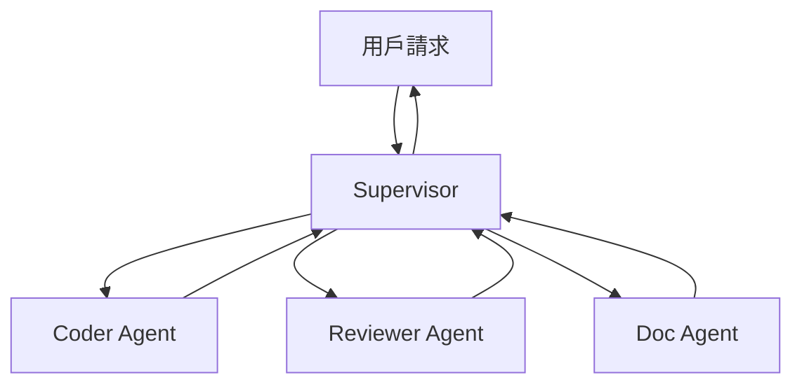
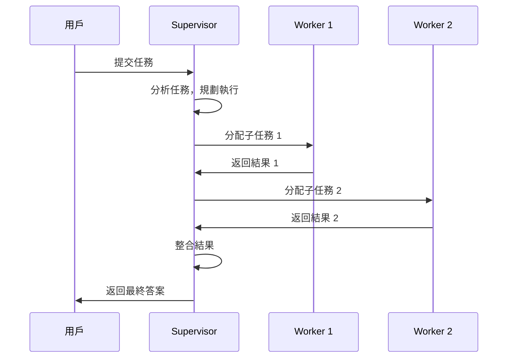
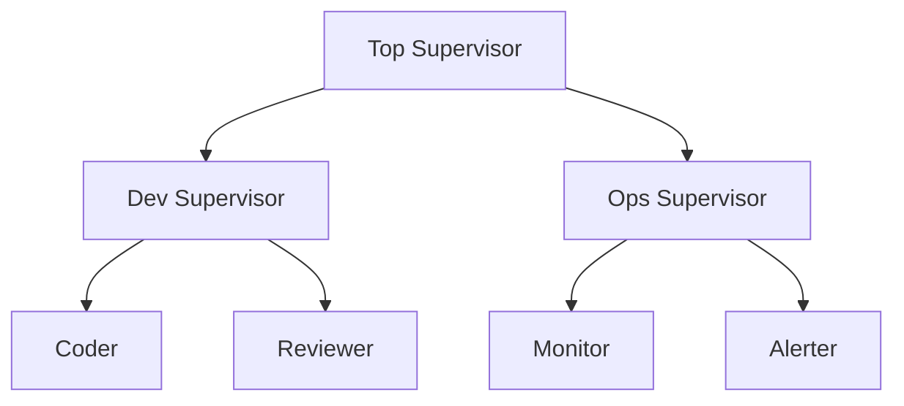
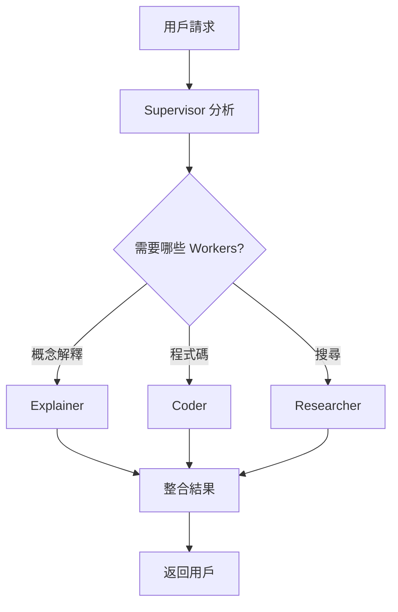

# Chapter 6: 多智能體協作——Supervisor 模式

> 「一個人可以走得很快，一群人可以走得很遠。」

---

## 本章學習目標

完成本章後，你將能夠：

- 理解 Multi-Agent 架構的設計原則
- 掌握 Supervisor Pattern 的實現方式
- 設計專業化的 Worker Agents
- 實現 Agent 間的通訊與協調
- 完成 TechAssist v0.7：多 Agent 協作的技術助理

---

## 6.1 場景引入：當單一 Agent 力不從心

TechAssist v0.6 表現良好，但面對複雜任務時顯得吃力：

**場景：用戶請求「幫我重構這段程式碼，確保測試通過，並更新文件」**

單一 Agent 需要：
1. 理解程式碼結構
2. 設計重構方案
3. 實施重構
4. 運行測試
5. 修復問題
6. 更新文件

這些任務需要**不同的專業能力**。一個 Agent 試圖做所有事情，往往結果不佳：

| 問題 | 原因 | 後果 |
|------|------|------|
| **上下文過載** | Prompt 太長 | 忘記重要細節 |
| **角色混淆** | 同時是 coder 和 reviewer | 無法客觀審查自己的程式碼 |
| **深度不足** | 什麼都會一點 | 沒有專業深度 |
| **效率低下** | 串行處理所有任務 | 耗時過長 |

**解決方案：Multi-Agent 系統**



---

## 6.2 Multi-Agent 架構模式

### 6.2.1 常見架構比較

| 架構 | 特點 | 適用場景 |
|------|------|----------|
| **Supervisor** | 中心化控制，單一決策點 | 任務分工明確，需要協調 |
| **Hierarchical** | 多層管理，子 Supervisor | 大規模系統，組織層級 |
| **Network/Mesh** | 去中心化，Agent 互相通訊 | 動態協作，無固定流程 |
| **Swarm** | 群體智慧，簡單規則 | 探索性任務，大量 Agent |

本章聚焦於最常用的 **Supervisor Pattern**。

### 6.2.2 Supervisor Pattern 架構



### 6.2.3 設計原則

**原則 1：專業化**
- 每個 Worker 專注於一個領域
- Prompt 針對該領域優化
- 工具集合針對該領域選擇

**原則 2：清晰的職責邊界**
- Worker 只做分配給它的任務
- 不越界處理其他領域
- 有疑問時返回給 Supervisor

**原則 3：統一的通訊協議**
- 標準化的任務描述格式
- 標準化的結果報告格式
- 明確的狀態定義

---

## 6.3 實現 Supervisor Agent

### 6.3.1 Supervisor 的職責

```python
"""
Supervisor 的核心職責：
1. 理解用戶意圖
2. 分解任務
3. 選擇合適的 Worker
4. 分配任務
5. 收集結果
6. 整合並回應
"""
```

### 6.3.2 狀態定義

```python
from typing import TypedDict, Annotated, Literal
from langgraph.graph.message import add_messages

class MultiAgentState(TypedDict):
    """多 Agent 系統狀態"""

    # 對話
    messages: Annotated[list, add_messages]

    # 任務管理
    current_task: str
    subtasks: list[dict]  # [{worker, task, status, result}]

    # 控制
    next_worker: str | None
    iteration: int
    max_iterations: int

    # 最終輸出
    final_answer: str | None
```

### 6.3.3 Worker 定義

```python
from langchain_anthropic import ChatAnthropic
from langchain_core.messages import HumanMessage, AIMessage, SystemMessage

# Worker 類型
WORKERS = {
    "coder": {
        "description": "專門編寫和修改程式碼",
        "system_prompt": """你是專業的程式碼工程師。
你的任務是編寫高品質、可維護的程式碼。
只回覆程式碼和必要的說明，不要處理其他任務。"""
    },
    "reviewer": {
        "description": "專門審查程式碼品質",
        "system_prompt": """你是嚴格的程式碼審查員。
檢查：程式碼風格、潛在 bug、效能問題、安全漏洞。
給出具體的改進建議。"""
    },
    "researcher": {
        "description": "專門搜尋和整理技術資訊",
        "system_prompt": """你是技術研究員。
搜尋最新的技術資訊、最佳實踐、文件。
整理成清晰的摘要。"""
    },
    "documenter": {
        "description": "專門撰寫技術文件",
        "system_prompt": """你是技術文件撰寫專家。
撰寫清晰、完整、易懂的技術文件。
包含範例和使用說明。"""
    },
}

def get_worker_names() -> list[str]:
    """獲取所有 Worker 名稱"""
    return list(WORKERS.keys())

def get_worker_descriptions() -> str:
    """獲取 Worker 描述（供 Supervisor 參考）"""
    lines = []
    for name, config in WORKERS.items():
        lines.append(f"- {name}: {config['description']}")
    return "\n".join(lines)
```

### 6.3.4 Supervisor 節點

```python
from langchain_core.tools import tool
from pydantic import BaseModel, Field

# 定義路由結構
class RouteDecision(BaseModel):
    """Supervisor 的路由決策"""
    next_worker: str = Field(
        description="下一個要執行的 Worker 名稱，或 'FINISH' 表示完成"
    )
    task_for_worker: str = Field(
        description="分配給 Worker 的具體任務描述"
    )
    reasoning: str = Field(
        description="選擇這個 Worker 的原因"
    )

# Supervisor 的系統提示
SUPERVISOR_PROMPT = f"""你是一個任務協調者 (Supervisor)。

你管理以下專業團隊成員：
{get_worker_descriptions()}

你的職責：
1. 分析用戶的請求
2. 將複雜任務分解為子任務
3. 選擇合適的團隊成員執行
4. 整合結果並回應用戶

規則：
- 每次只能選擇一個 Worker
- 如果任務完成，選擇 'FINISH'
- 給 Worker 的任務描述要具體、清晰
- 不要自己執行任務，只做協調

可選擇的 Worker: {get_worker_names() + ['FINISH']}"""


def supervisor_node(state: MultiAgentState) -> dict:
    """Supervisor 決策節點"""
    llm = ChatAnthropic(model="claude-3-5-sonnet-20241022")
    structured_llm = llm.with_structured_output(RouteDecision)

    messages = [
        SystemMessage(content=SUPERVISOR_PROMPT),
        *state["messages"]
    ]

    # 添加已完成的子任務資訊
    if state["subtasks"]:
        completed = [t for t in state["subtasks"] if t["status"] == "completed"]
        if completed:
            summary = "\n".join([
                f"- {t['worker']} 完成了：{t['task'][:50]}..."
                for t in completed
            ])
            messages.append(SystemMessage(
                content=f"已完成的子任務：\n{summary}"
            ))

    decision = structured_llm.invoke(messages)

    # 更新狀態
    updates = {
        "next_worker": decision.next_worker if decision.next_worker != "FINISH" else None,
        "iteration": state["iteration"] + 1
    }

    if decision.next_worker != "FINISH":
        # 添加新子任務
        new_subtask = {
            "worker": decision.next_worker,
            "task": decision.task_for_worker,
            "status": "pending",
            "result": None
        }
        updates["subtasks"] = state["subtasks"] + [new_subtask]
        updates["messages"] = [AIMessage(
            content=f"[Supervisor] 分配任務給 {decision.next_worker}：{decision.task_for_worker}"
        )]

    return updates
```

### 6.3.5 Worker 節點

```python
def create_worker_node(worker_name: str):
    """工廠函數：創建 Worker 節點"""
    config = WORKERS[worker_name]

    def worker_node(state: MultiAgentState) -> dict:
        """Worker 執行節點"""
        llm = ChatAnthropic(model="claude-3-5-sonnet-20241022")

        # 獲取當前分配給這個 Worker 的任務
        current_subtask = None
        for task in reversed(state["subtasks"]):
            if task["worker"] == worker_name and task["status"] == "pending":
                current_subtask = task
                break

        if not current_subtask:
            return {}  # 沒有待處理任務

        # 構建訊息
        messages = [
            SystemMessage(content=config["system_prompt"]),
            HumanMessage(content=current_subtask["task"])
        ]

        # 執行
        response = llm.invoke(messages)

        # 更新子任務狀態
        updated_subtasks = []
        for task in state["subtasks"]:
            if task is current_subtask:
                updated_subtasks.append({
                    **task,
                    "status": "completed",
                    "result": response.content
                })
            else:
                updated_subtasks.append(task)

        return {
            "subtasks": updated_subtasks,
            "messages": [AIMessage(
                content=f"[{worker_name}] 完成任務：\n{response.content[:500]}..."
            )]
        }

    return worker_node
```

### 6.3.6 路由邏輯

```python
def route_supervisor(state: MultiAgentState) -> str:
    """Supervisor 路由"""
    # 檢查迭代限制
    if state["iteration"] >= state["max_iterations"]:
        return "finalize"

    next_worker = state.get("next_worker")

    if next_worker is None:
        return "finalize"

    if next_worker in WORKERS:
        return next_worker

    return "finalize"
```

### 6.3.7 組裝 Multi-Agent Graph

```python
from langgraph.graph import StateGraph, START, END

def create_multi_agent_graph():
    """創建多 Agent 協作圖"""
    graph = StateGraph(MultiAgentState)

    # 添加 Supervisor 節點
    graph.add_node("supervisor", supervisor_node)

    # 添加所有 Worker 節點
    for worker_name in WORKERS:
        graph.add_node(worker_name, create_worker_node(worker_name))

    # 添加最終整合節點
    graph.add_node("finalize", finalize_node)

    # 邊：START -> Supervisor
    graph.add_edge(START, "supervisor")

    # 邊：Supervisor -> Workers 或 Finalize
    graph.add_conditional_edges(
        "supervisor",
        route_supervisor,
        {
            **{name: name for name in WORKERS},
            "finalize": "finalize"
        }
    )

    # 邊：Workers -> Supervisor（報告結果）
    for worker_name in WORKERS:
        graph.add_edge(worker_name, "supervisor")

    # 邊：Finalize -> END
    graph.add_edge("finalize", END)

    return graph.compile()

multi_agent_app = create_multi_agent_graph()
```

---

## 6.4 增強：Worker 專業化

### 6.4.1 為 Worker 配備工具

```python
from langchain_core.tools import tool

# Coder 的專用工具
@tool
def run_tests(code: str) -> str:
    """執行程式碼測試"""
    # 實現測試邏輯
    return "測試結果：5 passed, 0 failed"

@tool
def lint_code(code: str) -> str:
    """檢查程式碼風格"""
    return "Lint 結果：沒有發現問題"

coder_tools = [run_tests, lint_code]

# Researcher 的專用工具
@tool
def search_docs(query: str) -> str:
    """搜尋技術文件"""
    return f"搜尋結果：關於 {query} 的資訊..."

@tool
def search_github(query: str) -> str:
    """搜尋 GitHub 代碼範例"""
    return f"GitHub 範例：{query} 相關代碼..."

researcher_tools = [search_docs, search_github]

# 更新 Worker 配置
WORKERS = {
    "coder": {
        "description": "專門編寫和修改程式碼",
        "system_prompt": "...",
        "tools": coder_tools
    },
    "researcher": {
        "description": "專門搜尋和整理技術資訊",
        "system_prompt": "...",
        "tools": researcher_tools
    },
    # ...
}
```

### 6.4.2 帶工具的 Worker 節點

```python
def create_worker_node_with_tools(worker_name: str):
    """創建帶工具的 Worker 節點"""
    config = WORKERS[worker_name]
    tools = config.get("tools", [])

    def worker_node(state: MultiAgentState) -> dict:
        llm = ChatAnthropic(model="claude-3-5-sonnet-20241022")

        if tools:
            llm = llm.bind_tools(tools)

        # ... 其餘邏輯同前

        # 如果有工具調用，執行工具
        response = llm.invoke(messages)

        if hasattr(response, "tool_calls") and response.tool_calls:
            # 執行工具
            tool_map = {t.name: t for t in tools}
            for tc in response.tool_calls:
                tool_result = tool_map[tc["name"]].invoke(tc["args"])
                # 繼續對話...

        return {
            "subtasks": updated_subtasks,
            "messages": [response]
        }

    return worker_node
```

### 6.4.3 Worker 作為子圖

複雜的 Worker 可以實現為子圖：

```python
def create_coder_subgraph():
    """Coder Worker 子圖"""
    graph = StateGraph(CoderState)

    graph.add_node("understand", understand_requirements)
    graph.add_node("plan", create_coding_plan)
    graph.add_node("implement", write_code)
    graph.add_node("test", run_tests)
    graph.add_node("refine", refine_code)

    graph.add_edge(START, "understand")
    graph.add_edge("understand", "plan")
    graph.add_edge("plan", "implement")
    graph.add_edge("implement", "test")

    graph.add_conditional_edges(
        "test",
        lambda s: "refine" if s["tests_failed"] else "complete",
        {"refine": "refine", "complete": END}
    )

    graph.add_edge("refine", "test")

    return graph.compile()
```

---

## 6.5 實作：TechAssist v0.7

### 6.5.1 專業團隊設計

```python
# techassist/agents/workers.py

TECHASSIST_WORKERS = {
    "analyst": {
        "description": "分析用戶需求，理解技術問題",
        "system_prompt": """你是需求分析專家。
分析用戶的技術問題，提取關鍵資訊：
- 問題類型（概念、實作、除錯）
- 技術領域（前端、後端、DevOps）
- 複雜度評估
- 需要的資源

輸出結構化的分析報告。""",
        "tools": []
    },

    "coder": {
        "description": "編寫、重構、優化程式碼",
        "system_prompt": """你是資深程式碼工程師。
專注於：
- 編寫清晰、可維護的程式碼
- 遵循最佳實踐
- 添加適當的註解
- 考慮邊界情況

只輸出程式碼和必要的說明。""",
        "tools": [run_code, lint_code]
    },

    "reviewer": {
        "description": "審查程式碼品質和安全性",
        "system_prompt": """你是嚴格的程式碼審查員。
檢查以下方面：
1. 程式碼正確性
2. 安全漏洞（注入、XSS 等）
3. 效能問題
4. 可維護性
5. 測試覆蓋

給出具體的問題列表和改進建議。""",
        "tools": []
    },

    "researcher": {
        "description": "搜尋技術文件和最佳實踐",
        "system_prompt": """你是技術研究專家。
搜尋並整理：
- 官方文件
- 最佳實踐
- 常見問題解答
- 代碼範例

整理成易於理解的摘要。""",
        "tools": [search_documentation, search_github]
    },

    "explainer": {
        "description": "用清晰易懂的方式解釋技術概念",
        "system_prompt": """你是技術教育專家。
用以下方式解釋技術概念：
- 使用類比和比喻
- 從簡單到複雜
- 提供具體範例
- 繁體中文

讓初學者也能理解。""",
        "tools": []
    },
}
```

### 6.5.2 TechAssist Supervisor

```python
# techassist/agents/supervisor.py

TECHASSIST_SUPERVISOR_PROMPT = """你是 TechAssist 的任務協調者。

你管理一個專業技術團隊：
{worker_descriptions}

用戶會向你提出各種技術問題和請求。你的工作是：
1. 分析用戶需求
2. 決定需要哪些團隊成員協助
3. 分配具體任務
4. 整合結果並回應用戶

決策原則：
- 簡單的概念問題：直接讓 explainer 解釋
- 需要搜尋的問題：先讓 researcher 搜尋
- 程式碼相關：讓 coder 處理，重要的讓 reviewer 審查
- 複雜問題：先讓 analyst 分析，再分配

每次只選擇一個 Worker。
任務完成後選擇 'FINISH'。
"""

class TechAssistSupervisor:
    """TechAssist v0.7 Supervisor"""

    def __init__(self):
        self.llm = ChatAnthropic(model="claude-3-5-sonnet-20241022")
        self.workers = TECHASSIST_WORKERS
        self.graph = self._build_graph()

    def _build_graph(self):
        graph = StateGraph(MultiAgentState)

        # Supervisor
        graph.add_node("supervisor", self._supervisor_node)

        # Workers
        for name in self.workers:
            graph.add_node(name, self._create_worker_node(name))

        # Finalize
        graph.add_node("finalize", self._finalize_node)

        # Edges
        graph.add_edge(START, "supervisor")

        graph.add_conditional_edges(
            "supervisor",
            self._route,
            {**{n: n for n in self.workers}, "finalize": "finalize"}
        )

        for name in self.workers:
            graph.add_edge(name, "supervisor")

        graph.add_edge("finalize", END)

        return graph.compile()

    def _supervisor_node(self, state):
        # ... 實現 Supervisor 邏輯
        pass

    def _create_worker_node(self, name):
        # ... 創建 Worker 節點
        pass

    def _finalize_node(self, state):
        """整合所有結果"""
        subtasks = state.get("subtasks", [])
        completed = [t for t in subtasks if t["status"] == "completed"]

        if not completed:
            return {"final_answer": "抱歉，無法處理您的請求。"}

        # 使用 LLM 整合結果
        summary_prompt = f"""
整合以下團隊成員的工作結果，給用戶一個完整、連貫的回答：

{chr(10).join([f"[{t['worker']}]: {t['result'][:500]}" for t in completed])}

原始請求：{state['messages'][0].content}
"""
        response = self.llm.invoke([HumanMessage(content=summary_prompt)])

        return {
            "final_answer": response.content,
            "messages": [AIMessage(content=response.content)]
        }

    def _route(self, state):
        if state["iteration"] >= state["max_iterations"]:
            return "finalize"
        return state.get("next_worker") or "finalize"

    def run(self, query: str) -> str:
        """執行查詢"""
        initial = {
            "messages": [HumanMessage(content=query)],
            "current_task": query,
            "subtasks": [],
            "next_worker": None,
            "iteration": 0,
            "max_iterations": 10,
            "final_answer": None,
        }

        result = self.graph.invoke(initial)
        return result["final_answer"]
```

### 6.5.3 CLI 介面

```python
# techassist/cli_v7.py

def run_cli_v7():
    """TechAssist v0.7 CLI - 多 Agent 版"""
    print("=" * 60)
    print("🤖 TechAssist v0.7 - 多 Agent 協作版")
    print("=" * 60)
    print("專業團隊：analyst, coder, reviewer, researcher, explainer")
    print("-" * 60)

    supervisor = TechAssistSupervisor()

    while True:
        query = input("\n📝 你的問題：").strip()
        if query.lower() in ('quit', 'exit'):
            break

        print("\n🔄 團隊協作中...\n")

        # 串流顯示執行過程
        for event in supervisor.graph.stream(create_initial(query)):
            for node, output in event.items():
                if node == "supervisor":
                    next_w = output.get("next_worker")
                    if next_w:
                        print(f"  📋 Supervisor → {next_w}")
                elif node in TECHASSIST_WORKERS:
                    print(f"  ✅ {node} 完成任務")
                elif node == "finalize":
                    print(f"\n📖 回答：\n{output['final_answer']}")

if __name__ == "__main__":
    run_cli_v7()
```

---

## 6.6 進階模式

### 6.6.1 並行執行

當子任務獨立時，可以並行執行：

```python
from langgraph.graph import StateGraph
from langgraph.constants import Send

def supervisor_with_parallel(state):
    """支援並行的 Supervisor"""
    # 分析需要哪些 Workers
    workers_needed = analyze_and_select_workers(state)

    # 使用 Send 並行分發
    return [
        Send(worker, {"task": task})
        for worker, task in workers_needed
    ]

graph.add_conditional_edges(
    "supervisor",
    supervisor_with_parallel,
    ["coder", "researcher", "reviewer"]  # 可能的目標
)
```

### 6.6.2 階層式 Multi-Agent



```python
def create_hierarchical_system():
    """創建階層式多 Agent 系統"""

    # 子 Supervisor：開發團隊
    dev_team = StateGraph(DevTeamState)
    dev_team.add_node("dev_supervisor", dev_supervisor_node)
    dev_team.add_node("coder", coder_node)
    dev_team.add_node("reviewer", reviewer_node)
    # ... edges
    dev_subgraph = dev_team.compile()

    # 子 Supervisor：運維團隊
    ops_team = StateGraph(OpsTeamState)
    ops_team.add_node("ops_supervisor", ops_supervisor_node)
    ops_team.add_node("monitor", monitor_node)
    ops_team.add_node("alerter", alerter_node)
    # ... edges
    ops_subgraph = ops_team.compile()

    # 頂層 Supervisor
    top_level = StateGraph(TopLevelState)
    top_level.add_node("top_supervisor", top_supervisor_node)
    top_level.add_node("dev_team", dev_subgraph)  # 子圖作為節點
    top_level.add_node("ops_team", ops_subgraph)
    # ... edges

    return top_level.compile()
```

### 6.6.3 動態 Worker 註冊

```python
class DynamicMultiAgentSystem:
    """支援動態註冊 Worker 的系統"""

    def __init__(self):
        self.workers = {}
        self._rebuild_needed = True
        self._graph = None

    def register_worker(self, name: str, config: dict):
        """註冊新 Worker"""
        self.workers[name] = config
        self._rebuild_needed = True

    def unregister_worker(self, name: str):
        """移除 Worker"""
        del self.workers[name]
        self._rebuild_needed = True

    @property
    def graph(self):
        if self._rebuild_needed:
            self._graph = self._build_graph()
            self._rebuild_needed = False
        return self._graph

    def _build_graph(self):
        # 根據當前註冊的 workers 動態建圖
        graph = StateGraph(MultiAgentState)
        # ...
        return graph.compile()
```

---

## 6.7 本章回顧

### 核心概念

| 概念 | 說明 |
|------|------|
| **Supervisor** | 中央協調者，負責任務分配與結果整合 |
| **Worker** | 專業執行者，專注於特定領域 |
| **Task Routing** | 根據任務類型選擇合適的 Worker |
| **Result Integration** | 整合多個 Worker 的結果 |

### 設計模式



### TechAssist 里程碑

- ✅ v0.6：具備人機協作 (HITL) 能力
- ✅ v0.7：多 Agent 協作（Supervisor 模式）

---

## 6.8 下一章預告

Part 2 完成！我們已經掌握了 LangGraph 的核心能力：
- 狀態管理
- 人機協作
- 多 Agent 協作

在 **Part 3: DeepAgents 架構**，我們將進入更高階的設計模式：

- **Chapter 7**：規劃模式 (Planning Pattern)
- **Chapter 8**：記憶模式 (Memory Pattern)
- **Chapter 9**：自我修正模式 (Reflexion Pattern)

這些模式將讓 TechAssist 具備**自主規劃**、**長期記憶**和**自我改進**的能力。

---

## 練習題

1. **基礎練習**：為 TechAssist v0.7 新增一個 `tester` Worker，專門編寫和運行測試。

2. **進階練習**：實現 Worker 之間的直接通訊——讓 `reviewer` 可以直接請求 `coder` 修改程式碼，而不經過 Supervisor。

3. **挑戰練習**：實現「投票機制」——對於爭議性問題，讓多個 Workers 各自給出答案，Supervisor 整合共識。

---

## 延伸閱讀

- [LangGraph：Multi-Agent](https://langchain-ai.github.io/langgraph/tutorials/multi_agent/)
- [AutoGen：Multi-Agent Conversations](https://microsoft.github.io/autogen/)
- [Multi-Agent Systems 設計原則](https://www.cs.cmu.edu/~softagents/papers/ecai06.pdf)
