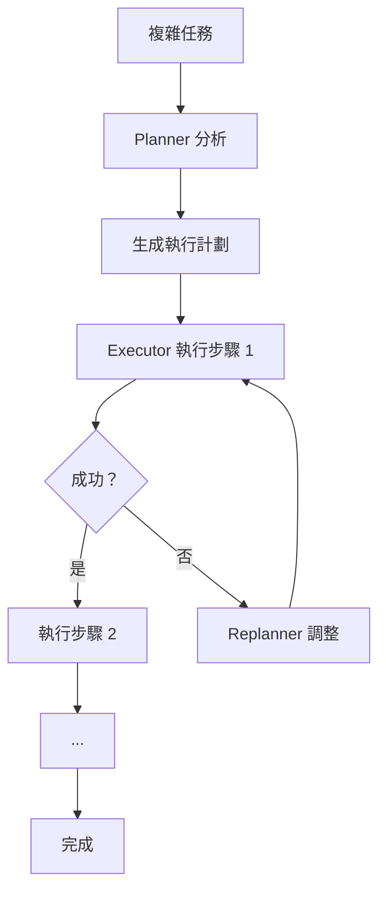
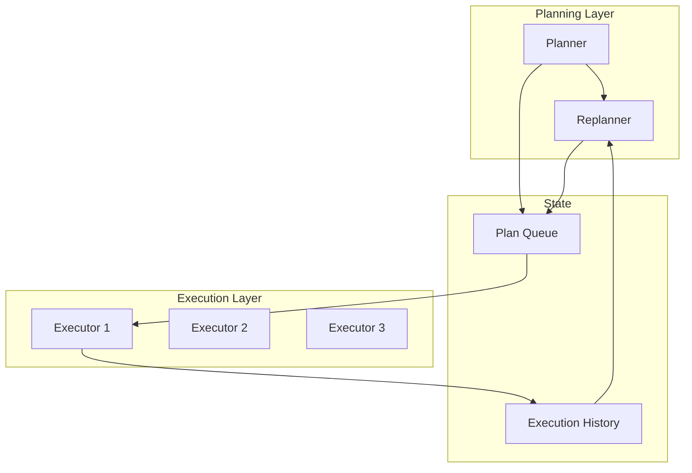
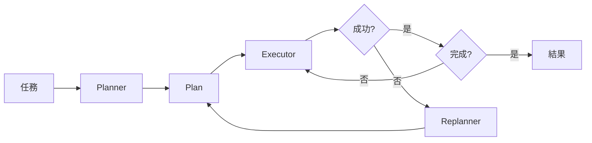

# Chapter 7: 規劃模式 (The Planning Pattern)

> 「不謀萬世者，不足謀一時；不謀全局者，不足謀一域。」——《寤言》

---

## 本章學習目標

完成本章後，你將能夠：

- 理解從 ReAct 到 Plan-and-Solve 的演進
- 掌握 Planning Pattern 的設計原則
- 實現 Planner-Executor 拓撲結構
- 動態維護和調整執行計劃
- 完成 TechAssist v0.8：具備自主規劃能力的助理

---

## 7.1 場景引入：為什麼需要規劃？

回顧 ReAct Agent 的工作方式：

```
思考 → 行動 → 觀察 → 思考 → 行動 → 觀察 → ...
```

這種「走一步看一步」的方式存在問題：

### 7.1.1 ReAct 的局限

| 問題 | 說明 | 後果 |
|------|------|------|
| **短視** | 只考慮下一步 | 可能走入死胡同 |
| **重複** | 忘記之前嘗試過什麼 | 原地打轉 |
| **無全局觀** | 不知道離目標多遠 | 效率低下 |
| **難以回溯** | 發現錯誤難以調整 | 累積錯誤 |

**真實案例**：

```
用戶：幫我實現一個用戶註冊功能，包含郵件驗證

ReAct Agent 的行為：
1. 思考：需要寫程式碼 → 寫了一個 register() 函數
2. 思考：需要發郵件 → 發現沒有郵件服務
3. 思考：需要配置 SMTP → 配置了 SMTP
4. 思考：需要生成驗證碼 → 寫了驗證碼邏輯
5. 思考：等等，register() 函數沒有調用驗證... 重寫！
```

如果一開始就有計劃：

```
計劃：
1. 設計資料結構（User, VerificationToken）
2. 實現驗證碼生成與存儲
3. 配置郵件服務
4. 實現 register() 函數（整合上述功能）
5. 實現 verify() 函數
6. 測試完整流程

按計劃執行，不走彎路。
```

### 7.1.2 Planning Pattern 的價值



**核心理念**：先規劃，後執行；執行中監控，必要時重新規劃。

---

## 7.2 Planning Pattern 設計

### 7.2.1 架構概覽



### 7.2.2 核心元件

| 元件 | 職責 | 輸入 | 輸出 |
|------|------|------|------|
| **Planner** | 分析任務，生成初始計劃 | 用戶請求 | 步驟列表 |
| **Executor** | 執行單一步驟 | 當前步驟 | 執行結果 |
| **Replanner** | 根據執行情況調整計劃 | 歷史 + 剩餘計劃 | 更新的計劃 |
| **Plan Queue** | 維護待執行步驟 | - | - |

### 7.2.3 狀態設計

```python
from typing import TypedDict, Annotated, Literal
from langgraph.graph.message import add_messages
from pydantic import BaseModel, Field

class PlanStep(BaseModel):
    """計劃步驟"""
    id: int = Field(description="步驟編號")
    description: str = Field(description="步驟描述")
    expected_output: str = Field(description="預期輸出")
    dependencies: list[int] = Field(default=[], description="依賴的步驟 ID")
    status: Literal["pending", "in_progress", "completed", "failed"] = "pending"
    result: str | None = None

class Plan(BaseModel):
    """執行計劃"""
    goal: str = Field(description="最終目標")
    steps: list[PlanStep] = Field(description="執行步驟")
    current_step_index: int = 0
    revision_count: int = 0

class PlanningState(TypedDict):
    """Planning Pattern 狀態"""
    messages: Annotated[list, add_messages]

    # 原始請求
    original_request: str

    # 計劃
    plan: Plan | None
    plan_history: list[Plan]  # 保存歷史計劃版本

    # 執行
    execution_history: list[dict]  # [{step_id, input, output, success}]

    # 控制
    iteration: int
    max_iterations: int
    should_replan: bool
```

---

## 7.3 實現 Planner

### 7.3.1 Planner Prompt

```python
PLANNER_SYSTEM_PROMPT = """你是一個專業的任務規劃專家。

你的職責是分析用戶的請求，制定清晰、可執行的計劃。

## 規劃原則

1. **分解**：將複雜任務拆分為簡單步驟
2. **依賴**：明確步驟之間的依賴關係
3. **可驗證**：每個步驟有明確的完成標準
4. **適度**：步驟數量適中（3-10 步）

## 輸出格式

為每個步驟提供：
- id: 步驟編號（從 1 開始）
- description: 具體要做什麼
- expected_output: 完成後應該得到什麼
- dependencies: 依賴哪些步驟（ID 列表）

## 範例

用戶請求：「實現一個待辦事項 API」

計劃：
1. 設計資料模型（Todo 結構）→ 輸出：Todo dataclass
2. 實現資料存儲（記憶體存儲）→ 輸出：TodoStore 類別，依賴：[1]
3. 實現 CRUD 端點 → 輸出：FastAPI 路由，依賴：[1, 2]
4. 添加輸入驗證 → 輸出：Pydantic schemas，依賴：[3]
5. 編寫測試 → 輸出：pytest 測試，依賴：[1, 2, 3, 4]
"""


class PlanOutput(BaseModel):
    """Planner 輸出結構"""
    goal: str = Field(description="理解的最終目標")
    reasoning: str = Field(description="規劃思路")
    steps: list[PlanStep] = Field(description="執行步驟")
```

### 7.3.2 Planner 節點

```python
from langchain_anthropic import ChatAnthropic
from langchain_core.messages import HumanMessage, SystemMessage

llm = ChatAnthropic(model="claude-3-5-sonnet-20241022")

def planner_node(state: PlanningState) -> dict:
    """Planner 節點：生成執行計劃"""
    structured_llm = llm.with_structured_output(PlanOutput)

    messages = [
        SystemMessage(content=PLANNER_SYSTEM_PROMPT),
        HumanMessage(content=f"請為以下請求制定執行計劃：\n\n{state['original_request']}")
    ]

    output = structured_llm.invoke(messages)

    plan = Plan(
        goal=output.goal,
        steps=output.steps,
        current_step_index=0,
        revision_count=0
    )

    return {
        "plan": plan,
        "plan_history": [plan],
        "messages": [AIMessage(content=f"📋 已制定計劃：{len(plan.steps)} 個步驟\n\n目標：{plan.goal}")]
    }
```

---

## 7.4 實現 Executor

### 7.4.1 Executor Prompt

```python
EXECUTOR_SYSTEM_PROMPT = """你是一個專注的任務執行者。

你的職責是執行計劃中的單一步驟，並報告結果。

## 執行原則

1. **專注**：只執行當前步驟，不要提前做後續步驟
2. **完整**：確保步驟完全完成
3. **報告**：清楚說明完成了什麼，輸出了什麼
4. **誠實**：如果無法完成，說明原因

## 輸出格式

- success: 是否成功完成
- output: 具體輸出（程式碼、文件、結果等）
- notes: 執行過程中的發現或問題
"""


class ExecutionResult(BaseModel):
    """執行結果"""
    success: bool = Field(description="是否成功")
    output: str = Field(description="執行輸出")
    notes: str = Field(default="", description="備註")
```

### 7.4.2 Executor 節點

```python
def executor_node(state: PlanningState) -> dict:
    """Executor 節點：執行當前步驟"""
    plan = state["plan"]
    if not plan or plan.current_step_index >= len(plan.steps):
        return {"should_replan": False}

    current_step = plan.steps[plan.current_step_index]

    # 構建執行上下文
    context_parts = [f"目標：{plan.goal}"]

    # 添加已完成步驟的結果
    for record in state["execution_history"]:
        context_parts.append(f"步驟 {record['step_id']} 結果：{record['output'][:200]}...")

    context = "\n".join(context_parts)

    # 執行
    structured_llm = llm.with_structured_output(ExecutionResult)

    messages = [
        SystemMessage(content=EXECUTOR_SYSTEM_PROMPT),
        HumanMessage(content=f"""
執行上下文：
{context}

當前步驟（{current_step.id}）：
{current_step.description}

預期輸出：
{current_step.expected_output}

請執行這個步驟。
""")
    ]

    result = structured_llm.invoke(messages)

    # 更新步驟狀態
    updated_steps = plan.steps.copy()
    updated_steps[plan.current_step_index] = PlanStep(
        **current_step.model_dump(),
        status="completed" if result.success else "failed",
        result=result.output
    )

    # 記錄執行歷史
    execution_record = {
        "step_id": current_step.id,
        "description": current_step.description,
        "output": result.output,
        "success": result.success,
        "notes": result.notes
    }

    # 更新計劃
    updated_plan = Plan(
        goal=plan.goal,
        steps=updated_steps,
        current_step_index=plan.current_step_index + 1 if result.success else plan.current_step_index,
        revision_count=plan.revision_count
    )

    return {
        "plan": updated_plan,
        "execution_history": state["execution_history"] + [execution_record],
        "should_replan": not result.success,
        "iteration": state["iteration"] + 1,
        "messages": [AIMessage(
            content=f"{'✅' if result.success else '❌'} 步驟 {current_step.id}：{result.output[:200]}..."
        )]
    }
```

---

## 7.5 實現 Replanner

### 7.5.1 Replanner Prompt

```python
REPLANNER_SYSTEM_PROMPT = """你是一個計劃調整專家。

當執行遇到問題時，你需要評估情況並調整計劃。

## 調整策略

1. **重試**：如果是暫時性問題，保持計劃不變
2. **修改**：如果步驟有問題，修改當前步驟
3. **插入**：如果缺少前置步驟，插入新步驟
4. **跳過**：如果步驟不再需要，標記為跳過
5. **放棄**：如果任務無法完成，建議終止

## 決策依據

- 失敗原因是什麼？
- 是否可以通過調整解決？
- 調整後是否仍能達成目標？
"""


class ReplanDecision(BaseModel):
    """Replanner 決策"""
    action: Literal["retry", "modify", "insert", "skip", "abort"] = Field(
        description="調整動作"
    )
    reasoning: str = Field(description="調整原因")
    modified_steps: list[PlanStep] | None = Field(
        default=None,
        description="修改後的步驟列表（如適用）"
    )
    message_to_user: str = Field(description="給用戶的說明")
```

### 7.5.2 Replanner 節點

```python
def replanner_node(state: PlanningState) -> dict:
    """Replanner 節點：調整計劃"""
    plan = state["plan"]
    history = state["execution_history"]

    # 獲取最後一次失敗
    last_failure = history[-1] if history and not history[-1]["success"] else None

    if not last_failure:
        return {"should_replan": False}

    structured_llm = llm.with_structured_output(ReplanDecision)

    # 構建上下文
    steps_summary = "\n".join([
        f"{s.id}. [{s.status}] {s.description}"
        for s in plan.steps
    ])

    messages = [
        SystemMessage(content=REPLANNER_SYSTEM_PROMPT),
        HumanMessage(content=f"""
原始目標：{plan.goal}

當前計劃：
{steps_summary}

最後執行的步驟：
- 步驟 {last_failure['step_id']}：{last_failure['description']}
- 結果：失敗
- 輸出：{last_failure['output']}
- 備註：{last_failure['notes']}

計劃已修改 {plan.revision_count} 次。

請決定如何調整計劃。
""")
    ]

    decision = structured_llm.invoke(messages)

    # 根據決策更新計劃
    if decision.action == "abort":
        return {
            "plan": None,
            "messages": [AIMessage(content=f"⚠️ 計劃終止：{decision.message_to_user}")]
        }

    if decision.action == "retry":
        # 不修改計劃，只是重試
        return {
            "should_replan": False,
            "messages": [AIMessage(content=f"🔄 重試：{decision.message_to_user}")]
        }

    if decision.action in ("modify", "insert") and decision.modified_steps:
        # 更新計劃
        updated_plan = Plan(
            goal=plan.goal,
            steps=decision.modified_steps,
            current_step_index=plan.current_step_index,
            revision_count=plan.revision_count + 1
        )
        return {
            "plan": updated_plan,
            "plan_history": state["plan_history"] + [updated_plan],
            "should_replan": False,
            "messages": [AIMessage(content=f"📝 計劃已調整：{decision.message_to_user}")]
        }

    if decision.action == "skip":
        # 跳過當前步驟
        updated_steps = plan.steps.copy()
        updated_steps[plan.current_step_index] = PlanStep(
            **plan.steps[plan.current_step_index].model_dump(),
            status="completed",
            result="(已跳過)"
        )
        updated_plan = Plan(
            goal=plan.goal,
            steps=updated_steps,
            current_step_index=plan.current_step_index + 1,
            revision_count=plan.revision_count
        )
        return {
            "plan": updated_plan,
            "should_replan": False,
            "messages": [AIMessage(content=f"⏭️ 跳過步驟：{decision.message_to_user}")]
        }

    return {"should_replan": False}
```

---

## 7.6 組裝 Planning Graph

### 7.6.1 路由邏輯

```python
def route_after_executor(state: PlanningState) -> str:
    """Executor 後路由"""
    # 檢查迭代限制
    if state["iteration"] >= state["max_iterations"]:
        return "finalize"

    # 檢查是否需要重新規劃
    if state.get("should_replan"):
        return "replanner"

    # 檢查計劃是否完成
    plan = state.get("plan")
    if not plan:
        return "finalize"

    if plan.current_step_index >= len(plan.steps):
        return "finalize"

    # 繼續執行
    return "executor"


def route_after_replanner(state: PlanningState) -> str:
    """Replanner 後路由"""
    plan = state.get("plan")

    if not plan:
        return "finalize"  # 計劃被終止

    if plan.revision_count > 3:
        return "finalize"  # 修改次數過多

    return "executor"
```

### 7.6.2 完整 Graph

```python
from langgraph.graph import StateGraph, START, END

def create_planning_graph():
    """創建 Planning Pattern Graph"""
    graph = StateGraph(PlanningState)

    # 添加節點
    graph.add_node("planner", planner_node)
    graph.add_node("executor", executor_node)
    graph.add_node("replanner", replanner_node)
    graph.add_node("finalize", finalize_node)

    # 添加邊
    graph.add_edge(START, "planner")
    graph.add_edge("planner", "executor")

    graph.add_conditional_edges(
        "executor",
        route_after_executor,
        {
            "executor": "executor",
            "replanner": "replanner",
            "finalize": "finalize"
        }
    )

    graph.add_conditional_edges(
        "replanner",
        route_after_replanner,
        {
            "executor": "executor",
            "finalize": "finalize"
        }
    )

    graph.add_edge("finalize", END)

    return graph.compile()


def finalize_node(state: PlanningState) -> dict:
    """最終整合節點"""
    plan = state.get("plan")
    history = state.get("execution_history", [])

    if not plan:
        return {
            "messages": [AIMessage(content="任務無法完成。")]
        }

    # 統計完成情況
    completed = sum(1 for s in plan.steps if s.status == "completed")
    total = len(plan.steps)

    # 整合結果
    results = []
    for record in history:
        if record["success"]:
            results.append(f"✅ 步驟 {record['step_id']}：\n{record['output']}")

    summary = f"""
## 任務完成報告

**目標**：{plan.goal}
**進度**：{completed}/{total} 步驟完成
**計劃修訂**：{plan.revision_count} 次

### 執行結果

{chr(10).join(results)}
"""

    return {
        "messages": [AIMessage(content=summary)]
    }
```

---

## 7.7 實作：TechAssist v0.8

### 7.7.1 整合 Planning Pattern

```python
# techassist/planning_assistant.py

class PlanningAssistant:
    """TechAssist v0.8 - 具備規劃能力"""

    def __init__(self):
        self.graph = create_planning_graph()

    def execute(self, request: str) -> str:
        """執行帶規劃的任務"""
        initial_state = {
            "messages": [HumanMessage(content=request)],
            "original_request": request,
            "plan": None,
            "plan_history": [],
            "execution_history": [],
            "iteration": 0,
            "max_iterations": 20,
            "should_replan": False,
        }

        # 執行
        final_state = self.graph.invoke(initial_state)

        return final_state["messages"][-1].content

    def execute_with_streaming(self, request: str):
        """串流執行，即時顯示進度"""
        initial_state = {
            "messages": [HumanMessage(content=request)],
            "original_request": request,
            "plan": None,
            "plan_history": [],
            "execution_history": [],
            "iteration": 0,
            "max_iterations": 20,
            "should_replan": False,
        }

        for event in self.graph.stream(initial_state):
            for node, output in event.items():
                yield {
                    "node": node,
                    "output": output
                }
```

### 7.7.2 CLI 介面

```python
# techassist/cli_v8.py

def run_cli_v8():
    """TechAssist v0.8 CLI - 規劃版"""
    print("=" * 60)
    print("🤖 TechAssist v0.8 - 智能規劃版")
    print("=" * 60)
    print("我現在會先制定計劃，再逐步執行！")
    print("-" * 60)

    assistant = PlanningAssistant()

    while True:
        request = input("\n📝 你的任務：").strip()
        if request.lower() in ('quit', 'exit'):
            break

        print("\n🔄 規劃與執行中...\n")

        for event in assistant.execute_with_streaming(request):
            node = event["node"]
            output = event["output"]

            if node == "planner":
                plan = output.get("plan")
                if plan:
                    print("📋 計劃已制定：")
                    for step in plan.steps:
                        print(f"   {step.id}. {step.description}")
                    print()

            elif node == "executor":
                history = output.get("execution_history", [])
                if history:
                    last = history[-1]
                    status = "✅" if last["success"] else "❌"
                    print(f"   {status} 步驟 {last['step_id']}: {last['description'][:50]}...")

            elif node == "replanner":
                msgs = output.get("messages", [])
                if msgs:
                    print(f"   🔄 {msgs[-1].content}")

            elif node == "finalize":
                print("\n" + "=" * 60)
                print(output.get("messages", [{}])[-1].content if output.get("messages") else "完成")

if __name__ == "__main__":
    run_cli_v8()
```

---

## 7.8 進階技巧

### 7.8.1 並行步驟執行

當步驟之間沒有依賴時，可以並行執行：

```python
from langgraph.constants import Send

def parallel_executor(state: PlanningState):
    """並行執行獨立步驟"""
    plan = state["plan"]
    completed_ids = {r["step_id"] for r in state["execution_history"] if r["success"]}

    # 找出可以執行的步驟（依賴都已完成）
    executable = []
    for step in plan.steps:
        if step.status == "pending":
            deps_met = all(d in completed_ids for d in step.dependencies)
            if deps_met:
                executable.append(step)

    # 並行分發
    return [Send("step_executor", {"step": s}) for s in executable]
```

### 7.8.2 計劃模板

對於常見任務，使用預定義模板：

```python
PLAN_TEMPLATES = {
    "api_implementation": [
        PlanStep(id=1, description="設計資料模型", expected_output="Pydantic models"),
        PlanStep(id=2, description="實現資料存儲", expected_output="Repository class", dependencies=[1]),
        PlanStep(id=3, description="實現 API 端點", expected_output="FastAPI routes", dependencies=[1, 2]),
        PlanStep(id=4, description="添加驗證", expected_output="Validation schemas", dependencies=[3]),
        PlanStep(id=5, description="編寫測試", expected_output="Pytest tests", dependencies=[1, 2, 3, 4]),
    ],
    "bug_fix": [
        PlanStep(id=1, description="重現問題", expected_output="Reproduction steps"),
        PlanStep(id=2, description="定位原因", expected_output="Root cause analysis", dependencies=[1]),
        PlanStep(id=3, description="設計修復", expected_output="Fix approach", dependencies=[2]),
        PlanStep(id=4, description="實施修復", expected_output="Code changes", dependencies=[3]),
        PlanStep(id=5, description="驗證修復", expected_output="Test results", dependencies=[4]),
    ],
}

def planner_with_templates(state: PlanningState) -> dict:
    """使用模板的 Planner"""
    request = state["original_request"].lower()

    # 檢查是否匹配模板
    if "api" in request and "implement" in request:
        template = PLAN_TEMPLATES["api_implementation"]
    elif "bug" in request or "fix" in request:
        template = PLAN_TEMPLATES["bug_fix"]
    else:
        # 使用 LLM 生成
        return planner_node(state)

    plan = Plan(
        goal=state["original_request"],
        steps=template,
        current_step_index=0,
        revision_count=0
    )

    return {"plan": plan, "plan_history": [plan]}
```

### 7.8.3 計劃可視化

```python
def visualize_plan(plan: Plan) -> str:
    """生成計劃的 Mermaid 圖"""
    lines = ["graph TD"]

    for step in plan.steps:
        # 節點
        status_icon = {
            "pending": "⏳",
            "in_progress": "🔄",
            "completed": "✅",
            "failed": "❌"
        }.get(step.status, "")

        lines.append(f'    S{step.id}["{status_icon} {step.id}. {step.description[:30]}"]')

        # 邊（依賴關係）
        for dep in step.dependencies:
            lines.append(f"    S{dep} --> S{step.id}")

    return "\n".join(lines)
```

---

## 7.9 本章回顧

### 核心概念

| 概念 | 說明 |
|------|------|
| **Planner** | 分析任務，生成執行計劃 |
| **Executor** | 執行單一步驟 |
| **Replanner** | 根據執行情況調整計劃 |
| **Plan Queue** | 維護待執行步驟 |

### 設計模式



### TechAssist 里程碑

- ✅ v0.7：Multi-Agent Supervisor
- ✅ v0.8：Planning Pattern（自主規劃）

---

## 7.10 下一章預告

TechAssist v0.8 具備了規劃能力，但它有個問題：**每次都從零開始**。它不記得：

- 之前處理過類似的任務
- 用戶的偏好設定
- 成功的解決方案

在下一章，我們將學習 **記憶模式 (The Memory Pattern)**：

- 短期記憶 vs 長期記憶
- Snapshot Pattern：狀態快照
- Semantic Injection：語義記憶注入
- TechAssist v0.9：具備長期記憶

---

## 練習題

1. **基礎練習**：為 Planner 添加「估計時間」欄位，讓每個步驟都有預估完成時間。

2. **進階練習**：實現「計劃審核」功能：Planner 生成計劃後，先讓用戶確認，再開始執行。

3. **挑戰練習**：實現「計劃學習」：保存成功執行的計劃，下次遇到類似任務時推薦使用。

---

## 延伸閱讀

- [Plan-and-Solve Prompting 論文](https://arxiv.org/abs/2305.04091)
- [LangGraph：Planning Agents](https://langchain-ai.github.io/langgraph/tutorials/planning/)
- [任務分解在 LLM 中的應用](https://arxiv.org/abs/2210.03629)
