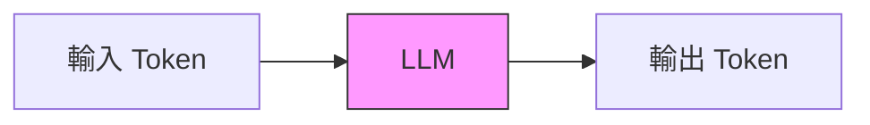
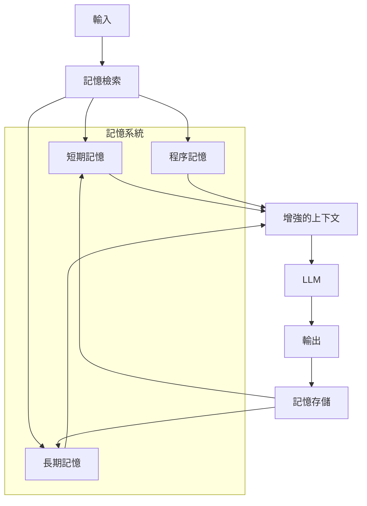
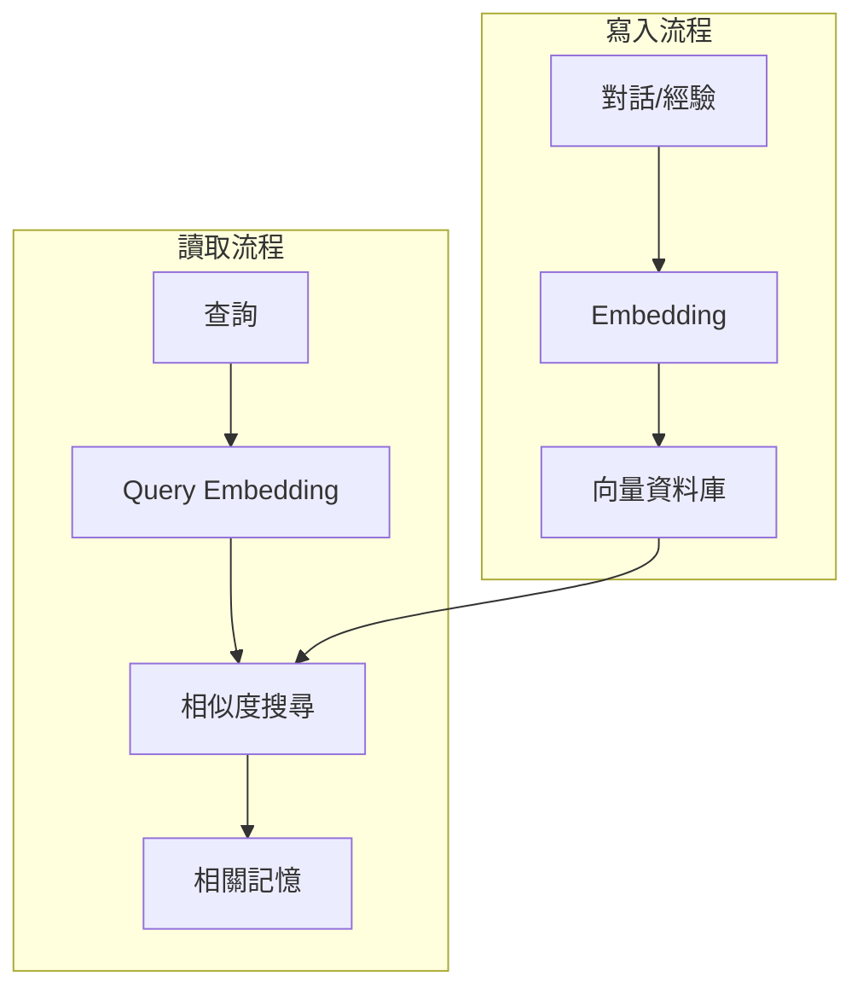
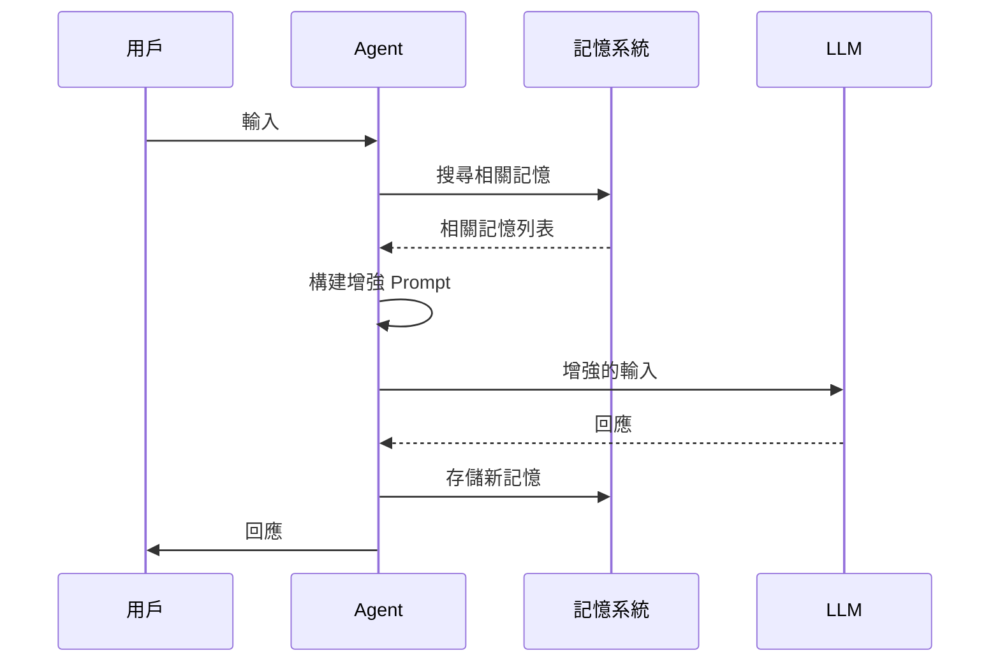
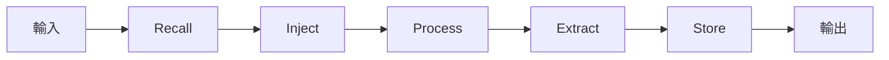

# Chapter 8: 記憶模式 (The Memory Pattern)

> 「記憶不是過去的容器，而是未來的指南。」

---

## 本章學習目標

完成本章後，你將能夠：

- 理解 Agent 記憶系統的架構
- 區分短期記憶與長期記憶的使用場景
- 實現 Snapshot Pattern 進行狀態回溯
- 實現 Semantic Injection 動態注入相關記憶
- 完成 TechAssist v0.9：具備長期記憶的助理

---

## 8.1 場景引入：記憶的價值

想像這個對話：

```
用戶（週一）：我喜歡用 TypeScript，不喜歡 JavaScript
TechAssist：好的，我記住了！

用戶（週三）：幫我寫一個前端組件
TechAssist：好的，這是 JavaScript 程式碼...

用戶：😤 我說過我喜歡 TypeScript！
```

問題在於：**TechAssist 沒有記憶**。

### 8.1.1 記憶的類型

人類的記憶系統：

| 類型 | 持續時間 | 容量 | 例子 |
|------|----------|------|------|
| **感覺記憶** | 毫秒 | 大 | 剛看到的畫面 |
| **短期記憶** | 秒-分鐘 | 小（7±2 項） | 正在思考的內容 |
| **長期記憶** | 永久 | 無限 | 學過的知識、經歷 |

Agent 的記憶系統：

| 類型 | 實現 | 用途 |
|------|------|------|
| **即時記憶** | 當前對話 messages | 維持對話連貫 |
| **會話記憶** | Checkpointer | 單次會話的狀態 |
| **長期記憶** | 向量資料庫 | 跨會話的知識 |
| **程序記憶** | 保存的計劃/模板 | 學習到的技能 |

### 8.1.2 為什麼 LLM 需要記憶系統？

LLM 本身的限制：



- **無狀態**：每次調用都是獨立的
- **上下文窗口有限**：Claude 128K tokens，但仍有限
- **無持久化**：對話結束後全部遺忘

記憶系統的作用：



---

## 8.2 短期記憶：對話上下文

### 8.2.1 使用 LangGraph 的 Messages

最基本的短期記憶：

```python
from typing import TypedDict, Annotated
from langgraph.graph.message import add_messages

class ConversationState(TypedDict):
    """對話狀態"""
    messages: Annotated[list, add_messages]

# add_messages 確保新訊息追加而非覆蓋
```

### 8.2.2 對話歷史管理

當對話過長時，需要管理歷史：

```python
from langchain_core.messages import HumanMessage, AIMessage, SystemMessage

def trim_messages(messages: list, max_tokens: int = 4000) -> list:
    """修剪訊息歷史，保持在 token 限制內

    策略：
    1. 保留 system message
    2. 保留最近的訊息
    3. 如有必要，摘要舊訊息
    """
    # 簡化的 token 計算（實際應使用 tiktoken）
    def estimate_tokens(msg) -> int:
        return len(msg.content) // 4

    # 分離系統訊息和對話訊息
    system_msgs = [m for m in messages if isinstance(m, SystemMessage)]
    chat_msgs = [m for m in messages if not isinstance(m, SystemMessage)]

    # 計算系統訊息的 token
    system_tokens = sum(estimate_tokens(m) for m in system_msgs)
    available_tokens = max_tokens - system_tokens

    # 從最新開始保留
    kept_msgs = []
    current_tokens = 0

    for msg in reversed(chat_msgs):
        msg_tokens = estimate_tokens(msg)
        if current_tokens + msg_tokens > available_tokens:
            break
        kept_msgs.insert(0, msg)
        current_tokens += msg_tokens

    return system_msgs + kept_msgs


def summarize_old_messages(messages: list, llm) -> str:
    """摘要舊的對話內容"""
    summary_prompt = """請摘要以下對話的關鍵資訊：

{conversation}

摘要應包含：
1. 討論的主要話題
2. 用戶的偏好或需求
3. 已經完成的任務
4. 待處理的事項

請用 3-5 句話摘要。"""

    conversation = "\n".join([
        f"{'用戶' if isinstance(m, HumanMessage) else 'AI'}: {m.content}"
        for m in messages
    ])

    response = llm.invoke(summary_prompt.format(conversation=conversation))
    return response.content
```

### 8.2.3 滑動窗口模式

```python
class SlidingWindowMemory:
    """滑動窗口記憶管理"""

    def __init__(self, window_size: int = 10):
        self.window_size = window_size
        self.messages = []

    def add(self, message):
        """添加訊息"""
        self.messages.append(message)
        # 保持窗口大小
        if len(self.messages) > self.window_size:
            self.messages = self.messages[-self.window_size:]

    def get_context(self) -> list:
        """獲取當前上下文"""
        return self.messages.copy()

    def clear(self):
        """清除記憶"""
        self.messages = []
```

---

## 8.3 會話記憶：Checkpointer

### 8.3.1 Snapshot Pattern

Checkpointer 實現了狀態快照，允許：
- 斷點恢復
- 狀態回溯
- 分支探索

```python
from langgraph.checkpoint.memory import MemorySaver
from langgraph.checkpoint.sqlite import SqliteSaver

# 記憶體 Checkpointer（開發用）
memory_saver = MemorySaver()

# SQLite Checkpointer（生產用）
import sqlite3
conn = sqlite3.connect("memory.db", check_same_thread=False)
sqlite_saver = SqliteSaver(conn)

# 編譯時指定
app = graph.compile(checkpointer=sqlite_saver)
```

### 8.3.2 多會話管理

```python
class SessionManager:
    """會話管理器"""

    def __init__(self, app, checkpointer):
        self.app = app
        self.checkpointer = checkpointer

    def create_session(self, user_id: str) -> str:
        """創建新會話"""
        session_id = f"{user_id}-{int(time.time())}"
        return session_id

    def get_config(self, session_id: str) -> dict:
        """獲取會話配置"""
        return {"configurable": {"thread_id": session_id}}

    def list_sessions(self, user_id: str) -> list[str]:
        """列出用戶的所有會話"""
        # 實現依賴於 checkpointer 的能力
        pass

    def resume_session(self, session_id: str, new_input: str):
        """恢復並繼續會話"""
        config = self.get_config(session_id)

        # 獲取之前的狀態
        snapshot = self.app.get_state(config)

        if snapshot.values:
            # 有歷史狀態，繼續對話
            return self.app.invoke(
                {"messages": [HumanMessage(content=new_input)]},
                config=config
            )
        else:
            # 新會話
            return self.app.invoke(
                {"messages": [HumanMessage(content=new_input)]},
                config=config
            )

    def rollback(self, session_id: str, steps: int = 1):
        """回滾到之前的狀態"""
        config = self.get_config(session_id)

        history = list(self.app.get_state_history(config))
        if len(history) > steps:
            target = history[steps]
            return self.app.update_state(
                config,
                target.values,
                as_node=target.next[0] if target.next else None
            )
```

### 8.3.3 狀態分支

```python
def explore_alternatives(app, config, alternatives: list[str]):
    """探索不同的回應分支"""
    results = []

    # 獲取當前狀態
    snapshot = app.get_state(config)
    base_checkpoint = snapshot.config["configurable"]["checkpoint_id"]

    for i, alternative in enumerate(alternatives):
        # 為每個替代方案創建新的分支
        branch_config = {
            "configurable": {
                "thread_id": f"{config['configurable']['thread_id']}-branch-{i}",
                "checkpoint_id": base_checkpoint
            }
        }

        # 從相同起點執行不同輸入
        result = app.invoke(
            {"messages": [HumanMessage(content=alternative)]},
            config=branch_config
        )
        results.append({
            "input": alternative,
            "output": result
        })

    return results
```

---

## 8.4 長期記憶：向量資料庫

### 8.4.1 記憶架構



### 8.4.2 實現長期記憶存儲

```python
from langchain_openai import OpenAIEmbeddings
from langchain_community.vectorstores import Qdrant
from qdrant_client import QdrantClient
from pydantic import BaseModel
from datetime import datetime

class Memory(BaseModel):
    """記憶條目"""
    id: str
    content: str
    memory_type: str  # "fact", "preference", "experience", "skill"
    source: str  # 來源（對話 ID、文件等）
    created_at: datetime
    importance: float  # 重要性分數 0-1
    access_count: int = 0
    last_accessed: datetime | None = None


class LongTermMemory:
    """長期記憶系統"""

    def __init__(self, collection_name: str = "techassist_memory"):
        self.embeddings = OpenAIEmbeddings()
        self.client = QdrantClient(":memory:")  # 或使用持久化存儲
        self.collection_name = collection_name
        self._init_collection()

    def _init_collection(self):
        """初始化向量集合"""
        from qdrant_client.models import Distance, VectorParams

        self.client.recreate_collection(
            collection_name=self.collection_name,
            vectors_config=VectorParams(
                size=1536,  # OpenAI embedding 維度
                distance=Distance.COSINE
            )
        )

    def store(self, memory: Memory):
        """存儲記憶"""
        # 生成 embedding
        vector = self.embeddings.embed_query(memory.content)

        # 存儲到向量資料庫
        self.client.upsert(
            collection_name=self.collection_name,
            points=[{
                "id": memory.id,
                "vector": vector,
                "payload": memory.model_dump()
            }]
        )

    def search(self, query: str, top_k: int = 5, memory_type: str | None = None) -> list[Memory]:
        """搜尋相關記憶"""
        query_vector = self.embeddings.embed_query(query)

        # 構建過濾條件
        filter_conditions = None
        if memory_type:
            filter_conditions = {
                "must": [{"key": "memory_type", "match": {"value": memory_type}}]
            }

        results = self.client.search(
            collection_name=self.collection_name,
            query_vector=query_vector,
            limit=top_k,
            query_filter=filter_conditions
        )

        memories = []
        for result in results:
            memory = Memory(**result.payload)
            memory.access_count += 1
            memory.last_accessed = datetime.now()
            memories.append(memory)

        return memories

    def forget(self, memory_id: str):
        """刪除記憶"""
        self.client.delete(
            collection_name=self.collection_name,
            points_selector={"points": [memory_id]}
        )

    def consolidate(self, threshold_days: int = 30):
        """記憶整合：清理舊的、不重要的記憶"""
        # 實現記憶遺忘曲線
        pass
```

### 8.4.3 記憶類型

```python
class MemoryTypes:
    """記憶類型定義"""

    FACT = "fact"           # 事實：用戶的資訊、偏好
    PREFERENCE = "preference"  # 偏好：喜歡什麼、不喜歡什麼
    EXPERIENCE = "experience"  # 經驗：處理過的任務、解決方案
    SKILL = "skill"         # 技能：學到的模式、模板


# 記憶提取 Prompt
MEMORY_EXTRACTION_PROMPT = """分析以下對話，提取應該記住的資訊。

對話：
{conversation}

請識別並提取：
1. 事實（FACT）：用戶提到的客觀資訊
2. 偏好（PREFERENCE）：用戶表達的喜好
3. 經驗（EXPERIENCE）：解決問題的過程和結果
4. 技能（SKILL）：可以複用的模式或方法

輸出格式（JSON 列表）：
[
    {{"type": "fact", "content": "...", "importance": 0.8}},
    ...
]
"""


def extract_memories(conversation: str, llm) -> list[dict]:
    """從對話中提取記憶"""
    response = llm.invoke(MEMORY_EXTRACTION_PROMPT.format(conversation=conversation))

    try:
        import json
        memories = json.loads(response.content)
        return memories
    except:
        return []
```

---

## 8.5 Semantic Injection：動態記憶注入

### 8.5.1 設計原則

在 LLM 調用前，根據當前上下文注入相關記憶：



### 8.5.2 實現 Memory Injection Node

```python
from langchain_core.messages import SystemMessage

def create_memory_injection_node(memory_system: LongTermMemory):
    """創建記憶注入節點"""

    def memory_injection_node(state: AgentState) -> dict:
        """在處理前注入相關記憶"""
        # 獲取最近的用戶輸入
        last_user_message = None
        for msg in reversed(state["messages"]):
            if isinstance(msg, HumanMessage):
                last_user_message = msg.content
                break

        if not last_user_message:
            return {}

        # 搜尋相關記憶
        relevant_memories = memory_system.search(
            query=last_user_message,
            top_k=5
        )

        if not relevant_memories:
            return {}

        # 構建記憶上下文
        memory_context = "## 相關記憶\n\n"
        for mem in relevant_memories:
            memory_context += f"- [{mem.memory_type}] {mem.content}\n"

        # 注入為系統訊息
        memory_message = SystemMessage(content=memory_context)

        return {
            "injected_memories": relevant_memories,
            "messages": [memory_message]
        }

    return memory_injection_node
```

### 8.5.3 記憶感知的 Prompt

```python
MEMORY_AWARE_SYSTEM_PROMPT = """你是 TechAssist，一個具有記憶能力的技術助理。

## 你的記憶

以下是關於用戶和之前互動的重要資訊：

{memory_context}

## 使用記憶的原則

1. **個人化**：根據用戶偏好調整回答
2. **連貫性**：參考之前的對話和決定
3. **學習**：應用之前的經驗和解決方案
4. **但不要**：過度依賴舊資訊，忽略新的上下文

## 當前對話

請根據上述記憶和用戶的新輸入進行回應。
"""


def build_memory_aware_prompt(memories: list[Memory]) -> str:
    """構建記憶感知的 Prompt"""
    if not memories:
        return MEMORY_AWARE_SYSTEM_PROMPT.replace("{memory_context}", "（無相關記憶）")

    memory_sections = {
        "fact": [],
        "preference": [],
        "experience": [],
        "skill": []
    }

    for mem in memories:
        memory_sections[mem.memory_type].append(mem.content)

    context_parts = []

    if memory_sections["fact"]:
        context_parts.append("### 用戶資訊\n" + "\n".join(f"- {f}" for f in memory_sections["fact"]))

    if memory_sections["preference"]:
        context_parts.append("### 用戶偏好\n" + "\n".join(f"- {p}" for p in memory_sections["preference"]))

    if memory_sections["experience"]:
        context_parts.append("### 相關經驗\n" + "\n".join(f"- {e}" for e in memory_sections["experience"]))

    if memory_sections["skill"]:
        context_parts.append("### 可用技能\n" + "\n".join(f"- {s}" for s in memory_sections["skill"]))

    memory_context = "\n\n".join(context_parts)

    return MEMORY_AWARE_SYSTEM_PROMPT.replace("{memory_context}", memory_context)
```

---

## 8.6 實作：TechAssist v0.9

### 8.6.1 記憶增強的狀態

```python
class MemoryEnhancedState(TypedDict):
    """TechAssist v0.9 狀態"""
    messages: Annotated[list, add_messages]

    # 用戶資訊
    user_id: str
    session_id: str

    # 記憶
    injected_memories: list[Memory]
    memories_to_store: list[Memory]

    # 原有功能
    intent: str | None
    plan: Plan | None
    iteration: int
```

### 8.6.2 完整的記憶管道

```python
class TechAssistV9:
    """TechAssist v0.9 - 具備長期記憶"""

    def __init__(self, user_id: str):
        self.user_id = user_id
        self.memory = LongTermMemory(collection_name=f"user_{user_id}")
        self.graph = self._build_graph()

    def _build_graph(self):
        graph = StateGraph(MemoryEnhancedState)

        # 記憶相關節點
        graph.add_node("recall", self._recall_node)
        graph.add_node("process", self._process_node)
        graph.add_node("memorize", self._memorize_node)

        # 流程
        graph.add_edge(START, "recall")
        graph.add_edge("recall", "process")
        graph.add_edge("process", "memorize")
        graph.add_edge("memorize", END)

        return graph.compile(checkpointer=MemorySaver())

    def _recall_node(self, state: MemoryEnhancedState) -> dict:
        """回憶相關記憶"""
        last_message = state["messages"][-1].content

        memories = self.memory.search(last_message, top_k=5)

        return {"injected_memories": memories}

    def _process_node(self, state: MemoryEnhancedState) -> dict:
        """處理請求（帶記憶上下文）"""
        # 構建記憶感知的 prompt
        system_prompt = build_memory_aware_prompt(state["injected_memories"])

        messages = [
            SystemMessage(content=system_prompt),
            *state["messages"]
        ]

        response = llm.invoke(messages)

        return {"messages": [response]}

    def _memorize_node(self, state: MemoryEnhancedState) -> dict:
        """存儲新記憶"""
        # 提取對話中的重要資訊
        conversation = "\n".join([
            f"{'User' if isinstance(m, HumanMessage) else 'AI'}: {m.content}"
            for m in state["messages"][-4:]  # 最近幾輪
        ])

        new_memories = extract_memories(conversation, llm)

        for mem_data in new_memories:
            memory = Memory(
                id=f"{self.user_id}-{int(time.time())}-{random.randint(1000, 9999)}",
                content=mem_data["content"],
                memory_type=mem_data["type"],
                source=state["session_id"],
                created_at=datetime.now(),
                importance=mem_data.get("importance", 0.5)
            )
            self.memory.store(memory)

        return {"memories_to_store": new_memories}

    def chat(self, message: str, session_id: str | None = None) -> str:
        """對話"""
        session_id = session_id or f"{self.user_id}-{int(time.time())}"

        config = {"configurable": {"thread_id": session_id}}

        initial = {
            "messages": [HumanMessage(content=message)],
            "user_id": self.user_id,
            "session_id": session_id,
            "injected_memories": [],
            "memories_to_store": [],
            "intent": None,
            "plan": None,
            "iteration": 0,
        }

        result = self.graph.invoke(initial, config=config)
        return result["messages"][-1].content
```

### 8.6.3 使用範例

```python
# 創建用戶專屬的助理
assistant = TechAssistV9(user_id="user_001")

# 第一次對話
response1 = assistant.chat("我是一個 Python 開發者，喜歡用 FastAPI")
print(response1)
# "很高興認識你！我會記住你使用 Python 和 FastAPI..."

# 一段時間後...
response2 = assistant.chat("幫我寫一個 REST API")
print(response2)
# "好的！根據你之前提到的偏好，我會使用 FastAPI 來實現..."
# （記憶生效！）

# 查看存儲的記憶
memories = assistant.memory.search("Python", top_k=10)
for mem in memories:
    print(f"[{mem.memory_type}] {mem.content}")
```

---

## 8.7 進階技巧

### 8.7.1 記憶衰減

模擬人類的遺忘曲線：

```python
import math

def calculate_memory_strength(memory: Memory, current_time: datetime) -> float:
    """計算記憶強度（基於遺忘曲線）"""
    # 艾賓浩斯遺忘曲線
    hours_since_creation = (current_time - memory.created_at).total_seconds() / 3600

    # 基礎衰減
    base_retention = math.exp(-hours_since_creation / 168)  # 168 小時 = 1 週

    # 重要性加成
    importance_bonus = memory.importance * 0.3

    # 訪問次數加成
    access_bonus = min(memory.access_count * 0.05, 0.2)

    return min(base_retention + importance_bonus + access_bonus, 1.0)


def prune_weak_memories(memory_system: LongTermMemory, threshold: float = 0.1):
    """清理弱記憶"""
    all_memories = memory_system.get_all()
    current_time = datetime.now()

    for memory in all_memories:
        strength = calculate_memory_strength(memory, current_time)
        if strength < threshold:
            memory_system.forget(memory.id)
```

### 8.7.2 記憶整合

將多個相關記憶合併：

```python
def consolidate_memories(memories: list[Memory], llm) -> Memory:
    """整合相關記憶"""
    contents = "\n".join([m.content for m in memories])

    prompt = f"""以下是多個相關的記憶片段，請整合為一個連貫的摘要：

{contents}

整合後的記憶應該：
1. 保留所有重要資訊
2. 去除重複
3. 保持邏輯連貫
"""

    response = llm.invoke(prompt)

    # 創建整合後的記憶
    return Memory(
        id=f"consolidated-{int(time.time())}",
        content=response.content,
        memory_type=memories[0].memory_type,
        source="consolidation",
        created_at=datetime.now(),
        importance=max(m.importance for m in memories)
    )
```

### 8.7.3 記憶索引優化

```python
class OptimizedMemoryIndex:
    """優化的記憶索引"""

    def __init__(self):
        self.by_type = {}      # 按類型索引
        self.by_time = []      # 按時間排序
        self.by_importance = []  # 按重要性排序

    def add(self, memory: Memory):
        # 按類型
        if memory.memory_type not in self.by_type:
            self.by_type[memory.memory_type] = []
        self.by_type[memory.memory_type].append(memory)

        # 按時間
        self.by_time.append(memory)
        self.by_time.sort(key=lambda m: m.created_at, reverse=True)

        # 按重要性
        self.by_importance.append(memory)
        self.by_importance.sort(key=lambda m: m.importance, reverse=True)

    def get_recent(self, n: int = 10) -> list[Memory]:
        return self.by_time[:n]

    def get_important(self, n: int = 10) -> list[Memory]:
        return self.by_importance[:n]

    def get_by_type(self, memory_type: str) -> list[Memory]:
        return self.by_type.get(memory_type, [])
```

---

## 8.8 本章回顧

### 核心概念

| 概念 | 說明 | 實現 |
|------|------|------|
| **短期記憶** | 當前對話上下文 | messages + trim |
| **會話記憶** | 單次會話狀態 | Checkpointer |
| **長期記憶** | 跨會話知識 | 向量資料庫 |
| **記憶注入** | 動態增強上下文 | Semantic Injection |

### 記憶管道



### TechAssist 里程碑

- ✅ v0.8：Planning Pattern
- ✅ v0.9：Memory Pattern（長期記憶）

---

## 8.9 下一章預告

TechAssist v0.9 有了記憶，但它還不能**從錯誤中學習**。當它給出錯誤的回答時，它不會自我反省和改進。

在下一章，我們將學習 **自我修正模式 (The Reflexion Pattern)**：

- 雙迴圈學習原理
- Generator-Evaluator-Refiner 架構
- 自動錯誤檢測與修復
- TechAssist v1.0：能自我改進的助理

---

## 練習題

1. **基礎練習**：實現一個「記憶面板」，讓用戶可以查看和管理 TechAssist 存儲的關於他們的記憶。

2. **進階練習**：實現「記憶衝突解決」：當新記憶與舊記憶矛盾時（例如「用戶喜歡 Python」vs「用戶現在喜歡 Rust」），自動處理。

3. **挑戰練習**：實現「記憶分享」：允許多個用戶共享某些記憶（例如團隊知識庫），同時保持個人記憶的私密性。

---

## 延伸閱讀

- [LangChain：Memory](https://python.langchain.com/docs/how_to/chatbots_memory/)
- [向量資料庫比較](https://www.pinecone.io/learn/vector-database/)
- [MemGPT：Long-term Memory for LLMs](https://arxiv.org/abs/2310.08560)
