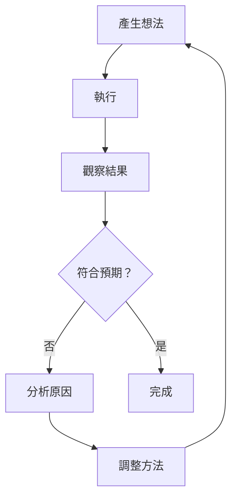
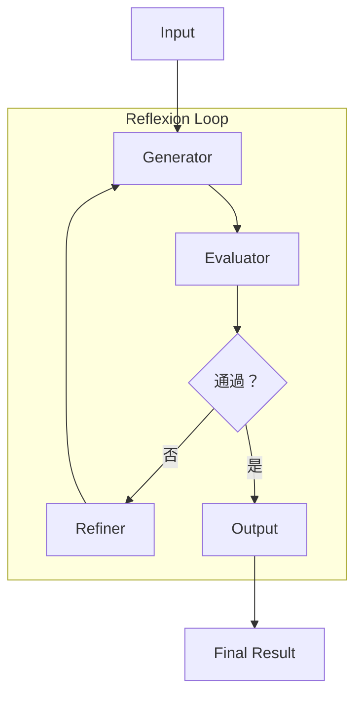
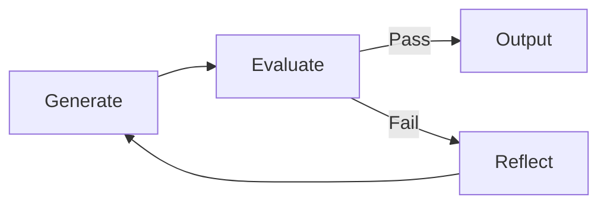

# Chapter 9: 自我修正模式 (The Reflexion Pattern)

> 「智慧不在於不犯錯，而在於從錯誤中學習。」

---

## 本章學習目標

完成本章後，你將能夠：

- 理解雙迴圈學習 (Dual-Loop Learning) 原理
- 設計 Generator-Evaluator-Refiner 架構
- 實現自動錯誤檢測與修復機制
- 建立自我改進的反饋循環
- 完成 TechAssist v1.0：能自我修正的智能助理

---

## 9.1 場景引入：為什麼需要自我修正？

觀察 TechAssist v0.9 處理程式碼任務：

```
用戶：幫我寫一個計算階乘的函數

TechAssist：
def factorial(n):
    if n == 0:
        return 1
    return n * factorial(n)  # Bug: 應該是 n-1

用戶：這有 bug，會無限遞迴！
TechAssist：抱歉，讓我修正...
```

問題：**TechAssist 無法自己發現錯誤**，需要用戶指出。

### 9.1.1 人類如何自我修正？



這是**雙迴圈學習**：
- **單迴圈**：改正錯誤
- **雙迴圈**：反思並改進方法本身

### 9.1.2 Reflexion Pattern 的價值

| 傳統方式 | Reflexion Pattern |
|----------|------------------|
| 用戶發現錯誤 | 自動檢測錯誤 |
| 重新生成 | 有針對性的修正 |
| 可能重複錯誤 | 學習避免類似錯誤 |
| 單次嘗試 | 迭代改進 |

---

## 9.2 Reflexion Pattern 架構

### 9.2.1 核心組件



| 組件 | 職責 | 輸入 | 輸出 |
|------|------|------|------|
| **Generator** | 生成初始輸出 | 任務描述 | 候選答案 |
| **Evaluator** | 評估輸出品質 | 候選答案 | 評估報告 |
| **Refiner** | 根據評估改進 | 候選答案 + 評估 | 改進建議 |

### 9.2.2 狀態設計

```python
from typing import TypedDict, Annotated, Literal
from langgraph.graph.message import add_messages
from pydantic import BaseModel, Field

class EvaluationResult(BaseModel):
    """評估結果"""
    passed: bool = Field(description="是否通過評估")
    score: float = Field(description="品質分數 0-1")
    issues: list[str] = Field(default=[], description="發現的問題")
    suggestions: list[str] = Field(default=[], description="改進建議")

class ReflexionState(TypedDict):
    """Reflexion Pattern 狀態"""
    messages: Annotated[list, add_messages]

    # 任務
    task: str
    task_type: str  # "code", "text", "analysis"

    # 生成
    current_output: str | None
    output_history: list[str]  # 歷史版本

    # 評估
    evaluation: EvaluationResult | None
    evaluation_history: list[EvaluationResult]

    # 反思
    reflections: list[str]

    # 控制
    iteration: int
    max_iterations: int
    quality_threshold: float
```

---

## 9.3 實現 Generator

### 9.3.1 Generator Prompt

```python
GENERATOR_SYSTEM_PROMPT = """你是一個專業的內容生成器。

你的任務是根據需求生成高品質的輸出。

## 生成原則

1. **正確性**：確保內容正確無誤
2. **完整性**：覆蓋所有需求
3. **清晰性**：易於理解和使用
4. **最佳實踐**：遵循行業標準

## 如果這是修正版本

你會收到：
- 之前的輸出
- 評估發現的問題
- 改進建議

請針對性地修正問題，不要引入新問題。
"""

class GeneratorOutput(BaseModel):
    """Generator 輸出"""
    output: str = Field(description="生成的內容")
    confidence: float = Field(description="自信程度 0-1")
    notes: str = Field(default="", description="備註")
```

### 9.3.2 Generator 節點

```python
def generator_node(state: ReflexionState) -> dict:
    """Generator 節點：生成或修正輸出"""
    llm = ChatAnthropic(model="claude-3-5-sonnet-20241022")
    structured_llm = llm.with_structured_output(GeneratorOutput)

    # 構建提示
    messages = [SystemMessage(content=GENERATOR_SYSTEM_PROMPT)]

    # 首次生成
    if state["iteration"] == 0:
        messages.append(HumanMessage(content=f"任務：{state['task']}"))
    else:
        # 修正版本
        last_output = state["current_output"]
        last_eval = state["evaluation"]
        reflections = state["reflections"]

        correction_prompt = f"""這是第 {state['iteration'] + 1} 次嘗試。

之前的輸出：
```
{last_output}
```

評估發現的問題：
{chr(10).join(f'- {issue}' for issue in last_eval.issues)}

改進建議：
{chr(10).join(f'- {sug}' for sug in last_eval.suggestions)}

反思：
{chr(10).join(f'- {ref}' for ref in reflections[-3:])}

請修正這些問題，生成改進的版本。
"""
        messages.append(HumanMessage(content=correction_prompt))

    result = structured_llm.invoke(messages)

    return {
        "current_output": result.output,
        "output_history": state["output_history"] + [result.output],
        "iteration": state["iteration"] + 1,
        "messages": [AIMessage(content=f"已生成第 {state['iteration'] + 1} 版")]
    }
```

---

## 9.4 實現 Evaluator

### 9.4.1 評估策略

不同任務類型需要不同的評估策略：

```python
EVALUATION_STRATEGIES = {
    "code": {
        "checks": [
            "syntax_check",      # 語法檢查
            "logic_check",       # 邏輯檢查
            "style_check",       # 風格檢查
            "security_check",    # 安全檢查
            "test_execution",    # 執行測試
        ],
        "threshold": 0.8
    },
    "text": {
        "checks": [
            "grammar_check",     # 語法檢查
            "coherence_check",   # 連貫性
            "completeness_check",  # 完整性
            "tone_check",        # 語氣檢查
        ],
        "threshold": 0.7
    },
    "analysis": {
        "checks": [
            "accuracy_check",    # 準確性
            "logic_check",       # 邏輯性
            "evidence_check",    # 證據支持
            "conclusion_check",  # 結論合理性
        ],
        "threshold": 0.75
    }
}
```

### 9.4.2 程式碼評估器

```python
import subprocess
import tempfile
import ast

class CodeEvaluator:
    """程式碼評估器"""

    def evaluate(self, code: str, task: str) -> EvaluationResult:
        """評估程式碼"""
        issues = []
        suggestions = []
        scores = []

        # 1. 語法檢查
        syntax_result = self._check_syntax(code)
        scores.append(syntax_result["score"])
        issues.extend(syntax_result["issues"])

        # 2. 執行測試
        if syntax_result["score"] == 1.0:
            exec_result = self._check_execution(code)
            scores.append(exec_result["score"])
            issues.extend(exec_result["issues"])
            suggestions.extend(exec_result["suggestions"])

        # 3. LLM 邏輯檢查
        logic_result = self._check_logic(code, task)
        scores.append(logic_result["score"])
        issues.extend(logic_result["issues"])
        suggestions.extend(logic_result["suggestions"])

        # 計算總分
        final_score = sum(scores) / len(scores)
        passed = final_score >= 0.8 and len(issues) == 0

        return EvaluationResult(
            passed=passed,
            score=final_score,
            issues=issues,
            suggestions=suggestions
        )

    def _check_syntax(self, code: str) -> dict:
        """語法檢查"""
        try:
            ast.parse(code)
            return {"score": 1.0, "issues": []}
        except SyntaxError as e:
            return {
                "score": 0.0,
                "issues": [f"語法錯誤（行 {e.lineno}）：{e.msg}"]
            }

    def _check_execution(self, code: str) -> dict:
        """執行檢查"""
        try:
            with tempfile.NamedTemporaryFile(mode='w', suffix='.py', delete=False) as f:
                f.write(code)
                temp_path = f.name

            result = subprocess.run(
                ["python", temp_path],
                capture_output=True,
                text=True,
                timeout=10
            )

            import os
            os.unlink(temp_path)

            if result.returncode == 0:
                return {"score": 1.0, "issues": [], "suggestions": []}
            else:
                return {
                    "score": 0.0,
                    "issues": [f"執行錯誤：{result.stderr[:200]}"],
                    "suggestions": ["檢查變數定義和函數調用"]
                }

        except subprocess.TimeoutExpired:
            return {
                "score": 0.0,
                "issues": ["執行超時（可能存在無限迴圈）"],
                "suggestions": ["檢查迴圈終止條件"]
            }
        except Exception as e:
            return {
                "score": 0.5,
                "issues": [f"無法執行測試：{e}"],
                "suggestions": []
            }

    def _check_logic(self, code: str, task: str) -> dict:
        """LLM 邏輯檢查"""
        llm = ChatAnthropic(model="claude-3-5-sonnet-20241022")

        prompt = f"""請審查以下程式碼是否正確實現了任務需求。

任務：{task}

程式碼：
```python
{code}
```

請檢查：
1. 邏輯是否正確
2. 邊界情況是否處理
3. 是否有潛在 bug

只回覆 JSON 格式：
{{"score": 0.0-1.0, "issues": ["問題1", ...], "suggestions": ["建議1", ...]}}
"""

        response = llm.invoke(prompt)

        try:
            import json
            result = json.loads(response.content)
            return result
        except:
            return {"score": 0.7, "issues": [], "suggestions": []}
```

### 9.4.3 Evaluator 節點

```python
def evaluator_node(state: ReflexionState) -> dict:
    """Evaluator 節點：評估輸出品質"""
    task_type = state["task_type"]
    current_output = state["current_output"]
    task = state["task"]

    # 選擇評估器
    if task_type == "code":
        evaluator = CodeEvaluator()
        result = evaluator.evaluate(current_output, task)
    else:
        # 通用 LLM 評估
        result = llm_evaluate(current_output, task, task_type)

    return {
        "evaluation": result,
        "evaluation_history": state["evaluation_history"] + [result],
        "messages": [AIMessage(
            content=f"評估完成：{'✅ 通過' if result.passed else '❌ 未通過'} (分數: {result.score:.2f})"
        )]
    }


def llm_evaluate(output: str, task: str, task_type: str) -> EvaluationResult:
    """通用 LLM 評估"""
    llm = ChatAnthropic(model="claude-3-5-sonnet-20241022")

    prompt = f"""評估以下輸出是否滿足任務需求。

任務：{task}
類型：{task_type}

輸出：
{output}

評估標準：
1. 正確性：內容是否正確
2. 完整性：是否覆蓋所有需求
3. 品質：是否達到專業水準

回覆 JSON 格式：
{{
    "passed": true/false,
    "score": 0.0-1.0,
    "issues": ["問題1", ...],
    "suggestions": ["建議1", ...]
}}
"""

    response = llm.invoke(prompt)

    try:
        import json
        data = json.loads(response.content)
        return EvaluationResult(**data)
    except:
        return EvaluationResult(passed=False, score=0.5, issues=["評估失敗"])
```

---

## 9.5 實現 Refiner

### 9.5.1 反思生成

```python
REFINER_PROMPT = """你是一個反思專家。

分析以下情況，生成有價值的反思，幫助改進下一次嘗試。

## 任務
{task}

## 當前輸出
```
{output}
```

## 評估結果
- 分數：{score}
- 問題：{issues}
- 建議：{suggestions}

## 歷史嘗試次數
{iteration}

## 你的反思

請分析：
1. **根本原因**：為什麼會出現這些問題？
2. **模式識別**：這次錯誤和之前的錯誤有什麼關聯？
3. **改進策略**：下次應該如何避免？
4. **關鍵洞察**：有什麼重要的發現？

請提供 3-5 條具體的反思。
"""


class Reflection(BaseModel):
    """反思結果"""
    root_cause: str = Field(description="根本原因分析")
    pattern: str = Field(description="錯誤模式")
    strategy: str = Field(description="改進策略")
    insight: str = Field(description="關鍵洞察")
```

### 9.5.2 Refiner 節點

```python
def refiner_node(state: ReflexionState) -> dict:
    """Refiner 節點：生成反思"""
    llm = ChatAnthropic(model="claude-3-5-sonnet-20241022")

    prompt = REFINER_PROMPT.format(
        task=state["task"],
        output=state["current_output"],
        score=state["evaluation"].score,
        issues="\n".join(f"- {i}" for i in state["evaluation"].issues),
        suggestions="\n".join(f"- {s}" for s in state["evaluation"].suggestions),
        iteration=state["iteration"]
    )

    response = llm.invoke(prompt)

    # 提取反思要點
    reflections = response.content.split("\n")
    reflections = [r.strip() for r in reflections if r.strip() and len(r) > 10]

    return {
        "reflections": state["reflections"] + reflections[:5],
        "messages": [AIMessage(content="反思完成，準備改進...")]
    }
```

---

## 9.6 組裝 Reflexion Graph

### 9.6.1 路由邏輯

```python
def route_after_evaluation(state: ReflexionState) -> str:
    """評估後路由"""
    evaluation = state["evaluation"]

    # 通過評估
    if evaluation.passed:
        return "output"

    # 達到迭代上限
    if state["iteration"] >= state["max_iterations"]:
        return "output"

    # 分數太低，可能需要完全重新開始
    if evaluation.score < 0.2 and state["iteration"] > 2:
        return "restart"

    # 繼續改進
    return "refine"


def route_after_refiner(state: ReflexionState) -> str:
    """Refiner 後路由"""
    return "generate"
```

### 9.6.2 完整 Graph

```python
from langgraph.graph import StateGraph, START, END

def create_reflexion_graph():
    """創建 Reflexion Pattern Graph"""
    graph = StateGraph(ReflexionState)

    # 添加節點
    graph.add_node("generate", generator_node)
    graph.add_node("evaluate", evaluator_node)
    graph.add_node("refine", refiner_node)
    graph.add_node("output", output_node)
    graph.add_node("restart", restart_node)

    # 添加邊
    graph.add_edge(START, "generate")
    graph.add_edge("generate", "evaluate")

    graph.add_conditional_edges(
        "evaluate",
        route_after_evaluation,
        {
            "output": "output",
            "refine": "refine",
            "restart": "restart"
        }
    )

    graph.add_edge("refine", "generate")
    graph.add_edge("restart", "generate")
    graph.add_edge("output", END)

    return graph.compile()


def output_node(state: ReflexionState) -> dict:
    """輸出節點：整理最終結果"""
    return {
        "messages": [AIMessage(content=f"""
## 任務完成

**迭代次數**：{state['iteration']}
**最終分數**：{state['evaluation'].score:.2f}

### 輸出
```
{state['current_output']}
```

### 改進歷程
{chr(10).join(f'{i+1}. 分數 {e.score:.2f}' for i, e in enumerate(state['evaluation_history']))}
""")]
    }


def restart_node(state: ReflexionState) -> dict:
    """重新開始節點"""
    return {
        "current_output": None,
        "iteration": 0,  # 保留反思
        "messages": [AIMessage(content="品質太低，重新開始...")]
    }
```

---

## 9.7 實作：TechAssist v1.0

### 9.7.1 整合所有模式

```python
class TechAssistV10:
    """TechAssist v1.0 - 完整版

    整合：
    - Planning Pattern（自主規劃）
    - Memory Pattern（長期記憶）
    - Reflexion Pattern（自我修正）
    """

    def __init__(self, user_id: str):
        self.user_id = user_id

        # 記憶系統
        self.memory = LongTermMemory(f"user_{user_id}")

        # 構建整合圖
        self.graph = self._build_integrated_graph()

    def _build_integrated_graph(self):
        """構建整合的 Graph"""
        graph = StateGraph(IntegratedState)

        # 記憶節點
        graph.add_node("recall", self._recall_memories)

        # 規劃節點
        graph.add_node("plan", self._create_plan)

        # 執行節點（帶 Reflexion）
        graph.add_node("execute", self._execute_with_reflexion)

        # 記憶存儲
        graph.add_node("memorize", self._store_memories)

        # 流程
        graph.add_edge(START, "recall")
        graph.add_edge("recall", "plan")
        graph.add_edge("plan", "execute")
        graph.add_edge("execute", "memorize")
        graph.add_edge("memorize", END)

        return graph.compile(checkpointer=MemorySaver())

    def _execute_with_reflexion(self, state) -> dict:
        """帶自我修正的執行"""
        reflexion_graph = create_reflexion_graph()

        # 對每個計劃步驟應用 Reflexion
        plan = state["plan"]
        results = []

        for step in plan.steps:
            reflexion_state = {
                "messages": [],
                "task": step.description,
                "task_type": self._detect_task_type(step.description),
                "current_output": None,
                "output_history": [],
                "evaluation": None,
                "evaluation_history": [],
                "reflections": [],
                "iteration": 0,
                "max_iterations": 3,
                "quality_threshold": 0.8
            }

            result = reflexion_graph.invoke(reflexion_state)
            results.append({
                "step": step.id,
                "output": result["current_output"],
                "iterations": result["iteration"],
                "final_score": result["evaluation"].score
            })

        return {"execution_results": results}

    def _detect_task_type(self, task: str) -> str:
        """檢測任務類型"""
        task_lower = task.lower()
        if any(kw in task_lower for kw in ["code", "function", "class", "程式", "函數"]):
            return "code"
        if any(kw in task_lower for kw in ["analyze", "分析", "evaluate", "評估"]):
            return "analysis"
        return "text"

    def chat(self, message: str) -> str:
        """對話"""
        config = {"configurable": {"thread_id": f"{self.user_id}-{int(time.time())}"}}

        initial = {
            "messages": [HumanMessage(content=message)],
            "user_id": self.user_id,
            # ... 其他初始狀態
        }

        result = self.graph.invoke(initial, config=config)
        return result["messages"][-1].content
```

### 9.7.2 CLI 介面

```python
def run_cli_v10():
    """TechAssist v1.0 CLI"""
    print("=" * 60)
    print("🤖 TechAssist v1.0 - DeepAgents 完整版")
    print("=" * 60)
    print("能力：自主規劃 | 長期記憶 | 自我修正")
    print("-" * 60)

    user_id = input("用戶 ID: ").strip() or "default"
    assistant = TechAssistV10(user_id)

    while True:
        message = input("\n📝 你的任務：").strip()
        if message.lower() in ('quit', 'exit'):
            break

        print("\n🔄 處理中...\n")

        # 串流顯示
        for event in assistant.graph.stream(create_initial(message, user_id)):
            for node, output in event.items():
                if node == "recall":
                    memories = output.get("injected_memories", [])
                    if memories:
                        print(f"💭 回憶了 {len(memories)} 條相關記憶")

                elif node == "plan":
                    plan = output.get("plan")
                    if plan:
                        print(f"📋 計劃：{len(plan.steps)} 個步驟")
                        for s in plan.steps:
                            print(f"   {s.id}. {s.description[:40]}...")

                elif node == "execute":
                    results = output.get("execution_results", [])
                    for r in results:
                        status = "✅" if r["final_score"] >= 0.8 else "⚠️"
                        print(f"   {status} 步驟 {r['step']}: {r['iterations']} 次迭代, 分數 {r['final_score']:.2f}")

                elif node == "memorize":
                    print("💾 已更新記憶")

        # 最終結果
        result = assistant.chat(message)
        print(f"\n📖 回答：\n{result}")
```

---

## 9.8 進階技巧

### 9.8.1 多層評估

```python
class MultiLayerEvaluator:
    """多層評估器"""

    def __init__(self):
        self.layers = [
            ("syntax", self._syntax_check, 0.3),      # 權重 30%
            ("logic", self._logic_check, 0.3),        # 權重 30%
            ("quality", self._quality_check, 0.2),    # 權重 20%
            ("style", self._style_check, 0.2),        # 權重 20%
        ]

    def evaluate(self, output: str, task: str) -> EvaluationResult:
        all_issues = []
        all_suggestions = []
        weighted_score = 0

        for name, checker, weight in self.layers:
            result = checker(output, task)
            weighted_score += result["score"] * weight
            all_issues.extend(result.get("issues", []))
            all_suggestions.extend(result.get("suggestions", []))

        return EvaluationResult(
            passed=weighted_score >= 0.8 and len(all_issues) == 0,
            score=weighted_score,
            issues=all_issues,
            suggestions=all_suggestions
        )
```

### 9.8.2 自適應迭代

```python
def adaptive_max_iterations(state: ReflexionState) -> int:
    """根據任務複雜度調整最大迭代次數"""
    task = state["task"]
    history = state["evaluation_history"]

    # 基礎迭代次數
    base = 3

    # 複雜任務增加
    if len(task) > 500:
        base += 2

    # 如果一直在進步，允許更多迭代
    if len(history) >= 2:
        improving = all(
            history[i].score > history[i-1].score
            for i in range(1, len(history))
        )
        if improving:
            base += 2

    return min(base, 10)  # 最多 10 次
```

### 9.8.3 經驗學習

```python
class ExperienceLearner:
    """從 Reflexion 過程學習"""

    def __init__(self, memory: LongTermMemory):
        self.memory = memory

    def learn_from_session(self, state: ReflexionState):
        """從一次 Reflexion 會話學習"""
        # 如果最終成功，保存成功的模式
        if state["evaluation"].passed:
            pattern = Memory(
                id=f"pattern-{int(time.time())}",
                content=f"任務類型：{state['task_type']}\n"
                        f"關鍵反思：{state['reflections'][-1] if state['reflections'] else 'N/A'}\n"
                        f"成功輸出特徵：{state['current_output'][:200]}...",
                memory_type="skill",
                source="reflexion",
                created_at=datetime.now(),
                importance=0.8
            )
            self.memory.store(pattern)

        # 保存常見錯誤模式
        for eval_result in state["evaluation_history"]:
            if not eval_result.passed and eval_result.issues:
                error_pattern = Memory(
                    id=f"error-{int(time.time())}-{hash(str(eval_result.issues))}",
                    content=f"錯誤類型：{eval_result.issues[0]}\n"
                            f"避免方法：{eval_result.suggestions[0] if eval_result.suggestions else 'N/A'}",
                    memory_type="experience",
                    source="reflexion",
                    created_at=datetime.now(),
                    importance=0.6
                )
                self.memory.store(error_pattern)
```

---

## 9.9 本章回顧

### 核心概念

| 概念 | 說明 |
|------|------|
| **Generator** | 生成候選輸出 |
| **Evaluator** | 評估輸出品質 |
| **Refiner** | 生成反思和改進建議 |
| **雙迴圈學習** | 不只改正錯誤，還改進方法 |

### Reflexion 流程



### TechAssist 里程碑

- ✅ v0.9：Memory Pattern
- ✅ v1.0：Reflexion Pattern（完整版）

---

## 9.10 Part 3 總結

Part 3 完成了 DeepAgents 三大設計模式：

| 模式 | 能力 | TechAssist 版本 |
|------|------|-----------------|
| **Planning** | 自主規劃、分解任務 | v0.8 |
| **Memory** | 長期記憶、個人化 | v0.9 |
| **Reflexion** | 自我修正、持續改進 | v1.0 |

這三個模式結合，讓 AI Agent 從「被動工具」升級為「自主助手」。

### 下一部分預告

**Part 4: 生產部署——從實驗室到企業**

- Chapter 10：可觀測性 (Observability)
- Chapter 11：安全護欄 (Security & Guardrails)
- Chapter 12：效能與成本優化
- Chapter 13：容器化與部署

---

## 練習題

1. **基礎練習**：為 Evaluator 添加「單元測試」檢查——自動生成測試用例並執行。

2. **進階練習**：實現「比較評估」——生成多個候選答案，選擇最好的一個。

3. **挑戰練習**：實現「元反思」——讓 Agent 反思它的反思過程本身，判斷反思是否有效。

---

## 延伸閱讀

- [Reflexion 論文](https://arxiv.org/abs/2303.11366)
- [Self-Refine 論文](https://arxiv.org/abs/2303.17651)
- [Constitutional AI](https://arxiv.org/abs/2212.08073)
