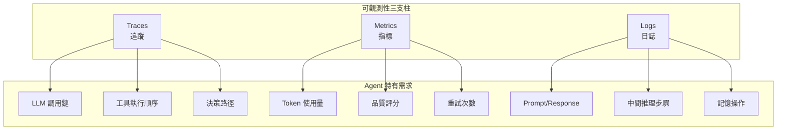
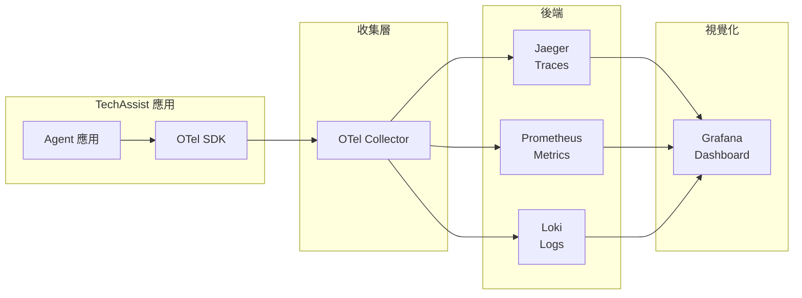
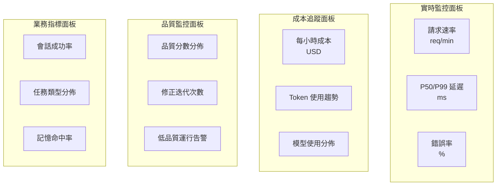
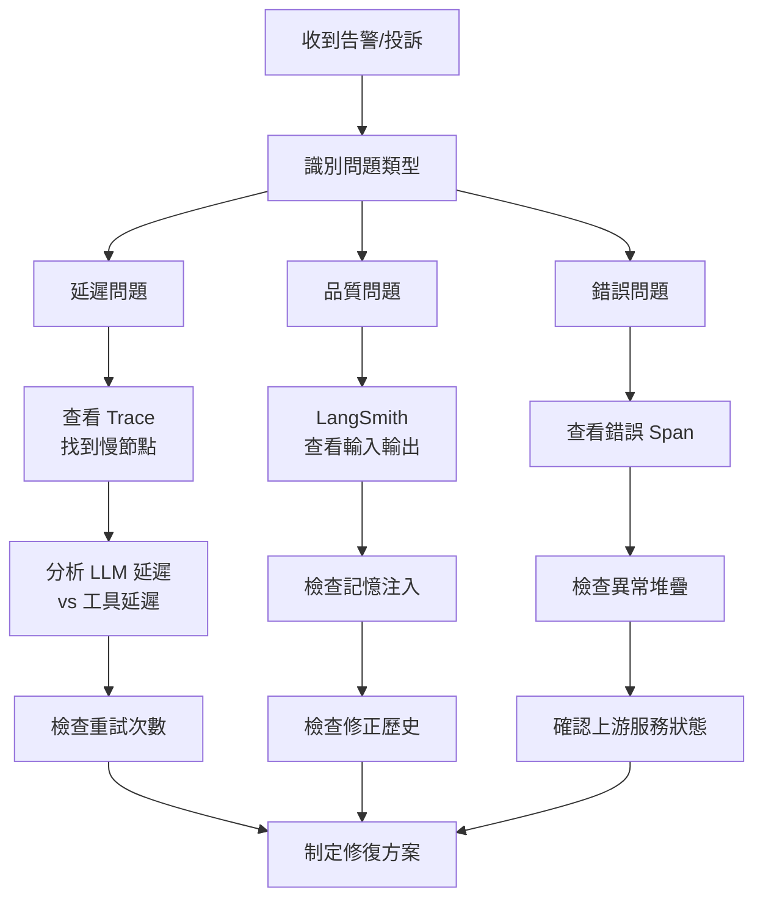

# Chapter 10: 可觀測性 (Observability)

> 「你無法改進你無法測量的東西。」——彼得·德魯克

---

## 本章學習目標

完成本章後，你將能夠：

1. 理解 AI Agent 可觀測性的三大支柱：Traces、Metrics、Logs
2. 使用 OpenTelemetry 為 TechAssist 建立完整的可觀測性基礎設施
3. 整合 LangSmith 進行 LLM 調用追蹤與除錯
4. 設計 Agent 特有的指標監控體系
5. 建立有效的告警與異常檢測機制

---

## 10.1 為什麼 Agent 系統需要可觀測性？

### 場景：TechAssist 的生產事故

TechAssist v1.0 上線後的第二週，客服團隊收到大量投訴：

> 「系統回應變得很慢，有時候等超過 30 秒！」
> 「AI 給的答案突然變得很奇怪，像是在胡言亂語。」
> 「同樣的問題，昨天還能回答，今天就不行了。」

運維團隊打開監控儀表板，卻發現：
- CPU 使用率正常
- 記憶體充足
- 網路延遲正常

**問題出在哪裡？** 傳統的基礎設施監控無法回答這個問題。因為 AI Agent 系統有其獨特的故障模式：

```
傳統應用                    AI Agent 系統
─────────────────          ─────────────────────────────
請求 → 處理 → 回應          請求 → LLM₁ → Tool → LLM₂ → 回應
                                    ↓
                              記憶檢索 → 規劃 → 評估 → 修正
```

### 10.1.1 Agent 系統的獨特挑戰

| 挑戰 | 傳統應用 | AI Agent |
|------|----------|----------|
| **延遲來源** | DB 查詢、網路 | LLM API、多輪對話、重試循環 |
| **錯誤類型** | 異常、超時 | 幻覺、邏輯錯誤、品質下降 |
| **行為確定性** | 相同輸入 → 相同輸出 | 相同輸入 → 可能不同輸出 |
| **依賴服務** | 資料庫、快取 | LLM API、向量資料庫、外部工具 |
| **成本模型** | 固定資源成本 | 按 Token 計費，成本波動大 |

### 10.1.2 可觀測性的三大支柱



---

## 10.2 OpenTelemetry 基礎設施

OpenTelemetry (OTel) 是 CNCF 的開源可觀測性框架，提供統一的 API 來收集 Traces、Metrics 和 Logs。

### 10.2.1 架構設計



### 10.2.2 基礎配置

首先，建立 OTel 的基礎配置：

```python
# techassist_v20/observability/config.py
"""
TechAssist v2.0 - OpenTelemetry 配置
"""

from opentelemetry import trace, metrics
from opentelemetry.sdk.trace import TracerProvider
from opentelemetry.sdk.trace.export import BatchSpanProcessor
from opentelemetry.sdk.metrics import MeterProvider
from opentelemetry.sdk.metrics.export import PeriodicExportingMetricReader
from opentelemetry.exporter.otlp.proto.grpc.trace_exporter import OTLPSpanExporter
from opentelemetry.exporter.otlp.proto.grpc.metric_exporter import OTLPMetricExporter
from opentelemetry.sdk.resources import Resource, SERVICE_NAME, SERVICE_VERSION

from ..config import config


def setup_observability() -> tuple[trace.Tracer, metrics.Meter]:
    """‹1› 初始化 OpenTelemetry"""

    # ‹2› 定義服務資源
    resource = Resource.create({
        SERVICE_NAME: "techassist",
        SERVICE_VERSION: "2.0.0",
        "deployment.environment": config.environment,
    })

    # ‹3› 設置 Tracer
    tracer_provider = TracerProvider(resource=resource)
    span_exporter = OTLPSpanExporter(
        endpoint=config.otel_endpoint,
        insecure=True
    )
    tracer_provider.add_span_processor(
        BatchSpanProcessor(span_exporter)
    )
    trace.set_tracer_provider(tracer_provider)

    # ‹4› 設置 Meter
    metric_exporter = OTLPMetricExporter(
        endpoint=config.otel_endpoint,
        insecure=True
    )
    metric_reader = PeriodicExportingMetricReader(
        metric_exporter,
        export_interval_millis=30000  # 30 秒
    )
    meter_provider = MeterProvider(
        resource=resource,
        metric_readers=[metric_reader]
    )
    metrics.set_meter_provider(meter_provider)

    # ‹5› 創建實例
    tracer = trace.get_tracer("techassist.agent")
    meter = metrics.get_meter("techassist.agent")

    return tracer, meter
```

**程式碼解析：**
- ‹1› 統一初始化函數，返回 Tracer 和 Meter 實例
- ‹2› 資源標籤用於識別服務來源
- ‹3› BatchSpanProcessor 批量發送 Spans，降低開銷
- ‹4› 指標每 30 秒導出一次
- ‹5› 使用命名空間區分不同模組

---

## 10.3 LLM 調用追蹤

### 10.3.1 包裝 LLM 調用

為了追蹤每次 LLM 調用，我們建立一個可觀測的包裝器：

```python
# techassist_v20/observability/llm_tracer.py
"""
LLM 調用追蹤包裝器
"""

import time
from typing import Any
from functools import wraps
from opentelemetry import trace
from opentelemetry.trace import Status, StatusCode
from langchain_core.language_models import BaseChatModel
from langchain_core.messages import BaseMessage

from .metrics import llm_metrics


class TracedLLM:
    """‹1› 可觀測的 LLM 包裝器"""

    def __init__(self, llm: BaseChatModel, tracer: trace.Tracer):
        self.llm = llm
        self.tracer = tracer
        self.model_name = getattr(llm, 'model_name', 'unknown')

    def invoke(self, messages: list[BaseMessage], **kwargs) -> BaseMessage:
        """‹2› 追蹤 LLM invoke 調用"""

        with self.tracer.start_as_current_span(
            "llm.invoke",
            attributes={
                "llm.model": self.model_name,
                "llm.message_count": len(messages),
            }
        ) as span:
            start_time = time.perf_counter()

            try:
                # ‹3› 記錄輸入（注意隱私）
                span.set_attribute(
                    "llm.input_preview",
                    self._truncate(str(messages[-1].content), 200)
                )

                # 執行調用
                response = self.llm.invoke(messages, **kwargs)

                # ‹4› 記錄輸出和 Token 使用
                duration = time.perf_counter() - start_time
                token_usage = self._extract_token_usage(response)

                span.set_attributes({
                    "llm.output_preview": self._truncate(response.content, 200),
                    "llm.duration_ms": duration * 1000,
                    "llm.input_tokens": token_usage.get("input", 0),
                    "llm.output_tokens": token_usage.get("output", 0),
                    "llm.total_tokens": token_usage.get("total", 0),
                })

                # ‹5› 更新指標
                llm_metrics.record_call(
                    model=self.model_name,
                    duration=duration,
                    input_tokens=token_usage.get("input", 0),
                    output_tokens=token_usage.get("output", 0),
                    success=True
                )

                span.set_status(Status(StatusCode.OK))
                return response

            except Exception as e:
                # ‹6› 記錄錯誤
                span.set_status(Status(StatusCode.ERROR, str(e)))
                span.record_exception(e)

                llm_metrics.record_call(
                    model=self.model_name,
                    duration=time.perf_counter() - start_time,
                    input_tokens=0,
                    output_tokens=0,
                    success=False,
                    error_type=type(e).__name__
                )

                raise

    def _truncate(self, text: str, max_length: int) -> str:
        """截斷長文本"""
        if len(text) <= max_length:
            return text
        return text[:max_length] + "..."

    def _extract_token_usage(self, response: BaseMessage) -> dict:
        """‹7› 提取 Token 使用量"""
        usage = {}

        # Anthropic 格式
        if hasattr(response, 'usage_metadata'):
            metadata = response.usage_metadata
            usage = {
                "input": getattr(metadata, 'input_tokens', 0),
                "output": getattr(metadata, 'output_tokens', 0),
                "total": getattr(metadata, 'total_tokens', 0),
            }

        # OpenAI 格式
        elif hasattr(response, 'response_metadata'):
            metadata = response.response_metadata.get('token_usage', {})
            usage = {
                "input": metadata.get('prompt_tokens', 0),
                "output": metadata.get('completion_tokens', 0),
                "total": metadata.get('total_tokens', 0),
            }

        return usage
```

**程式碼解析：**
- ‹1› 包裝器模式，不修改原有 LLM 行為
- ‹2› 使用 OpenTelemetry Span 追蹤每次調用
- ‹3› 記錄輸入預覽，但要注意隱私合規
- ‹4› 記錄響應時間和 Token 使用
- ‹5› 同時更新 Prometheus 指標
- ‹6› 錯誤情況的完整記錄
- ‹7› 兼容多種 LLM 提供者的 Token 統計

### 10.3.2 追蹤 Agent 執行流程

對於完整的 Agent 執行流程，我們需要更高層級的追蹤：

```python
# techassist_v20/observability/agent_tracer.py
"""
Agent 執行流程追蹤
"""

from typing import Any, Callable
from functools import wraps
from opentelemetry import trace
from opentelemetry.trace import SpanKind

from .config import tracer


def trace_agent_node(node_name: str):
    """‹1› 裝飾器：追蹤 Agent 節點"""

    def decorator(func: Callable) -> Callable:
        @wraps(func)
        def wrapper(state: dict, *args, **kwargs) -> dict:
            with tracer.start_as_current_span(
                f"agent.node.{node_name}",
                kind=SpanKind.INTERNAL,
                attributes={
                    "agent.node": node_name,
                    "agent.phase": state.get("phase", "unknown"),
                    "agent.iteration": state.get("iteration", 0),
                }
            ) as span:
                try:
                    result = func(state, *args, **kwargs)

                    # ‹2› 記錄狀態變化
                    if isinstance(result, dict):
                        for key, value in result.items():
                            if key in ["phase", "task_type", "iteration"]:
                                span.set_attribute(f"agent.output.{key}", str(value))

                    return result

                except Exception as e:
                    span.record_exception(e)
                    raise

        return wrapper
    return decorator


def trace_tool_call(tool_name: str):
    """‹3› 裝飾器：追蹤工具調用"""

    def decorator(func: Callable) -> Callable:
        @wraps(func)
        def wrapper(*args, **kwargs) -> Any:
            with tracer.start_as_current_span(
                f"agent.tool.{tool_name}",
                kind=SpanKind.CLIENT,
                attributes={"tool.name": tool_name}
            ) as span:
                try:
                    result = func(*args, **kwargs)

                    span.set_attribute(
                        "tool.result_preview",
                        str(result)[:200] if result else "None"
                    )

                    return result

                except Exception as e:
                    span.set_attribute("tool.error", str(e))
                    span.record_exception(e)
                    raise

        return wrapper
    return decorator


class AgentTracer:
    """‹4› Agent 級別的追蹤上下文管理"""

    def __init__(self, tracer_instance: trace.Tracer):
        self.tracer = tracer_instance

    def start_session(self, session_id: str, user_id: str) -> trace.Span:
        """開始新的 Agent 會話追蹤"""
        return self.tracer.start_as_current_span(
            "agent.session",
            kind=SpanKind.SERVER,
            attributes={
                "session.id": session_id,
                "user.id": user_id,
            }
        )

    def trace_planning(self, task: str, plan_steps: int):
        """追蹤規劃階段"""
        span = trace.get_current_span()
        span.add_event(
            "planning.completed",
            attributes={
                "planning.task": task[:100],
                "planning.steps": plan_steps,
            }
        )

    def trace_memory_retrieval(self, query: str, results_count: int):
        """追蹤記憶檢索"""
        span = trace.get_current_span()
        span.add_event(
            "memory.retrieved",
            attributes={
                "memory.query": query[:100],
                "memory.results": results_count,
            }
        )

    def trace_reflexion(self, iteration: int, score: float, passed: bool):
        """追蹤自我修正迭代"""
        span = trace.get_current_span()
        span.add_event(
            "reflexion.iteration",
            attributes={
                "reflexion.iteration": iteration,
                "reflexion.score": score,
                "reflexion.passed": passed,
            }
        )
```

**程式碼解析：**
- ‹1› 節點裝飾器，自動追蹤每個 LangGraph 節點
- ‹2› 記錄狀態變化便於除錯
- ‹3› 工具調用使用 CLIENT 類型的 Span
- ‹4› 高層級追蹤器管理整個會話上下文

---

## 10.4 Agent 指標體系

### 10.4.1 指標設計

為 Agent 系統設計專門的指標體系：

```python
# techassist_v20/observability/metrics.py
"""
TechAssist Agent 指標定義
"""

from dataclasses import dataclass
from opentelemetry import metrics

# 獲取全局 Meter
meter = metrics.get_meter("techassist.agent")


@dataclass
class LLMMetrics:
    """‹1› LLM 相關指標"""

    def __init__(self):
        # 調用計數器
        self.call_counter = meter.create_counter(
            name="llm.calls.total",
            description="Total number of LLM API calls",
            unit="1"
        )

        # 延遲直方圖
        self.latency_histogram = meter.create_histogram(
            name="llm.latency",
            description="LLM API call latency",
            unit="ms"
        )

        # Token 使用計數器
        self.token_counter = meter.create_counter(
            name="llm.tokens.total",
            description="Total tokens used",
            unit="1"
        )

        # 錯誤計數器
        self.error_counter = meter.create_counter(
            name="llm.errors.total",
            description="Total LLM API errors",
            unit="1"
        )

    def record_call(
        self,
        model: str,
        duration: float,
        input_tokens: int,
        output_tokens: int,
        success: bool,
        error_type: str | None = None
    ):
        """記錄一次 LLM 調用"""
        labels = {"model": model}

        self.call_counter.add(1, labels)
        self.latency_histogram.record(duration * 1000, labels)

        self.token_counter.add(input_tokens, {**labels, "type": "input"})
        self.token_counter.add(output_tokens, {**labels, "type": "output"})

        if not success:
            self.error_counter.add(1, {**labels, "error_type": error_type or "unknown"})


@dataclass
class AgentMetrics:
    """‹2› Agent 行為指標"""

    def __init__(self):
        # 會話計數器
        self.session_counter = meter.create_counter(
            name="agent.sessions.total",
            description="Total agent sessions",
            unit="1"
        )

        # 任務類型分佈
        self.task_counter = meter.create_counter(
            name="agent.tasks.total",
            description="Tasks by type",
            unit="1"
        )

        # 會話持續時間
        self.session_duration = meter.create_histogram(
            name="agent.session.duration",
            description="Agent session duration",
            unit="s"
        )

        # 規劃步驟數
        self.plan_steps_histogram = meter.create_histogram(
            name="agent.plan.steps",
            description="Number of steps in plans",
            unit="1"
        )

        # 自我修正迭代次數
        self.reflexion_iterations = meter.create_histogram(
            name="agent.reflexion.iterations",
            description="Reflexion iterations before passing",
            unit="1"
        )

        # 品質評分
        self.quality_score = meter.create_histogram(
            name="agent.quality.score",
            description="Output quality scores",
            unit="1"
        )

        # 記憶命中率
        self.memory_hit_counter = meter.create_counter(
            name="agent.memory.hits",
            description="Memory retrieval hits",
            unit="1"
        )

    def record_session(self, task_type: str, duration: float):
        """記錄會話完成"""
        self.session_counter.add(1, {"task_type": task_type})
        self.task_counter.add(1, {"type": task_type})
        self.session_duration.record(duration, {"task_type": task_type})

    def record_planning(self, steps: int):
        """記錄規劃結果"""
        self.plan_steps_histogram.record(steps)

    def record_reflexion(self, iterations: int, final_score: float):
        """記錄自我修正結果"""
        self.reflexion_iterations.record(iterations)
        self.quality_score.record(final_score)

    def record_memory_access(self, hit: bool, source: str):
        """記錄記憶訪問"""
        self.memory_hit_counter.add(
            1 if hit else 0,
            {"source": source, "hit": str(hit)}
        )


@dataclass
class CostMetrics:
    """‹3› 成本相關指標"""

    # Token 價格 (USD per 1K tokens)
    PRICING = {
        "claude-sonnet-4-20250514": {"input": 0.003, "output": 0.015},
        "claude-opus-4-20250514": {"input": 0.015, "output": 0.075},
        "gpt-4o": {"input": 0.005, "output": 0.015},
    }

    def __init__(self):
        self.cost_counter = meter.create_counter(
            name="agent.cost.usd",
            description="Estimated cost in USD",
            unit="USD"
        )

    def record_cost(self, model: str, input_tokens: int, output_tokens: int):
        """記錄估算成本"""
        pricing = self.PRICING.get(model, {"input": 0.01, "output": 0.03})

        input_cost = (input_tokens / 1000) * pricing["input"]
        output_cost = (output_tokens / 1000) * pricing["output"]
        total_cost = input_cost + output_cost

        self.cost_counter.add(total_cost, {"model": model})


# ‹4› 全局指標實例
llm_metrics = LLMMetrics()
agent_metrics = AgentMetrics()
cost_metrics = CostMetrics()
```

**程式碼解析：**
- ‹1› LLM 指標：調用次數、延遲、Token、錯誤
- ‹2› Agent 行為指標：會話、規劃、修正、品質
- ‹3› 成本指標：按模型計算估算成本
- ‹4› 全局實例便於各模組使用

---

## 10.5 LangSmith 整合

LangSmith 是 LangChain 官方的 LLM 應用追蹤平台，提供專門針對 Agent 的除錯功能。

### 10.5.1 配置 LangSmith

```python
# techassist_v20/observability/langsmith.py
"""
LangSmith 整合
"""

import os
from langsmith import Client
from langsmith.run_trees import RunTree

# 環境變數配置
os.environ["LANGCHAIN_TRACING_V2"] = "true"
os.environ["LANGCHAIN_PROJECT"] = "techassist-production"


class LangSmithIntegration:
    """‹1› LangSmith 整合工具"""

    def __init__(self):
        self.client = Client()
        self.project_name = os.environ.get("LANGCHAIN_PROJECT", "default")

    def create_feedback(
        self,
        run_id: str,
        key: str,
        score: float,
        comment: str | None = None
    ):
        """‹2› 創建運行反饋"""
        self.client.create_feedback(
            run_id=run_id,
            key=key,
            score=score,
            comment=comment
        )

    def get_run_url(self, run_id: str) -> str:
        """‹3› 獲取運行詳情 URL"""
        return f"https://smith.langchain.com/o/default/projects/p/{self.project_name}/r/{run_id}"

    def log_quality_feedback(
        self,
        run_id: str,
        quality_score: float,
        user_rating: int | None = None
    ):
        """‹4› 記錄品質反饋"""
        # AI 評估分數
        self.create_feedback(
            run_id=run_id,
            key="ai_quality_score",
            score=quality_score,
            comment="Automated quality evaluation"
        )

        # 用戶評分（如果有）
        if user_rating is not None:
            self.create_feedback(
                run_id=run_id,
                key="user_rating",
                score=user_rating / 5.0,  # 標準化到 0-1
                comment="User feedback"
            )

    def get_recent_low_quality_runs(
        self,
        threshold: float = 0.6,
        limit: int = 10
    ) -> list[dict]:
        """‹5› 獲取最近的低品質運行"""
        runs = self.client.list_runs(
            project_name=self.project_name,
            filter='has(feedback_key, "ai_quality_score")',
            limit=limit * 3  # 過濾前多取一些
        )

        low_quality = []
        for run in runs:
            feedbacks = self.client.list_feedback(run_ids=[str(run.id)])
            for fb in feedbacks:
                if fb.key == "ai_quality_score" and fb.score < threshold:
                    low_quality.append({
                        "run_id": str(run.id),
                        "score": fb.score,
                        "inputs": run.inputs,
                        "url": self.get_run_url(str(run.id))
                    })
                    break

            if len(low_quality) >= limit:
                break

        return low_quality
```

**程式碼解析：**
- ‹1› 封裝 LangSmith 客戶端操作
- ‹2› 創建運行反饋用於標註品質
- ‹3› 生成可直接訪問的 URL
- ‹4› 結合 AI 評估和用戶反饋
- ‹5› 便於快速定位問題運行

### 10.5.2 自動品質標註

```python
# techassist_v20/observability/quality_annotator.py
"""
自動品質標註器
"""

from typing import Callable
from functools import wraps
from langsmith.run_trees import RunTree
from langsmith import traceable

from .langsmith import LangSmithIntegration

langsmith = LangSmithIntegration()


def auto_annotate_quality(quality_extractor: Callable[[dict], float]):
    """‹1› 裝飾器：自動標註運行品質"""

    def decorator(func: Callable) -> Callable:
        @wraps(func)
        @traceable(name=func.__name__)
        def wrapper(*args, **kwargs) -> dict:
            result = func(*args, **kwargs)

            # ‹2› 提取品質分數
            if isinstance(result, dict):
                quality_score = quality_extractor(result)

                # ‹3› 獲取當前 Run ID 並標註
                run_tree = RunTree.get_current()
                if run_tree:
                    langsmith.log_quality_feedback(
                        run_id=str(run_tree.id),
                        quality_score=quality_score
                    )

            return result

        return wrapper
    return decorator


# 使用範例
def extract_quality_from_evaluation(result: dict) -> float:
    """從結果中提取品質分數"""
    evaluation = result.get("evaluation")
    if evaluation:
        return evaluation.overall_score
    return 0.5


@auto_annotate_quality(extract_quality_from_evaluation)
def agent_respond(state: dict) -> dict:
    """Agent 回應函數（自動標註品質）"""
    # ... 實際實現
    pass
```

---

## 10.6 Grafana 儀表板

### 10.6.1 儀表板設計

```json
{
  "dashboard": {
    "title": "TechAssist Agent Observability",
    "panels": [
      {
        "title": "LLM Calls per Minute",
        "type": "timeseries",
        "targets": [
          {
            "expr": "rate(llm_calls_total[1m])",
            "legendFormat": "{{model}}"
          }
        ]
      },
      {
        "title": "P99 Latency",
        "type": "stat",
        "targets": [
          {
            "expr": "histogram_quantile(0.99, rate(llm_latency_bucket[5m]))"
          }
        ]
      },
      {
        "title": "Token Usage",
        "type": "timeseries",
        "targets": [
          {
            "expr": "sum(rate(llm_tokens_total[5m])) by (type)",
            "legendFormat": "{{type}} tokens"
          }
        ]
      },
      {
        "title": "Quality Score Distribution",
        "type": "histogram",
        "targets": [
          {
            "expr": "agent_quality_score_bucket"
          }
        ]
      },
      {
        "title": "Estimated Cost (Hourly)",
        "type": "stat",
        "targets": [
          {
            "expr": "sum(increase(agent_cost_usd[1h]))"
          }
        ]
      },
      {
        "title": "Reflexion Iterations",
        "type": "bargauge",
        "targets": [
          {
            "expr": "histogram_quantile(0.5, agent_reflexion_iterations_bucket)"
          }
        ]
      }
    ]
  }
}
```

### 10.6.2 關鍵指標視覺化



---

## 10.7 告警配置

### 10.7.1 Prometheus 告警規則

```yaml
# alerting-rules.yaml
groups:
  - name: techassist-agent-alerts
    rules:
      # ‹1› 高延遲告警
      - alert: HighLLMLatency
        expr: histogram_quantile(0.99, rate(llm_latency_bucket[5m])) > 10000
        for: 5m
        labels:
          severity: warning
        annotations:
          summary: "LLM API P99 延遲過高"
          description: "P99 延遲 {{ $value }}ms 超過 10 秒閾值"

      # ‹2› 錯誤率告警
      - alert: HighLLMErrorRate
        expr: |
          sum(rate(llm_errors_total[5m])) /
          sum(rate(llm_calls_total[5m])) > 0.05
        for: 5m
        labels:
          severity: critical
        annotations:
          summary: "LLM API 錯誤率過高"
          description: "錯誤率 {{ $value | humanizePercentage }} 超過 5%"

      # ‹3› 品質下降告警
      - alert: QualityDegradation
        expr: |
          histogram_quantile(0.5, agent_quality_score_bucket) < 0.7
        for: 15m
        labels:
          severity: warning
        annotations:
          summary: "Agent 輸出品質下降"
          description: "中位數品質分數 {{ $value }} 低於 0.7"

      # ‹4› 成本異常告警
      - alert: CostSpike
        expr: |
          sum(increase(agent_cost_usd[1h])) >
          sum(increase(agent_cost_usd[1h] offset 1d)) * 2
        for: 30m
        labels:
          severity: warning
        annotations:
          summary: "成本異常增長"
          description: "過去一小時成本是昨日同期的 2 倍以上"

      # ‹5› 修正循環過多告警
      - alert: ExcessiveReflexionIterations
        expr: |
          histogram_quantile(0.9, agent_reflexion_iterations_bucket) >= 3
        for: 10m
        labels:
          severity: warning
        annotations:
          summary: "自我修正迭代過多"
          description: "90% 的請求需要 3 次以上修正迭代"
```

---

## 10.8 除錯工作流

### 10.8.1 問題診斷流程

當收到告警或用戶投訴時，使用以下流程：



### 10.8.2 實用除錯腳本

```python
# techassist_v20/observability/debug_tools.py
"""
除錯工具集
"""

from datetime import datetime, timedelta
from .langsmith import LangSmithIntegration

langsmith = LangSmithIntegration()


def diagnose_slow_requests(threshold_ms: float = 5000, hours: int = 1):
    """‹1› 診斷慢請求"""
    print(f"=== 診斷過去 {hours} 小時內延遲 > {threshold_ms}ms 的請求 ===\n")

    # 從 LangSmith 獲取慢請求
    runs = langsmith.client.list_runs(
        project_name=langsmith.project_name,
        filter=f'latency > {threshold_ms}',
        start_time=datetime.now() - timedelta(hours=hours),
        limit=20
    )

    for run in runs:
        print(f"Run ID: {run.id}")
        print(f"  延遲: {run.latency_ms:.0f}ms")
        print(f"  輸入: {str(run.inputs)[:100]}...")
        print(f"  URL: {langsmith.get_run_url(str(run.id))}")
        print()


def diagnose_quality_issues(threshold: float = 0.6, limit: int = 10):
    """‹2› 診斷品質問題"""
    print(f"=== 品質分數 < {threshold} 的請求 ===\n")

    low_quality = langsmith.get_recent_low_quality_runs(
        threshold=threshold,
        limit=limit
    )

    for item in low_quality:
        print(f"Run ID: {item['run_id']}")
        print(f"  分數: {item['score']:.2f}")
        print(f"  輸入: {str(item['inputs'])[:100]}...")
        print(f"  URL: {item['url']}")
        print()


def analyze_token_usage(hours: int = 24):
    """‹3› 分析 Token 使用"""
    print(f"=== 過去 {hours} 小時 Token 使用分析 ===\n")

    runs = langsmith.client.list_runs(
        project_name=langsmith.project_name,
        start_time=datetime.now() - timedelta(hours=hours),
        limit=1000
    )

    total_input = 0
    total_output = 0
    model_usage = {}

    for run in runs:
        if run.total_tokens:
            total_input += run.prompt_tokens or 0
            total_output += run.completion_tokens or 0

            model = run.extra.get("model", "unknown") if run.extra else "unknown"
            if model not in model_usage:
                model_usage[model] = {"input": 0, "output": 0}
            model_usage[model]["input"] += run.prompt_tokens or 0
            model_usage[model]["output"] += run.completion_tokens or 0

    print(f"總 Input Tokens: {total_input:,}")
    print(f"總 Output Tokens: {total_output:,}")
    print(f"\n按模型分佈:")
    for model, usage in model_usage.items():
        print(f"  {model}: {usage['input']:,} input, {usage['output']:,} output")


if __name__ == "__main__":
    import sys

    if len(sys.argv) < 2:
        print("Usage: python debug_tools.py [slow|quality|tokens]")
        sys.exit(1)

    command = sys.argv[1]

    if command == "slow":
        diagnose_slow_requests()
    elif command == "quality":
        diagnose_quality_issues()
    elif command == "tokens":
        analyze_token_usage()
    else:
        print(f"Unknown command: {command}")
```

---

## 10.9 本章回顧

### 核心概念

| 概念 | 說明 |
|------|------|
| **三大支柱** | Traces（追蹤）、Metrics（指標）、Logs（日誌） |
| **OpenTelemetry** | 統一的可觀測性框架，支持多後端導出 |
| **LangSmith** | LangChain 專用的 LLM 應用追蹤平台 |
| **Agent 特有指標** | Token 使用、品質分數、修正迭代、成本估算 |

### TechAssist v2.0 進度

```
v1.0 功能                    v2.0 新增
─────────────────           ─────────────────
✅ 規劃模式                  ✅ OpenTelemetry 整合
✅ 記憶模式                  ✅ LLM 調用追蹤
✅ 自我修正模式              ✅ Agent 指標體系
                            ✅ LangSmith 整合
                            ✅ Grafana 儀表板
                            ✅ 告警配置
```

### 實戰檢查清單

- [ ] 配置 OpenTelemetry Collector
- [ ] 包裝 LLM 調用以追蹤延遲和 Token
- [ ] 定義 Agent 特有的業務指標
- [ ] 配置 Grafana 儀表板
- [ ] 設置關鍵告警規則
- [ ] 建立除錯工作流

---

## 練習題

### 練習 10.1：自定義指標

為 TechAssist 添加以下自定義指標：
1. 「記憶檢索延遲」直方圖
2. 「計劃重規劃次數」計數器
3. 「用戶滿意度」評分直方圖

### 練習 10.2：告警規則

設計一個「Agent 陷入死循環」的告警規則，當：
- 同一會話在 5 分鐘內執行超過 10 次迭代
- 品質分數沒有提升趨勢

### 練習 10.3：除錯腳本

編寫一個腳本，自動分析過去 24 小時內：
- 最耗費 Token 的 10 個請求
- 修正迭代最多的 10 個請求
- 並嘗試找出它們的共同特徵

---

**下一章預告：** 在第 11 章中，我們將探討如何為 Agent 系統建立安全護欄，包括輸入驗證、輸出過濾、權限控制和敏感數據處理。
