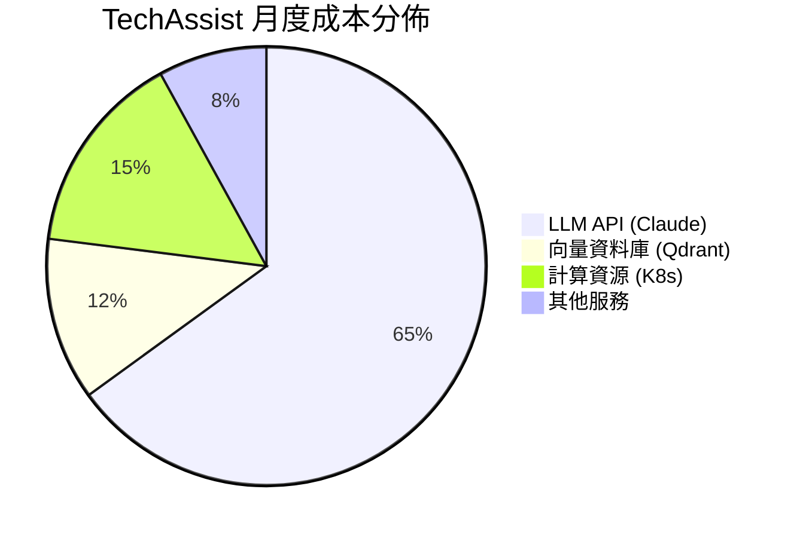
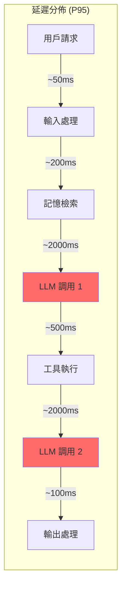
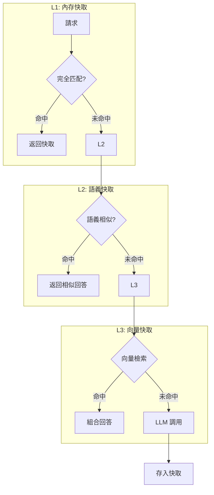

# Chapter 12: 效能與成本優化

> 「過早優化是萬惡之源，但該優化時不優化也是。」——改編自 Donald Knuth

---

## 本章學習目標

完成本章後，你將能夠：

1. 分析 Agent 系統的效能瓶頸和成本構成
2. 實現 Token 優化策略降低 LLM 成本
3. 設計多層快取機制提升響應速度
4. 使用模型路由策略平衡效能與成本
5. 應用批處理和併發技術提升吞吐量

---

## 12.1 成本與效能分析

### 場景：財務總監的質疑

TechAssist v2.0 上線一個月後，財務總監發來一封郵件：

> 「我們上個月的 AI API 費用是預算的 3 倍！請解釋原因並提出改進方案。」

技術團隊開始調查，發現幾個驚人的數據：

- 平均每次對話消耗 **15,000 tokens**
- 30% 的請求是重複問題
- 複雜任務平均需要 **5 次 LLM 調用**
- 自我修正平均迭代 **2.3 次**

### 12.1.1 成本構成分析



### 12.1.2 效能瓶頸地圖



**關鍵洞察：** LLM 調用佔總延遲的 **80%** 和總成本的 **65%**。

---

## 12.2 Token 優化策略

### 12.2.1 Prompt 壓縮技術

```python
# techassist_v20/optimization/prompt_compressor.py
"""
Prompt 壓縮器
"""

import re
from typing import Callable
from langchain_core.messages import BaseMessage, HumanMessage, AIMessage, SystemMessage


class PromptCompressor:
    """‹1› Prompt 壓縮器"""

    def __init__(self, target_ratio: float = 0.6):
        self.target_ratio = target_ratio

    def compress_system_prompt(self, prompt: str) -> str:
        """‹2› 壓縮系統提示"""
        compressed = prompt

        # 移除多餘空白
        compressed = re.sub(r'\n\s*\n', '\n\n', compressed)
        compressed = re.sub(r'[ \t]+', ' ', compressed)

        # 移除註解和說明
        compressed = re.sub(r'#.*$', '', compressed, flags=re.MULTILINE)
        compressed = re.sub(r'<!--.*?-->', '', compressed, flags=re.DOTALL)

        # 縮寫常見短語
        abbreviations = {
            "for example": "e.g.",
            "that is": "i.e.",
            "and so on": "etc.",
            "請注意": "注意",
            "請確保": "確保",
            "你需要": "需",
        }
        for full, short in abbreviations.items():
            compressed = compressed.replace(full, short)

        return compressed.strip()

    def compress_conversation(
        self,
        messages: list[BaseMessage],
        max_tokens: int = 2000
    ) -> list[BaseMessage]:
        """‹3› 壓縮對話歷史"""
        if not messages:
            return messages

        # 估算當前 token 數
        total_tokens = sum(self._estimate_tokens(m.content) for m in messages)

        if total_tokens <= max_tokens:
            return messages

        # ‹4› 策略：保留首尾，壓縮中間
        result = []

        # 保留系統消息
        system_msgs = [m for m in messages if isinstance(m, SystemMessage)]
        result.extend(system_msgs)

        # 保留最近的對話
        non_system = [m for m in messages if not isinstance(m, SystemMessage)]

        # 保留最後 4 輪對話（8 條消息）
        recent = non_system[-8:] if len(non_system) > 8 else non_system

        # 如果還有更早的對話，生成摘要
        if len(non_system) > 8:
            older = non_system[:-8]
            summary = self._summarize_messages(older)
            result.append(SystemMessage(content=f"[對話摘要] {summary}"))

        result.extend(recent)

        return result

    def compress_context(self, context: str, max_chars: int = 3000) -> str:
        """‹5› 壓縮注入的上下文"""
        if len(context) <= max_chars:
            return context

        # 按段落分割
        paragraphs = context.split('\n\n')

        # 計算每段的重要性（簡化版：長度 + 關鍵詞）
        scored = []
        keywords = ["重要", "關鍵", "注意", "必須", "決定", "結論"]

        for p in paragraphs:
            score = len(p) * 0.5  # 長度權重
            for kw in keywords:
                if kw in p:
                    score += 100
            scored.append((p, score))

        # 按重要性排序
        scored.sort(key=lambda x: x[1], reverse=True)

        # 選擇直到達到限制
        result = []
        current_length = 0

        for p, _ in scored:
            if current_length + len(p) > max_chars:
                break
            result.append(p)
            current_length += len(p) + 2

        return '\n\n'.join(result)

    def _estimate_tokens(self, text: str) -> int:
        """估算 token 數（簡化版）"""
        # 粗略估算：英文 ~4 字符/token，中文 ~2 字符/token
        chinese_chars = len(re.findall(r'[\u4e00-\u9fff]', text))
        other_chars = len(text) - chinese_chars

        return chinese_chars // 2 + other_chars // 4

    def _summarize_messages(self, messages: list[BaseMessage]) -> str:
        """生成對話摘要"""
        # 簡化版：提取關鍵點
        key_points = []

        for m in messages:
            content = m.content[:100]
            if isinstance(m, HumanMessage):
                key_points.append(f"用戶問：{content}")
            elif isinstance(m, AIMessage):
                key_points.append(f"AI答：{content}")

        # 只保留前 5 個關鍵點
        return " | ".join(key_points[:5])
```

**程式碼解析：**
- ‹1› 統一的壓縮器類
- ‹2› 移除系統提示中的冗餘內容
- ‹3› 智能壓縮對話歷史
- ‹4› 保留首尾策略：系統消息 + 最近對話 + 摘要
- ‹5› 基於重要性的上下文壓縮

### 12.2.2 動態 Token 預算

```python
# techassist_v20/optimization/token_budget.py
"""
動態 Token 預算管理
"""

from dataclasses import dataclass
from enum import Enum


class TaskComplexity(Enum):
    SIMPLE = "simple"
    MEDIUM = "medium"
    COMPLEX = "complex"


@dataclass
class TokenBudget:
    """‹1› Token 預算配置"""
    system_prompt: int
    context: int
    user_input: int
    output: int
    reserve: int  # 預留緩衝

    @property
    def total(self) -> int:
        return (
            self.system_prompt +
            self.context +
            self.user_input +
            self.output +
            self.reserve
        )


# ‹2› 按任務複雜度的預算配置
BUDGET_CONFIGS = {
    TaskComplexity.SIMPLE: TokenBudget(
        system_prompt=500,
        context=500,
        user_input=200,
        output=500,
        reserve=100
    ),  # 總計：1,800 tokens
    TaskComplexity.MEDIUM: TokenBudget(
        system_prompt=800,
        context=1500,
        user_input=500,
        output=1500,
        reserve=200
    ),  # 總計：4,500 tokens
    TaskComplexity.COMPLEX: TokenBudget(
        system_prompt=1000,
        context=3000,
        user_input=1000,
        output=3000,
        reserve=500
    ),  # 總計：8,500 tokens
}


class TokenBudgetManager:
    """‹3› Token 預算管理器"""

    def __init__(self, compressor: PromptCompressor):
        self.compressor = compressor
        self.configs = BUDGET_CONFIGS

    def allocate(
        self,
        complexity: TaskComplexity,
        system_prompt: str,
        context: str,
        user_input: str
    ) -> dict:
        """‹4› 分配並壓縮到預算內"""
        budget = self.configs[complexity]

        # 壓縮各部分
        compressed_system = self.compressor.compress_system_prompt(system_prompt)
        if self._estimate_tokens(compressed_system) > budget.system_prompt:
            compressed_system = compressed_system[:budget.system_prompt * 3]

        compressed_context = self.compressor.compress_context(
            context,
            max_chars=budget.context * 3
        )

        compressed_input = user_input
        if self._estimate_tokens(user_input) > budget.user_input:
            compressed_input = user_input[:budget.user_input * 3]

        return {
            "system_prompt": compressed_system,
            "context": compressed_context,
            "user_input": compressed_input,
            "max_output_tokens": budget.output,
            "budget_used": {
                "system": self._estimate_tokens(compressed_system),
                "context": self._estimate_tokens(compressed_context),
                "input": self._estimate_tokens(compressed_input),
            }
        }

    def _estimate_tokens(self, text: str) -> int:
        """估算 token 數"""
        return self.compressor._estimate_tokens(text)
```

---

## 12.3 多層快取架構

### 12.3.1 快取策略設計



### 12.3.2 實現多層快取

```python
# techassist_v20/optimization/cache.py
"""
多層快取系統
"""

import hashlib
import time
from typing import Any
from dataclasses import dataclass
from functools import lru_cache

import redis
from qdrant_client import QdrantClient
from qdrant_client.models import Distance, VectorParams, PointStruct


@dataclass
class CacheEntry:
    """快取條目"""
    key: str
    value: str
    created_at: float
    ttl: int
    hit_count: int = 0


class L1MemoryCache:
    """‹1› L1 內存快取：精確匹配"""

    def __init__(self, max_size: int = 1000, ttl: int = 3600):
        self.max_size = max_size
        self.ttl = ttl
        self.cache: dict[str, CacheEntry] = {}

    def _make_key(self, query: str, context_hash: str) -> str:
        """生成快取鍵"""
        content = f"{query}:{context_hash}"
        return hashlib.md5(content.encode()).hexdigest()

    def get(self, query: str, context_hash: str = "") -> str | None:
        """查詢快取"""
        key = self._make_key(query, context_hash)
        entry = self.cache.get(key)

        if not entry:
            return None

        # 檢查是否過期
        if time.time() - entry.created_at > entry.ttl:
            del self.cache[key]
            return None

        entry.hit_count += 1
        return entry.value

    def set(self, query: str, response: str, context_hash: str = ""):
        """設置快取"""
        # LRU 淘汰
        if len(self.cache) >= self.max_size:
            self._evict()

        key = self._make_key(query, context_hash)
        self.cache[key] = CacheEntry(
            key=key,
            value=response,
            created_at=time.time(),
            ttl=self.ttl
        )

    def _evict(self):
        """LRU 淘汰"""
        if not self.cache:
            return

        # 找到最少使用的條目
        min_entry = min(self.cache.values(), key=lambda x: x.hit_count)
        del self.cache[min_entry.key]


class L2RedisCache:
    """‹2› L2 Redis 快取：分布式共享"""

    def __init__(self, redis_url: str, ttl: int = 7200):
        self.client = redis.from_url(redis_url)
        self.ttl = ttl
        self.prefix = "techassist:cache:"

    def get(self, query: str, context_hash: str = "") -> str | None:
        """查詢快取"""
        key = self._make_key(query, context_hash)
        value = self.client.get(key)
        return value.decode() if value else None

    def set(self, query: str, response: str, context_hash: str = ""):
        """設置快取"""
        key = self._make_key(query, context_hash)
        self.client.setex(key, self.ttl, response)

    def _make_key(self, query: str, context_hash: str) -> str:
        content = f"{query}:{context_hash}"
        return self.prefix + hashlib.md5(content.encode()).hexdigest()


class L3SemanticCache:
    """‹3› L3 語義快取：基於向量相似度"""

    def __init__(
        self,
        qdrant_url: str,
        collection_name: str = "response_cache",
        similarity_threshold: float = 0.92
    ):
        self.client = QdrantClient(url=qdrant_url)
        self.collection_name = collection_name
        self.threshold = similarity_threshold
        self.embeddings = SimpleEmbeddings()  # 複用之前的嵌入類

        # 確保集合存在
        self._ensure_collection()

    def _ensure_collection(self):
        """確保集合存在"""
        collections = self.client.get_collections().collections
        if not any(c.name == self.collection_name for c in collections):
            self.client.create_collection(
                collection_name=self.collection_name,
                vectors_config=VectorParams(
                    size=64,  # 簡化嵌入維度
                    distance=Distance.COSINE
                )
            )

    def get(self, query: str) -> tuple[str | None, float]:
        """‹4› 語義查詢"""
        query_vector = self.embeddings.embed_query(query)

        results = self.client.search(
            collection_name=self.collection_name,
            query_vector=query_vector,
            limit=1,
            score_threshold=self.threshold
        )

        if results:
            best = results[0]
            return best.payload.get("response"), best.score

        return None, 0.0

    def set(self, query: str, response: str):
        """存入語義快取"""
        query_vector = self.embeddings.embed_query(query)

        point = PointStruct(
            id=hashlib.md5(query.encode()).hexdigest(),
            vector=query_vector,
            payload={
                "query": query,
                "response": response,
                "created_at": time.time()
            }
        )

        self.client.upsert(
            collection_name=self.collection_name,
            points=[point]
        )


class MultiLayerCache:
    """‹5› 多層快取協調器"""

    def __init__(
        self,
        l1: L1MemoryCache,
        l2: L2RedisCache | None = None,
        l3: L3SemanticCache | None = None
    ):
        self.l1 = l1
        self.l2 = l2
        self.l3 = l3

    def get(self, query: str, context_hash: str = "") -> tuple[str | None, str]:
        """‹6› 多層查詢"""
        # L1 精確匹配
        result = self.l1.get(query, context_hash)
        if result:
            return result, "L1_HIT"

        # L2 分布式快取
        if self.l2:
            result = self.l2.get(query, context_hash)
            if result:
                # 回填 L1
                self.l1.set(query, result, context_hash)
                return result, "L2_HIT"

        # L3 語義快取
        if self.l3:
            result, score = self.l3.get(query)
            if result:
                # 回填 L1 和 L2
                self.l1.set(query, result, context_hash)
                if self.l2:
                    self.l2.set(query, result, context_hash)
                return result, f"L3_HIT (similarity: {score:.2f})"

        return None, "MISS"

    def set(self, query: str, response: str, context_hash: str = ""):
        """‹7› 多層存入"""
        self.l1.set(query, response, context_hash)

        if self.l2:
            self.l2.set(query, response, context_hash)

        if self.l3:
            self.l3.set(query, response)
```

**程式碼解析：**
- ‹1› L1 內存快取：最快，精確匹配
- ‹2› L2 Redis 快取：分布式共享
- ‹3› L3 語義快取：基於向量相似度
- ‹4› 語義查詢返回最相似的回答
- ‹5› 協調器統一管理三層快取
- ‹6› 逐層查詢並回填
- ‹7› 同時寫入所有層

---

## 12.4 模型路由策略

### 12.4.1 智能模型選擇

```python
# techassist_v20/optimization/model_router.py
"""
智能模型路由
"""

from dataclasses import dataclass
from enum import Enum
from typing import Callable

from langchain_anthropic import ChatAnthropic
from langchain_openai import ChatOpenAI


class ModelTier(Enum):
    """‹1› 模型等級"""
    FAST = "fast"       # 快速便宜：Haiku, GPT-3.5
    BALANCED = "balanced"  # 平衡：Sonnet, GPT-4o
    POWERFUL = "powerful"  # 強大昂貴：Opus, GPT-4


@dataclass
class ModelConfig:
    """模型配置"""
    name: str
    tier: ModelTier
    cost_per_1k_input: float
    cost_per_1k_output: float
    avg_latency_ms: int
    max_context: int
    quality_score: float  # 0-1


# ‹2› 可用模型池
MODEL_POOL = {
    "claude-3-haiku": ModelConfig(
        name="claude-3-haiku-20240307",
        tier=ModelTier.FAST,
        cost_per_1k_input=0.00025,
        cost_per_1k_output=0.00125,
        avg_latency_ms=500,
        max_context=200000,
        quality_score=0.7
    ),
    "claude-sonnet-4-20250514": ModelConfig(
        name="claude-sonnet-4-20250514",
        tier=ModelTier.BALANCED,
        cost_per_1k_input=0.003,
        cost_per_1k_output=0.015,
        avg_latency_ms=1500,
        max_context=200000,
        quality_score=0.9
    ),
    "claude-opus-4-20250514": ModelConfig(
        name="claude-opus-4-20250514",
        tier=ModelTier.POWERFUL,
        cost_per_1k_input=0.015,
        cost_per_1k_output=0.075,
        avg_latency_ms=3000,
        max_context=200000,
        quality_score=0.98
    ),
    "gpt-4o-mini": ModelConfig(
        name="gpt-4o-mini",
        tier=ModelTier.FAST,
        cost_per_1k_input=0.00015,
        cost_per_1k_output=0.0006,
        avg_latency_ms=400,
        max_context=128000,
        quality_score=0.75
    ),
}


class ModelRouter:
    """‹3› 智能模型路由器"""

    def __init__(self, default_model: str = "claude-sonnet-4-20250514"):
        self.models = MODEL_POOL
        self.default = default_model

        # 任務類型到模型等級的映射
        self.task_tier_mapping = {
            "simple_qa": ModelTier.FAST,
            "summarization": ModelTier.FAST,
            "translation": ModelTier.FAST,
            "code_generation": ModelTier.BALANCED,
            "analysis": ModelTier.BALANCED,
            "complex_reasoning": ModelTier.POWERFUL,
            "creative_writing": ModelTier.BALANCED,
        }

    def select_model(
        self,
        task_type: str,
        estimated_input_tokens: int,
        quality_requirement: float = 0.8,
        latency_requirement_ms: int | None = None,
        cost_budget: float | None = None
    ) -> ModelConfig:
        """‹4› 選擇最適合的模型"""

        # 確定目標等級
        target_tier = self.task_tier_mapping.get(task_type, ModelTier.BALANCED)

        # 篩選候選模型
        candidates = []
        for config in self.models.values():
            # 品質要求
            if config.quality_score < quality_requirement:
                continue

            # 延遲要求
            if latency_requirement_ms and config.avg_latency_ms > latency_requirement_ms:
                continue

            # 成本預算
            if cost_budget:
                estimated_cost = self._estimate_cost(config, estimated_input_tokens)
                if estimated_cost > cost_budget:
                    continue

            candidates.append(config)

        if not candidates:
            # 沒有符合條件的，返回默認
            return self.models[self.default]

        # ‹5› 按等級和成本排序
        def score_model(config: ModelConfig) -> float:
            tier_score = {
                ModelTier.FAST: 1,
                ModelTier.BALANCED: 2,
                ModelTier.POWERFUL: 3
            }[config.tier]

            target_tier_score = {
                ModelTier.FAST: 1,
                ModelTier.BALANCED: 2,
                ModelTier.POWERFUL: 3
            }[target_tier]

            # 接近目標等級得分高
            tier_diff = abs(tier_score - target_tier_score)

            # 成本效益
            cost = self._estimate_cost(config, estimated_input_tokens)
            cost_efficiency = config.quality_score / (cost + 0.001)

            return cost_efficiency - tier_diff * 0.5

        candidates.sort(key=score_model, reverse=True)
        return candidates[0]

    def _estimate_cost(self, config: ModelConfig, input_tokens: int) -> float:
        """估算成本"""
        # 假設輸出是輸入的 0.5 倍
        output_tokens = input_tokens * 0.5

        input_cost = (input_tokens / 1000) * config.cost_per_1k_input
        output_cost = (output_tokens / 1000) * config.cost_per_1k_output

        return input_cost + output_cost

    def create_llm(self, config: ModelConfig):
        """‹6› 創建 LLM 實例"""
        if "claude" in config.name:
            return ChatAnthropic(model=config.name)
        elif "gpt" in config.name:
            return ChatOpenAI(model=config.name)
        else:
            raise ValueError(f"不支持的模型: {config.name}")


class AdaptiveRouter(ModelRouter):
    """‹7› 自適應路由器：根據實時表現調整"""

    def __init__(self, *args, **kwargs):
        super().__init__(*args, **kwargs)
        self.performance_history = {}  # model -> [latency, quality, cost]

    def record_performance(
        self,
        model_name: str,
        latency_ms: int,
        quality_score: float,
        actual_cost: float
    ):
        """記錄實際表現"""
        if model_name not in self.performance_history:
            self.performance_history[model_name] = []

        self.performance_history[model_name].append({
            "latency": latency_ms,
            "quality": quality_score,
            "cost": actual_cost
        })

        # 只保留最近 100 次
        if len(self.performance_history[model_name]) > 100:
            self.performance_history[model_name] = \
                self.performance_history[model_name][-100:]

    def get_adjusted_config(self, model_name: str) -> ModelConfig:
        """獲取根據實際表現調整後的配置"""
        base_config = self.models.get(model_name)
        if not base_config:
            return base_config

        history = self.performance_history.get(model_name, [])
        if len(history) < 10:
            return base_config

        # 計算實際平均值
        avg_latency = sum(h["latency"] for h in history) / len(history)
        avg_quality = sum(h["quality"] for h in history) / len(history)

        # 創建調整後的配置
        return ModelConfig(
            name=base_config.name,
            tier=base_config.tier,
            cost_per_1k_input=base_config.cost_per_1k_input,
            cost_per_1k_output=base_config.cost_per_1k_output,
            avg_latency_ms=int(avg_latency),
            max_context=base_config.max_context,
            quality_score=avg_quality
        )
```

---

## 12.5 批處理與併發優化

### 12.5.1 批處理請求

```python
# techassist_v20/optimization/batch_processor.py
"""
批處理器
"""

import asyncio
from typing import Callable, TypeVar, Generic
from dataclasses import dataclass
from collections import deque

T = TypeVar('T')
R = TypeVar('R')


@dataclass
class BatchRequest(Generic[T]):
    """批處理請求"""
    id: str
    data: T
    future: asyncio.Future


class BatchProcessor(Generic[T, R]):
    """‹1› 批處理器"""

    def __init__(
        self,
        process_fn: Callable[[list[T]], list[R]],
        max_batch_size: int = 10,
        max_wait_ms: int = 100
    ):
        self.process_fn = process_fn
        self.max_batch_size = max_batch_size
        self.max_wait_ms = max_wait_ms

        self.queue: deque[BatchRequest[T]] = deque()
        self._lock = asyncio.Lock()
        self._processor_task = None

    async def submit(self, request_id: str, data: T) -> R:
        """‹2› 提交請求並等待結果"""
        future = asyncio.get_event_loop().create_future()
        request = BatchRequest(id=request_id, data=data, future=future)

        async with self._lock:
            self.queue.append(request)

            # 啟動處理器（如果未啟動）
            if self._processor_task is None or self._processor_task.done():
                self._processor_task = asyncio.create_task(self._process_loop())

        return await future

    async def _process_loop(self):
        """‹3› 批處理循環"""
        while True:
            # 等待足夠的請求或超時
            start_time = asyncio.get_event_loop().time()

            while (
                len(self.queue) < self.max_batch_size and
                (asyncio.get_event_loop().time() - start_time) * 1000 < self.max_wait_ms
            ):
                if not self.queue:
                    await asyncio.sleep(0.01)
                else:
                    await asyncio.sleep(0.01)

            # 收集批次
            batch = []
            async with self._lock:
                while self.queue and len(batch) < self.max_batch_size:
                    batch.append(self.queue.popleft())

            if not batch:
                break

            # ‹4› 批量處理
            try:
                data_list = [req.data for req in batch]
                results = await asyncio.to_thread(self.process_fn, data_list)

                for req, result in zip(batch, results):
                    req.future.set_result(result)

            except Exception as e:
                for req in batch:
                    req.future.set_exception(e)


class EmbeddingBatcher:
    """‹5› 嵌入批處理器"""

    def __init__(self, embeddings_model, max_batch_size: int = 50):
        def batch_embed(texts: list[str]) -> list[list[float]]:
            return embeddings_model.embed_documents(texts)

        self.processor = BatchProcessor(
            process_fn=batch_embed,
            max_batch_size=max_batch_size,
            max_wait_ms=50
        )

    async def embed(self, text: str) -> list[float]:
        """異步獲取單個文本的嵌入"""
        import uuid
        return await self.processor.submit(str(uuid.uuid4()), text)
```

### 12.5.2 併發 LLM 調用

```python
# techassist_v20/optimization/concurrent_llm.py
"""
併發 LLM 調用
"""

import asyncio
from typing import Any
from dataclasses import dataclass

from langchain_core.language_models import BaseChatModel
from langchain_core.messages import BaseMessage


@dataclass
class LLMCallResult:
    """LLM 調用結果"""
    success: bool
    response: BaseMessage | None
    error: str | None
    latency_ms: float


class ConcurrentLLMCaller:
    """‹1› 併發 LLM 調用器"""

    def __init__(
        self,
        llm: BaseChatModel,
        max_concurrent: int = 5,
        timeout_seconds: float = 30.0
    ):
        self.llm = llm
        self.semaphore = asyncio.Semaphore(max_concurrent)
        self.timeout = timeout_seconds

    async def call(self, messages: list[BaseMessage]) -> LLMCallResult:
        """‹2› 單次調用（受限併發）"""
        import time

        async with self.semaphore:
            start = time.perf_counter()

            try:
                # 使用 asyncio 超時
                response = await asyncio.wait_for(
                    asyncio.to_thread(self.llm.invoke, messages),
                    timeout=self.timeout
                )

                return LLMCallResult(
                    success=True,
                    response=response,
                    error=None,
                    latency_ms=(time.perf_counter() - start) * 1000
                )

            except asyncio.TimeoutError:
                return LLMCallResult(
                    success=False,
                    response=None,
                    error="Timeout",
                    latency_ms=(time.perf_counter() - start) * 1000
                )

            except Exception as e:
                return LLMCallResult(
                    success=False,
                    response=None,
                    error=str(e),
                    latency_ms=(time.perf_counter() - start) * 1000
                )

    async def call_many(
        self,
        message_lists: list[list[BaseMessage]]
    ) -> list[LLMCallResult]:
        """‹3› 併發調用多個"""
        tasks = [self.call(msgs) for msgs in message_lists]
        return await asyncio.gather(*tasks)


class ParallelAgentExecutor:
    """‹4› 並行 Agent 執行器"""

    def __init__(self, llm_caller: ConcurrentLLMCaller):
        self.llm_caller = llm_caller

    async def execute_parallel_steps(
        self,
        steps: list[dict]
    ) -> list[dict]:
        """‹5› 並行執行獨立步驟"""

        # 分析依賴關係
        dependency_graph = self._build_dependency_graph(steps)

        # 拓撲排序分層
        layers = self._topological_layers(dependency_graph)

        results = {}

        # 逐層並行執行
        for layer in layers:
            layer_steps = [steps[i] for i in layer]

            # 準備消息
            message_lists = [
                self._prepare_messages(step, results)
                for step in layer_steps
            ]

            # 並行調用
            layer_results = await self.llm_caller.call_many(message_lists)

            # 收集結果
            for step, result in zip(layer_steps, layer_results):
                results[step["id"]] = result

        return list(results.values())

    def _build_dependency_graph(self, steps: list[dict]) -> dict:
        """構建依賴圖"""
        graph = {}
        for i, step in enumerate(steps):
            deps = step.get("dependencies", [])
            graph[i] = [steps.index(s) for s in steps if s["id"] in deps]
        return graph

    def _topological_layers(self, graph: dict) -> list[list[int]]:
        """拓撲排序分層"""
        in_degree = {node: 0 for node in graph}
        for node, deps in graph.items():
            for dep in deps:
                in_degree[node] += 1

        layers = []
        remaining = set(graph.keys())

        while remaining:
            # 找到入度為 0 的節點
            layer = [n for n in remaining if in_degree[n] == 0]
            if not layer:
                raise ValueError("存在循環依賴")

            layers.append(layer)

            # 更新入度
            for node in layer:
                remaining.remove(node)
                for other in remaining:
                    if node in graph[other]:
                        in_degree[other] -= 1

        return layers

    def _prepare_messages(
        self,
        step: dict,
        previous_results: dict
    ) -> list[BaseMessage]:
        """準備步驟的消息"""
        # 實際實現：根據步驟配置和之前結果構建消息
        pass
```

---

## 12.6 優化效果評估

### 12.6.1 A/B 測試框架

```python
# techassist_v20/optimization/ab_testing.py
"""
A/B 測試框架
"""

import random
from dataclasses import dataclass, field
from typing import Callable, Any
from datetime import datetime


@dataclass
class Variant:
    """變體配置"""
    name: str
    weight: float  # 0-1
    config: dict


@dataclass
class ExperimentResult:
    """實驗結果"""
    variant: str
    latency_ms: float
    cost: float
    quality_score: float
    success: bool


@dataclass
class Experiment:
    """實驗定義"""
    name: str
    variants: list[Variant]
    metrics: list[str] = field(default_factory=lambda: ["latency", "cost", "quality"])
    results: list[ExperimentResult] = field(default_factory=list)

    def select_variant(self, user_id: str) -> Variant:
        """‹1› 確定性變體選擇"""
        # 使用 user_id 的哈希確保同一用戶總是進入同一變體
        hash_value = hash(f"{self.name}:{user_id}") % 1000 / 1000

        cumulative = 0
        for variant in self.variants:
            cumulative += variant.weight
            if hash_value < cumulative:
                return variant

        return self.variants[-1]

    def record_result(self, result: ExperimentResult):
        """記錄結果"""
        self.results.append(result)

    def get_statistics(self) -> dict:
        """‹2› 獲取統計數據"""
        if not self.results:
            return {}

        stats = {}
        for variant in self.variants:
            variant_results = [r for r in self.results if r.variant == variant.name]

            if not variant_results:
                continue

            stats[variant.name] = {
                "count": len(variant_results),
                "success_rate": sum(1 for r in variant_results if r.success) / len(variant_results),
                "avg_latency": sum(r.latency_ms for r in variant_results) / len(variant_results),
                "avg_cost": sum(r.cost for r in variant_results) / len(variant_results),
                "avg_quality": sum(r.quality_score for r in variant_results) / len(variant_results),
            }

        return stats


class ExperimentManager:
    """‹3› 實驗管理器"""

    def __init__(self):
        self.experiments: dict[str, Experiment] = {}

    def create_experiment(
        self,
        name: str,
        variants: list[Variant]
    ) -> Experiment:
        """創建實驗"""
        experiment = Experiment(name=name, variants=variants)
        self.experiments[name] = experiment
        return experiment

    def run_with_experiment(
        self,
        experiment_name: str,
        user_id: str,
        func: Callable,
        *args,
        **kwargs
    ) -> tuple[Any, Variant]:
        """‹4› 在實驗下執行函數"""
        experiment = self.experiments.get(experiment_name)
        if not experiment:
            raise ValueError(f"實驗 {experiment_name} 不存在")

        variant = experiment.select_variant(user_id)

        # 注入變體配置
        kwargs["_variant_config"] = variant.config

        return func(*args, **kwargs), variant


# 使用範例
def create_optimization_experiment() -> Experiment:
    """創建優化實驗"""
    manager = ExperimentManager()

    return manager.create_experiment(
        name="model_routing_v1",
        variants=[
            Variant(
                name="control",
                weight=0.5,
                config={"model": "claude-sonnet-4-20250514", "cache_enabled": True}
            ),
            Variant(
                name="treatment_fast",
                weight=0.25,
                config={"model": "claude-3-haiku-20240307", "cache_enabled": True}
            ),
            Variant(
                name="treatment_smart_routing",
                weight=0.25,
                config={"model": "auto", "cache_enabled": True}
            ),
        ]
    )
```

---

## 12.7 本章回顧

### 核心概念

| 概念 | 說明 |
|------|------|
| **Token 優化** | Prompt 壓縮、動態預算、上下文精簡 |
| **多層快取** | L1 內存 + L2 Redis + L3 語義 |
| **模型路由** | 根據任務選擇成本效益最優模型 |
| **批處理** | 聚合請求降低 API 調用次數 |
| **併發優化** | 並行執行獨立步驟 |

### 優化效果預估

| 優化措施 | 延遲改善 | 成本節省 |
|----------|----------|----------|
| Prompt 壓縮 | 10-20% | 15-25% |
| L1 快取 | 50-80%（命中時） | 30-50% |
| 語義快取 | 30-50%（命中時） | 20-40% |
| 智能模型路由 | 可變 | 20-40% |
| 批處理 | 20-30% | 10-20% |

### 實戰檢查清單

- [ ] 實現 Prompt 壓縮器
- [ ] 配置動態 Token 預算
- [ ] 部署多層快取架構
- [ ] 建立模型路由策略
- [ ] 實現批處理器
- [ ] 設置 A/B 測試框架
- [ ] 建立成本監控儀表板

---

## 練習題

### 練習 12.1：快取預熱

設計一個快取預熱策略：
1. 分析歷史請求日誌
2. 識別高頻問題
3. 定時預先生成回答填充快取

### 練習 12.2：自適應 Token 預算

實現一個自適應預算系統：
1. 監控實際 Token 使用
2. 自動調整各部分預算分配
3. 在品質和成本間動態平衡

### 練習 12.3：成本告警

實現一個成本告警系統：
1. 追蹤每日/週/月成本
2. 預測月末成本
3. 超過預算閾值時發送告警

---

**下一章預告：** 在第 13 章中，我們將學習如何將 TechAssist 容器化並部署到生產環境，包括 Docker 化、Kubernetes 配置、CI/CD 流水線和藍綠部署策略。
