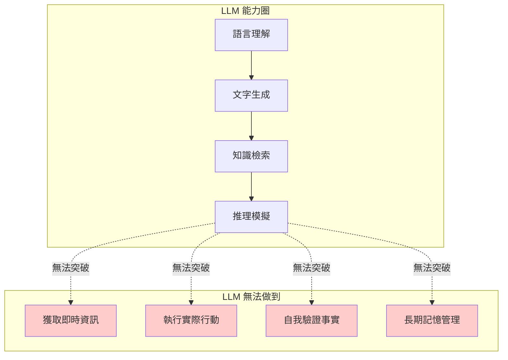
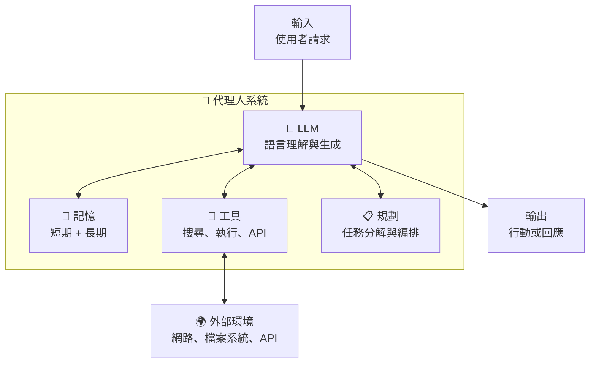
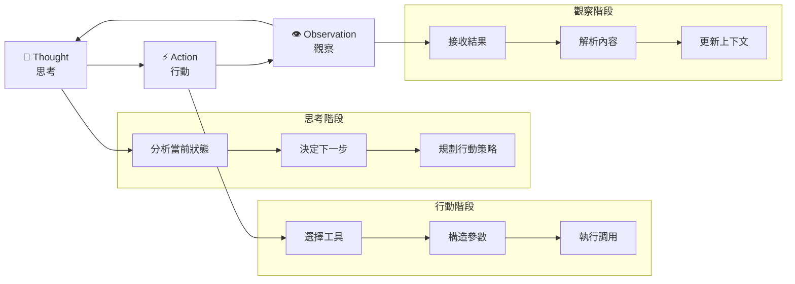

# 第 1 章：從 LLM 到自主代理人

> **本章目標**
> 在本章結束時，你將理解 LLM 的本質與局限、代理人（Agent）的核心特徵，以及 ReAct 範式如何讓 AI 具備「思考-行動-觀察」的循環能力。最重要的是，你將親手建構一個能搜尋網路、分析結果的簡單代理人。

---

## 我們要建構什麼？

在這一章，我們將從零開始打造一個「會自己找答案」的 AI 代理人。

想像你問它：「2025 年諾貝爾物理學獎得主的主要研究貢獻是什麼？」

傳統的 ChatGPT 可能會說：「抱歉，我的知識截止於 2024 年。」

但我們的代理人會這樣做：

```
[思考] 這是一個時效性問題，我需要查詢最新資訊。

[行動] 搜尋：2025 諾貝爾物理學獎得主

[觀察] 搜尋結果顯示：獲獎者是 xxx，因為在量子計算領域的貢獻...

[思考] 我已經知道得主是誰，但還需要了解具體的研究貢獻。

[行動] 搜尋：xxx 量子計算 主要研究成果

[觀察] 找到相關論文和報導...

[最終答案] 2025 年諾貝爾物理學獎由 xxx 獲得，其主要貢獻是...
```

這就是「代理人」與「聊天機器人」的本質差異——**代理人會主動採取行動來獲取資訊，而不是僅依賴預訓練的知識**。

讓我們開始這段旅程。

---

## 1.1 LLM 的能力與局限

在深入代理人架構之前，我們需要先理解「原材料」——大型語言模型（LLM）——到底能做什麼，又有什麼根本性的限制。

### 1.1.1 LLM 的本質：一個超級強大的機率預測器

讓我們揭開 LLM 的神秘面紗。

當你輸入「今天天氣」，模型預測下一個詞最可能是「很好」、「如何」或「晴朗」。這個預測基於它在訓練過程中看過的數十億個句子中「今天天氣」後面通常接什麼詞。

```python
# 概念示意（非實際實現）
def predict_next_token(context: str) -> str:
    """
    LLM 的核心功能：給定上下文，預測最可能的下一個 token
    """
    probabilities = model.compute_probabilities(context)
    # probabilities = {"很好": 0.35, "如何": 0.28, "晴朗": 0.15, ...}
    return sample_from(probabilities)
```

這個機制讓 LLM 能夠：

- **生成流暢的文字**：因為它學會了語言的統計規律
- **回答問題**：因為訓練資料中有大量的問答對
- **寫程式碼**：因為它見過數十億行程式碼
- **翻譯語言**：因為它學會了不同語言之間的對應關係

但這個機制也決定了它的根本限制。

### 1.1.2 LLM 的四大局限

讓我們用一張圖來總結 LLM 的能力邊界：



**局限一：知識截止日期**

LLM 的知識來自訓練資料，而訓練資料有截止日期。

```python
# 嘗試詢問 2024 年之後的事件
response = llm.chat("2025 年諾貝爾物理學獎得主是誰？")
# 可能的回答：「抱歉，我的訓練資料截止於 2024 年...」
```

**局限二：無法執行行動**

LLM 只能「說」，不能「做」。

```python
# LLM 可以告訴你如何發送郵件
response = llm.chat("如何用 Python 發送郵件？")
# 回答：使用 smtplib...

# 但它無法真的發送郵件
response = llm.chat("幫我發送一封郵件給 boss@company.com")
# 回答：我無法直接發送郵件，但我可以幫你寫郵件內容...
```

**局限三：無法自我驗證**

LLM 不知道自己說的是否正確。

```python
# LLM 可能自信地說出錯誤資訊
response = llm.chat("台積電 2024 年第四季營收是多少？")
# 可能的回答：「約 7,500 億台幣」（這可能是錯的，但模型無法查證）

response = llm.chat("你確定這個數字是對的嗎？")
# 可能的回答：「是的，我確定。」（但其實不確定）
```

**局限四：上下文有限且易遺忘**

即使是 128K 甚至 256K 的上下文視窗，在長對話或大量資料面前仍然捉襟見肘。

```python
# 假設我們有一份 50 頁的報告
report = load_report("annual_report_2024.pdf")  # 假設 100K tokens

# 詢問報告開頭的資訊
response = llm.chat(report + "\n報告第一頁提到的核心策略是什麼？")
# 可能無法準確回答，因為注意力被稀釋了
```

### 1.1.3 理解這些局限為何重要

這些局限不是「bug」，而是「feature」——或者說，是 LLM 這個技術路線的固有特性。

理解這一點至關重要，因為它決定了我們的解決方向：

> **不是讓 LLM 變得「更聰明」，而是給它「工具」和「自主性」**。

這就引出了「代理人」的概念。

---

## 1.2 代理人的定義與特徵

### 1.2.1 什麼是代理人（Agent）？

在 AI 領域，「代理人」有一個精確的定義：

> **代理人是一個能夠感知環境、做出決策、並採取行動以實現目標的自主系統。**

讓我們分解這個定義：

| 要素 | 說明 | LLM 本身 | LLM + Agent |
|------|------|----------|-------------|
| **感知環境** | 獲取外部資訊 | ❌ 只能讀取 Prompt | ✅ 可搜尋、讀取檔案、調用 API |
| **做出決策** | 決定下一步行動 | ⚠️ 有限（單輪回應）| ✅ 多步驟規劃與調整 |
| **採取行動** | 執行具體操作 | ❌ 只能生成文字 | ✅ 可執行工具、修改檔案 |
| **實現目標** | 完成指定任務 | ⚠️ 被動回應 | ✅ 主動追求目標 |

### 1.2.2 Agent = LLM + 記憶 + 工具 + 規劃

一個完整的代理人系統包含四個核心組件：



**‹1› LLM（大腦）**

這是代理人的「思考引擎」。它負責：
- 理解使用者的意圖
- 分析當前情境
- 決定下一步行動
- 生成最終回應

**‹2› 記憶（Memory）**

代理人需要記住：
- **工作記憶**：當前對話的上下文
- **情節記憶**：過去的交互歷史
- **語義記憶**：長期知識庫

**‹3› 工具（Tools）**

代理人可以調用的能力：
- 網路搜尋
- 程式碼執行
- 檔案讀寫
- 外部 API 調用

**‹4› 規劃（Planning）**

複雜任務需要分解：
- 識別子任務
- 確定執行順序
- 處理依賴關係
- 動態調整計畫

### 1.2.3 自主性的三個層次

並非所有代理人都有相同的自主程度：

| 層次 | 描述 | 範例 |
|------|------|------|
| **Level 1：工具調用者** | 人類指定用什麼工具 | 「用 Google 搜尋 xxx」 |
| **Level 2：任務執行者** | 人類指定目標，代理人選擇工具 | 「找出 xxx 的最新資訊」 |
| **Level 3：目標追求者** | 人類指定高階目標，代理人規劃並執行 | 「研究 xxx 的市場前景」 |

MiroThinker 是一個 **Level 3** 的代理人——你給它一個研究主題，它會自己規劃研究策略、選擇工具、執行搜尋、整合結果。

---

## 1.3 ReAct 範式深度解析

### 1.3.1 從 Chain-of-Thought 到 ReAct

在代理人架構中，「ReAct」是最重要的範式之一。讓我們先理解它的演化過程。

**Chain-of-Thought（CoT）：讓模型展示思考過程**

```
問題：Roger 有 5 個網球。他又買了 2 罐網球，每罐 3 個。他現在有多少網球？

普通回答：11 個

Chain-of-Thought 回答：
讓我一步步思考：
1. Roger 原本有 5 個網球
2. 他買了 2 罐，每罐 3 個，所以新買了 2 × 3 = 6 個
3. 總共有 5 + 6 = 11 個
答案：11 個
```

CoT 讓模型「展示工作」，提高了推理準確度。但它有一個問題：**思考過程與行動是分離的**。

**ReAct（Reasoning + Acting）：思考與行動的融合**

ReAct 的核心洞察是：**人類不是先想完再做，而是邊想邊做、邊做邊調整**。

```
問題：蘋果公司 2024 年第四季的 iPhone 銷量比 2023 年同期變化了多少？

ReAct 過程：
[Thought] 這需要兩個數據點：2024 Q4 和 2023 Q4 的 iPhone 銷量。
          我需要分別查詢這兩個數據。

[Action] Search: Apple iPhone sales Q4 2024

[Observation] Apple reported 78.5 million iPhones sold in Q4 2024...

[Thought] 好，我有了 2024 Q4 的數據。現在需要 2023 Q4 的數據來比較。

[Action] Search: Apple iPhone sales Q4 2023

[Observation] Apple sold 71.2 million iPhones in Q4 2023...

[Thought] 現在我可以計算變化了：
          增長數量 = 78.5 - 71.2 = 7.3 million
          增長率 = 7.3 / 71.2 × 100% ≈ 10.25%

[Answer] 蘋果公司 2024 年第四季 iPhone 銷量約 7850 萬台，
         比 2023 年同期（7120 萬台）增長了約 730 萬台，增幅約 10.25%。
```

### 1.3.2 ReAct 的三要素循環

ReAct 模式由三個核心要素構成：



**‹1› Thought（思考）**

思考階段是代理人的「內心獨白」：
- 分析當前已知的資訊
- 識別還缺少什麼
- 決定下一步應該做什麼
- 評估是否已經可以回答

**‹2› Action（行動）**

行動是思考的外化：
- 選擇適當的工具（搜尋、計算、讀取檔案...）
- 構造正確的參數
- 執行工具調用

**‹3› Observation（觀察）**

觀察是行動的回饋：
- 接收工具返回的結果
- 解析和理解結果內容
- 將新資訊納入上下文

### 1.3.3 ReAct vs. 其他範式

讓我們比較 ReAct 與其他常見範式：

| 範式 | 特點 | 優勢 | 劣勢 |
|------|------|------|------|
| **Direct Answer** | 直接回答 | 快速 | 容易出錯 |
| **Chain-of-Thought** | 先想完再答 | 推理清晰 | 無法獲取新資訊 |
| **ReAct** | 邊想邊做 | 動態調整、可獲取外部資訊 | 較慢、成本較高 |
| **Plan-and-Execute** | 先規劃再執行 | 結構清晰 | 不夠靈活 |

MiroThinker 主要採用 ReAct 範式，但在複雜任務中會結合 Plan-and-Execute 進行階段性規劃。

### 1.3.4 為何 ReAct 對深度研究至關重要？

深度研究任務有幾個特點：

1. **資訊分散**：答案不在一個地方，需要多次搜尋
2. **動態發展**：搜尋結果可能改變研究方向
3. **需要驗證**：找到的資訊需要交叉確認
4. **逐步深入**：從表面問題到核心洞察

ReAct 的「邊想邊做」正好匹配這些需求：

```
任務：研究 AI 對就業市場的影響

[Thought] 這是一個複雜的多面向問題。我需要從幾個角度切入：
          1. 哪些工作最容易被取代？
          2. 哪些新工作會出現？
          3. 不同國家/地區的差異？
          讓我先從「被取代的工作」開始。

[Action] Search: AI automation job displacement statistics 2024

[Observation] 多項研究顯示客服、數據輸入、基礎翻譯等工作受影響最大...

[Thought] 這些是「文書型」工作。但我也聽說創意工作受到影響。
          讓我查證這一點。

[Action] Search: AI impact creative jobs graphic design 2024

[Observation] 調查顯示 40% 的設計工作室開始使用 AI 工具，但就業影響複雜...

[Thought] 有趣！AI 對創意工作的影響比我預期的複雜。
          我需要區分「取代」和「輔助」。
          同時，這兩個來源的數據時間點不同，我需要注意一致性...
```

這種「邊想邊調整」的能力，是深度研究代理人的核心。

---

## 1.4 MiroThinker 的設計哲學

### 1.4.1 「向外求證」vs.「內部推理」

讓我們用一個類比來理解 MiroThinker 的核心理念。

**傳統 LLM：閉卷考試**

想像一個學生參加閉卷考試。他只能依靠自己腦中的知識來回答問題。
- 優勢：回答快速
- 劣勢：知識有限、可能記錯、無法查證

**MiroThinker：開放式研究**

現在想像同一個學生在做研究報告。他可以上網、去圖書館、查資料庫、問專家。
- 優勢：資訊豐富、可以查證、能處理新問題
- 劣勢：需要更多時間

MiroThinker 的設計哲學可以總結為一句話：

> **寧可多查幾次，也不要猜測。**

### 1.4.2 Interactive Intelligence 的核心理念

這個理念有一個更正式的名字：**Interactive Intelligence（交互式智能）**。

核心洞察是：

```
最終表現 = f(模型能力, 交互深度, 交互品質)
```

傳統方法主要優化「模型能力」（更大的參數、更多的訓練資料）。

MiroThinker 則特別優化「交互深度」和「交互品質」：
- **交互深度**：允許最多 400 次工具調用
- **交互品質**：每次交互都經過精心設計的工具和 Prompt

### 1.4.3 設計原則對比

讓我們看看 MiroThinker 與傳統方法的設計差異：

| 設計面向 | 傳統 LLM | 傳統 RAG | MiroThinker |
|----------|----------|----------|-------------|
| **知識來源** | 參數化記憶 | 單次檢索 | 多輪動態搜尋 |
| **錯誤處理** | 重新生成 | 無 | 自我修正循環 |
| **查證機制** | 無 | 無 | 多源交叉驗證 |
| **上下文管理** | 固定視窗 | 固定視窗 | 動態壓縮 + 長期記憶 |
| **工具調用上限** | 通常 3-5 次 | N/A | 最多 400 次 |

### 1.4.4 開源透明的價值

MiroThinker 選擇完全開源，這帶來了幾個重要優勢：

**可審計性**

當代理人做出一個研究結論時，你可以追溯：
- 它搜尋了什麼
- 它看到了什麼結果
- 它如何整合這些資訊
- 它為何排除某些來源

**可定制性**

你可以根據自己的需求：
- 添加專業領域的工具
- 調整搜尋策略
- 修改驗證邏輯
- 整合內部知識庫

**可學習性**

對於我們這樣的學習者，開源意味著：
- 可以看到「專家是怎麼做的」
- 可以實驗和修改
- 可以理解設計決策背後的原因

這也是為什麼本書選擇 MiroThinker 作為教學案例的核心原因。

---

## 1.5 動手實作：你的第一個 ReAct Agent

理論講得夠多了，讓我們動手寫程式碼！

在這一節，我們將建構一個簡單但完整的 ReAct 代理人，它能夠：
1. 接收使用者問題
2. 決定是否需要搜尋
3. 執行網路搜尋
4. 分析搜尋結果
5. 給出最終答案

### 1.5.1 環境設定

首先，讓我們設定開發環境。

**建立專案目錄**

```bash
mkdir simple-react-agent
cd simple-react-agent
python -m venv venv
source venv/bin/activate  # Windows: venv\Scripts\activate
```

**安裝依賴**

建立 `requirements.txt`：

```text
openai>=1.0.0
httpx>=0.25.0
python-dotenv>=1.0.0
```

安裝：

```bash
pip install -r requirements.txt
```

**設定環境變數**

建立 `.env` 檔案：

```bash
# OpenAI API Key
OPENAI_API_KEY=your-api-key-here

# 搜尋 API（我們使用 Serper，你也可以用其他服務）
SERPER_API_KEY=your-serper-key-here
```

### 1.5.2 核心程式碼：simple_react_agent.py

現在讓我們逐步建構代理人。完整程式碼如下，我們會在下方詳細解釋每個部分。

```python
"""
simple_react_agent.py

一個簡單但完整的 ReAct 代理人實現。
展示 Thought-Action-Observation 循環的核心機制。
"""

import os
import json
import httpx
from openai import OpenAI
from dotenv import load_dotenv
from typing import Optional
from dataclasses import dataclass

# 載入環境變數
load_dotenv()

# ‹1› 定義工具的資料結構
@dataclass
class Tool:
    """工具定義"""
    name: str
    description: str
    parameters: dict

@dataclass
class ToolCall:
    """工具調用記錄"""
    tool_name: str
    arguments: dict
    result: str

# ‹2› 搜尋工具實現
class SearchTool:
    """
    網路搜尋工具
    使用 Serper API 進行 Google 搜尋
    """

    def __init__(self):
        self.api_key = os.getenv("SERPER_API_KEY")
        self.base_url = "https://google.serper.dev/search"

    def search(self, query: str, num_results: int = 5) -> str:
        """
        執行搜尋並返回格式化的結果

        Args:
            query: 搜尋關鍵字
            num_results: 返回結果數量

        Returns:
            格式化的搜尋結果字串
        """
        headers = {
            "X-API-KEY": self.api_key,
            "Content-Type": "application/json"
        }
        payload = {
            "q": query,
            "num": num_results
        }

        try:
            response = httpx.post(
                self.base_url,
                headers=headers,
                json=payload,
                timeout=30.0
            )
            response.raise_for_status()
            data = response.json()

            # 格式化搜尋結果
            results = []
            for item in data.get("organic", [])[:num_results]:
                results.append(
                    f"標題: {item.get('title', 'N/A')}\n"
                    f"連結: {item.get('link', 'N/A')}\n"
                    f"摘要: {item.get('snippet', 'N/A')}\n"
                )

            if results:
                return "\n---\n".join(results)
            else:
                return "未找到相關結果"

        except Exception as e:
            return f"搜尋錯誤: {str(e)}"

# ‹3› ReAct 代理人核心類別
class SimpleReActAgent:
    """
    簡單的 ReAct 代理人

    實現 Thought-Action-Observation 循環
    """

    def __init__(self, model: str = "gpt-4o-mini"):
        self.client = OpenAI()
        self.model = model
        self.search_tool = SearchTool()
        self.max_iterations = 10  # 防止無限循環

        # ‹4› 系統提示詞：教導模型如何扮演 ReAct 代理人
        self.system_prompt = """你是一個使用 ReAct（Reasoning and Acting）模式的研究助理代理人。

你的工作方式如下：
1. 收到問題後，先思考（Thought）需要什麼資訊
2. 如果需要外部資訊，使用工具（Action）獲取
3. 觀察（Observation）工具返回的結果
4. 重複上述過程，直到能夠回答問題

## 可用工具

### search
- 功能：搜尋網路獲取最新資訊
- 使用方式：Action: search[搜尋關鍵字]
- 範例：Action: search[2024 年諾貝爾物理學獎得主]

## 回應格式

請嚴格按照以下格式回應：

如果需要搜尋：
```
Thought: [你的思考過程，為什麼需要搜尋，搜尋什麼]
Action: search[搜尋關鍵字]
```

如果已經可以回答：
```
Thought: [你的最終思考，為什麼可以回答了]
Answer: [你的最終答案]
```

## 重要原則

1. 每次只執行一個 Action
2. 如果資訊不足，不要猜測，繼續搜尋
3. 如果搜尋結果矛盾，嘗試更多搜尋來交叉驗證
4. 最終答案要基於搜尋結果，並說明資訊來源
5. 如果無法找到可靠資訊，誠實說明
"""

    def _parse_response(self, response: str) -> tuple[str, Optional[str], Optional[str]]:
        """
        ‹5› 解析模型回應，提取 Thought、Action 或 Answer

        Returns:
            (thought, action, answer) 元組
        """
        thought = ""
        action = None
        answer = None

        lines = response.strip().split("\n")

        for line in lines:
            line = line.strip()
            if line.startswith("Thought:"):
                thought = line[8:].strip()
            elif line.startswith("Action:"):
                action = line[7:].strip()
            elif line.startswith("Answer:"):
                answer = line[7:].strip()

        return thought, action, answer

    def _execute_action(self, action: str) -> str:
        """
        ‹6› 執行工具調用

        Args:
            action: 工具調用字串，格式如 "search[關鍵字]"

        Returns:
            工具執行結果
        """
        if action.startswith("search[") and action.endswith("]"):
            query = action[7:-1]
            print(f"    🔍 執行搜尋: {query}")
            result = self.search_tool.search(query)
            return result
        else:
            return f"未知的工具: {action}"

    def run(self, question: str) -> str:
        """
        ‹7› 執行 ReAct 循環

        Args:
            question: 使用者問題

        Returns:
            最終答案
        """
        print(f"\n{'='*60}")
        print(f"📝 問題: {question}")
        print(f"{'='*60}\n")

        # 初始化對話歷史
        messages = [
            {"role": "system", "content": self.system_prompt},
            {"role": "user", "content": f"問題: {question}"}
        ]

        iteration = 0
        observations = []

        while iteration < self.max_iterations:
            iteration += 1
            print(f"🔄 第 {iteration} 輪迭代")

            # 調用 LLM
            response = self.client.chat.completions.create(
                model=self.model,
                messages=messages,
                temperature=0.1,  # 低溫度提高一致性
                max_tokens=1000
            )

            assistant_message = response.choices[0].message.content
            messages.append({"role": "assistant", "content": assistant_message})

            # 解析回應
            thought, action, answer = self._parse_response(assistant_message)

            print(f"   💭 Thought: {thought}")

            # 如果有最終答案，結束循環
            if answer:
                print(f"\n{'='*60}")
                print(f"✅ 最終答案: {answer}")
                print(f"{'='*60}")
                return answer

            # 如果有行動，執行並添加觀察結果
            if action:
                observation = self._execute_action(action)
                observations.append({
                    "action": action,
                    "observation": observation
                })

                # 將觀察結果添加到對話歷史
                observation_message = f"Observation: {observation}"
                messages.append({"role": "user", "content": observation_message})

                print(f"   👁 Observation: {observation[:200]}...")
                print()

        # 超過最大迭代次數
        return "抱歉，經過多次嘗試仍無法找到滿意的答案。"


# ‹8› 主程式入口
def main():
    """
    主程式：展示代理人的使用方式
    """
    agent = SimpleReActAgent()

    # 測試問題列表
    test_questions = [
        "2024 年諾貝爾物理學獎得主是誰？他們的主要貢獻是什麼？",
        "今天台北的天氣如何？",
        "SpaceX 最近一次成功發射是什麼時候？",
    ]

    print("\n" + "="*60)
    print("🤖 簡單 ReAct 代理人示範")
    print("="*60)

    # 執行第一個測試問題
    question = test_questions[0]
    answer = agent.run(question)

    print("\n" + "-"*60)
    print("📊 執行完成")
    print("-"*60)


if __name__ == "__main__":
    main()
```

### 1.5.3 程式碼詳解

讓我們深入理解每個關鍵部分：

**‹1› 資料結構定義**

```python
@dataclass
class Tool:
    """工具定義"""
    name: str
    description: str
    parameters: dict
```

我們使用 `dataclass` 來定義清晰的資料結構。這讓程式碼更易讀、更容易維護。

**‹2› 搜尋工具實現**

```python
class SearchTool:
    def search(self, query: str, num_results: int = 5) -> str:
        # ... 調用 Serper API
```

這是代理人的「眼睛」——它讓代理人能夠「看到」網路上的資訊。我們封裝了 API 調用的細節，讓核心邏輯更清晰。

**‹3› ReAct 代理人核心**

```python
class SimpleReActAgent:
    def __init__(self, model: str = "gpt-4o-mini"):
        self.max_iterations = 10  # 防止無限循環
```

注意 `max_iterations` 設定——這是一個重要的安全機制。沒有它，代理人可能陷入無限循環。

**‹4› 系統提示詞**

```python
self.system_prompt = """你是一個使用 ReAct 模式的研究助理代理人。

你的工作方式如下：
1. 收到問題後，先思考（Thought）...
```

這是「教導」LLM 如何扮演代理人的關鍵。好的提示詞讓模型能夠：
- 理解自己的角色
- 知道可用的工具
- 遵循正確的格式

**‹5› 回應解析**

```python
def _parse_response(self, response: str) -> tuple[str, Optional[str], Optional[str]]:
```

這個函數負責從模型的自由文字回應中提取結構化資訊。在更進階的系統中，我們會使用 JSON 格式或專門的解析器。

**‹6› 行動執行**

```python
def _execute_action(self, action: str) -> str:
    if action.startswith("search[") and action.endswith("]"):
        query = action[7:-1]
        result = self.search_tool.search(query)
```

這是「手」——將代理人的決策轉化為實際行動。

**‹7› ReAct 循環**

```python
def run(self, question: str) -> str:
    while iteration < self.max_iterations:
        # 1. 調用 LLM 獲取下一步
        # 2. 解析回應
        # 3. 如果有答案，返回
        # 4. 如果有行動，執行並添加觀察
```

這就是 ReAct 的核心——一個思考-行動-觀察的循環。

### 1.5.4 執行結果範例

讓我們看看執行這段程式碼會是什麼樣子：

```
============================================================
📝 問題: 2024 年諾貝爾物理學獎得主是誰？他們的主要貢獻是什麼？
============================================================

🔄 第 1 輪迭代
   💭 Thought: 這是一個關於 2024 年諾貝爾獎的問題，屬於近期事件，
              我需要搜尋最新資訊來回答。
    🔍 執行搜尋: 2024 年諾貝爾物理學獎得主
   👁 Observation: 標題: 2024年諾貝爾物理學獎揭曉 - BBC
              摘要: John Hopfield 和 Geoffrey Hinton 因在人工神經網路...

🔄 第 2 輪迭代
   💭 Thought: 搜尋結果顯示得主是 Hopfield 和 Hinton。
              我需要更多關於他們具體貢獻的資訊。
    🔍 執行搜尋: Hopfield Hinton 諾貝爾物理學獎 貢獻 神經網路
   👁 Observation: 標題: 諾貝爾物理學獎：機器學習先驅獲獎
              摘要: Hopfield 提出了能夠儲存和重建模式的網路...

🔄 第 3 輪迭代
   💭 Thought: 我現在有足夠的資訊來回答這個問題了。

============================================================
✅ 最終答案: 2024 年諾貝爾物理學獎由 John Hopfield 和 Geoffrey Hinton
          共同獲得。Hopfield 提出了 Hopfield 網路，一種能夠儲存
          和重建資訊模式的聯想記憶網路。Hinton 則是深度學習的先驅，
          發明了反向傳播算法和 Boltzmann 機器。他們的工作奠定了
          現代人工智慧和機器學習的基礎。
============================================================
```

### 1.5.5 進階挑戰：自己試試看

現在你已經有了一個工作的代理人，試著：

1. **添加新工具**：加入一個計算器工具，讓代理人能做數學運算
2. **改進搜尋**：嘗試搜尋多次並交叉比對結果
3. **增加記憶**：讓代理人記住之前的對話
4. **處理錯誤**：優雅地處理 API 失敗的情況

這些練習會幫助你更深入理解代理人架構。

---

## 1.6 章節總結

恭喜你完成了第一章！讓我們回顧一下學到了什麼：

### 核心概念回顧

| 概念 | 要點 |
|------|------|
| **LLM 的局限** | 知識截止、無法行動、無法自驗、上下文有限 |
| **Agent 定義** | LLM + 記憶 + 工具 + 規劃 |
| **ReAct 範式** | Thought → Action → Observation 循環 |
| **MiroThinker 哲學** | 向外求證、交互式智能、開源透明 |

### 關鍵產出物

- ✅ 理解了 LLM 與 Agent 的差異
- ✅ 掌握了 ReAct 範式的三要素
- ✅ 建構了 `simple_react_agent.py`
- ✅ 實際運行並觀察了代理人的「思考」過程

### 思考問題

在進入下一章之前，思考這些問題：

1. 當前的代理人只能進行 10 次迭代。如果問題很複雜，需要 50 次搜尋怎麼辦？
2. 搜尋結果可能有錯誤或過時資訊。代理人如何判斷資訊的可靠性？
3. 如果兩次搜尋得到矛盾的結果，代理人應該如何處理？

這些問題的答案，將在後續章節逐步揭曉。

---

## 下一章預告

> **第 2 章：交互式縮放的奧秘**
>
> 為什麼 8B 的模型加上 400 次工具調用，能在某些任務上超越 72B 的模型？我們將深入探討「縮放定律的第三維度」——交互式縮放，理解 MiroThinker 為何能以小搏大，並設計實驗來測量你自己代理人的縮放效益。

---

**本章程式碼**：`code-examples/chapter-01/simple_react_agent.py`

**延伸閱讀**：
- ReAct 原論文：[ReAct: Synergizing Reasoning and Acting in Language Models](https://arxiv.org/abs/2210.03629)
- MiroThinker GitHub：https://github.com/MiroMindAI/MiroThinker
