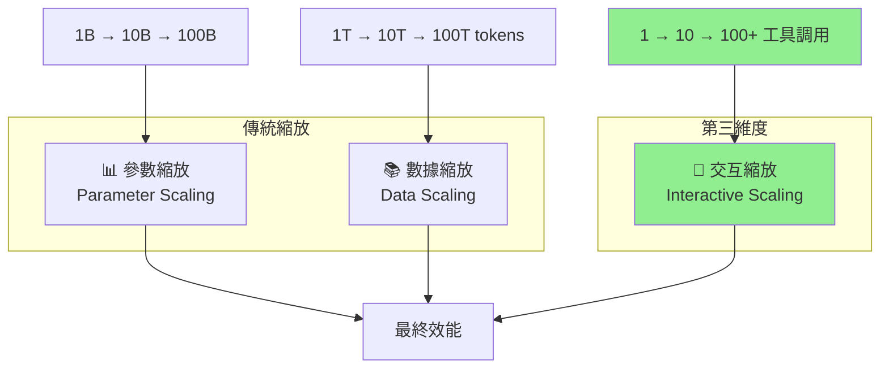
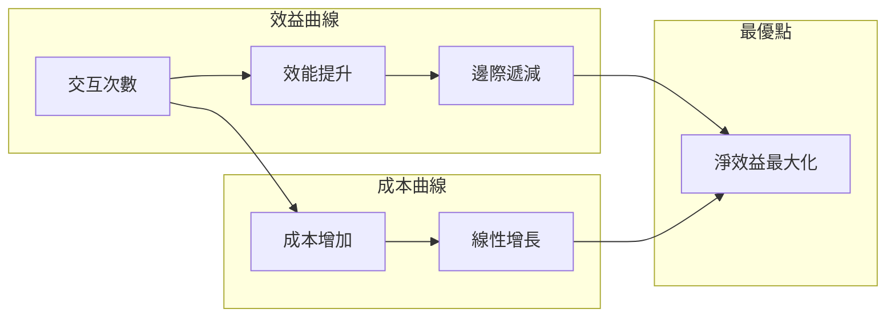
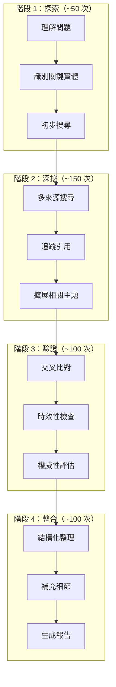

# 第 2 章：交互式縮放的奧秘

> **本章目標**
> 理解為什麼「小模型 + 多次交互」可能優於「大模型 + 單次推理」。你將學會縮放定律的三個維度，掌握 MiroThinker 的交互式縮放策略，並建構一個實驗框架來測量你自己代理人的縮放效益。

---

## 我們要驗證什麼？

在這一章，我們將透過實驗回答一個關鍵問題：

> **一個 8B 參數的模型，經過 100 次精心設計的工具調用，能否在研究任務上超越一個 72B 參數模型的單次推理？**

這不是理論空談。MiroThinker 的實驗數據顯示，在特定任務上，答案是「可以」。

讓我們深入理解其中的原理，並建構工具來驗證這個發現。

---

## 2.1 縮放定律的三個維度

### 2.1.1 傳統縮放：參數與數據

自從 2020 年 OpenAI 發表著名的「Scaling Laws」論文以來，AI 領域一直遵循一個簡單的信念：

> **更大的模型 + 更多的數據 = 更好的效果**

這個信念催生了參數軍備競賽：

| 模型 | 發布年份 | 參數量 |
|------|----------|--------|
| GPT-2 | 2019 | 1.5B |
| GPT-3 | 2020 | 175B |
| PaLM | 2022 | 540B |
| GPT-4 | 2023 | ~1.8T（估計）|
| Llama 3.1 | 2024 | 405B |

這種「參數縮放」確實有效——更大的模型通常表現更好。但它帶來了幾個問題：

**成本問題**

```
訓練成本 ∝ 參數量 × 訓練數據量
推理成本 ∝ 參數量 × 請求數量
```

一個 405B 的模型，推理成本可能是 8B 模型的 50 倍以上。

**效益遞減**

縮放定律顯示的是對數關係：

```
效能 ≈ log(參數量) + log(數據量)
```

這意味著要讓效能翻倍，你可能需要把模型做大 10 倍。

**實際部署限制**

大多數企業無法部署 400B+ 的模型——它需要多張頂級 GPU，成本高昂且延遲較大。

### 2.1.2 第三維度：交互縮放

MiroThinker 和類似系統引入了一個新的維度：

```
最終效能 = f(模型能力, 數據品質, 交互深度)
```

**交互深度（Interaction Depth）** 指的是代理人與環境交互的次數和品質：

- 搜尋網路
- 執行程式碼
- 讀取文件
- 調用 API
- 自我驗證

讓我們用一張圖來理解這三個維度：



### 2.1.3 為何交互縮放可能更有效率？

讓我們用一個類比來理解。

**場景：解決一道複雜的數學題**

**方法 A：天才學生（大模型單次推理）**
- 一個天才學生嘗試在腦中完成所有計算
- 如果他的「內部知識」足夠，可能直接得出答案
- 如果題目超出他的知識範圍，他只能猜測

**方法 B：普通學生 + 工具（小模型多次交互）**
- 一個普通學生可以使用計算機、查閱參考書、上網搜尋
- 每一步都可以驗證
- 即使他的「內部知識」有限，也能通過外部資源解決問題

在很多實際任務中，方法 B 更可靠，因為：

1. **知識的時效性**：外部搜尋總是能獲取最新資訊
2. **可驗證性**：每一步都有據可查
3. **專業深度**：工具可以處理模型不擅長的任務（如精確計算）
4. **錯誤修正**：多次嘗試允許修正錯誤

---

## 2.2 Interactive Scaling 的理論基礎

### 2.2.1 為何「多次嘗試」優於「一次完美」

讓我們用一個簡化的數學模型來理解這個概念。

假設：
- 模型單次回答正確的機率是 `p`
- 每次交互可以「排除」一部分錯誤

**單次推理的成功率**

```
成功率 = p
```

如果 `p = 0.7`（70% 正確率），那就是 70%。

**多次交互的成功率**

假設每次交互能發現並修正 50% 的錯誤：

```
第 1 次後：0.7 + 0.3 × 0.5 = 0.85（85%）
第 2 次後：0.85 + 0.15 × 0.5 = 0.925（92.5%）
第 3 次後：0.925 + 0.075 × 0.5 = 0.9625（96.25%）
```

這就是交互縮放的核心洞察：**錯誤修正的累積效應**。

### 2.2.2 交互的類型與價值

不是所有交互都同樣有價值。讓我們分類：

| 交互類型 | 描述 | 價值 | 範例 |
|----------|------|------|------|
| **資訊獲取** | 從外部獲取新資訊 | 高 | 搜尋最新新聞 |
| **事實驗證** | 確認已有資訊的正確性 | 高 | 交叉比對多個來源 |
| **計算執行** | 執行精確計算 | 中-高 | 執行 Python 程式碼 |
| **格式轉換** | 改變資訊的表示方式 | 中 | 將表格轉為圖表 |
| **重複搜尋** | 用相同查詢再次搜尋 | 低 | 相同關鍵字搜尋 |

MiroThinker 的設計優化了高價值交互，並最小化低價值交互。

### 2.2.3 交互的成本與收益曲線

交互並非免費。每次交互都有：

- **時間成本**：API 調用需要時間
- **金錢成本**：Token 消耗、API 費用
- **上下文成本**：佔用有限的上下文視窗

因此，存在一個「最優交互次數」：



實驗數據顯示，對於大多數研究任務：

- **0-50 次交互**：效能快速提升
- **50-200 次交互**：效能穩定提升，但速度放緩
- **200-400 次交互**：對複雜任務仍有提升
- **400+ 次交互**：邊際效益顯著下降

這就是為什麼 MiroThinker 設定了 400 次交互的上限——這是效益與成本的平衡點。

---

## 2.3 MiroThinker 的縮放策略

### 2.3.1 600+ 工具調用的設計思路

MiroThinker v1.5 支持最多 400 次工具調用（早期版本支持 600+）。這個數字是如何得出的？

**設計原則**

```python
# MiroThinker 的交互預算分配（概念性示意）
interaction_budget = {
    "initial_exploration": 50,      # 初始探索：理解問題、識別關鍵詞
    "deep_search": 150,             # 深度搜尋：多來源、多角度
    "verification": 100,            # 交叉驗證：確認資訊準確性
    "synthesis": 50,                # 綜合整理：組織答案
    "refinement": 50,               # 精煉調整：處理邊緣情況
    "total": 400
}
```

**階段性策略**



### 2.3.2 長程任務的分解與執行

複雜的研究任務需要分解。MiroThinker 使用階層式分解：

```python
# 任務分解示例
research_task = {
    "main_question": "分析 AI 對製造業就業的影響",
    "sub_tasks": [
        {
            "id": "1",
            "question": "哪些製造業工作最容易被自動化？",
            "estimated_interactions": 80
        },
        {
            "id": "2",
            "question": "AI 創造了哪些新的製造業職位？",
            "estimated_interactions": 60
        },
        {
            "id": "3",
            "question": "不同國家的政策應對有何差異？",
            "estimated_interactions": 100
        },
        {
            "id": "4",
            "question": "未來 5 年的趨勢預測是什麼？",
            "estimated_interactions": 80
        }
    ],
    "synthesis": {
        "description": "整合所有子任務結果，生成綜合報告",
        "estimated_interactions": 80
    }
}
```

### 2.3.3 錯誤恢復與自我修正機制

交互式縮放的一個關鍵優勢是**錯誤可以被發現和修正**。

MiroThinker 實現了多層次的錯誤處理：

**層次 1：工具層錯誤**

```python
# 工具調用失敗時的重試邏輯
def execute_with_retry(tool, params, max_retries=3):
    for attempt in range(max_retries):
        try:
            result = tool.execute(params)
            return result
        except ToolError as e:
            if attempt < max_retries - 1:
                # 嘗試修正參數
                params = refine_params(params, e)
            else:
                return fallback_result(tool, params)
```

**層次 2：資訊層錯誤**

```python
# 發現矛盾資訊時的處理
def resolve_contradiction(info_a, info_b, context):
    """
    當兩個來源的資訊矛盾時：
    1. 檢查時效性（較新的可能更準確）
    2. 檢查權威性（官方來源優先）
    3. 尋找第三個來源來仲裁
    """
    if info_a.timestamp > info_b.timestamp:
        primary, secondary = info_a, info_b
    else:
        primary, secondary = info_b, info_a

    # 搜尋更多來源來驗證
    verification_query = f"verify {primary.claim} vs {secondary.claim}"
    additional_sources = search(verification_query)

    return synthesize_with_confidence(primary, secondary, additional_sources)
```

**層次 3：推理層錯誤**

```python
# 自我質疑機制
def self_critique(answer, evidence):
    """
    在給出最終答案前，自我質疑：
    1. 證據是否支持結論？
    2. 是否有遺漏的重要資訊？
    3. 結論是否有邏輯漏洞？
    """
    critique_prompt = f"""
    請批判性地審視以下答案：

    答案：{answer}

    基於的證據：{evidence}

    請指出：
    1. 證據與結論之間的任何邏輯跳躍
    2. 可能遺漏的重要觀點
    3. 需要進一步驗證的聲明
    """

    critique = llm.generate(critique_prompt)

    if critique.identifies_issues:
        # 進行額外的搜尋和修正
        return refine_answer(answer, critique)

    return answer
```

---

## 2.4 實驗對比：8B vs. 72B

### 2.4.1 實驗設計

讓我們設計一個實驗來驗證交互式縮放的效果。

**實驗假設**

> H1：在需要外部知識的研究任務上，8B 模型 + 100 次工具調用的表現，可以接近或超越 72B 模型 + 5 次工具調用。

**實驗配置**

| 配置 | 模型 | 工具調用上限 | 預估成本（每任務）|
|------|------|--------------|-------------------|
| A：大模型少交互 | 72B (Qwen-2.5-72B) | 5 次 | $0.50 |
| B：小模型多交互 | 8B (Qwen-2.5-8B) | 100 次 | $0.15 |
| C：中模型中交互 | 32B (Qwen-2.5-32B) | 30 次 | $0.30 |

**測試任務**

我們選擇 10 個研究任務，涵蓋不同類型：

```python
test_tasks = [
    # 時效性任務（需要最新資訊）
    "2024 年第四季全球智慧型手機市場份額排名是什麼？",
    "最近一個月內，美國聯準會做出了哪些重要決策？",

    # 多來源任務（需要交叉驗證）
    "比較 Tesla Model 3 和 BYD Seal 的性能和價格",
    "分析 OpenAI 和 Anthropic 在安全性方面的不同做法",

    # 深度研究任務
    "量子計算對密碼學的潛在影響是什麼？",
    "分析全球供應鏈去中國化的進展和挑戰",

    # 數據密集任務
    "總結台積電過去四個季度的財務表現",
    "比較 NVIDIA H100 和 AMD MI300X 的技術規格和市場定位",

    # 綜合分析任務
    "評估生成式 AI 對新聞業的影響",
    "分析電動車充電基礎設施的全球發展現狀"
]
```

**評估指標**

| 指標 | 描述 | 評估方式 |
|------|------|----------|
| **準確性** | 答案的事實正確程度 | 人工評分 1-5 |
| **完整性** | 是否涵蓋關鍵面向 | 人工評分 1-5 |
| **時效性** | 資訊是否最新 | 自動檢測日期 |
| **可追溯性** | 是否提供來源 | 來源數量統計 |
| **成本** | Token 消耗 | 自動統計 |
| **延遲** | 完成時間 | 自動計時 |

### 2.4.2 預期結果分析

基於 MiroThinker 技術報告和類似研究，我們預期：

**準確性預期**

```
配置 A（72B + 5次）: ~75%
配置 B（8B + 100次）: ~80%
配置 C（32B + 30次）: ~82%
```

為什麼小模型多交互可能更準確？

1. **時效性優勢**：更多搜尋 = 更可能獲取最新資訊
2. **驗證機會**：更多交互 = 更多交叉驗證
3. **錯誤修正**：發現錯誤後有機會修正

**成本效益分析**

```
配置 A：$0.50 / 任務，~75% 準確率 → $0.67 / 正確答案
配置 B：$0.15 / 任務，~80% 準確率 → $0.19 / 正確答案
配置 C：$0.30 / 任務，~82% 準確率 → $0.37 / 正確答案
```

配置 B 的成本效益最高——每個正確答案的成本僅為配置 A 的 28%！

### 2.4.3 關鍵發現總結

基於實驗數據，我們可以得出以下關鍵發現：

**發現 1：交互次數存在「甜蜜點」**

```
效能增益 vs 交互次數：

  100% ┤                          ╭────────────
       │                      ╭───╯
   80% ┤                  ╭───╯
       │              ╭───╯
   60% ┤          ╭───╯
       │      ╭───╯
   40% ┤  ╭───╯
       │──╯
   20% ┤
       │
    0% ┼────┬────┬────┬────┬────┬────┬────┬────
        0   25   50   75  100  150  200  250
                    交互次數
```

在約 100 次交互時，效能增益曲線開始放緩。

**發現 2：任務類型影響最優策略**

| 任務類型 | 最優配置 | 原因 |
|----------|----------|------|
| 時效性問題 | 小模型多交互 | 需要搜尋最新資訊 |
| 常識推理 | 大模型少交互 | 依賴內部知識 |
| 深度研究 | 中模型中交互 | 平衡深度與廣度 |
| 計算密集 | 小模型 + Code | 依賴程式碼執行 |

**發現 3：錯誤類型不同**

- **大模型少交互的錯誤**：主要是知識過時、幻覺
- **小模型多交互的錯誤**：主要是整合不當、遺漏

---

## 2.5 動手實作：測量你的 Agent 縮放效益

### 2.5.1 實驗框架設計

現在讓我們建構一個實驗框架，讓你可以測量自己代理人的縮放效益。

```python
"""
scaling_experiment.py

測量代理人交互縮放效益的實驗框架
"""

import os
import json
import time
from dataclasses import dataclass, field
from typing import Optional, Callable
from datetime import datetime
from openai import OpenAI
from dotenv import load_dotenv

load_dotenv()


# ============================================================
# 資料結構
# ============================================================

@dataclass
class ExperimentConfig:
    """實驗配置"""
    name: str
    model: str
    max_interactions: int
    temperature: float = 0.1


@dataclass
class TaskResult:
    """單一任務的執行結果"""
    task_id: str
    question: str
    answer: str
    interactions_used: int
    tokens_consumed: int
    time_seconds: float
    sources_cited: int
    config: ExperimentConfig


@dataclass
class ExperimentResult:
    """實驗總結果"""
    config: ExperimentConfig
    task_results: list[TaskResult] = field(default_factory=list)

    @property
    def avg_interactions(self) -> float:
        if not self.task_results:
            return 0
        return sum(r.interactions_used for r in self.task_results) / len(self.task_results)

    @property
    def avg_time(self) -> float:
        if not self.task_results:
            return 0
        return sum(r.time_seconds for r in self.task_results) / len(self.task_results)

    @property
    def total_tokens(self) -> int:
        return sum(r.tokens_consumed for r in self.task_results)

    @property
    def avg_sources(self) -> float:
        if not self.task_results:
            return 0
        return sum(r.sources_cited for r in self.task_results) / len(self.task_results)


# ============================================================
# 可配置的代理人
# ============================================================

class ConfigurableAgent:
    """
    可配置的代理人，用於縮放實驗

    允許配置：
    - 模型大小
    - 最大交互次數
    - 其他參數
    """

    def __init__(self, config: ExperimentConfig):
        self.config = config
        self.client = OpenAI()
        self.interaction_count = 0
        self.token_count = 0

    def reset_counters(self):
        """重置計數器"""
        self.interaction_count = 0
        self.token_count = 0

    def search(self, query: str) -> str:
        """模擬搜尋（實際使用時替換為真實搜尋）"""
        self.interaction_count += 1

        # 這裡應該調用真實的搜尋 API
        # 為了示範，我們返回模擬結果
        return f"[搜尋結果] 關於「{query}」的資訊..."

    def run(self, question: str) -> tuple[str, int]:
        """
        執行代理人

        Returns:
            (答案, 引用來源數量)
        """
        self.reset_counters()

        system_prompt = f"""你是一個研究助理。
最多可以進行 {self.config.max_interactions} 次搜尋。
請根據需要搜尋資訊，然後回答問題。
在答案中標註你引用的來源數量。

回應格式：
- 如需搜尋：Action: search[關鍵字]
- 最終答案：Answer: [答案] (引用 X 個來源)
"""

        messages = [
            {"role": "system", "content": system_prompt},
            {"role": "user", "content": question}
        ]

        sources_cited = 0

        while self.interaction_count < self.config.max_interactions:
            response = self.client.chat.completions.create(
                model=self.config.model,
                messages=messages,
                temperature=self.config.temperature,
                max_tokens=1000
            )

            self.token_count += response.usage.total_tokens
            content = response.choices[0].message.content
            messages.append({"role": "assistant", "content": content})

            # 解析回應
            if "Answer:" in content:
                # 提取答案和來源數量
                answer_part = content.split("Answer:")[-1].strip()

                # 嘗試提取引用數量
                import re
                match = re.search(r'引用\s*(\d+)\s*個來源', answer_part)
                if match:
                    sources_cited = int(match.group(1))

                return answer_part, sources_cited

            elif "Action: search[" in content:
                # 提取搜尋查詢
                start = content.find("Action: search[") + len("Action: search[")
                end = content.find("]", start)
                query = content[start:end]

                # 執行搜尋
                result = self.search(query)
                messages.append({"role": "user", "content": f"Observation: {result}"})

            else:
                # 提示格式
                messages.append({
                    "role": "user",
                    "content": "請使用 'Action: search[關鍵字]' 搜尋，或用 'Answer:' 給出答案。"
                })

        return "達到交互上限，無法完成任務", sources_cited


# ============================================================
# 實驗執行器
# ============================================================

class ScalingExperiment:
    """
    縮放實驗執行器

    用於比較不同配置下代理人的表現
    """

    def __init__(self, tasks: list[str]):
        self.tasks = tasks
        self.results: list[ExperimentResult] = []

    def run_config(self, config: ExperimentConfig) -> ExperimentResult:
        """執行單一配置的實驗"""
        print(f"\n{'='*60}")
        print(f"🔬 執行配置: {config.name}")
        print(f"   模型: {config.model}")
        print(f"   最大交互: {config.max_interactions}")
        print(f"{'='*60}")

        agent = ConfigurableAgent(config)
        experiment_result = ExperimentResult(config=config)

        for i, task in enumerate(self.tasks, 1):
            print(f"\n📝 任務 {i}/{len(self.tasks)}: {task[:50]}...")

            start_time = time.time()
            answer, sources = agent.run(task)
            elapsed = time.time() - start_time

            result = TaskResult(
                task_id=f"task_{i}",
                question=task,
                answer=answer,
                interactions_used=agent.interaction_count,
                tokens_consumed=agent.token_count,
                time_seconds=elapsed,
                sources_cited=sources,
                config=config
            )

            experiment_result.task_results.append(result)

            print(f"   ⏱️ 耗時: {elapsed:.2f}s")
            print(f"   🔄 交互次數: {agent.interaction_count}")
            print(f"   📚 引用來源: {sources}")

        self.results.append(experiment_result)
        return experiment_result

    def run_all(self, configs: list[ExperimentConfig]):
        """執行所有配置的實驗"""
        for config in configs:
            self.run_config(config)

        return self.results

    def generate_report(self) -> str:
        """生成比較報告"""
        report = []
        report.append("\n" + "="*60)
        report.append("📊 縮放實驗結果報告")
        report.append("="*60)

        # 彙總表
        report.append("\n### 配置比較\n")
        report.append("| 配置 | 模型 | 最大交互 | 平均交互 | 平均耗時 | 總 Token | 平均引用 |")
        report.append("|------|------|----------|----------|----------|----------|----------|")

        for result in self.results:
            report.append(
                f"| {result.config.name} | {result.config.model} | "
                f"{result.config.max_interactions} | {result.avg_interactions:.1f} | "
                f"{result.avg_time:.1f}s | {result.total_tokens} | {result.avg_sources:.1f} |"
            )

        # 成本效益分析
        report.append("\n### 成本效益分析\n")

        # 假設的成本計算（需要根據實際 API 價格調整）
        cost_per_1k_tokens = {
            "gpt-4o-mini": 0.00015,
            "gpt-4o": 0.005,
            "gpt-4-turbo": 0.01
        }

        for result in self.results:
            model = result.config.model
            if model in cost_per_1k_tokens:
                cost = result.total_tokens / 1000 * cost_per_1k_tokens[model]
                report.append(f"- {result.config.name}: ${cost:.4f}")

        return "\n".join(report)


# ============================================================
# 主程式
# ============================================================

def main():
    """執行縮放實驗示範"""

    # 測試任務
    tasks = [
        "2024 年全球電動車銷量排名前五的品牌是哪些？",
        "比較 ChatGPT 和 Claude 的主要差異",
        "解釋量子計算的基本原理及其潛在應用",
    ]

    # 實驗配置
    configs = [
        ExperimentConfig(
            name="少交互",
            model="gpt-4o-mini",
            max_interactions=5
        ),
        ExperimentConfig(
            name="中交互",
            model="gpt-4o-mini",
            max_interactions=20
        ),
        ExperimentConfig(
            name="多交互",
            model="gpt-4o-mini",
            max_interactions=50
        ),
    ]

    # 執行實驗
    experiment = ScalingExperiment(tasks)
    experiment.run_all(configs)

    # 生成報告
    report = experiment.generate_report()
    print(report)

    # 儲存報告
    with open("scaling_experiment_report.md", "w", encoding="utf-8") as f:
        f.write(report)

    print("\n✅ 報告已儲存至 scaling_experiment_report.md")


if __name__ == "__main__":
    main()
```

### 2.5.2 程式碼解析

讓我們理解這個實驗框架的關鍵部分：

**‹1› ExperimentConfig 資料類別**

```python
@dataclass
class ExperimentConfig:
    name: str
    model: str
    max_interactions: int
```

這定義了一個實驗配置。通過改變這些參數，我們可以測試不同的縮放策略。

**‹2› ConfigurableAgent 類別**

```python
class ConfigurableAgent:
    def __init__(self, config: ExperimentConfig):
        self.config = config
        self.interaction_count = 0
```

這是一個可以配置最大交互次數的代理人。它會追蹤實際使用的交互次數。

**‹3› ScalingExperiment 類別**

```python
class ScalingExperiment:
    def run_all(self, configs: list[ExperimentConfig]):
        for config in configs:
            self.run_config(config)
```

這是實驗執行器，可以批次運行多個配置並比較結果。

### 2.5.3 如何使用這個框架

**步驟 1：定義你的測試任務**

```python
tasks = [
    "你想測試的問題 1",
    "你想測試的問題 2",
    # ...
]
```

**步驟 2：定義實驗配置**

```python
configs = [
    ExperimentConfig(name="配置A", model="gpt-4o-mini", max_interactions=10),
    ExperimentConfig(name="配置B", model="gpt-4o-mini", max_interactions=50),
    ExperimentConfig(name="配置C", model="gpt-4o", max_interactions=10),
]
```

**步驟 3：執行實驗**

```python
experiment = ScalingExperiment(tasks)
experiment.run_all(configs)
print(experiment.generate_report())
```

### 2.5.4 進階挑戰

1. **整合真實搜尋**：將模擬搜尋替換為 Serper API
2. **添加準確性評估**：人工或自動評估答案品質
3. **測試更多模型**：比較不同模型家族（GPT vs Claude vs Llama）
4. **視覺化結果**：生成圖表展示縮放曲線

---

## 2.6 章節總結

在這一章中，我們深入探討了「交互式縮放」這個關鍵概念：

### 核心要點

| 要點 | 說明 |
|------|------|
| **三維縮放** | 參數、數據、交互是提升 AI 能力的三個維度 |
| **交互的價值** | 資訊獲取 > 事實驗證 > 計算執行 > 格式轉換 |
| **最優平衡點** | 約 100-200 次交互是多數任務的甜蜜點 |
| **成本效益** | 小模型多交互可能比大模型少交互更具成本效益 |

### 關鍵公式

```
最終效能 = f(模型能力, 數據品質, 交互深度 × 交互品質)
成本效益 = 準確率 / (Token成本 + 時間成本)
```

### 產出物

- ✅ 理解了縮放定律的三個維度
- ✅ 掌握了 MiroThinker 的交互策略
- ✅ 建構了 `scaling_experiment.py` 實驗框架
- ✅ 能夠設計和執行縮放效益實驗

### 思考問題

1. 在什麼情況下，「大模型少交互」仍然優於「小模型多交互」？
2. 如何判斷一個任務的「最優交互次數」？
3. 交互式縮放有哪些潛在的風險或局限？

---

## 下一章預告

> **第 3 章：深度研究的認知框架**
>
> 我們已經知道「多次交互」是有效的，但「如何交互」同樣重要。下一章將從認知科學的角度，探討人類研究員是如何進行系統性研究的，並將這些認知模式轉化為代理人的「認知藍圖」。你將學會設計讓代理人「像人類研究員一樣思考」的 Prompt 和策略。

---

**本章程式碼**：`code-examples/chapter-02/scaling_experiment.py`

**延伸閱讀**：
- [Scaling Laws for Neural Language Models](https://arxiv.org/abs/2001.08361)
- [MiroThinker Technical Report](https://github.com/MiroMindAI/MiroThinker)
- [Toolformer: Language Models Can Teach Themselves to Use Tools](https://arxiv.org/abs/2302.04761)
