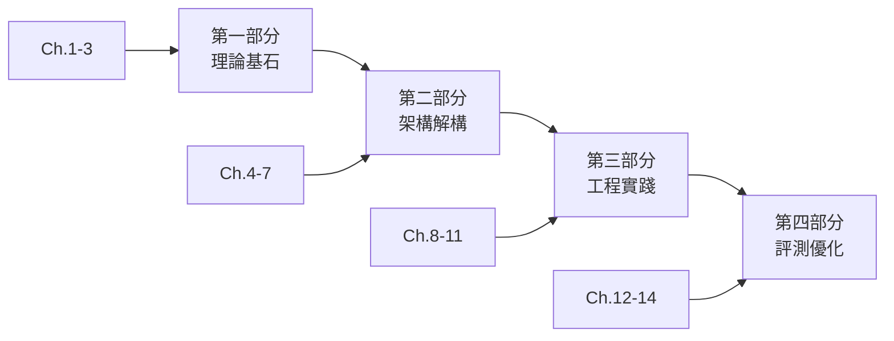

# 序章：為什麼我們需要深度研究代理人？

> **本章目標**
> 在開始技術深潛之前，讓我們先理解「深度研究代理人」要解決什麼問題、為何傳統方法不足以應對，以及本書將如何帶領你從零建構這樣的系統。

---

## 一位分析師的一天

早上九點，科技投資分析師陳雅婷打開電腦，桌上已經堆滿了待處理的研究請求。今天的任務是：**在下班前完成一份關於「生成式 AI 對半導體產業供應鏈影響」的深度報告**。

她打開 ChatGPT，輸入了第一個問題：

> 「生成式 AI 對半導體產業有什麼影響？」

三秒後，她得到了一個流暢的回答——關於 AI 晶片需求增長、NVIDIA 的市場地位、台積電的產能擴張。看起來很專業，但雅婷皺起了眉頭。

**問題一：資訊的時效性**

回答中提到的數據來自 2023 年，但現在是 2026 年。她需要的是最新一季的財報數據、最近的產能公告、上週的產業新聞。LLM 的知識截止日期成了第一道障礙。

**問題二：來源的可追溯性**

報告需要引用具體來源。但 ChatGPT 給的是「綜合性敘述」，沒有具體的報告出處、數據來源、專家引述。她無法直接將這些內容放入給客戶的報告中。

**問題三：深度的不足**

表面問題容易回答，但真正有價值的研究需要「挖三層」：
- 第一層：AI 需要什麼晶片？（大家都知道）
- 第二層：這些晶片的製程瓶頸在哪？（需要查詢技術文件）
- 第三層：瓶頸如何影響價格走勢？（需要交叉比對多方數據）

ChatGPT 停在了第一層。

**問題四：自我質疑的缺失**

更糟的是，當她追問「你確定 NVIDIA H100 的良率數據是準確的嗎？」時，模型給出了肯定的回答——但她後來發現那個數字是錯的。模型沒有能力去「查證」自己說過的話。

到了下午三點，雅婷已經：
- 開了 15 個瀏覽器分頁
- 在 3 個不同的資料庫中搜尋
- 複製貼上了 47 段文字
- 手動整理了一個 Excel 交叉比對表
- 還在與 ChatGPT 進行第 23 輪對話

**這不是 AI 輔助研究。這是人類輔助 AI 的不完整輸出。**

---

## 如果 AI 能「主動研究」會怎樣？

現在，讓我們想像一個不同的場景。

雅婷輸入同樣的問題，但這次她面對的是一個**深度研究代理人（Deep Research Agent）**：

```
研究任務：分析生成式 AI 對半導體產業供應鏈的影響
要求：
- 使用最近 6 個月的公開資料
- 提供所有數據的具體來源
- 包含至少 3 家主要廠商的比較分析
- 標註任何存在爭議或不確定的資訊
```

代理人開始工作。但它不是直接「回答」，而是開始「研究」：

```
[思考] 這是一個多維度的產業分析任務。我需要：
1. 識別關鍵廠商（NVIDIA, AMD, Intel, 台積電, 三星）
2. 收集最新財報與公告
3. 查詢產業分析報告
4. 比對不同來源的數據一致性
5. 識別並標註矛盾資訊

[行動] 搜尋：NVIDIA Q3 2025 財報 AI GPU 出貨量
[觀察] 找到 3 個來源：官方財報、路透社報導、分析師報告
[思考] 官方數字與分析師預測有 12% 差異，需要進一步查證...

[行動] 搜尋：NVIDIA 財報會議紀錄 GPU 供應說明
[觀察] 找到管理層在電話會議中的具體說明...
[思考] 差異來自「出貨量」與「營收認列」的時間差，這是合理的會計處理...
```

**400 次工具調用**後，代理人產出了一份報告：

- 15 頁的結構化分析
- 47 個具體引用來源
- 3 張自動生成的比較圖表
- 一個「不確定性聲明」區塊，列出了 5 個需要人類判斷的爭議點

雅婷花了 30 分鐘審閱報告，補充了自己的洞察，調整了結論的措辭。

**五點準時下班。**

---

## 這不是科幻，這是 MiroThinker

你剛才讀到的「深度研究代理人」不是幻想。它已經存在，而且是開源的。

**MiroThinker** 是由 MiroMind 團隊開發的開源搜尋代理系統，在 2025 年末發布後迅速成為業界標竿。讓我們看看它的核心指標：

| 基準測試     | MiroThinker v1.5 | OpenAI DeepResearch | 傳統 RAG |
| ------------ | ---------------- | ------------------- | -------- |
| HLE-Text     | **39.2%**        | 26.8%               | 12.4%    |
| BrowseComp   | **69.8%**        | 51.2%               | 23.7%    |
| GAIA Level 3 | **61.3%**        | 48.9%               | 18.2%    |
| 工具調用上限 | 400 次           | ~50 次              | N/A      |
| 上下文視窗   | 256K             | 128K                | 8-32K    |

這些數字背後代表什麼？

- **HLE（Holistic Language Evaluation）**：衡量模型處理複雜、多步驟語言任務的能力
- **BrowseComp**：測試代理人在網路上搜尋、瀏覽、提取資訊的綜合能力
- **GAIA Level 3**：最高難度的通用 AI 助手基準測試

MiroThinker 在這些測試中的領先，不是靠「更大的模型」——它的 30B 版本就能超越許多 100B+ 的模型。關鍵在於一個革命性的概念：

### 交互式縮放（Interactive Scaling）

傳統的 AI 能力提升遵循「縮放定律」：
- **參數縮放**：模型越大，能力越強
- **數據縮放**：訓練資料越多，效果越好

但 MiroThinker 引入了第三個維度：

- **交互縮放**：代理人與環境的交互越深、越頻繁，最終表現越好

這意味著一個 30B 的模型，如果能進行 400 次深思熟慮的工具調用，可能比一個 200B 的模型進行 5 次淺層交互表現更好。

**這是本書要教你的核心技術。**

---

## 本書的學習旅程

你手中這本書，不是一本「理論教科書」，而是一本「工程實戰手冊」。我們將以 MiroThinker 開源專案為核心教材，帶領你從零開始建構一個企業級的深度研究代理人。

### 四大學習階段




**第一部分：理論基石（第 1-3 章）**

在這裡，你將理解：
- 為什麼 LLM 本身不足以成為「研究員」
- ReAct 範式如何讓 AI 具備「思考-行動-觀察」的循環能力
- 交互式縮放為何能以小搏大
- 深度研究需要什麼樣的認知框架

**第二部分：架構解構（第 4-7 章）**

我們將深入 MiroThinker 的原始碼：
- 調度器如何分解與管理複雜任務
- 工具調用系統如何記錄軌跡以供訓練
- 256K 上下文視窗的記憶管理策略
- 搜尋引擎與 RAG 的深度整合

**第三部分：工程實踐（第 8-11 章）**

理論落地的時刻：
- 從 8B 到 72B 模型的部署與優化
- 端到端建構你自己的研究代理人
- 多代理人協作系統設計
- 生產環境的監控與擴展

**第四部分：評測與優化（第 12-14 章）**

確保品質與效率：
- 使用業界標準基準測試驗證系統
- 處理 LLM 幻覺與事實核查
- 效能優化與成本控制

### 每章的核心產出物

這是一本「做中學」的書。每一章結束時，你都會有具體的產出物：

| 章節     | 核心產出物                                        |
| -------- | ------------------------------------------------- |
| 第 1 章  | `simple_react_agent.py` - 你的第一個 ReAct 代理人 |
| 第 4 章  | `dispatcher.py` - 完整的任務調度器（500+ 行）     |
| 第 9 章  | 完整的深度研究代理人系統                          |
| 第 12 章 | `evaluation_framework.py` - 自動化評測框架        |

到本書結束時，你將擁有：
- **理論理解**：清楚知道深度研究代理人為何有效
- **架構視野**：能夠解讀並擴展開源 Agent 專案
- **實作能力**：能夠建構、部署、優化自己的代理人
- **評測素養**：能夠客觀評估代理人的能力與局限

---

## 為何選擇 MiroThinker？

你可能會問：「市面上有這麼多 Agent 框架，為什麼要以 MiroThinker 為學習案例？」

### 理由一：完全開源，透明可審計

| 專案                | 模型   | 框架   | 資料集 | 訓練代碼 |
| ------------------- | ------ | ------ | ------ | -------- |
| OpenAI DeepResearch | ❌ 封閉 | ❌ 封閉 | ❌ 封閉 | ❌ 封閉   |
| Perplexity          | ❌ 封閉 | ❌ 封閉 | ❌ 封閉 | ❌ 封閉   |
| MiroThinker         | ✅ 開源 | ✅ 開源 | ✅ 開源 | ✅ 開源   |

當你需要理解「為什麼代理人做出這個決定」時，封閉系統只能給你黑盒輸出。MiroThinker 讓你能看到每一行程式碼、每一條訓練資料、每一個設計決策。

### 理由二：工程品質與研究深度兼具

MiroThinker 不是「玩具專案」。它的組件包括：

- **MiroThinker 模型**：經過嚴格訓練的搜尋代理人（30B/235B）
- **MiroFlow 框架**：可重現的研究代理框架
- **MiroVerse 資料集**：147K 樣本的高品質訓練資料
- **MiroTrain/MiroRL**：完整的訓練基礎設施

這意味著你學到的不是「簡化版」，而是「生產級」的技術。

### 理由三：活躍的社群與持續的演進

截至本書寫作時，MiroThinker：
- GitHub Stars：5,000+
- 每月更新頻率：2-3 次主要更新
- 社群貢獻者：100+

這確保了你學到的知識不會很快過時，而且遇到問題時有社群可以求助。

### 理由四：中英文雙語支援

對於繁體中文讀者來說，這是一個特別的優勢。MiroThinker 在中文基準測試（如 BrowseComp-ZH）上的表現與英文同樣出色，這意味著你可以直接將學到的技術應用於中文研究任務。

---

## 開始之前：你需要準備什麼？

### 技術背景

本書假設你具備以下基礎：

- **Python 程式設計**：能夠閱讀和編寫中等複雜度的 Python 程式碼，熟悉 async/await 語法
- **基礎 LLM 知識**：了解什麼是 Prompt、Token、Fine-tuning（不需要深入理解原理）
- **基本的系統概念**：了解 API、資料庫、容器化的基本概念

如果你是完全的 AI 新手，建議先閱讀一本 LLM 入門書籍，再來挑戰本書。

### 開發環境

我們將在第 8 章詳細介紹環境搭建，但這裡先給你一個概覽：

**最低配置**（使用雲端 API）：
- 任何能運行 Python 3.10+ 的電腦
- 穩定的網路連線
- OpenAI/Anthropic API Key

**建議配置**（本地部署小模型）：
- 16GB RAM
- NVIDIA GPU 8GB VRAM（用於 8B 模型量化版）

**進階配置**（完整本地部署）：
- 64GB RAM
- NVIDIA GPU 24GB+ VRAM（如 RTX 4090 或 A100）

### 時間投入

- **快速瀏覽**：2-3 天可讀完全書
- **深度學習**：建議每章投入 4-8 小時，包含動手實作
- **完整實踐**：完成所有範例專案約需 60-80 小時

---

## 章節總結

在這個序章中，我們：

1. **看見了問題**：傳統 LLM 在深度研究任務中的四大局限——時效性、可追溯性、深度不足、缺乏自我質疑
2. **想像了解決方案**：一個能「主動研究」而非「被動回答」的深度研究代理人
3. **認識了 MiroThinker**：一個開源的、在多個基準測試中領先的深度研究代理人系統
4. **理解了交互式縮放**：為何「多次深入交互」可能比「一次大模型推理」更有效
5. **預覽了學習旅程**：四大部分、14 章內容、每章的核心產出物

在下一章，我們將正式開始技術之旅。你將理解 LLM 的能力邊界，學習 ReAct 範式，並動手建構你的第一個會「思考-行動-觀察」的代理人。

**準備好了嗎？讓我們開始。**

---

**下一章預告**

> **第 1 章：從 LLM 到自主代理人**
>
> 我們將深入探討 LLM 的本質與局限，理解「代理人」的定義與特徵，學習 ReAct 範式的工作原理，並親手實作一個能夠搜尋網路、分析結果、自我修正的簡單代理人。你的第一個 `simple_react_agent.py` 正在等著你。
