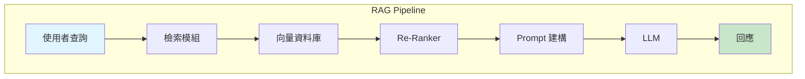
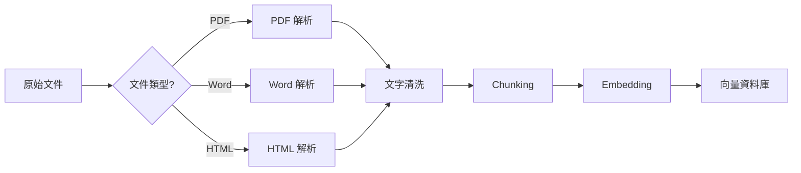
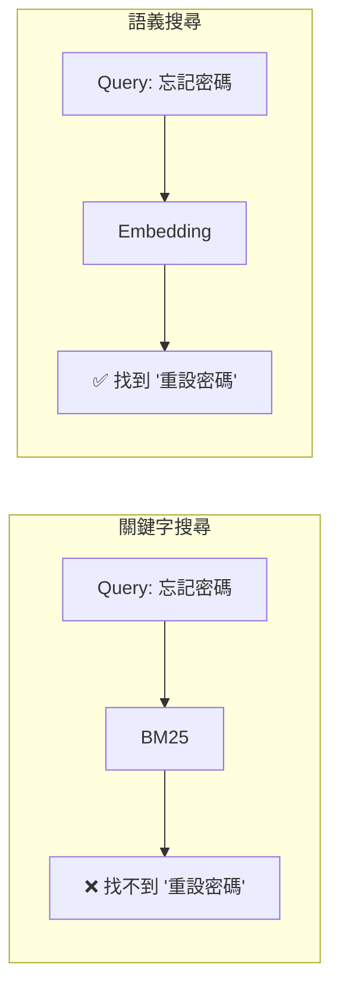

# CLAUDE.md - RAG in Action 撰寫指南

> 本文件為 Claude Code 撰寫《RAG in Action: 打造精準的企業級 AI 搜尋系統》時的指導規範。

---

## 書籍定位

**書名**：RAG in Action: 打造精準的企業級 AI 搜尋系統
**風格**：Manning "in Action" 系列
**目標字數**：~136,000 字（13 章 + 前言）
**核心專案**：AskBot - 企業客服知識庫 AI 助理

---

## 寫作風格規範

### 1. 第二人稱親切語氣

使用「你」、「我們」直接對話：

```
✅ 正確：「你可能會想，為什麼搜尋結果這麼差？讓我們來揭開謎底。」
❌ 錯誤：「讀者可能會想，為什麼搜尋結果如此不準確。」
```

### 2. 專案驅動敘事

每章以真實企業場景開場（500-800 字），讓讀者代入角色：

```
✅ 正確：「你是 TechCorp 的後端工程師，老闆剛剛說要在三週內上線一個 AI 客服系統...」
❌ 錯誤：「RAG 是一種結合檢索與生成的技術架構...」
```

### 3. 程式碼標記規範

使用 ‹1›, ‹2›, ‹3› 標記關鍵程式碼行，並在下方提供詳細說明：

```python
class BM25SearchEngine:
    def __init__(self, documents: List[str]):
        self.documents = documents                    # ‹1›
        self.tokenized_docs = self._tokenize_all()    # ‹2›
        self.bm25 = BM25Okapi(self.tokenized_docs)    # ‹3›
```

說明：
- ‹1› 儲存原始文件列表，供後續檢索時返回
- ‹2› 將所有文件進行分詞處理
- ‹3› 建立 BM25 索引，這是核心搜尋演算法

### 4. 解釋「為何」而非只解釋「如何」

```
✅ 正確：「我們選擇 k1=1.5 而非預設的 1.2，是因為我們的技術文件平均較長，
         需要更強的詞頻飽和效果來避免長文件被過度獎勵。」

❌ 錯誤：「將 k1 參數設為 1.5。」
```

### 5. 量化改進效果

每個優化都要提供具體數據：

```
✅ 正確：「加入 Re-Ranking 後，Precision@5 從 0.65 提升到 0.82，
         提升幅度達 26%，但延遲增加了 45ms。」

❌ 錯誤：「Re-Ranking 可以顯著提升精準度。」
```

---

## 章節結構模板

每章必須包含以下結構：

```markdown
# 第 X 章：標題

> **本章任務：** 一句話描述本章核心產出

---

## 學習目標

完成本章後，你將能夠：

- [ ] 目標 1（動詞開頭）
- [ ] 目標 2
- [ ] 目標 3
- [ ] 目標 4
- [ ] 目標 5

---

## 核心產出物

- `file1.py` - 功能描述
- `file2.py` - 功能描述
- 測試資料集 / Docker 設定等

---

## X.1 開場場景（500-800 字）

企業真實問題描述，角色代入

## X.2 技術原理

核心概念解說

## X.3 動手實作

完整可執行程式碼

## X.4 進階優化

效能調優與最佳實踐

## X.5 實驗與評估

量化測試結果

## X.6 本章小結

### 核心要點回顧
1. ...
2. ...
3. ...

### 下一章預告

引導讀者期待下一章內容

---

## 延伸閱讀

- 相關論文或文章（可選）
```

---

## 程式碼規範

### Python 風格

- **Python 版本**：3.9+
- **類型提示**：所有函數必須有完整類型提示
- **文件字串**：使用三引號 docstring
- **命名規範**：
  - 類別：`PascalCase`
  - 函數/變數：`snake_case`
  - 常數：`UPPER_SNAKE_CASE`

### 範例程式碼模板

```python
"""
chapter_xx/module_name.py

本章核心模組：模組功能描述

使用方式：
    python module_name.py

依賴安裝：
    pip install package1 package2
"""

from typing import List, Dict, Optional
import logging

# ‹1› 設定日誌記錄器
logging.basicConfig(level=logging.INFO)
logger = logging.getLogger(__name__)


class SearchEngine:
    """
    搜尋引擎基礎類別

    Attributes:
        documents: 文件集合
        index: 索引結構

    Example:
        >>> engine = SearchEngine(documents)
        >>> results = engine.search("query")
    """

    def __init__(self, documents: List[str]):
        """
        初始化搜尋引擎

        Args:
            documents: 要索引的文件列表
        """
        self.documents = documents
        self._build_index()

    def search(self, query: str, top_k: int = 5) -> List[Dict]:
        """
        執行搜尋

        Args:
            query: 搜尋查詢
            top_k: 返回結果數量

        Returns:
            排序後的搜尋結果列表
        """
        pass


if __name__ == "__main__":
    # 演示用法
    sample_docs = [
        "如何重設密碼？",
        "忘記密碼怎麼辦？",
        "產品價格是多少？",
    ]

    engine = SearchEngine(sample_docs)
    results = engine.search("我忘記密碼了")

    for i, result in enumerate(results, 1):
        print(f"{i}. {result}")
```

---

## Mermaid 圖表規範

每章至少包含 3 個圖表：

### 1. 架構圖（必備）



### 2. 流程圖



### 3. 對比圖



---

## AskBot 版本演進

| 版本 | 章節 | 功能 |
|------|------|------|
| v1.0 | Ch3 | 基礎 RAG Pipeline |
| v2.0 | Ch7 | Hybrid Search + Re-Ranking |
| v3.0 | Ch10 | 生產級部署（K8s + 監控）|
| v4.0 | Ch13 | 持續學習（自動重訓練）|

---

## 字數目標

| 章節 | 目標字數 | 說明 |
|------|----------|------|
| 前言 | 2,000 | ✅ 已完成 |
| Ch1-Ch3 | 各 10,000 | 基礎建設篇 |
| Ch4 | 12,000 | Chunking 策略（5 種方法詳解）|
| Ch5 | 10,000 | Embedding 選型 |
| Ch6 | 10,000 | Re-Ranking |
| Ch7 | 10,000 | Hybrid Search |
| Ch8 | 12,000 | Prompt Engineering（5 種範本）|
| Ch9 | 10,000 | 監控系統 |
| Ch10 | 12,000 | 部署架構 |
| Ch11 | 10,000 | 回饋收集 |
| Ch12 | 10,000 | 評估框架 |
| Ch13 | 10,000 | 持續學習 |
| **總計** | **~136,000** | |

---

## 技術棧

- **語言**：Python 3.9+
- **Web 框架**：FastAPI
- **Embedding**：Sentence Transformers（all-MiniLM-L6-v2 起步）
- **向量資料庫**：Qdrant
- **LLM**：Claude API (claude-3-haiku / claude-3-sonnet)
- **快取**：Redis
- **監控**：Prometheus + Grafana
- **部署**：Docker Compose → Kubernetes
- **工作流程**：Apache Airflow
- **測試**：pytest

---

## 禁止事項

1. ❌ 不要使用虛擬碼（必須是可執行的 Python）
2. ❌ 不要跳過錯誤處理（生產級程式碼必須穩健）
3. ❌ 不要假設讀者有 GPU（從 CPU 友善方案開始）
4. ❌ 不要使用「簡單」、「容易」、「只要」等詞彙
5. ❌ 不要使用過多 emoji（技術書籍保持專業）

---

## 參考資源

- **BM25 原論文**：Robertson, S. E., & Zaragoza, H. (2009). The Probabilistic Relevance Framework
- **Sentence Transformers**：https://www.sbert.net/
- **Qdrant 官方文檔**：https://qdrant.tech/documentation/
- **RAG 論文**：Lewis, P., et al. (2020). Retrieval-Augmented Generation for Knowledge-Intensive NLP Tasks

---

**最後更新：2026-01-17**
