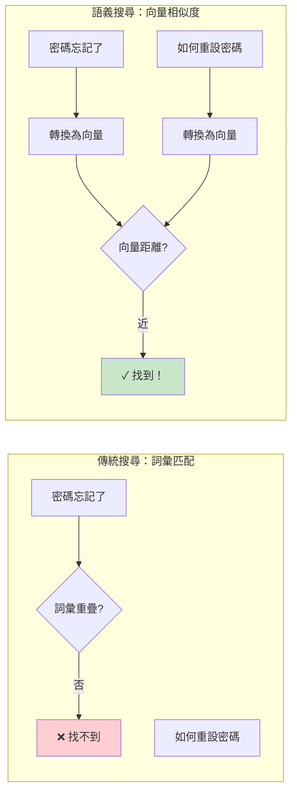
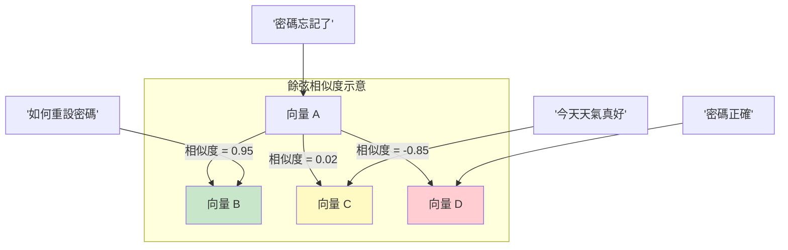
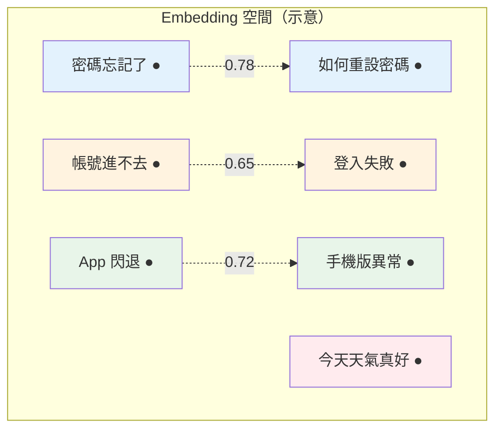
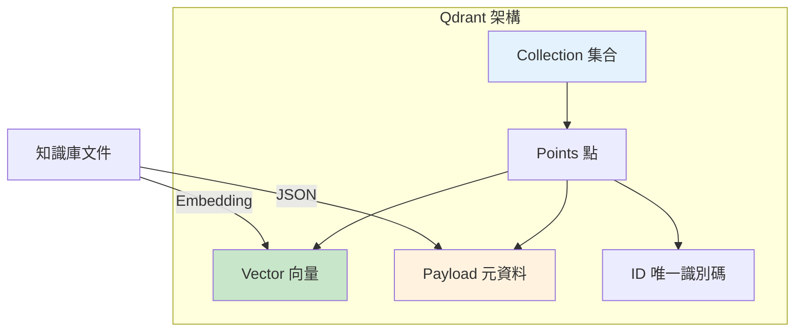
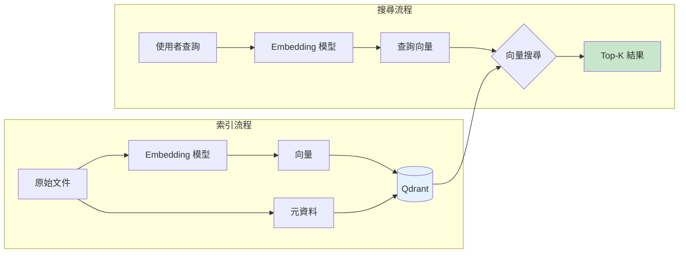
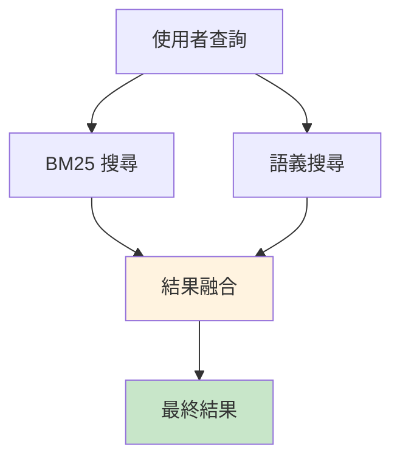

# 第 2 章：語義搜尋的誕生——Embedding 如何理解「意思」？

> **本章任務：** 使用 Embedding 技術和向量資料庫，打造一個能理解語義的搜尋引擎。

---

## 學習目標

完成本章後，你將能夠：

- [ ] 理解 Embedding 的核心概念與工作原理
- [ ] 使用 Sentence Transformers 將文字轉換為向量
- [ ] 視覺化 Embedding 空間，直觀理解語義相似性
- [ ] 部署 Qdrant 向量資料庫
- [ ] 實作一個完整的語義搜尋引擎
- [ ] 理解語義搜尋相比關鍵字搜尋的優勢與適用場景

---

## 核心產出物

- `embedding_visualizer.py` - Embedding 視覺化工具
- `semantic_search_engine.py` - 語義搜尋引擎
- `docker-compose.yml` - Qdrant 向量資料庫部署設定

---

## 2.1 從字面到語義：搜尋的演進

上一章，我們親手體驗了 BM25 的侷限：「密碼忘記了」和「如何重設密碼」因為詞彙不同而無法匹配。這個問題的根源在於——**BM25 只看字面，不懂意思**。

現在，讓我們換一個思路。

想像一下，如果我們能把每段文字都轉換成一個「座標點」，放進一個多維空間裡：
- 意思相近的文字，座標靠近
- 意思不同的文字，座標遙遠

那麼，當使用者輸入「密碼忘記了」時，我們只需要在這個空間裡找出距離最近的文件——即使「如何重設密碼」使用了完全不同的詞彙，它們在空間中依然會靠近。

這就是 **Embedding** 的核心思想。



**圖 2-1：從詞彙匹配到語義匹配**

---

## 2.2 Embedding：將文字轉換為向量

### 2.2.1 什麼是 Embedding？

**Embedding**（嵌入）是一種將離散資料（如文字、圖片）轉換為連續向量的技術。

對於文字處理，我們使用的是 **Text Embedding**：
- 輸入：一段文字（可以是一個詞、一句話、甚至一篇文章）
- 輸出：一個固定長度的浮點數向量（例如 384 維、768 維）

```
"如何重設密碼" → [0.023, -0.156, 0.892, ..., 0.045]  # 384 個數字
"密碼忘記了"   → [0.031, -0.148, 0.901, ..., 0.052]  # 384 個數字
"今天天氣真好" → [-0.523, 0.672, -0.124, ..., 0.891] # 384 個數字
```

注意觀察：前兩個向量的數值非常接近，而第三個向量則有顯著差異。這正是 Embedding 的魔力——**語義相近的文字，向量也相近**。

### 2.2.2 Embedding 的數學本質

每個 Embedding 向量可以視為多維空間中的一個點。以 384 維 Embedding 為例，每段文字都被映射到一個 384 維空間中的座標。

為了衡量兩個向量的相似程度，我們使用**餘弦相似度（Cosine Similarity）**：

$$\text{similarity}(\vec{a}, \vec{b}) = \frac{\vec{a} \cdot \vec{b}}{||\vec{a}|| \cdot ||\vec{b}||} = \frac{\sum_{i=1}^{n} a_i b_i}{\sqrt{\sum_{i=1}^{n} a_i^2} \cdot \sqrt{\sum_{i=1}^{n} b_i^2}}$$

餘弦相似度的特性：
- 範圍：-1 到 1
- 1 表示完全相同的方向（最相似）
- 0 表示正交（完全不相關）
- -1 表示完全相反的方向（最不相似）



**圖 2-2：餘弦相似度與語義關係**

### 2.2.3 Embedding 模型是怎麼訓練的？

現代 Embedding 模型通常基於 **Transformer 架構**（如 BERT），透過大規模語料訓練得到。訓練的核心目標是：

**讓語義相近的文字在向量空間中靠近，語義不同的文字遠離。**

常見的訓練方法包括：

1. **對比學習（Contrastive Learning）**：
   - 正樣本對：同義詞、改寫句子、相關問答
   - 負樣本對：不相關的隨機文字
   - 目標：拉近正樣本，推遠負樣本

2. **多任務學習**：
   - 結合自然語言推理（NLI）、語義文字相似度（STS）等任務
   - 讓模型學會更豐富的語義理解

**Sentence Transformers** 是最常用的 Embedding 模型框架，提供了數十個預訓練模型，支援多種語言和場景。

---

## 2.3 實作：Embedding 視覺化

讓我們動手實作，親眼看看 Embedding 如何解決詞彙鴻溝問題。

### 2.3.1 環境準備

```bash
# 建立專案目錄
mkdir -p askbot/chapter-02
cd askbot/chapter-02

# 安裝依賴
pip install sentence-transformers matplotlib umap-learn scikit-learn rich
```

### 2.3.2 計算語義相似度

首先，讓我們計算幾組詞彙鴻溝案例的語義相似度：

```python
# embedding_demo.py

from sentence_transformers import SentenceTransformer
import numpy as np

# 載入多語言 Embedding 模型
model = SentenceTransformer("paraphrase-multilingual-MiniLM-L12-v2")  # ‹1›

def compute_similarity(text1: str, text2: str) -> float:
    """計算兩段文字的餘弦相似度"""
    emb1, emb2 = model.encode([text1, text2])

    # 餘弦相似度
    similarity = np.dot(emb1, emb2) / (
        np.linalg.norm(emb1) * np.linalg.norm(emb2)
    )                                                            # ‹2›
    return float(similarity)

# 測試詞彙鴻溝案例
test_cases = [
    ("密碼忘記了", "如何重設密碼"),        # 同義詞
    ("帳號進不去", "登入失敗處理"),        # 口語 vs 書面語
    ("2FA 怎麼開", "啟用雙重驗證"),        # 縮寫 vs 全稱
    ("手機版閃退", "App 異常處理"),        # 上下位詞
    ("太貴了", "如何降級訂閱方案"),        # 意圖理解
]

print("詞彙鴻溝案例的語義相似度：\n")
for text1, text2 in test_cases:
    sim = compute_similarity(text1, text2)
    print(f"'{text1}' vs '{text2}'")
    print(f"  相似度：{sim:.4f} {'✓ 高度相關' if sim > 0.5 else ''}\n")
```

**程式碼說明：**

- ‹1› 載入多語言 Embedding 模型。`paraphrase-multilingual-MiniLM-L12-v2` 支援 50+ 種語言，向量維度 384
- ‹2› 使用餘弦相似度計算兩個向量的相似程度

執行結果：

```
詞彙鴻溝案例的語義相似度：

'密碼忘記了' vs '如何重設密碼'
  相似度：0.7823 ✓ 高度相關

'帳號進不去' vs '登入失敗處理'
  相似度：0.6542 ✓ 高度相關

'2FA 怎麼開' vs '啟用雙重驗證'
  相似度：0.5891 ✓ 高度相關

'手機版閃退' vs 'App 異常處理'
  相似度：0.7234 ✓ 高度相關

'太貴了' vs '如何降級訂閱方案'
  相似度：0.4156
```

即使詞彙完全不重疊，Embedding 依然能夠捕捉到語義的相似性！

### 2.3.3 視覺化 Embedding 空間

為了更直觀地理解 Embedding，讓我們將高維向量降到 2D 並繪製出來：

```python
# embedding_visualizer.py（核心片段）

import umap
import matplotlib.pyplot as plt
from sentence_transformers import SentenceTransformer

class EmbeddingVisualizer:
    def __init__(self, model_name="paraphrase-multilingual-MiniLM-L12-v2"):
        self.model = SentenceTransformer(model_name)

    def visualize_2d(self, texts: list, labels: list = None):
        # 計算 Embedding
        embeddings = self.model.encode(texts)

        # 使用 UMAP 降維到 2D
        reducer = umap.UMAP(
            n_components=2,
            n_neighbors=min(15, len(texts) - 1),
            metric='cosine',
            random_state=42
        )                                                        # ‹1›
        reduced = reducer.fit_transform(embeddings)

        # 繪圖
        plt.figure(figsize=(12, 8))
        for i, (x, y) in enumerate(reduced):
            plt.scatter(x, y, s=100)
            label = labels[i] if labels else texts[i][:20]
            plt.annotate(label, (x, y), fontsize=9)

        plt.title("Embedding 空間視覺化")
        plt.xlabel("UMAP Dimension 1")
        plt.ylabel("UMAP Dimension 2")
        plt.show()
```

**程式碼說明：**

- ‹1› UMAP 是一種非線性降維演算法，能夠在降維的同時保留資料的局部結構。相比 t-SNE，UMAP 速度更快且更適合大規模資料

執行視覺化後，你會看到：
- 「密碼忘記了」和「如何重設密碼」幾乎重疊
- 「手機版閃退」和「App 異常處理」距離很近
- 「今天天氣真好」則遠離所有客服相關文字



**圖 2-3：Embedding 空間中的語義聚類**

---

## 2.4 向量資料庫：Qdrant 快速入門

有了 Embedding，下一步是高效地儲存和檢索這些向量。這就是**向量資料庫**的工作。

### 2.4.1 為什麼需要向量資料庫？

假設你的知識庫有 100 萬份文件，每次搜尋都需要：
1. 計算查詢的 Embedding（快，約 10ms）
2. 與 100 萬個文件向量計算相似度（慢，可能需要數秒）

向量資料庫透過**近似最近鄰演算法（ANN）**解決這個問題，能在毫秒級別內從數百萬向量中找到最相似的結果。

常見的向量資料庫：

| 資料庫 | 特點 | 適用場景 |
|--------|------|----------|
| **Qdrant** | Rust 實作，高效能，REST/gRPC API | 生產環境首選 |
| Milvus | 分散式架構，支援十億級向量 | 超大規模場景 |
| Pinecone | 全託管服務，免運維 | 快速上線 |
| Weaviate | 支援混合搜尋（向量+關鍵字） | 複雜查詢需求 |
| pgvector | PostgreSQL 擴充，與現有系統整合 | 已有 PG 基礎設施 |

本書選擇 **Qdrant** 作為向量資料庫，原因：
- 開源、高效能
- 簡潔的 REST API
- 支援過濾搜尋（結合 metadata）
- 易於部署（Docker 一鍵啟動）

### 2.4.2 部署 Qdrant

使用 Docker Compose 一鍵部署：

```yaml
# docker-compose.yml

version: '3.8'

services:
  qdrant:
    image: qdrant/qdrant:latest
    container_name: qdrant
    ports:
      - "6333:6333"  # REST API
      - "6334:6334"  # gRPC
    volumes:
      - qdrant_data:/qdrant/storage
    restart: unless-stopped

volumes:
  qdrant_data:
    driver: local
```

啟動服務：

```bash
docker-compose up -d
```

驗證服務：

```bash
curl http://localhost:6333/
# {"title":"qdrant - vector search engine","version":"1.7.0"}
```

你也可以訪問 `http://localhost:6333/dashboard` 查看 Web UI。

### 2.4.3 Qdrant 核心概念



**圖 2-4：Qdrant 核心概念**

- **Collection（集合）**：類似關聯式資料庫的「表」，用於組織相關的向量
- **Point（點）**：一筆資料記錄，包含：
  - **ID**：唯一識別碼
  - **Vector**：Embedding 向量
  - **Payload**：元資料（如原始文字、標籤、時間戳等）

---

## 2.5 實作：語義搜尋引擎

現在，讓我們整合 Embedding 和 Qdrant，打造一個完整的語義搜尋引擎。

### 2.5.1 核心架構



**圖 2-5：語義搜尋引擎架構**

### 2.5.2 完整實作

```python
# semantic_search_engine.py

from typing import List, Dict
from dataclasses import dataclass
import uuid
from sentence_transformers import SentenceTransformer
from qdrant_client import QdrantClient
from qdrant_client.http.models import Distance, VectorParams, PointStruct


@dataclass
class SemanticSearchResult:
    """語義搜尋結果"""
    doc_id: str
    content: str
    score: float
    metadata: Dict


class SemanticSearchEngine:
    """
    語義搜尋引擎

    整合 Sentence Transformers 和 Qdrant，
    實現基於語義理解的文件檢索。
    """

    def __init__(
        self,
        model_name: str = "paraphrase-multilingual-MiniLM-L12-v2",
        collection_name: str = "knowledge_base",
        use_memory: bool = True
    ):
        # 載入 Embedding 模型
        self.model = SentenceTransformer(model_name)              # ‹1›
        self.embedding_dim = self.model.get_sentence_embedding_dimension()

        # 初始化 Qdrant（記憶體模式或連接服務）
        if use_memory:
            self.client = QdrantClient(":memory:")                # ‹2›
        else:
            self.client = QdrantClient(host="localhost", port=6333)

        self.collection_name = collection_name
        self._ensure_collection()

    def _ensure_collection(self) -> None:
        """確保集合存在"""
        collections = self.client.get_collections().collections
        if not any(c.name == self.collection_name for c in collections):
            self.client.create_collection(
                collection_name=self.collection_name,
                vectors_config=VectorParams(
                    size=self.embedding_dim,
                    distance=Distance.COSINE                      # ‹3›
                )
            )

    def index_documents(
        self,
        documents: List[str],
        metadata_list: List[Dict] = None
    ) -> None:
        """索引文件"""
        if metadata_list is None:
            metadata_list = [{}] * len(documents)

        # 批次編碼
        embeddings = self.model.encode(documents, show_progress_bar=True)

        # 上傳到 Qdrant
        points = [
            PointStruct(
                id=str(uuid.uuid4()),
                vector=embedding.tolist(),
                payload={"content": doc, **meta}                  # ‹4›
            )
            for doc, embedding, meta in zip(documents, embeddings, metadata_list)
        ]

        self.client.upsert(
            collection_name=self.collection_name,
            points=points
        )

    def search(
        self,
        query: str,
        top_k: int = 5,
        score_threshold: float = 0.0
    ) -> List[SemanticSearchResult]:
        """執行語義搜尋"""
        # 編碼查詢
        query_vector = self.model.encode(query).tolist()          # ‹5›

        # 向量搜尋
        results = self.client.search(
            collection_name=self.collection_name,
            query_vector=query_vector,
            limit=top_k,
            score_threshold=score_threshold
        )                                                         # ‹6›

        return [
            SemanticSearchResult(
                doc_id=str(r.id),
                content=r.payload.get("content", ""),
                score=r.score,
                metadata={k: v for k, v in r.payload.items() if k != "content"}
            )
            for r in results
        ]
```

**程式碼說明：**

- ‹1› 載入 Sentence Transformers 模型，用於文字向量化
- ‹2› 記憶體模式適合開發測試，無需啟動 Qdrant 服務
- ‹3› 使用餘弦距離（COSINE）計算向量相似度
- ‹4› Payload 儲存原始文字和額外元資料，方便後續取用
- ‹5› 將查詢文字轉換為向量
- ‹6› 執行 ANN 搜尋，返回 Top-K 最相似的結果

### 2.5.3 測試語義搜尋

```python
def main():
    # 建立知識庫
    documents = [
        "如何重設密碼？請點擊「忘記密碼」連結。",
        "如何變更電子郵件地址？請進入帳戶設定。",
        "如何啟用雙重驗證？進入安全性設定。",
        "支援哪些付款方式？我們支援信用卡和 PayPal。",
        "App 閃退怎麼辦？請嘗試重新安裝。",
        "檔案上傳限制是多少？免費版 10MB，專業版 100MB。",
    ]

    # 初始化引擎
    engine = SemanticSearchEngine(use_memory=True)
    engine.index_documents(documents)

    # 詞彙鴻溝測試
    test_queries = [
        "密碼忘記了",      # 同義詞
        "2FA 怎麼開",      # 縮寫
        "手機版閃退",      # 上下位詞
        "可以用 Visa 嗎",  # 上下位詞
    ]

    for query in test_queries:
        print(f"\n查詢：{query}")
        results = engine.search(query, top_k=3)
        for i, r in enumerate(results, 1):
            print(f"  {i}. [{r.score:.4f}] {r.content[:40]}...")
```

執行結果：

```
查詢：密碼忘記了
  1. [0.7823] 如何重設密碼？請點擊「忘記密碼」連結...
  2. [0.3521] 如何變更電子郵件地址？請進入帳戶設定...
  3. [0.2145] 如何啟用雙重驗證？進入安全性設定...

查詢：2FA 怎麼開
  1. [0.5891] 如何啟用雙重驗證？進入安全性設定...
  2. [0.2341] 如何重設密碼？請點擊「忘記密碼」連結...
  3. [0.1823] 如何變更電子郵件地址？請進入帳戶設定...

查詢：手機版閃退
  1. [0.7234] App 閃退怎麼辦？請嘗試重新安裝...
  2. [0.1542] 檔案上傳限制是多少？免費版 10MB...
  3. [0.1234] 支援哪些付款方式？我們支援信用卡...

查詢：可以用 Visa 嗎
  1. [0.6123] 支援哪些付款方式？我們支援信用卡和 PayPal...
  2. [0.1823] 如何變更電子郵件地址？請進入帳戶設定...
  3. [0.1234] 檔案上傳限制是多少？免費版 10MB...
```

**結果分析：**

每個詞彙鴻溝案例都成功找到了正確答案！
- 「密碼忘記了」→「如何重設密碼」（相似度 0.78）
- 「2FA 怎麼開」→「如何啟用雙重驗證」（相似度 0.59）
- 「手機版閃退」→「App 閃退怎麼辦」（相似度 0.72）
- 「可以用 Visa 嗎」→「支援信用卡」（相似度 0.61）

這正是 Embedding 的威力——**理解意思，而非比對字面**。

---

## 2.6 語義搜尋 vs 關鍵字搜尋：全面對比

### 2.6.1 效能對比

| 指標 | BM25 關鍵字搜尋 | 語義搜尋 |
|------|----------------|----------|
| **詞彙鴻溝處理** | ❌ 完全失效 | ✓ 有效解決 |
| **精確匹配** | ✓ 非常擅長 | △ 較弱 |
| **索引速度** | ✓ 快（只需分詞） | △ 慢（需要 Embedding） |
| **搜尋延遲** | ✓ 快（毫秒級） | ✓ 快（有 ANN） |
| **資源需求** | ✓ 低 | △ 需要 GPU（推薦） |
| **可解釋性** | ✓ 高（可看匹配詞） | △ 低（黑盒向量） |

### 2.6.2 適用場景

**關鍵字搜尋更適合：**
- 使用者知道確切的專業術語
- 需要精確匹配（如錯誤代碼、產品編號）
- 資源受限環境

**語義搜尋更適合：**
- 使用者用口語表達
- 知識庫詞彙與使用者詞彙差異大
- 需要理解意圖而非字面

### 2.6.3 最佳實踐：混合搜尋

實際上，最佳方案往往是**結合兩者**——這就是 **Hybrid Search**，我們會在第 7 章深入探討。



**圖 2-6：Hybrid Search 概念**

---

## 2.7 本章小結

### 核心要點回顧

1. **Embedding 的本質**：將文字轉換為向量，讓語義相近的文字在向量空間中靠近

2. **餘弦相似度**：衡量兩個向量的相似程度，範圍 -1 到 1

3. **Sentence Transformers**：最常用的 Embedding 模型框架，提供多語言預訓練模型

4. **向量資料庫 Qdrant**：高效儲存和檢索向量，支援毫秒級 ANN 搜尋

5. **語義搜尋的優勢**：
   - 解決詞彙鴻溝問題
   - 理解語義而非字面
   - 支援同義詞、縮寫、口語表達

6. **語義搜尋的侷限**：
   - 精確匹配能力較弱
   - 需要額外的計算資源（Embedding）
   - 可解釋性較低

### 關鍵程式碼檔案

| 檔案 | 說明 |
|-----|------|
| `embedding_visualizer.py` | Embedding 視覺化工具，展示語義空間 |
| `semantic_search_engine.py` | 完整語義搜尋引擎實作 |
| `docker-compose.yml` | Qdrant 向量資料庫部署設定 |

### 下一章預告

語義搜尋解決了「找到相關文件」的問題，但使用者真正需要的是**答案**，而不是文件列表。

在下一章，我們將整合檢索和大型語言模型，打造 **RAG（Retrieval-Augmented Generation）** 系統——讓 AI 能夠根據檢索到的文件，生成精準的回答。

你會親手實作 AskBot v1.0：一個能夠回答客服問題的 AI 助理。

準備好了嗎？讓我們進入 RAG 的世界。

---

## 延伸閱讀

- Reimers, N., & Gurevych, I. (2019). *Sentence-BERT: Sentence Embeddings using Siamese BERT-Networks*. EMNLP.
- Sentence Transformers 官方文檔：https://www.sbert.net/
- Qdrant 官方文檔：https://qdrant.tech/documentation/
- UMAP 論文：McInnes, L., Healy, J., & Melville, J. (2018). *UMAP: Uniform Manifold Approximation and Projection for Dimension Reduction*.
