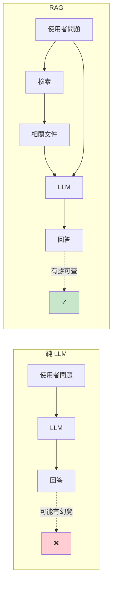
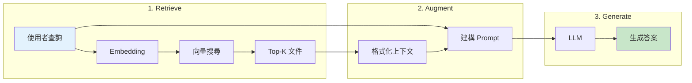
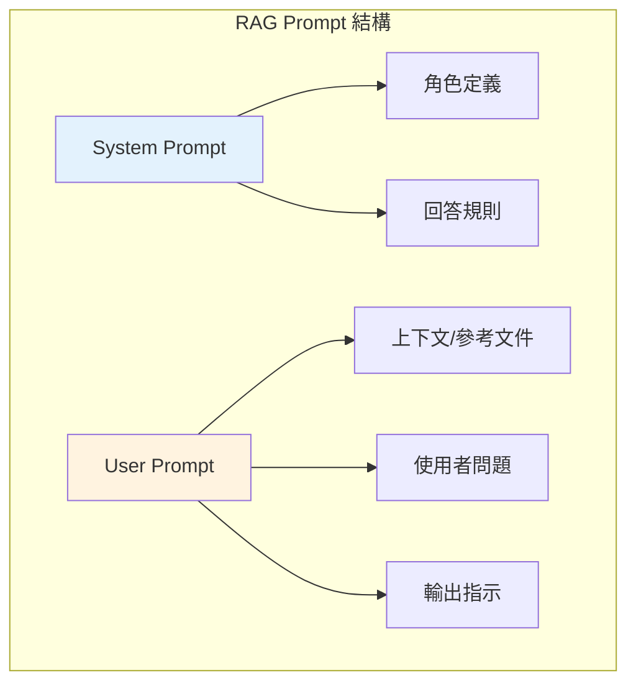
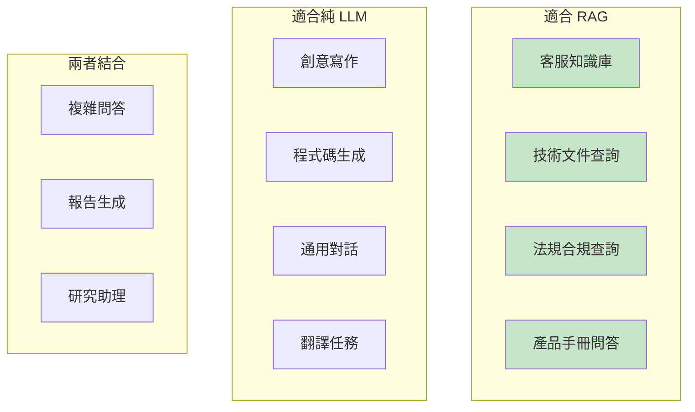
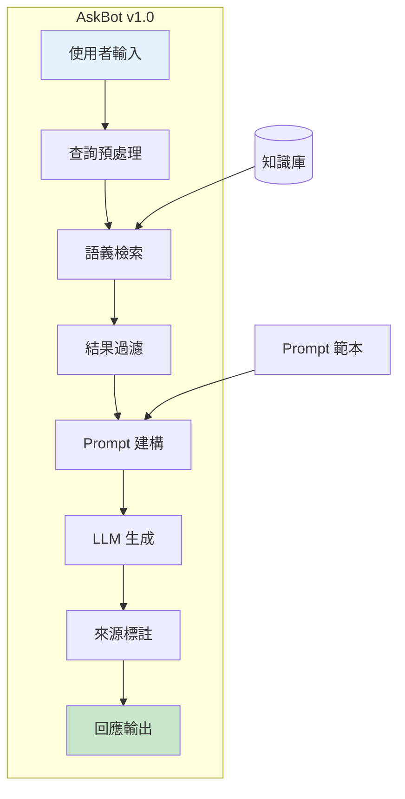

# 第 3 章：RAG 的最小可行版本——整合檢索與生成

> **本章任務：** 整合語義搜尋與 LLM，打造第一個能回答問題的 AI 助理——AskBot v1.0。

---

## 學習目標

完成本章後，你將能夠：

- [ ] 理解 RAG 的核心架構與工作流程
- [ ] 實作一個端到端的 RAG Pipeline
- [ ] 設計有效的 Prompt 將檢索結果注入 LLM
- [ ] 實作來源追蹤，讓使用者能驗證答案可信度
- [ ] 理解 RAG 相比純 LLM 的優勢與適用場景
- [ ] 完成 AskBot v1.0 的第一個可運作版本

---

## 核心產出物

- `rag_v1.py` - RAG Pipeline 核心實作
- `prompt_templates.py` - Prompt 範本庫
- `askbot_demo.py` - AskBot v1.0 完整演示

---

## 3.1 RAG 架構概覽

### 3.1.1 什麼是 RAG？

**RAG（Retrieval-Augmented Generation，檢索增強生成）** 是一種結合資訊檢索和文字生成的技術架構。它的核心思想是：

**不要讓 LLM 憑空回答問題，而是先從知識庫中找到相關資料，再讓 LLM 根據這些資料生成答案。**

這解決了純 LLM 的兩大問題：
1. **知識過時**：LLM 的訓練資料有截止日期，無法回答最新資訊
2. **幻覺問題**：LLM 可能會編造不存在的事實



**圖 3-1：純 LLM vs RAG**

### 3.1.2 RAG 的三個核心步驟

RAG 的名稱精確描述了它的工作流程：

1. **Retrieve（檢索）**：從知識庫中找出與查詢最相關的文件
2. **Augment（增強）**：將檢索到的文件整理成上下文，注入到 Prompt 中
3. **Generate（生成）**：讓 LLM 根據 Prompt（包含上下文和問題）生成答案



**圖 3-2：RAG 的三個核心步驟**

### 3.1.3 為什麼 RAG 是企業 AI 的首選？

對於企業知識庫場景，RAG 相比其他方案有明顯優勢：

| 方案 | 優點 | 缺點 |
|------|------|------|
| **微調 LLM** | 模型「記住」特定知識 | 成本高、更新慢、可能過擬合 |
| **純向量搜尋** | 快速、準確 | 只返回文件，無法直接回答問題 |
| **RAG** | 結合兩者優點 | 需要維護檢索和生成兩個系統 |

RAG 的核心優勢：
- **知識可更新**：新增文件只需重新索引，不需重新訓練模型
- **答案可追溯**：每個回答都有明確的來源文件
- **成本可控**：使用較小的 LLM 即可獲得好效果
- **隱私可控**：企業資料不需要上傳給模型提供商

---

## 3.2 實作最簡單的 RAG Pipeline

讓我們用最少的程式碼實作一個可運作的 RAG 系統。

### 3.2.1 環境準備

```bash
# 建立專案目錄
mkdir -p askbot/chapter-03
cd askbot/chapter-03

# 安裝依賴
pip install sentence-transformers qdrant-client anthropic python-dotenv rich

# 設定 API 金鑰
echo "ANTHROPIC_API_KEY=your_key_here" > .env
```

### 3.2.2 五行程式碼實現 RAG

讓我先展示 RAG 的本質——只需要五行核心程式碼：

```python
# 1. 檢索：找到相關文件
docs = vector_db.search(query_embedding, top_k=3)

# 2. 增強：建構 Prompt
context = "\n".join([doc.content for doc in docs])
prompt = f"根據以下資料回答問題：\n{context}\n\n問題：{query}"

# 3. 生成：呼叫 LLM
response = llm.generate(prompt)
```

這就是 RAG 的精髓。當然，生產級系統需要更多的錯誤處理和優化，但核心邏輯就是這麼直接。

### 3.2.3 完整的 RAG Pipeline 類別

```python
# rag_v1.py

from typing import List, Dict
from dataclasses import dataclass
from sentence_transformers import SentenceTransformer
from qdrant_client import QdrantClient
from qdrant_client.http.models import Distance, VectorParams, PointStruct
import anthropic


@dataclass
class RAGResponse:
    """RAG 系統回應"""
    answer: str
    sources: List[Dict]
    query: str


class RAGPipeline:
    """
    RAG Pipeline 第一版

    整合三個核心元件：
    1. Embedding 模型
    2. 向量資料庫
    3. LLM
    """

    def __init__(self):
        # 1. Embedding 模型
        self.embedding_model = SentenceTransformer(
            "paraphrase-multilingual-MiniLM-L12-v2"
        )                                                        # ‹1›

        # 2. 向量資料庫（記憶體模式）
        self.vector_db = QdrantClient(":memory:")
        self._init_collection()                                  # ‹2›

        # 3. LLM 客戶端
        self.llm = anthropic.Anthropic()                         # ‹3›

    def _init_collection(self):
        """初始化向量集合"""
        self.vector_db.create_collection(
            collection_name="knowledge_base",
            vectors_config=VectorParams(
                size=384,  # MiniLM 的維度
                distance=Distance.COSINE
            )
        )

    def index(self, documents: List[str]) -> None:
        """索引文件到知識庫"""
        embeddings = self.embedding_model.encode(documents)

        points = [
            PointStruct(
                id=i,
                vector=embedding.tolist(),
                payload={"content": doc}
            )
            for i, (doc, embedding) in enumerate(zip(documents, embeddings))
        ]

        self.vector_db.upsert(
            collection_name="knowledge_base",
            points=points
        )

    def ask(self, query: str, top_k: int = 3) -> RAGResponse:
        """
        完整的 RAG 問答流程

        Args:
            query: 使用者問題
            top_k: 檢索文件數量

        Returns:
            包含答案和來源的回應
        """
        # Step 1: Retrieve - 檢索相關文件
        query_vector = self.embedding_model.encode(query).tolist()
        results = self.vector_db.search(
            collection_name="knowledge_base",
            query_vector=query_vector,
            limit=top_k
        )                                                        # ‹4›

        sources = [
            {"content": r.payload["content"], "score": r.score}
            for r in results
        ]

        # Step 2: Augment - 建構 Prompt
        context = "\n\n".join([
            f"[文件 {i+1}]\n{s['content']}"
            for i, s in enumerate(sources)
        ])

        prompt = f"""根據以下參考文件回答使用者的問題。
如果文件中沒有相關資訊，請說明無法回答。

參考文件：
{context}

使用者問題：{query}

回答："""                                                        # ‹5›

        # Step 3: Generate - 呼叫 LLM 生成答案
        response = self.llm.messages.create(
            model="claude-3-haiku-20240307",
            max_tokens=1024,
            messages=[{"role": "user", "content": prompt}]
        )                                                        # ‹6›

        return RAGResponse(
            answer=response.content[0].text,
            sources=sources,
            query=query
        )
```

**程式碼說明：**

- ‹1› 載入多語言 Embedding 模型，將文字轉換為 384 維向量
- ‹2› 使用 Qdrant 記憶體模式，無需額外部署
- ‹3› 初始化 Anthropic 客戶端（會自動讀取環境變數中的 API 金鑰）
- ‹4› **Retrieve**：使用向量搜尋找出最相關的 Top-K 文件
- ‹5› **Augment**：將檢索到的文件格式化並嵌入 Prompt
- ‹6› **Generate**：呼叫 Claude API 生成答案

### 3.2.4 測試 RAG Pipeline

```python
def main():
    # 初始化 RAG Pipeline
    rag = RAGPipeline()

    # 索引知識庫
    documents = [
        "如何重設密碼？請點擊「忘記密碼」連結，系統將寄送重設郵件。",
        "支援哪些付款方式？我們支援信用卡、PayPal 和銀行轉帳。",
        "如何啟用雙重驗證？進入帳戶設定 > 安全性 > 啟用 2FA。",
        "檔案上傳限制？免費版 10MB，專業版 100MB。",
    ]
    rag.index(documents)

    # 測試問答
    queries = [
        "密碼忘記了怎麼辦",
        "可以用 Visa 付款嗎",
        "2FA 怎麼設定",
    ]

    for query in queries:
        print(f"\n問題：{query}")
        response = rag.ask(query)
        print(f"回答：{response.answer}")
        print(f"來源：{len(response.sources)} 份文件")
```

執行結果：

```
問題：密碼忘記了怎麼辦
回答：如果您忘記密碼，請點擊登入頁面的「忘記密碼」連結。
      系統會寄送一封包含重設連結的郵件到您的註冊信箱。
來源：3 份文件

問題：可以用 Visa 付款嗎
回答：是的，我們支援 Visa 信用卡付款。除了信用卡外，
      我們也接受 PayPal 和銀行轉帳。
來源：3 份文件

問題：2FA 怎麼設定
回答：您可以按照以下步驟啟用雙重驗證（2FA）：
      1. 進入「帳戶設定」
      2. 點選「安全性」
      3. 點擊「啟用 2FA」
來源：3 份文件
```

RAG 成功地回答了所有問題，包括詞彙鴻溝案例（「密碼忘記了」→「重設密碼」）！

---

## 3.3 Prompt Engineering 基礎

Prompt 的設計對 RAG 系統的效果有重大影響。讓我們深入探討如何設計有效的 Prompt。

### 3.3.1 RAG Prompt 的核心結構

一個好的 RAG Prompt 通常包含以下部分：



**圖 3-3：RAG Prompt 結構**

### 3.3.2 System Prompt 設計

System Prompt 定義了 AI 的角色和行為準則：

```python
SYSTEM_PROMPT = """你是一個專業的客服助理。你的任務是根據提供的參考文件回答使用者問題。

回答原則：
1. 只使用參考文件中的資訊，不要編造
2. 如果文件中沒有相關資訊，誠實告知
3. 回答要簡潔、直接、有幫助
4. 如果需要，可以引用文件來源

禁止事項：
- 不要編造不在文件中的資訊
- 不要提供可能有害的建議
- 不要假裝知道文件中沒有的內容"""
```

### 3.3.3 User Prompt 設計

User Prompt 包含上下文和問題：

```python
def build_user_prompt(query: str, documents: List[Dict]) -> str:
    """建構 User Prompt"""

    # 格式化參考文件
    context_parts = []
    for i, doc in enumerate(documents, 1):
        context_parts.append(
            f"[文件 {i}]（相關度：{doc['score']:.0%}）\n{doc['content']}"
        )
    context = "\n\n".join(context_parts)

    # 組合 Prompt
    return f"""參考文件：
{context}

---

使用者問題：{query}

請根據參考文件回答問題。如果文件中沒有足夠的資訊，請說明無法回答。"""
```

### 3.3.4 不同場景的 Prompt 範本

我們提供多種場景的 Prompt 範本：

```python
# prompt_templates.py

from enum import Enum

class PromptType(Enum):
    CUSTOMER_SUPPORT = "customer_support"  # 客服
    TECHNICAL_DOC = "technical_doc"        # 技術文件
    FACTUAL_QA = "factual_qa"              # 事實問答

TEMPLATES = {
    PromptType.CUSTOMER_SUPPORT: {
        "system": """你是一個專業且友善的客服助理...""",
        "user": """參考文件：{context}\n\n問題：{query}"""
    },

    PromptType.TECHNICAL_DOC: {
        "system": """你是一個技術文件助理，回答要精確...""",
        "user": """技術文件：{context}\n\n問題：{query}"""
    },

    PromptType.FACTUAL_QA: {
        "system": """你是一個事實查核助理，只陳述文件中的事實...""",
        "user": """參考資料：{context}\n\n問題：{query}"""
    },
}
```

### 3.3.5 Prompt 優化技巧

**技巧 1：包含相關度分數**

讓 LLM 知道哪些文件更相關：

```
[文件 1]（相關度：92%）
如何重設密碼？請點擊忘記密碼連結...

[文件 2]（相關度：65%）
帳戶安全建議：定期更換密碼...
```

**技巧 2：指定輸出格式**

```
請以以下格式回答：
1. 直接回答問題
2. 如果有多個步驟，使用編號列表
3. 在回答末尾標註參考的文件編號
```

**技巧 3：處理無法回答的情況**

```
如果參考文件中沒有足夠的資訊回答問題，請回覆：
「根據現有資料無法回答這個問題。建議您聯繫客服：support@example.com」
```

---

## 3.4 來源追蹤與可信度

RAG 的一大優勢是**答案可追溯**。讓我們實作來源追蹤功能。

### 3.4.1 為什麼需要來源追蹤？

1. **建立信任**：使用者可以驗證答案的來源
2. **除錯工具**：開發者可以分析錯誤答案的原因
3. **合規要求**：某些行業要求答案必須可追溯

### 3.4.2 實作來源追蹤

```python
@dataclass
class RAGResponse:
    """包含來源追蹤的 RAG 回應"""
    answer: str
    sources: List[Dict]        # 檢索到的文件
    query: str                 # 原始查詢
    model: str                 # 使用的 LLM 模型
    timestamp: str             # 回應時間
    retrieval_scores: List[float]  # 檢索分數

    def to_dict(self) -> Dict:
        """轉換為字典，方便儲存或傳輸"""
        return {
            "answer": self.answer,
            "sources": self.sources,
            "query": self.query,
            "model": self.model,
            "timestamp": self.timestamp,
            "retrieval_scores": self.retrieval_scores
        }

    def format_with_citations(self) -> str:
        """格式化答案並加入引用標記"""
        # 在答案中標記來源
        cited_answer = self.answer
        for i, source in enumerate(self.sources, 1):
            if source['score'] > 0.7:  # 只標記高相關度來源
                cited_answer += f"\n\n[參考 {i}]: {source['content'][:100]}..."
        return cited_answer
```

### 3.4.3 顯示來源資訊

```python
def display_response(response: RAGResponse) -> None:
    """美化顯示回應與來源"""

    # 顯示答案
    print(f"回答：{response.answer}")

    # 顯示來源
    print("\n參考來源：")
    for i, source in enumerate(response.sources, 1):
        score = source['score']
        # 用顏色表示相關度
        if score > 0.7:
            indicator = "🟢"  # 高相關
        elif score > 0.5:
            indicator = "🟡"  # 中相關
        else:
            indicator = "🔴"  # 低相關

        print(f"  {indicator} [{i}] (相關度: {score:.0%})")
        print(f"      {source['content'][:60]}...")
```

### 3.4.4 來源品質評估

```python
def evaluate_source_quality(sources: List[Dict]) -> Dict:
    """評估來源品質"""
    if not sources:
        return {"quality": "poor", "reason": "no_sources"}

    top_score = sources[0]['score']
    avg_score = sum(s['score'] for s in sources) / len(sources)

    if top_score > 0.8 and avg_score > 0.6:
        quality = "excellent"
        confidence = "high"
    elif top_score > 0.6:
        quality = "good"
        confidence = "medium"
    elif top_score > 0.4:
        quality = "fair"
        confidence = "low"
    else:
        quality = "poor"
        confidence = "very_low"

    return {
        "quality": quality,
        "confidence": confidence,
        "top_score": top_score,
        "avg_score": avg_score,
        "num_sources": len(sources)
    }
```

---

## 3.5 RAG vs 純 LLM：何時使用哪個？

### 3.5.1 RAG 的優勢

| 優勢 | 說明 |
|------|------|
| **知識可更新** | 新增文件只需重新索引，秒級生效 |
| **答案可追溯** | 每個回答都有明確來源 |
| **減少幻覺** | LLM 被限制在已知資料範圍內 |
| **成本可控** | 使用小模型即可獲得好效果 |
| **隱私保護** | 企業資料不需上傳給模型商 |

### 3.5.2 RAG 的侷限

| 侷限 | 說明 |
|------|------|
| **檢索品質依賴** | 如果檢索不到相關文件，答案會很差 |
| **系統複雜度** | 需要維護檢索和生成兩套系統 |
| **延遲較高** | 多了檢索步驟，延遲會增加 |
| **無法推理** | 對於需要跨文件推理的問題效果有限 |

### 3.5.3 適用場景對比



**圖 3-4：RAG vs 純 LLM 適用場景**

### 3.5.4 決策樹

```
你的應用需要 RAG 嗎？

1. 答案需要基於特定、可更新的知識庫？
   ├─ 是 → 強烈建議使用 RAG
   └─ 否 → 繼續評估

2. 答案需要可追溯、可驗證？
   ├─ 是 → 建議使用 RAG
   └─ 否 → 繼續評估

3. 擔心 LLM 幻覺問題？
   ├─ 是 → 建議使用 RAG
   └─ 否 → 純 LLM 可能足夠

4. 需要處理企業內部敏感資料？
   ├─ 是 → 使用 RAG + 本地部署
   └─ 否 → 視情況選擇
```

---

## 3.6 AskBot v1.0：我們的第一個成果

現在，讓我們整合所有技術，打造 AskBot v1.0。

### 3.6.1 AskBot 的功能設計



**圖 3-5：AskBot v1.0 架構**

### 3.6.2 完整實作

```python
# askbot_demo.py

class AskBot:
    """
    AskBot v1.0 - 企業客服 AI 助理

    版本演進：
    - v1.0: 基礎 RAG Pipeline（本章）
    - v2.0: Hybrid Search + Re-Ranking（第 7 章）
    - v3.0: 生產級部署（第 10 章）
    - v4.0: 持續學習（第 13 章）
    """

    def __init__(self, config=None):
        self.config = config or AskBotConfig()
        self.conversation_history = []
        self._init_components()

    def _init_components(self):
        """初始化元件"""
        # Embedding 模型
        self.embedding_model = SentenceTransformer(
            self.config.embedding_model
        )

        # 向量資料庫
        self.vector_db = QdrantClient(":memory:")
        self._init_collection()

        # LLM
        self.llm = anthropic.Anthropic()

    def load_knowledge_base(self, documents: List[str]):
        """載入知識庫"""
        embeddings = self.embedding_model.encode(documents)

        points = [
            PointStruct(
                id=str(uuid.uuid4()),
                vector=embedding.tolist(),
                payload={"content": doc}
            )
            for doc, embedding in zip(documents, embeddings)
        ]

        self.vector_db.upsert(
            collection_name=self.config.collection_name,
            points=points
        )

    def ask(self, query: str) -> Dict:
        """處理使用者提問"""
        # 1. 檢索
        sources = self._retrieve(query)

        # 2. 生成
        if sources:
            answer = self._generate(query, sources)
        else:
            answer = "抱歉，找不到相關資訊。建議聯繫客服。"

        # 3. 記錄對話
        self.conversation_history.append({
            "query": query,
            "answer": answer,
            "sources": sources
        })

        return {
            "query": query,
            "answer": answer,
            "sources": sources
        }
```

### 3.6.3 測試 AskBot

```python
def main():
    # 初始化
    bot = AskBot()

    # 載入知識庫
    bot.load_knowledge_base([
        "如何重設密碼？點擊「忘記密碼」連結。",
        "支援信用卡、PayPal、銀行轉帳付款。",
        "啟用 2FA：帳戶設定 > 安全性 > 啟用雙重驗證。",
        # ... 更多文件
    ])

    # 互動式問答
    while True:
        query = input("您的問題 > ")
        if query.lower() == 'quit':
            break

        response = bot.ask(query)
        print(f"回答：{response['answer']}")
        print(f"來源：{len(response['sources'])} 份文件")
```

---

## 3.7 本章小結

### 核心要點回顧

1. **RAG 的本質**：Retrieve → Augment → Generate，先檢索再生成

2. **RAG 的優勢**：
   - 知識可更新
   - 答案可追溯
   - 減少幻覺
   - 成本可控

3. **Prompt 設計**：
   - System Prompt 定義角色和規則
   - User Prompt 包含上下文和問題
   - 針對不同場景使用不同範本

4. **來源追蹤**：
   - 記錄檢索分數和來源文件
   - 讓答案可驗證、可除錯

5. **AskBot v1.0**：
   - 整合語義搜尋和 LLM 生成
   - 提供完整的問答功能
   - 為後續優化奠定基礎

### 關鍵程式碼檔案

| 檔案 | 說明 |
|-----|------|
| `rag_v1.py` | RAG Pipeline 核心實作 |
| `prompt_templates.py` | Prompt 範本庫 |
| `askbot_demo.py` | AskBot v1.0 完整演示 |

### 下一章預告

AskBot v1.0 已經可以運作，但你可能已經注意到——搜尋結果的精準度還有很大的提升空間。

在下一章，我們將深入探討 **Chunking 策略**——如何將長文件切割成適合檢索的片段。這是影響 RAG 精準度的第一個關鍵因素。

錯誤的 Chunking 策略可能會：
- 將相關內容切開，導致上下文缺失
- Chunk 太大，混入不相關資訊
- Chunk 太小，無法提供足夠上下文

準備好進入精準度工程的世界了嗎？讓我們開始第二部分。

---

## 延伸閱讀

- Lewis, P., et al. (2020). *Retrieval-Augmented Generation for Knowledge-Intensive NLP Tasks*. NeurIPS.
- Anthropic Claude API 文檔：https://docs.anthropic.com/
- LangChain RAG 教程：https://python.langchain.com/docs/use_cases/question_answering/
