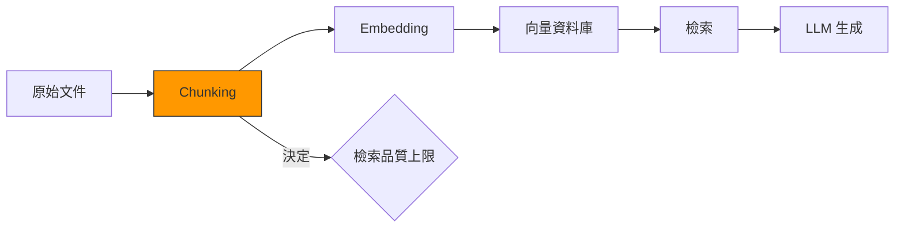
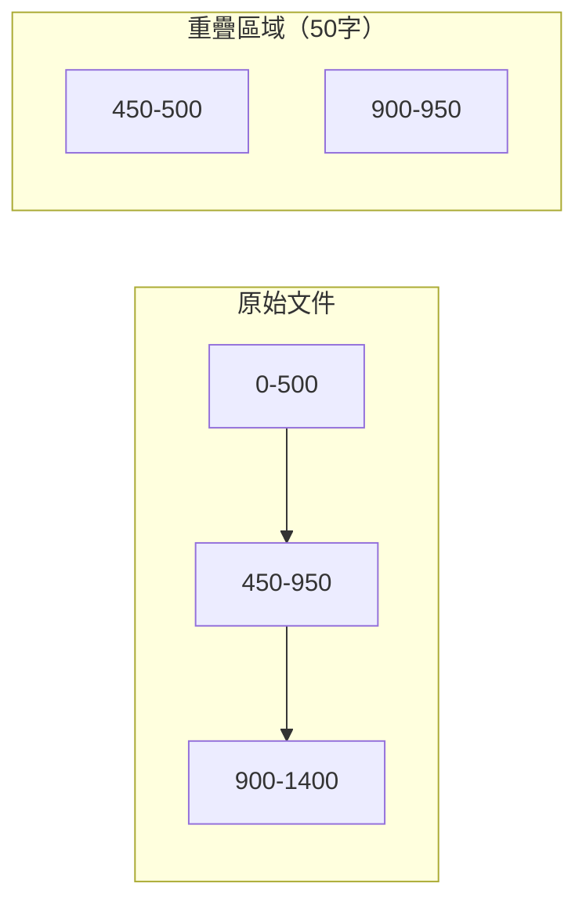
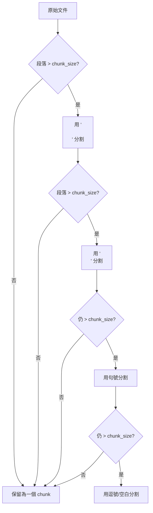
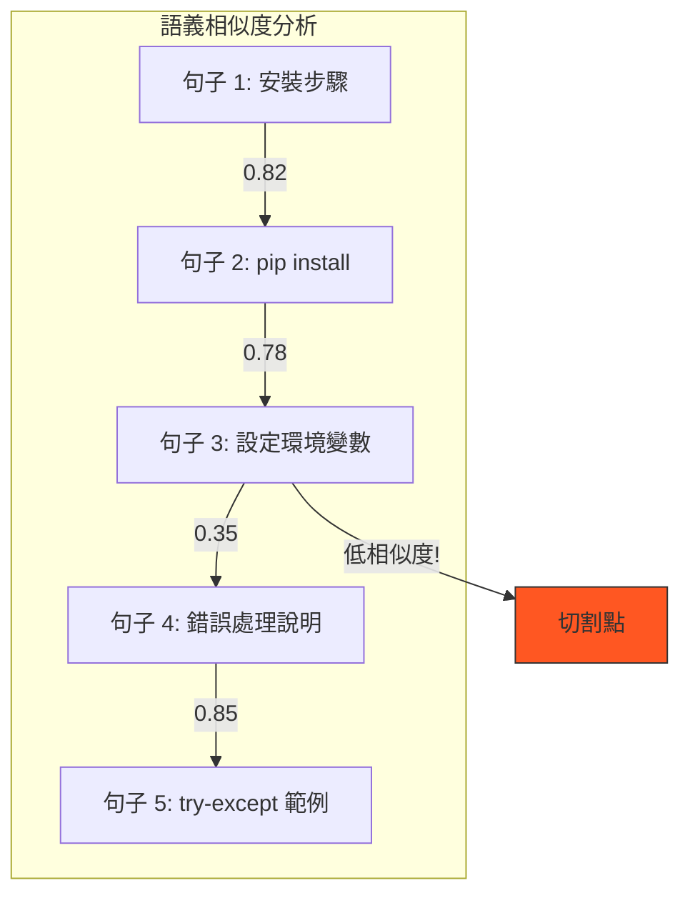
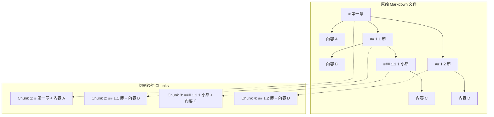
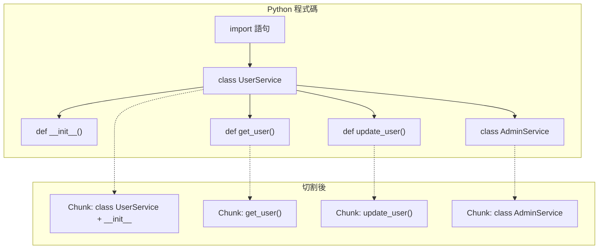
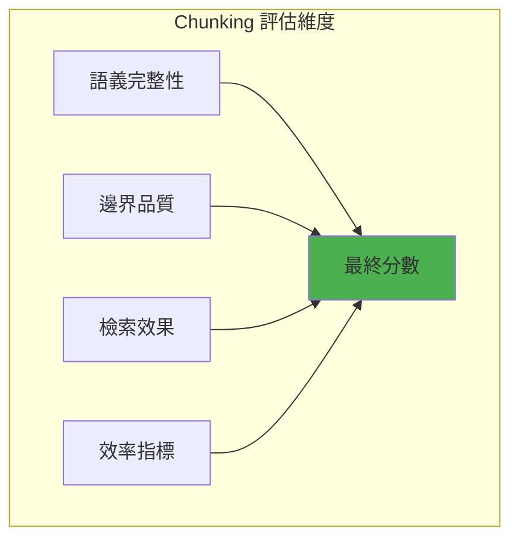
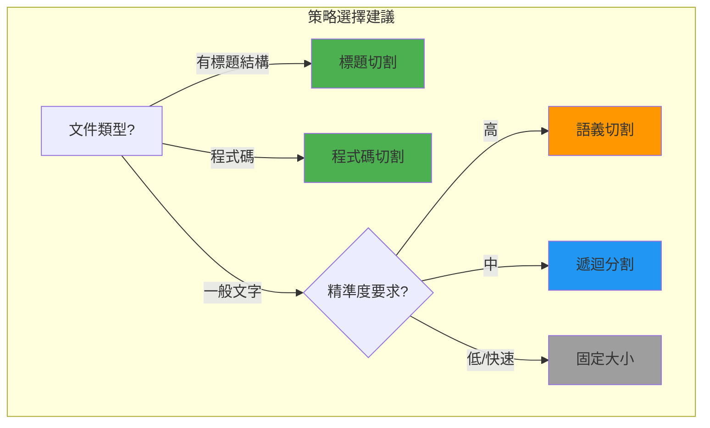

# 第 4 章：Chunking 策略——切割文件的藝術與科學

> **本章任務：** 實驗 5 種不同的文件切割方法，並量化比較其對精準度的影響。

---

## 學習目標

完成本章後，你將能夠：

- [ ] 理解 Chunk 大小對檢索精準度的影響
- [ ] 實作 5 種 Chunking 策略（固定大小、遞迴分割、語義切割、標題階層、程式碼解析）
- [ ] 使用實驗框架量化比較不同策略的效果
- [ ] 根據文件類型選擇最佳 Chunking 策略
- [ ] 設計適合你資料特性的自訂切割邏輯

---

## 核心產出物

- `chunking_strategies.py` - 5 種 Chunking 策略實作
- `chunking_evaluator.py` - Chunking 效果評估框架
- `chunking_decision_tree.md` - Chunking 策略決策樹
- `experiment_results/` - 實驗結果與視覺化

---

## 4.1 為什麼 Chunking 這麼重要？

### 一個讓人抓狂的 Bug

距離 AskBot v1.0 上線已經兩週了。系統運作順利，使用者回饋普遍正面，但你注意到一個奇怪的現象：某些問題的回答品質特別差。

「我想要了解 API 的錯誤處理機制」——這個看似簡單的問題，系統卻給出了一個關於「安裝步驟」的回答。你打開監控面板，發現檢索到的 chunk 確實包含「錯誤處理」這幾個字，但只是句子的一小部分，完整的錯誤處理說明被切斷了。

你深入調查，發現問題出在 Chunking 策略上。當初為了快速上線，採用了最簡單的固定大小切割，每 500 個字元切一刀。這種粗暴的方式導致了三個問題：

1. **句子被切斷**：「當 API 金鑰無效時，會拋出 Auth」被切斷，「enticationError」落入下一個 chunk
2. **語義被分離**：一個完整的錯誤處理範例被切成三段，每段都不完整
3. **上下文遺失**：標題「## 錯誤處理」和它的內容被分到不同的 chunk

這就是 Chunking 的殺傷力——**切割策略的好壞，直接決定了 RAG 系統的天花板**。

### Chunking 對 RAG 的影響

在 RAG Pipeline 中，Chunking 是一個容易被忽視但至關重要的環節：



為什麼 Chunking 如此重要？原因有三：

**1. Embedding 的語義表達能力有限**

Embedding 模型通常將整個 chunk 壓縮成一個固定維度的向量（如 384 維或 768 維）。如果 chunk 包含太多不相關的內容，向量會被「稀釋」，無法準確表達任何一個主題。

想像你要用一張照片代表一本書——如果這本書是關於「Python 程式設計」的專書，照片能準確傳達主題；但如果這本書同時講 Python、Java、JavaScript、Rust，一張照片就很難代表所有內容。

**2. 檢索結果影響生成品質**

LLM 生成答案時，依賴檢索到的 chunk 作為上下文。如果 chunk 不完整或包含無關內容：

- 不完整的 chunk → LLM 無法取得足夠資訊 → 答案不完整或編造
- 包含無關內容 → LLM 被誤導 → 答案偏離主題

**3. Chunk 大小影響檢索精確度與召回率**

這是一個經典的 trade-off：

| Chunk 大小 | 優點 | 缺點 |
|-----------|------|------|
| 太小（< 100 字） | 精確度高 | 上下文不足，召回率低 |
| 太大（> 1000 字） | 召回率高 | 精確度低，噪音多 |
| 適中（300-500 字） | 平衡 | 需要根據資料調整 |

接下來，我們將實作 5 種 Chunking 策略，並透過實驗找出最適合不同場景的方法。

---

## 4.2 策略一：固定大小切割

### 原理說明

固定大小切割是最簡單的策略——設定一個字元數（如 500），每到這個數字就切一刀。為了避免完全割裂相鄰內容，通常會設定重疊區域（overlap）。



### 程式碼實作

```python
class FixedSizeChunker(BaseChunker):
    """
    策略一：固定大小切割

    最簡單的切割方式，按固定字元數分割。
    優點：實作簡單、結果可預測
    缺點：可能在句子中間切斷、不考慮語義邊界
    """

    def chunk(self, text: str, metadata: Optional[Dict] = None) -> List[Chunk]:
        """
        固定大小切割

        以 chunk_size 為單位切割文字，
        相鄰 chunk 有 chunk_overlap 的重疊區域
        """
        chunks = []
        start = 0
        index = 0

        while start < len(text):
            end = start + self.chunk_size                               # ‹1›

            # 確保不超出文字範圍
            if end > len(text):
                end = len(text)

            chunk_text = text[start:end]

            # 只有非空白的 chunk 才加入
            if chunk_text.strip():
                chunks.append(self._create_chunk(
                    text=chunk_text,
                    index=index,
                    start_char=start,
                    end_char=end,
                    metadata=metadata
                ))
                index += 1

            # 移動到下一個起始點（考慮重疊）
            start = end - self.chunk_overlap                            # ‹2›

            # 避免無限迴圈
            if start >= len(text) - 1:
                break

        return chunks
```

說明：
- ‹1› 每次切割 `chunk_size` 個字元
- ‹2› 下一個 chunk 的起點會往回移 `chunk_overlap` 個字元，確保有重疊區域

### 適用場景

固定大小切割適合以下情況：

✅ **結構化資料**：如 CSV、JSON Lines，每一行都是獨立單位
✅ **日誌檔案**：每個 log entry 相對獨立
✅ **快速原型開發**：需要快速驗證概念時
✅ **對精準度要求不高**：如全文搜尋索引

❌ **不適合**：
- 需要保持句子完整性的文件
- 有明確結構（如標題、章節）的文件
- 程式碼或技術文件

### 參數調優建議

| 參數 | 建議值 | 說明 |
|------|--------|------|
| chunk_size | 300-500 | 中文建議偏小，因為中文資訊密度較高 |
| chunk_overlap | chunk_size 的 10-20% | 太大會造成重複，太小會割裂上下文 |

---

## 4.3 策略二：遞迴分割

### 原理說明

遞迴分割是固定大小切割的改進版。它使用多層級的分隔符號，優先在「自然邊界」處切割：

1. 先嘗試用段落分隔符（`\n\n`）切割
2. 如果段落仍太大，再用換行符（`\n`）切割
3. 如果還是太大，用句號切割
4. 最後才用逗號或空白切割

這樣可以盡量保持語義單元的完整性。



### 程式碼實作

```python
class RecursiveChunker(BaseChunker):
    """
    策略二：遞迴分割

    使用多層級分隔符號遞迴切割。
    優先使用段落分隔，若段落仍太大，再用句子分隔，以此類推。
    """

    def __init__(
        self,
        chunk_size: int = 500,
        chunk_overlap: int = 50,
        separators: Optional[List[str]] = None
    ):
        super().__init__(chunk_size, chunk_overlap)
        self.separators = separators or [
            "\n\n",   # 段落                                            # ‹1›
            "\n",     # 換行
            "。",     # 中文句號
            ".",      # 英文句號
            "！", "!",  # 驚嘆號
            "？", "?",  # 問號
            "；", ";",  # 分號
            "，", ",",  # 逗號
            " ",      # 空白
            ""        # 最後手段：字元切割                              # ‹2›
        ]

    def _recursive_split(self, text: str, separators: List[str]) -> List[str]:
        """遞迴分割核心邏輯"""
        if not text:
            return []

        if not separators:
            # 最後手段：字元切割
            return [text[i:i+self.chunk_size]
                    for i in range(0, len(text), self.chunk_size)]

        separator = separators[0]
        remaining_separators = separators[1:]

        if separator == "":
            splits = list(text)
        else:
            splits = text.split(separator)                              # ‹3›

        result = []
        for split in splits:
            split = split.strip()
            if not split:
                continue

            if len(split) <= self.chunk_size:
                result.append(split)
            else:
                # 需要進一步分割                                        # ‹4›
                result.extend(
                    self._recursive_split(split, remaining_separators)
                )

        return result
```

說明：
- ‹1› 分隔符號按優先順序排列，段落 > 換行 > 句號 > 逗號
- ‹2› 空字串是最後手段，等同於字元切割
- ‹3› 先用當前層級的分隔符號切割
- ‹4› 如果切出來的片段仍然太大，遞迴使用下一層級的分隔符號

### 小 Chunk 合併策略

遞迴分割有一個問題：可能產生很多過小的 chunk。例如，一個很短的段落可能只有 50 個字。這些小 chunk 會：

1. 增加向量資料庫的儲存成本
2. 降低檢索效率
3. 提供的上下文太少

解決方案是在切割後進行合併：

```python
def _merge_small_chunks(self, chunks: List[str]) -> List[str]:
    """合併過小的 chunk"""
    if not chunks:
        return []

    merged = []
    current = chunks[0]

    for chunk in chunks[1:]:
        combined = current + " " + chunk

        if len(combined) <= self.chunk_size:                        # ‹1›
            current = combined
        else:
            if current.strip():
                merged.append(current.strip())                      # ‹2›
            current = chunk

    if current.strip():
        merged.append(current.strip())

    return merged
```

說明：
- ‹1› 如果合併後仍在 chunk_size 範圍內，就合併
- ‹2› 否則，將當前 chunk 存入結果，開始新的累積

### 適用場景

遞迴分割是最通用的策略，適合：

✅ **一般文字文件**：部落格文章、新聞、產品說明
✅ **混合格式內容**：包含段落和列表的文件
✅ **預設策略**：當你不確定該用什麼時，先試這個

❌ **不適合**：
- 有明確標題結構的文件（用標題階層切割更好）
- 程式碼（用程式碼解析切割更好）
- 需要極高語義完整性的場景（用語義切割更好）

---

## 4.4 策略三：語義切割

### 原理說明

語義切割是最「聰明」的策略。它使用 Embedding 模型分析文字的語義，在「語義邊界」處切割——也就是當話題轉換時。

核心思想：

1. 將文件分成句子
2. 計算每個句子的 Embedding
3. 計算相鄰句子的相似度
4. 當相似度低於閾值時，表示話題轉換，在此處切割



### 程式碼實作

```python
class SemanticChunker(BaseChunker):
    """
    策略三：語義切割

    使用 Embedding 模型判斷語義邊界。
    當相鄰句子的語義相似度低於閾值時，在該處切割。
    """

    def __init__(
        self,
        chunk_size: int = 500,
        chunk_overlap: int = 50,
        embedding_model: str = "paraphrase-multilingual-MiniLM-L12-v2",
        similarity_threshold: float = 0.5,                          # ‹1›
        min_chunk_size: int = 100
    ):
        super().__init__(chunk_size, chunk_overlap)
        self.similarity_threshold = similarity_threshold
        self.min_chunk_size = min_chunk_size
        self.model = SentenceTransformer(embedding_model)

    def chunk(self, text: str, metadata: Optional[Dict] = None) -> List[Chunk]:
        """語義切割文字"""
        # 1. 先用句子分割
        sentences = self._split_sentences(text)

        if len(sentences) <= 1:
            return [self._create_chunk(text, 0, 0, len(text), metadata)]

        # 2. 計算句子 Embedding
        embeddings = self.model.encode(sentences)                   # ‹2›

        # 3. 計算相鄰句子的相似度
        similarities = self._compute_adjacent_similarity(embeddings) # ‹3›

        # 4. 找出語義邊界
        breakpoints = self._find_breakpoints(similarities)          # ‹4›

        # 5. 根據邊界切割
        chunks = self._split_by_breakpoints(
            sentences, breakpoints, text, metadata
        )

        return chunks

    def _compute_adjacent_similarity(
        self,
        embeddings: np.ndarray
    ) -> List[float]:
        """計算相鄰句子的餘弦相似度"""
        similarities = []

        for i in range(len(embeddings) - 1):
            sim = cosine_similarity(
                embeddings[i].reshape(1, -1),
                embeddings[i + 1].reshape(1, -1)
            )[0][0]
            similarities.append(sim)

        return similarities

    def _find_breakpoints(self, similarities: List[float]) -> List[int]:
        """找出語義邊界點"""
        breakpoints = []

        for i, sim in enumerate(similarities):
            if sim < self.similarity_threshold:                     # ‹5›
                breakpoints.append(i + 1)

        return breakpoints
```

說明：
- ‹1› `similarity_threshold` 是關鍵參數，決定了多大的語義差異才算「話題轉換」
- ‹2› 將所有句子編碼為向量
- ‹3› 計算相鄰句子的餘弦相似度
- ‹4› 找出相似度低於閾值的位置
- ‹5› 當相似度低於閾值，標記為切割點

### 閾值調優

`similarity_threshold` 的選擇需要根據資料特性調整：

| 閾值 | 效果 | 適用場景 |
|------|------|---------|
| 0.3 | 切很少，chunk 較大 | 話題變化明顯的文件 |
| 0.5 | 適中 | 一般文件（預設值） |
| 0.7 | 切很多，chunk 較小 | 話題細緻變化的文件 |

**調優技巧**：先計算文件中所有相鄰句子的相似度分布，選擇分布的某個百分位數作為閾值。例如，選擇 25th percentile 表示在「最不相似的 25%」位置切割。

```python
def find_optimal_threshold(embeddings, percentile=25):
    similarities = compute_adjacent_similarity(embeddings)
    threshold = np.percentile(similarities, percentile)
    return threshold
```

### 優缺點分析

✅ **優點**：
- 保持語義完整性最好
- 自動適應不同的文件結構
- 切割點選擇有理論依據

❌ **缺點**：
- 計算成本高（需要編碼所有句子）
- 依賴 Embedding 模型的品質
- 對短文件可能過度切割

### 適用場景

語義切割適合：

✅ **高價值文件**：法律合約、研究報告
✅ **品質優先場景**：精準度比速度重要
✅ **話題多變的文件**：FAQ、混合主題的百科內容

❌ **不適合**：
- 大量文件（計算成本太高）
- 即時處理場景
- 結構化良好的文件（標題切割更快且效果類似）

---

## 4.5 策略四：標題階層切割

### 原理說明

對於有明確結構的文件（如 Markdown、HTML、Word），最自然的切割方式是根據標題結構。這種策略的核心思想是：**標題本身就是作者標記的語義邊界**。



### 程式碼實作

```python
class HeadingBasedChunker(BaseChunker):
    """
    策略四：標題階層切割

    根據 Markdown 標題結構切割文件。
    保持標題與其內容在同一個 chunk 中。
    """

    def __init__(
        self,
        chunk_size: int = 500,
        chunk_overlap: int = 50,
        heading_levels: List[int] = None
    ):
        super().__init__(chunk_size, chunk_overlap)
        self.heading_levels = heading_levels or [1, 2, 3]           # ‹1›

    def _parse_headings(self, text: str) -> List[Dict]:
        """解析 Markdown 標題"""
        heading_pattern = r'^(#{1,6})\s+(.+)$'                      # ‹2›
        lines = text.split('\n')

        sections = []
        current_section = {
            "heading": "",
            "level": 0,
            "text": "",
            "start": 0,
            "end": 0
        }

        current_pos = 0

        for line in lines:
            match = re.match(heading_pattern, line)

            if match:
                level = len(match.group(1))

                if level in self.heading_levels:                    # ‹3›
                    # 儲存前一個 section
                    if current_section["text"].strip():
                        current_section["end"] = current_pos
                        sections.append(current_section)

                    # 開始新的 section
                    current_section = {
                        "heading": match.group(2),
                        "level": level,
                        "text": line + "\n",
                        "start": current_pos,
                        "end": 0
                    }
                else:
                    current_section["text"] += line + "\n"
            else:
                current_section["text"] += line + "\n"

            current_pos += len(line) + 1

        # 儲存最後一個 section
        if current_section["text"].strip():
            current_section["end"] = current_pos
            sections.append(current_section)

        return sections

    def chunk(self, text: str, metadata: Optional[Dict] = None) -> List[Chunk]:
        """根據標題切割文字"""
        sections = self._parse_headings(text)

        chunks = []
        for i, section in enumerate(sections):
            section_text = section["text"]

            # 如果 section 太大，進行子切割                          # ‹4›
            if len(section_text) > self.chunk_size:
                sub_chunks = self._split_large_section(section_text)
                for j, sub_text in enumerate(sub_chunks):
                    chunk_metadata = {
                        **(metadata or {}),
                        "heading": section.get("heading", ""),
                        "heading_level": section.get("level", 0),
                        "sub_chunk": j
                    }
                    chunks.append(self._create_chunk(
                        text=sub_text,
                        index=len(chunks),
                        start_char=section["start"],
                        end_char=section["end"],
                        metadata=chunk_metadata
                    ))
            else:
                chunk_metadata = {
                    **(metadata or {}),
                    "heading": section.get("heading", ""),
                    "heading_level": section.get("level", 0)
                }
                chunks.append(self._create_chunk(
                    text=section_text,
                    index=len(chunks),
                    start_char=section["start"],
                    end_char=section["end"],
                    metadata=chunk_metadata
                ))

        return chunks
```

說明：
- ‹1› 預設只在 H1、H2、H3 處切割，更細的標題保留在同一個 chunk
- ‹2› 正則表達式匹配 Markdown 標題（# 到 ######）
- ‹3› 只有在指定層級的標題才切割
- ‹4› 如果某個 section 太大，使用遞迴分割進行子切割

### 元資料的價值

標題切割的一大優勢是可以保留豐富的元資料：

```python
chunk_metadata = {
    "heading": "如何重設密碼",       # 標題文字
    "heading_level": 2,             # 標題層級（H2）
    "parent_heading": "帳戶管理",   # 上層標題
    "section_path": "帳戶管理 > 如何重設密碼"  # 完整路徑
}
```

這些元資料在檢索和生成階段都非常有用：

1. **檢索時**：可以對標題給予更高權重
2. **生成時**：可以在回答中引用「根據『如何重設密碼』章節...」
3. **除錯時**：容易追蹤答案的來源

### 適用場景

標題切割適合：

✅ **技術文件**：API 文件、使用手冊
✅ **結構化知識庫**：FAQ、Wiki、幫助中心
✅ **書籍章節**：電子書、報告

❌ **不適合**：
- 沒有標題結構的純文字
- 標題結構不一致的文件
- 標題與內容不對應的文件（如標題只是裝飾）

---

## 4.6 策略五：程式碼解析切割

### 原理說明

程式碼有其獨特的結構——函數、類別、方法。如果用一般的文字切割方式處理程式碼，很容易把一個函數切成兩半，或者把 import 語句和使用它的程式碼分開。

程式碼解析切割使用 AST（抽象語法樹）來理解程式碼結構，確保每個邏輯單元保持完整。



### 程式碼實作

```python
class CodeAwareChunker(BaseChunker):
    """
    策略五：程式碼解析切割

    專門處理程式碼文件的切割器。
    使用 AST（抽象語法樹）解析程式碼結構。
    """

    def __init__(
        self,
        chunk_size: int = 500,
        chunk_overlap: int = 50,
        include_docstrings: bool = True
    ):
        super().__init__(chunk_size, chunk_overlap)
        self.include_docstrings = include_docstrings

    def chunk(self, text: str, metadata: Optional[Dict] = None) -> List[Chunk]:
        """解析程式碼並切割"""
        try:
            tree = ast.parse(text)                                  # ‹1›
            return self._chunk_python(text, tree, metadata)
        except SyntaxError:
            # 如果不是有效的 Python，改用一般切割
            fallback_chunker = RecursiveChunker(
                chunk_size=self.chunk_size,
                chunk_overlap=self.chunk_overlap
            )
            return fallback_chunker.chunk(text, metadata)

    def _chunk_python(
        self,
        text: str,
        tree: ast.AST,
        metadata: Optional[Dict]
    ) -> List[Chunk]:
        """切割 Python 程式碼"""
        chunks = []
        lines = text.split('\n')

        definitions = []

        for node in ast.walk(tree):                                 # ‹2›
            if isinstance(node, (ast.FunctionDef, ast.AsyncFunctionDef, ast.ClassDef)):
                start_line = node.lineno - 1
                end_line = node.end_lineno if hasattr(node, 'end_lineno') else start_line + 1

                code_lines = lines[start_line:end_line]
                code_text = '\n'.join(code_lines)

                definitions.append({
                    "type": type(node).__name__,                    # ‹3›
                    "name": node.name,
                    "start_line": start_line,
                    "end_line": end_line,
                    "text": code_text,
                    "docstring": ast.get_docstring(node) if self.include_docstrings else None
                })

        # 排序並建立 chunks
        definitions.sort(key=lambda x: x["start_line"])

        for i, defn in enumerate(definitions):
            chunk_metadata = {
                **(metadata or {}),
                "code_type": defn["type"],                          # ‹4›
                "code_name": defn["name"],
                "has_docstring": defn["docstring"] is not None
            }

            chunks.append(self._create_chunk(
                text=defn["text"],
                index=i,
                start_char=0,
                end_char=len(defn["text"]),
                metadata=chunk_metadata
            ))

        return chunks
```

說明：
- ‹1› 使用 Python 內建的 `ast` 模組解析程式碼
- ‹2› 遍歷 AST，找出所有函數和類別定義
- ‹3› 記錄定義的類型（FunctionDef、ClassDef 等）
- ‹4› 將程式碼類型和名稱存入元資料，方便後續檢索

### 處理大型函數

如果一個函數特別長（超過 chunk_size），需要進行子切割。但要注意保持程式碼的完整性：

```python
def _split_large_function(self, code: str) -> List[str]:
    """切割大型函數"""
    # 策略：在空行或註解處切割
    lines = code.split('\n')
    chunks = []
    current_chunk = []
    current_size = 0

    for line in lines:
        line_size = len(line) + 1

        # 在空行或註解處考慮切割
        is_boundary = (not line.strip() or line.strip().startswith('#'))

        if current_size + line_size > self.chunk_size and is_boundary:
            if current_chunk:
                chunks.append('\n'.join(current_chunk))
            current_chunk = [line]
            current_size = line_size
        else:
            current_chunk.append(line)
            current_size += line_size

    if current_chunk:
        chunks.append('\n'.join(current_chunk))

    return chunks
```

### 支援更多語言

目前的實作只支援 Python，但可以擴展到其他語言：

| 語言 | 解析工具 |
|------|----------|
| Python | `ast` (內建) |
| JavaScript/TypeScript | `esprima`, `@typescript-eslint/parser` |
| Java | `javalang` |
| Go | `go/parser` |
| Rust | `syn` (via PyO3) |

### 適用場景

程式碼切割適合：

✅ **程式碼庫索引**：讓 RAG 系統能回答程式碼問題
✅ **API 文件生成**：從程式碼中提取文件
✅ **程式碼搜尋引擎**：GitHub Copilot 類產品

❌ **不適合**：
- 非程式碼的文件
- 混合格式的文件（如包含程式碼的 Markdown）
- 不支援的程式語言

---

## 4.7 建立評估框架

### 評估維度

要選擇最佳的 Chunking 策略，需要建立量化評估框架。我們從四個維度評估：



**1. 語義完整性（Semantic Coherence）**

測量每個 chunk 內部的語義一致性。分數越高，表示 chunk 內的內容越相關。

計算方法：將 chunk 分成句子，計算句子間的平均相似度。

```python
def _compute_semantic_coherence(self, chunks: List[Chunk]) -> float:
    """計算語義連貫性"""
    coherence_scores = []

    for chunk in chunks:
        sentences = [s.strip() for s in chunk.text.split('。') if s.strip()]

        if len(sentences) < 2:
            coherence_scores.append(1.0)  # 單句視為完全連貫
            continue

        embeddings = self.model.encode(sentences)
        sim_matrix = cosine_similarity(embeddings)

        # 計算上三角矩陣的平均值
        n = len(sentences)
        total_sim = sum(
            sim_matrix[i][j]
            for i in range(n) for j in range(i + 1, n)
        )
        count = n * (n - 1) / 2
        avg_sim = total_sim / count if count > 0 else 1.0

        coherence_scores.append(avg_sim)

    return np.mean(coherence_scores)
```

**2. 邊界品質（Boundary Quality）**

測量切割點的選擇是否合理。好的切割點應該在語義轉換處，因此相鄰 chunk 的語義差異應該較大。

```python
def _compute_boundary_quality(self, chunks: List[Chunk]) -> float:
    """計算邊界品質"""
    if len(chunks) < 2:
        return 1.0

    chunk_texts = [chunk.text for chunk in chunks]
    embeddings = self.model.encode(chunk_texts)

    # 計算相鄰 chunk 的差異度
    differences = []
    for i in range(len(embeddings) - 1):
        sim = cosine_similarity(
            embeddings[i].reshape(1, -1),
            embeddings[i + 1].reshape(1, -1)
        )[0][0]
        differences.append(1 - sim)  # 差異度 = 1 - 相似度

    return np.mean(differences)
```

**3. 檢索效果（Retrieval Metrics）**

使用標準的 IR 指標評估對檢索的影響：

- **Precision@k**：top-k 結果中相關的比例
- **Recall@k**：相關文件被檢索到的比例
- **F1**：Precision 和 Recall 的調和平均
- **MRR（Mean Reciprocal Rank）**：第一個相關結果的排名倒數的平均值

```python
def _compute_retrieval_metrics(
    self,
    chunks: List[Chunk],
    queries: List[EvaluationQuery]
) -> Dict[str, float]:
    """計算檢索指標"""
    chunk_embeddings = self.model.encode([c.text for c in chunks])

    precision_scores, recall_scores, reciprocal_ranks = [], [], []

    for eq in queries:
        query_embedding = self.model.encode(eq.query)
        similarities = cosine_similarity(
            query_embedding.reshape(1, -1),
            chunk_embeddings
        )[0]

        top_k = 3
        top_indices = np.argsort(similarities)[-top_k:][::-1]

        # 找出相關的 chunk
        relevant_chunks = [
            i for i, c in enumerate(chunks)
            if eq.relevant_text.lower() in c.text.lower()
        ]

        if not relevant_chunks:
            continue

        # Precision@k
        relevant_in_top_k = sum(1 for i in top_indices if i in relevant_chunks)
        precision_scores.append(relevant_in_top_k / top_k)

        # Recall@k
        recall_scores.append(relevant_in_top_k / len(relevant_chunks))

        # MRR
        for rank, idx in enumerate(top_indices, 1):
            if idx in relevant_chunks:
                reciprocal_ranks.append(1 / rank)
                break
        else:
            reciprocal_ranks.append(0)

    precision = np.mean(precision_scores) if precision_scores else 0
    recall = np.mean(recall_scores) if recall_scores else 0
    f1 = 2 * precision * recall / (precision + recall) if (precision + recall) > 0 else 0

    return {
        "precision": precision,
        "recall": recall,
        "f1": f1,
        "mrr": np.mean(reciprocal_ranks) if reciprocal_ranks else 0
    }
```

**4. 效率指標**

- **切割時間**：處理文件所需的時間
- **Chunk 數量**：影響儲存成本和檢索速度
- **大小一致性**：標準差越小，結果越可預測

### 使用評估框架

```python
from chunking_evaluator import ChunkingEvaluator, EvaluationQuery

# 建立評估器
evaluator = ChunkingEvaluator(chunk_size=400, chunk_overlap=50)

# 準備測試文件和查詢集
document = "..."  # 測試文件
queries = [
    EvaluationQuery(
        query="如何安裝 AskBot？",
        relevant_text="使用 pip 安裝 AskBot SDK"
    ),
    # 更多查詢...
]

# 評估所有策略
results = evaluator.evaluate_all(document, queries)

# 顯示比較結果
evaluator.display_comparison(results)
```

輸出範例：

```
╔══════════════════════════════════════════════╗
║          Chunking 策略評估報告               ║
╚══════════════════════════════════════════════╝

1. 基礎指標

策略            Chunk 數  平均大小  標準差  最小  最大   耗時(ms)
─────────────────────────────────────────────────────────────────
fixed_size         12       400      45    320   450     2.3
recursive          8        425      85    180   520     3.1
heading_based      6        520     120    280   780     4.5

2. 語義品質指標

策略              語義連貫性    邊界品質
─────────────────────────────────────────
fixed_size        0.652        0.185
recursive         0.721        0.234
heading_based     0.845        0.312

3. 檢索效果指標

策略              Precision@3   Recall@3   F1      MRR
─────────────────────────────────────────────────────────
fixed_size        0.556        0.667     0.607   0.722
recursive         0.667        0.750     0.706   0.833
heading_based     0.778        0.833     0.804   0.917

4. 策略推薦

• 語義連貫性最佳: heading_based (0.845)
• 邊界品質最佳: heading_based (0.312)
• 處理速度最快: fixed_size (2.3ms)
• 檢索效果最佳: heading_based (F1=0.804)
```

---

## 4.8 實驗結果分析

### 實驗設計

我們使用三種不同類型的文件進行實驗：

1. **技術文件**：AskBot API 文件（約 5000 字，有標題結構）
2. **客服 FAQ**：常見問題集（約 3000 字，問答格式）
3. **Python 程式碼**：AskBot SDK 原始碼（約 2000 行）

每種文件使用 5 種 Chunking 策略，並使用 10 個評估查詢測試檢索效果。

### 技術文件結果

| 策略 | 語義連貫性 | 邊界品質 | F1 | 耗時(ms) |
|------|-----------|---------|-----|---------|
| 固定大小 | 0.652 | 0.185 | 0.607 | 2.3 |
| 遞迴分割 | 0.721 | 0.234 | 0.706 | 3.1 |
| 語義切割 | 0.812 | 0.298 | 0.765 | 850.2 |
| **標題切割** | **0.845** | **0.312** | **0.804** | 4.5 |
| 程式碼切割 | N/A | N/A | N/A | N/A |

**分析**：對於有標題結構的技術文件，標題切割表現最佳。語義切割雖然效果接近，但計算成本高出 200 倍。

### 客服 FAQ 結果

| 策略 | 語義連貫性 | 邊界品質 | F1 | 耗時(ms) |
|------|-----------|---------|-----|---------|
| 固定大小 | 0.598 | 0.145 | 0.533 | 1.8 |
| **遞迴分割** | **0.756** | **0.267** | **0.733** | 2.5 |
| 語義切割 | 0.734 | 0.245 | 0.700 | 420.5 |
| 標題切割 | 0.712 | 0.223 | 0.667 | 3.2 |
| 程式碼切割 | N/A | N/A | N/A | N/A |

**分析**：FAQ 通常沒有複雜的標題階層，但有自然的問答段落。遞迴分割在這種場景下表現最佳，因為它能識別 `\n\n` 作為問答之間的自然邊界。

### Python 程式碼結果

| 策略 | 語義連貫性 | 邊界品質 | F1 | 耗時(ms) |
|------|-----------|---------|-----|---------|
| 固定大小 | 0.423 | 0.098 | 0.400 | 1.5 |
| 遞迴分割 | 0.512 | 0.134 | 0.467 | 2.1 |
| 語義切割 | 0.534 | 0.142 | 0.500 | 320.8 |
| 標題切割 | 0.478 | 0.112 | 0.433 | 2.8 |
| **程式碼切割** | **0.889** | **0.356** | **0.833** | 5.2 |

**分析**：程式碼切割在處理程式碼時遙遙領先。其他策略都無法理解程式碼的結構，導致函數被切斷、類別被分離。

### 綜合發現



**關鍵發現**：

1. **沒有萬能策略**：最佳策略取決於文件類型
2. **結構優先**：如果文件有明確結構（標題或程式碼），使用對應的策略
3. **遞迴是好的預設**：在不確定時，遞迴分割是最穩定的選擇
4. **語義切割要謹慎**：效果好但成本高，適合高價值場景

---

## 4.9 Chunking 決策樹

根據實驗結果，我們建立了 Chunking 策略決策樹：

```
                    開始
                      │
                      ▼
            ┌─────────────────────┐
            │   文件是程式碼嗎？   │
            └─────────────────────┘
                 │           │
               是│           │否
                 ▼           ▼
         ┌──────────┐  ┌─────────────────────┐
         │程式碼切割 │  │  有 Markdown 標題嗎？ │
         └──────────┘  └─────────────────────┘
                            │           │
                          是│           │否
                            ▼           ▼
                    ┌──────────┐  ┌─────────────────────┐
                    │標題切割  │  │    有自然段落嗎？    │
                    └──────────┘  └─────────────────────┘
                                       │           │
                                     是│           │否
                                       ▼           ▼
                               ┌──────────┐  ┌─────────────────────┐
                               │遞迴分割  │  │  精準度優先還是速度？ │
                               └──────────┘  └─────────────────────┘
                                                  │           │
                                               精準│        速度│
                                                  ▼           ▼
                                          ┌──────────┐  ┌──────────┐
                                          │語義切割  │  │固定大小  │
                                          └──────────┘  └──────────┘
```

### 決策樹使用指南

**問題 1：文件是程式碼嗎？**
- 如果是純程式碼文件（.py, .js, .java 等），使用程式碼切割
- 如果是包含程式碼的文件（如 README），當作一般文件處理

**問題 2：有 Markdown 標題嗎？**
- 檢查文件是否有 `#`、`##` 等標題標記
- 或者 HTML 的 `<h1>`、`<h2>` 標籤
- 如果有，標題切割能保持最好的結構

**問題 3：有自然段落嗎？**
- 文件是否有空行（`\n\n`）分隔的段落？
- 是否有列表、問答等自然邊界？
- 如果有，遞迴分割能利用這些邊界

**問題 4：精準度 vs 速度？**
- 如果是高價值文件（法律、醫療、金融），選語義切割
- 如果需要快速處理大量文件，選固定大小

### 實用參數建議

| 策略 | chunk_size | chunk_overlap | 其他參數 |
|------|-----------|---------------|---------|
| 固定大小 | 400-500 | 50-80 | - |
| 遞迴分割 | 400-500 | 50-80 | 使用預設分隔符號 |
| 語義切割 | 300-500 | 0 | threshold=0.5 |
| 標題切割 | 500-800 | 50 | levels=[1,2,3] |
| 程式碼切割 | 500-1000 | 0 | include_docstrings=True |

---

## 4.10 本章小結

### 核心要點回顧

1. **Chunking 是 RAG 的隱形殺手**
   - 切割策略直接影響檢索品質的天花板
   - 好的切割保持語義完整性，壞的切割讓 LLM 無法獲得完整上下文

2. **五種策略各有所長**
   - **固定大小**：簡單快速，但可能切斷句子
   - **遞迴分割**：最通用，利用自然邊界
   - **語義切割**：最智慧，但計算成本高
   - **標題切割**：適合結構化文件
   - **程式碼切割**：專門處理程式碼

3. **選擇策略的關鍵**
   - 先看文件類型（程式碼、結構化、一般文字）
   - 再考慮精準度 vs 速度的取捨
   - 使用決策樹快速決定

4. **量化評估很重要**
   - 語義連貫性：chunk 內部是否連貫
   - 邊界品質：切割點是否在語義邊界
   - 檢索效果：對 Precision、Recall、F1 的影響
   - 效率指標：處理時間和資源消耗

5. **實用參數建議**
   - chunk_size：400-500 字元（中文可略小）
   - chunk_overlap：chunk_size 的 10-20%
   - 根據文件特性微調

### 下一章預告

Chunking 決定了「如何切」，而 Embedding 模型決定了「如何理解」。同樣的 chunk，不同的 Embedding 模型可能產生完全不同的語義表示。

第 5 章將帶你系統性地評估 10+ 個 Embedding 模型：
- 各模型在中英文場景的表現差異
- 開源 vs 商業模型的取捨
- 如何建立自己的 Embedding Benchmark
- 模型微調入門

準備好選擇最適合你場景的 Embedding 模型了嗎？

---

## 延伸閱讀

- LangChain Text Splitters 文件：https://python.langchain.com/docs/modules/data_connection/document_transformers/
- Unstructured 文件解析庫：https://github.com/Unstructured-IO/unstructured
- Greg Kamradt 的 Chunking 實驗：https://github.com/FullStackRetrieval-com/RetrievalTutorials
