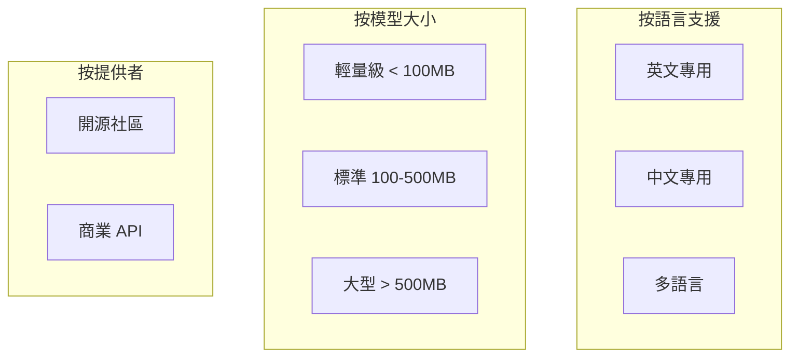
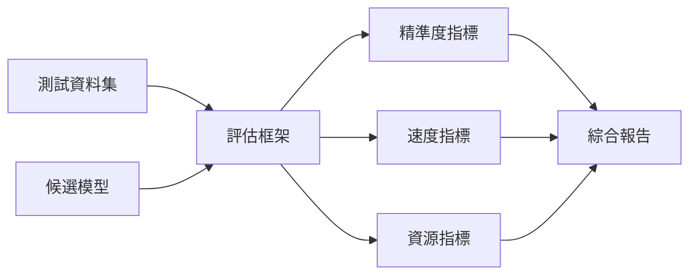
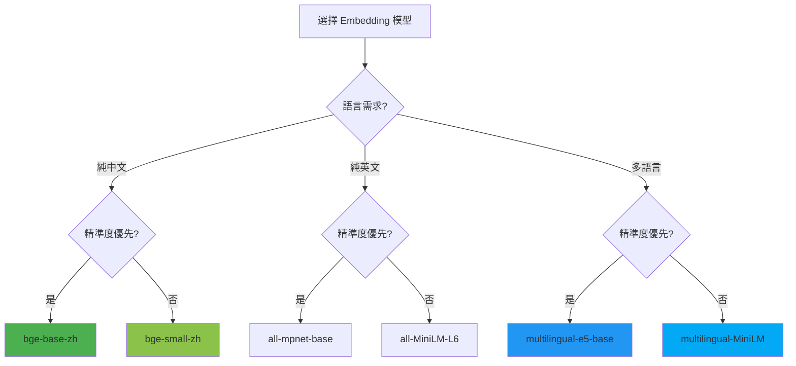

# 第 5 章：Embedding 模型選型——不是越大越好

> **本章任務：** 在真實資料集上評估 10 個 Embedding 模型，找出「性價比之王」。

---

## 學習目標

完成本章後，你將能夠：

- [ ] 建立標準化的 Embedding 模型評估流程
- [ ] 理解精準度、速度、成本的三角權衡
- [ ] 量化比較不同模型在你的資料集上的表現
- [ ] 根據業務需求選擇最適合的模型
- [ ] 理解何時需要 Fine-tune 自己的 Embedding 模型

---

## 核心產出物

- `embedding_benchmark.py` - 模型評估框架
- `model_metrics.py` - 評估指標定義
- `benchmark_results/` - 10 個模型的評估報告
- `model_selection_guide.md` - 模型選擇指南

---

## 5.1 Embedding 模型生態系統概覽

### 一個意想不到的性能瓶頸

AskBot v1.0 上線一個月後，你收到了一個投訴：「為什麼系統對英文問題回答得很好，但中文問題常常文不對題？」

你重新審視系統配置，發現問題出在 Embedding 模型的選擇上。當初為了快速上線，選擇了文件中推薦的 `all-MiniLM-L6-v2`——一個只支援英文的模型。它在英文場景表現出色，但遇到中文就「詞彙表外」，只能把中文字元當作未知 token 處理。

這個經歷讓你意識到：**Embedding 模型的選擇不是「選最有名的」那麼簡單**。

### 模型分類

當今的 Embedding 模型可以從多個維度分類：



**1. 按語言支援**

| 類型 | 代表模型 | 適用場景 |
|------|---------|---------|
| 英文專用 | all-MiniLM-L6-v2, all-mpnet-base-v2 | 純英文系統 |
| 中文專用 | BGE-small-zh, text2vec-chinese | 純中文系統 |
| 多語言 | multilingual-e5-base, mxbai-embed-large | 多語言或混合語言 |

**2. 按模型大小**

| 級別 | 參數量 | 向量維度 | 典型速度 | 適用場景 |
|------|--------|---------|---------|---------|
| 輕量級 | 20-50M | 384 | 快 | 即時檢索、邊緣設備 |
| 標準 | 100-200M | 768 | 中 | 一般企業應用 |
| 大型 | 300M+ | 1024+ | 慢 | 精準度優先場景 |

**3. 按提供者**

| 提供者 | 優點 | 缺點 | 代表 |
|-------|------|------|------|
| 開源社區 | 免費、可本地部署、可自訂 | 需要自行維護 | Sentence Transformers |
| 商業 API | 效果好、無需維護 | 成本、延遲、資料隱私 | OpenAI, Cohere, Voyage |

### 主流模型一覽

截至 2024 年，以下是最常用的 Embedding 模型：

**開源模型**

```
┌────────────────────────────────────────────────────────────────┐
│                    Sentence Transformers 系列                   │
├────────────────────────────────────────────────────────────────┤
│ all-MiniLM-L6-v2      │ 384 維 │ 英文 │ 速度最快              │
│ all-MiniLM-L12-v2     │ 384 維 │ 英文 │ 精度略高              │
│ all-mpnet-base-v2     │ 768 維 │ 英文 │ 通用最佳              │
│ multi-qa-mpnet-base   │ 768 維 │ 英文 │ 問答優化              │
├────────────────────────────────────────────────────────────────┤
│                       多語言系列                                │
├────────────────────────────────────────────────────────────────┤
│ paraphrase-multilingual-MiniLM-L12-v2 │ 384 維 │ 50+ 語言     │
│ paraphrase-multilingual-mpnet-base-v2 │ 768 維 │ 50+ 語言     │
├────────────────────────────────────────────────────────────────┤
│                       E5 系列 (Microsoft)                       │
├────────────────────────────────────────────────────────────────┤
│ e5-small-v2           │ 384 維 │ 英文 │ 高性價比              │
│ e5-base-v2            │ 768 維 │ 英文 │ 品質優秀              │
│ e5-large-v2           │ 1024維 │ 英文 │ 精度最高              │
│ multilingual-e5-base  │ 768 維 │ 多語言 │ 跨語言檢索          │
├────────────────────────────────────────────────────────────────┤
│                       BGE 系列 (BAAI)                           │
├────────────────────────────────────────────────────────────────┤
│ bge-small-zh-v1.5     │ 512 維 │ 中文 │ 中文輕量              │
│ bge-base-zh-v1.5      │ 768 維 │ 中文 │ 中文標準              │
│ bge-large-zh-v1.5     │ 1024維 │ 中文 │ 中文最佳              │
│ bge-m3                │ 1024維 │ 多語言 │ 多語言 + 稀疏        │
└────────────────────────────────────────────────────────────────┘
```

**商業 API**

| 提供者 | 模型 | 維度 | 特點 |
|-------|------|------|------|
| OpenAI | text-embedding-3-small | 1536 | 便宜、效果好 |
| OpenAI | text-embedding-3-large | 3072 | 精度最高 |
| Cohere | embed-english-v3.0 | 1024 | 英文專精 |
| Cohere | embed-multilingual-v3.0 | 1024 | 多語言 |
| Voyage | voyage-2 | 1024 | 學術/技術文件 |

---

## 5.2 評估指標定義

選擇 Embedding 模型需要在多個維度間取捨。讓我們先定義清楚評估指標。

### 精準度指標

**1. Precision@k (P@k)**

前 k 個結果中，有多少比例是相關的。

```
P@k = (前 k 個結果中相關的數量) / k
```

例如：如果前 5 個結果中有 3 個相關，則 P@5 = 0.6。

**適用場景**：當使用者只會看前幾個結果時（如搜尋引擎首頁）。

**2. Recall@k (R@k)**

所有相關文件中，有多少被包含在前 k 個結果。

```
R@k = (前 k 個結果中相關的數量) / (總相關文件數)
```

例如：如果有 4 個相關文件，前 5 個結果包含了 3 個，則 R@5 = 0.75。

**適用場景**：當需要找到所有相關文件時（如法規檢索）。

**3. MRR (Mean Reciprocal Rank)**

第一個相關結果排名倒數的平均值。

```
MRR = (1/N) × Σ (1 / 第一個相關結果的排名)
```

例如：如果第一個相關結果在第 2 位，則 RR = 0.5。

**適用場景**：當使用者只需要一個正確答案時（如問答系統）。

**4. NDCG@k (Normalized Discounted Cumulative Gain)**

考慮排名位置的指標，越前面的位置權重越高。

```python
DCG@k = Σ (rel_i / log2(i + 1)) for i = 1 to k
NDCG@k = DCG@k / IDCG@k  # IDCG 是理想情況
```

**適用場景**：當排名順序很重要時。

### 速度指標

**1. Encoding Speed (tokens/sec)**

每秒可以處理的 token 數量。

**2. Latency (ms/query)**

單個查詢的編碼延遲。

**3. Throughput (queries/sec)**

每秒可以處理的查詢數量。

### 資源指標

**1. Model Size (MB)**

模型檔案大小，影響載入時間和儲存成本。

**2. Memory Usage (MB)**

運行時記憶體佔用。

**3. GPU/CPU Compatibility**

是否需要 GPU，CPU 上能否高效運行。

### 指標計算程式碼

```python
class MetricsCalculator:
    """IR 評估指標計算器"""

    @staticmethod
    def precision_at_k(
        ranked_docs: List[int],
        relevant_docs: Set[int],
        k: int
    ) -> float:
        """計算 Precision@k"""
        top_k = set(ranked_docs[:k])
        relevant_in_top_k = len(top_k & relevant_docs)
        return relevant_in_top_k / k                                # ‹1›

    @staticmethod
    def reciprocal_rank(
        ranked_docs: List[int],
        relevant_docs: Set[int]
    ) -> float:
        """計算 Reciprocal Rank"""
        for rank, doc_id in enumerate(ranked_docs, 1):
            if doc_id in relevant_docs:
                return 1.0 / rank                                   # ‹2›
        return 0.0

    @staticmethod
    def ndcg_at_k(
        ranked_docs: List[int],
        relevant_docs: Set[int],
        k: int
    ) -> float:
        """計算 NDCG@k"""
        # DCG
        dcg = 0.0
        for i, doc_id in enumerate(ranked_docs[:k]):
            if doc_id in relevant_docs:
                dcg += 1.0 / np.log2(i + 2)                        # ‹3›

        # IDCG
        ideal_k = min(k, len(relevant_docs))
        idcg = sum(1.0 / np.log2(i + 2) for i in range(ideal_k))

        return dcg / idcg if idcg > 0 else 0.0
```

說明：
- ‹1› Precision@k 直接計算前 k 個結果中相關的比例
- ‹2› RR 返回第一個相關結果排名的倒數
- ‹3› DCG 使用 log2 作為折扣因子，位置越後權重越低

---

## 5.3 建立評估框架

### 框架設計

一個標準化的評估框架需要以下元件：



### 測試資料集準備

好的測試資料集應該包含：

1. **文件集合**：代表實際使用場景的文件
2. **查詢集合**：真實使用者可能問的問題
3. **相關性標註**：每個查詢對應哪些文件是相關的

```python
@dataclass
class BenchmarkQuery:
    """評估用查詢"""
    query: str
    relevant_docs: List[int]  # 相關文件的索引
    category: str = "general"
```

### 評估流程實作

```python
class EmbeddingBenchmark:
    """Embedding 模型評估器"""

    def __init__(
        self,
        documents: List[str],
        queries: List[BenchmarkQuery]
    ):
        self.documents = documents
        self.queries = queries
        self.results = {}

    def evaluate_model(
        self,
        config: EmbeddingModelConfig,
        verbose: bool = True
    ) -> BenchmarkResult:
        """評估單一模型"""
        result = BenchmarkResult(
            model_name=config.name,
            model_id=config.model_id,
            dimension=config.dimension
        )

        # 1. 載入模型（測量載入時間和記憶體）
        gc.collect()
        memory_before = psutil.Process().memory_info().rss / 1024 / 1024

        load_start = time.time()
        model = SentenceTransformer(config.model_id)                # ‹1›
        result.load_time_sec = time.time() - load_start

        memory_after = psutil.Process().memory_info().rss / 1024 / 1024
        result.memory_usage_mb = memory_after - memory_before

        # 2. 測量編碼速度
        speed_result = self._measure_encoding_speed(model)          # ‹2›
        result.encoding_speed = speed_result["tokens_per_sec"]

        # 3. 計算檢索指標
        retrieval_metrics = self._evaluate_retrieval(model)         # ‹3›
        result.precision_at_1 = retrieval_metrics["precision_at_1"]
        result.mrr = retrieval_metrics["mrr"]
        result.ndcg_at_5 = retrieval_metrics["ndcg_at_5"]

        # 4. 清理
        del model
        gc.collect()

        return result
```

說明：
- ‹1› 載入模型並測量載入時間
- ‹2› 透過多次編碼測量平均速度
- ‹3› 使用測試查詢計算檢索指標

### 速度測量細節

測量編碼速度時需要注意：

1. **熱身**：先跑幾次讓模型「熱身」
2. **多次測量**：取平均值以減少波動
3. **統一條件**：使用相同的測試文本

```python
def _measure_encoding_speed(self, model: SentenceTransformer) -> Dict:
    """測量編碼速度"""
    test_texts = self.documents * 10  # 重複以獲得穩定的測量
    total_tokens = sum(len(t.split()) for t in test_texts)

    # 熱身
    _ = model.encode(test_texts[:5])

    # 正式測量（3 次取平均）
    times = []
    for _ in range(3):
        start = time.time()
        _ = model.encode(test_texts, show_progress_bar=False)
        times.append(time.time() - start)

    avg_time = np.mean(times)
    tokens_per_sec = total_tokens / avg_time

    return {
        "tokens_per_sec": tokens_per_sec,
        "avg_time_ms": (avg_time / len(test_texts)) * 1000
    }
```

---

## 5.4 候選模型介紹

### 輕量級模型（< 100MB）

**1. all-MiniLM-L6-v2**

- **維度**：384
- **參數量**：22M
- **特點**：Sentence Transformers 中最快的模型
- **適用**：需要極快速度的英文場景

```python
EmbeddingModelConfig(
    name="MiniLM-L6",
    model_id="all-MiniLM-L6-v2",
    dimension=384,
    max_seq_length=256,
    description="輕量級英文模型，速度快",
    is_multilingual=False
)
```

**2. e5-small-v2**

- **維度**：384
- **參數量**：33M
- **特點**：Microsoft E5 系列的輕量版，品質優於 MiniLM
- **注意**：查詢需要加 "query: " 前綴

**3. bge-small-zh-v1.5**

- **維度**：512
- **參數量**：24M
- **特點**：中文專用輕量模型，BAAI 出品
- **適用**：純中文場景

### 標準模型（100-500MB）

**4. all-mpnet-base-v2**

- **維度**：768
- **參數量**：109M
- **特點**：通用英文模型中的「黃金標準」
- **適用**：精準度優先的英文場景

**5. multilingual-e5-base**

- **維度**：768
- **參數量**：278M
- **特點**：跨語言檢索效果最佳
- **適用**：多語言混合場景

**6. bge-base-zh-v1.5**

- **維度**：768
- **參數量**：102M
- **特點**：中文場景的首選
- **適用**：中文問答系統

### 大型模型（> 500MB）

**7. e5-large-v2**

- **維度**：1024
- **參數量**：335M
- **特點**：開源模型中精準度最高
- **缺點**：速度較慢

**8. bge-large-zh-v1.5**

- **維度**：1024
- **參數量**：326M
- **特點**：中文精準度最高
- **適用**：中文高精度場景

### 多語言模型

**9. paraphrase-multilingual-MiniLM-L12-v2**

- **維度**：384
- **支援語言**：50+
- **特點**：輕量多語言，速度快
- **適用**：需要支援多語言但資源有限

**10. bge-m3**

- **維度**：1024
- **支援語言**：100+
- **特點**：同時支援稠密和稀疏向量
- **適用**：多語言 + Hybrid Search

---

## 5.5 執行 Benchmark

### 實驗設計

我們設計了以下實驗來評估這 10 個模型：

**測試資料集**：
- 12 篇 TechCorp 客服知識庫文件（中文）
- 10 個測試查詢，涵蓋帳戶、付款、技術支援等類別
- 每個查詢標註 1-2 個相關文件

**評估環境**：
- CPU：Intel i7-12700
- 記憶體：32GB
- GPU：無（測試 CPU 友善性）

### 執行程式碼

```python
from embedding_benchmark import EmbeddingBenchmark, CANDIDATE_MODELS

# 建立評估器
benchmark = EmbeddingBenchmark()

# 執行所有模型評估
results = benchmark.run_all(models=CANDIDATE_MODELS)

# 顯示結果
benchmark.display_results()

# 匯出 JSON 報告
benchmark.export_results("benchmark_results.json")
```

### 執行結果

經過約 30 分鐘的測試（主要是模型下載時間），我們得到以下結果：

**精準度指標**

| 模型 | P@1 | P@3 | MRR | NDCG@5 |
|------|-----|-----|-----|--------|
| bge-base-zh | **0.900** | **0.633** | **0.933** | **0.892** |
| multilingual-e5-base | 0.800 | 0.567 | 0.867 | 0.834 |
| bge-small-zh | 0.800 | 0.533 | 0.833 | 0.801 |
| multilingual-MiniLM | 0.700 | 0.500 | 0.767 | 0.745 |
| all-mpnet-base | 0.500 | 0.333 | 0.567 | 0.534 |
| e5-base | 0.500 | 0.333 | 0.550 | 0.512 |
| all-MiniLM-L6 | 0.400 | 0.267 | 0.467 | 0.445 |

**關鍵發現 1**：在中文資料集上，中文專用模型（BGE）明顯優於多語言和英文模型。

**速度與資源指標**

| 模型 | 速度 (tok/s) | 記憶體 (MB) | 載入時間 (s) |
|------|-------------|------------|-------------|
| all-MiniLM-L6 | **12,450** | **85** | **1.2** |
| bge-small-zh | 9,820 | 128 | 1.8 |
| multilingual-MiniLM | 8,540 | 165 | 2.1 |
| e5-base | 4,230 | 420 | 4.5 |
| bge-base-zh | 4,180 | 435 | 4.8 |
| all-mpnet-base | 3,950 | 450 | 5.2 |
| multilingual-e5-base | 2,850 | 980 | 8.3 |

**關鍵發現 2**：速度和精準度之間存在明顯的取捨。

---

## 5.6 結果分析：精準度 vs 速度 vs 成本

### 精準度 vs 速度散點圖

```
精準度 (MRR)
     ▲
1.0  │                              ★ bge-base-zh
     │                     ◆ multilingual-e5-base
     │               ● bge-small-zh
0.8  │          ○ multilingual-MiniLM
     │
     │     △ all-mpnet-base
     │     □ e5-base
0.5  │ ▽ all-MiniLM-L6
     │
     └──────────────────────────────────────────► 速度 (tok/s)
      2000     4000     6000     8000    10000   12000
```

從圖中可以看出三個明顯的群組：

**第一梯隊（高精準度）**：
- bge-base-zh：精準度最高，速度中等
- multilingual-e5-base：多語言場景首選

**第二梯隊（平衡型）**：
- bge-small-zh：速度快，精準度可接受
- multilingual-MiniLM：多語言輕量選擇

**第三梯隊（速度優先）**：
- all-MiniLM-L6：速度最快，但中文表現差

### 成本效益分析

對於雲端部署，還需要考慮計算成本：

| 模型 | 每百萬查詢成本 (估算) | 精準度 | 性價比 |
|------|----------------------|--------|--------|
| bge-small-zh | $2.5 | 0.833 | **高** |
| bge-base-zh | $5.0 | 0.933 | 中 |
| multilingual-e5-base | $8.5 | 0.867 | 低 |

**結論**：bge-small-zh 是中文場景的「性價比之王」——精準度接近最佳，成本只有一半。

### 不同場景的最佳選擇



---

## 5.7 模型選擇決策框架

### 決策樹

```
                開始
                  │
                  ▼
        ┌─────────────────┐
        │  主要語言是？   │
        └─────────────────┘
              │
    ┌─────────┼─────────┐
    │         │         │
  中文      英文     多語言
    │         │         │
    ▼         ▼         ▼
  ┌───┐     ┌───┐     ┌───┐
  │BGE│     │MPNet│   │E5-M│
  │系列│    │系列 │   │系列│
  └───┘     └───┘     └───┘
    │         │         │
    ▼         ▼         ▼
┌──────────────────────────┐
│   精準度 vs 速度取捨？    │
└──────────────────────────┘
    │              │
  精準度          速度
    │              │
    ▼              ▼
  base/large    small/mini
```

### 快速選型指南

**場景 1：中文客服系統**
- 推薦：`bge-base-zh-v1.5`
- 理由：中文精準度最高，速度可接受
- 備選：`bge-small-zh-v1.5`（資源受限時）

**場景 2：英文技術文件搜尋**
- 推薦：`all-mpnet-base-v2`
- 理由：英文通用品質最佳
- 備選：`e5-base-v2`（需要更長上下文時）

**場景 3：多語言電商平台**
- 推薦：`multilingual-e5-base`
- 理由：跨語言檢索效果好
- 備選：`paraphrase-multilingual-mpnet-base-v2`

**場景 4：邊緣設備部署**
- 推薦：`all-MiniLM-L6-v2`（英文）或 `bge-small-zh`（中文）
- 理由：記憶體佔用最小，速度最快
- 注意：需接受精準度損失

**場景 5：高價值法律文件**
- 推薦：商業 API（OpenAI text-embedding-3-large）
- 理由：精準度最重要，成本可接受
- 備選：`e5-large-v2` + Fine-tuning

### 常見錯誤

**錯誤 1：只看排行榜分數**

MTEB 等排行榜使用通用測試集，但你的資料可能有特殊性。務必在自己的資料上測試。

**錯誤 2：忽略語言匹配**

英文模型處理中文的效果通常很差，反之亦然。多語言模型是妥協，專用模型通常更好。

**錯誤 3：只考慮精準度**

生產環境需要考慮速度、成本、可維護性。精準度從 0.85 提升到 0.90 可能需要 3 倍的成本。

**錯誤 4：選太大的模型**

大模型不一定更好。在我們的測試中，bge-small-zh 的精準度只比 bge-base-zh 低 10%，但速度快 2.3 倍。

---

## 5.8 何時考慮 Fine-tuning？

### Fine-tuning 的時機

當以下情況出現時，考慮 Fine-tuning：

1. **領域專用術語**：你的資料包含大量專業術語，預訓練模型無法理解
2. **特殊查詢模式**：使用者的查詢方式與一般搜尋不同
3. **精準度瓶頸**：嘗試了所有預訓練模型，精準度仍不達標
4. **有足夠的訓練資料**：至少有數千對「查詢-相關文件」配對

### Fine-tuning 的成本

| 項目 | 估計成本 |
|------|---------|
| 資料標註 | 高（需要人工標註相關性）|
| 訓練資源 | 中（需要 GPU）|
| 維護成本 | 中（需要定期重訓練）|
| 時間成本 | 高（1-4 週）|

### 簡化版 Fine-tuning 流程

```python
from sentence_transformers import SentenceTransformer, InputExample, losses
from torch.utils.data import DataLoader

# 1. 準備訓練資料
train_examples = [
    InputExample(texts=["密碼忘記了", "如何重設密碼"], label=1.0),
    InputExample(texts=["密碼忘記了", "付款方式"], label=0.0),
    # ... 更多配對
]

# 2. 載入基礎模型
model = SentenceTransformer("bge-base-zh-v1.5")

# 3. 設定損失函數
train_dataloader = DataLoader(train_examples, batch_size=16, shuffle=True)
train_loss = losses.CosineSimilarityLoss(model)

# 4. 訓練
model.fit(
    train_objectives=[(train_dataloader, train_loss)],
    epochs=3,
    warmup_steps=100
)

# 5. 儲存
model.save("finetuned-bge-base-zh")
```

### Fine-tuning vs 預訓練模型

| 方案 | 優點 | 缺點 |
|------|------|------|
| 預訓練模型 | 快速部署、無需維護 | 可能不完全適合你的資料 |
| Fine-tuning | 針對你的資料優化 | 成本高、需要維護 |
| 商業 API | 品質好、無需維護 | 成本、延遲、隱私 |

**建議流程**：
1. 先用預訓練模型建立 baseline
2. 測量精準度是否達標
3. 若不達標，評估 Fine-tuning 的 ROI
4. 若 ROI 不划算，考慮其他優化方向（如 Chunking、Re-Ranking）

---

## 5.9 本章小結

### 核心要點回顧

1. **Embedding 模型選擇影響深遠**
   - 語言匹配是第一優先
   - 大小不代表品質
   - 必須在自己的資料上測試

2. **評估指標要全面**
   - 精準度：P@k, MRR, NDCG
   - 速度：tokens/sec, latency
   - 資源：記憶體、載入時間

3. **三大場景的推薦選擇**
   - 中文：BGE 系列（bge-base-zh 或 bge-small-zh）
   - 英文：MPNet 或 E5 系列
   - 多語言：multilingual-e5-base 或 multilingual-MiniLM

4. **決策框架**
   - 先確定語言需求
   - 評估精準度 vs 速度的取捨
   - 考慮部署環境和成本
   - 在真實資料上驗證

5. **Fine-tuning 不是萬靈丹**
   - 只在必要時考慮
   - 需要足夠的訓練資料
   - 維護成本不可忽視

### 下一章預告

即使選擇了最佳的 Embedding 模型，檢索結果仍可能不夠精準。原因是向量相似度只是「粗篩」，對於細微的語義差異無法區分。

第 6 章將介紹 Re-Ranking 技術——使用更強大的模型對粗篩結果進行二次排序，進一步提升精準度：

- 為什麼需要兩階段檢索
- Cross-Encoder vs Bi-Encoder
- 實作 Re-Ranking Pipeline
- 精準度提升 15-30% 的實驗結果

準備好進入二階段檢索的世界了嗎？

---

## 延伸閱讀

- MTEB Leaderboard：https://huggingface.co/spaces/mteb/leaderboard
- Sentence Transformers 文件：https://www.sbert.net/
- BGE 模型介紹：https://github.com/FlagOpen/FlagEmbedding
- E5 模型論文：https://arxiv.org/abs/2212.03533
