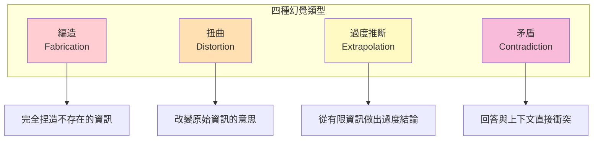
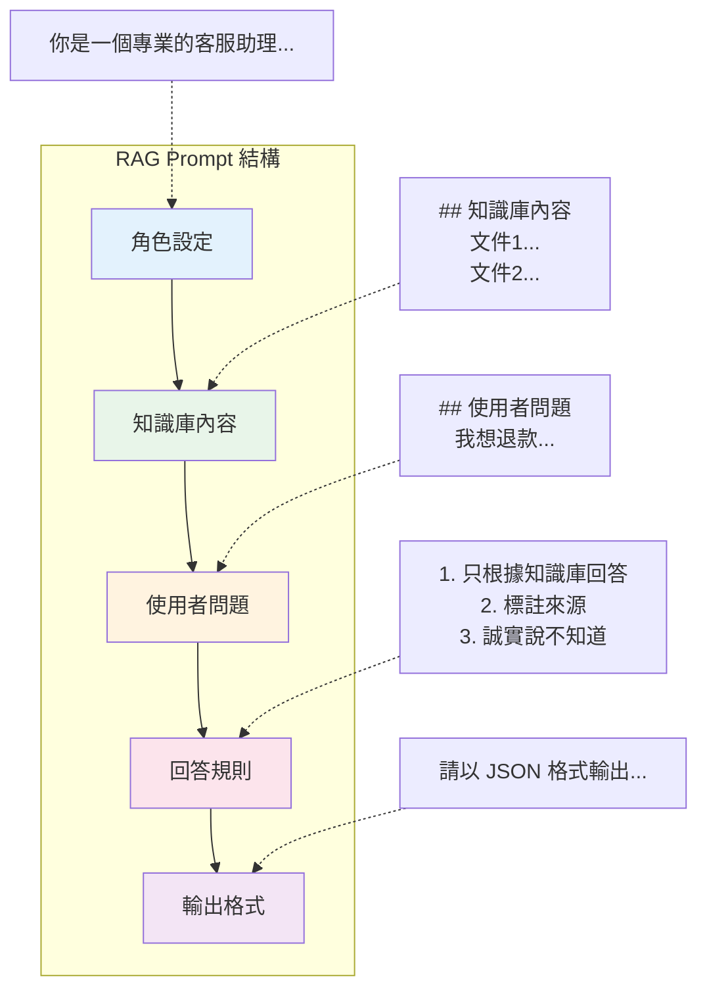
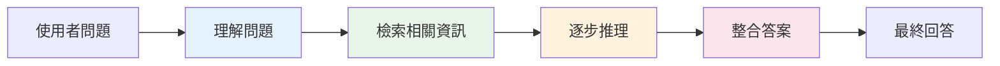
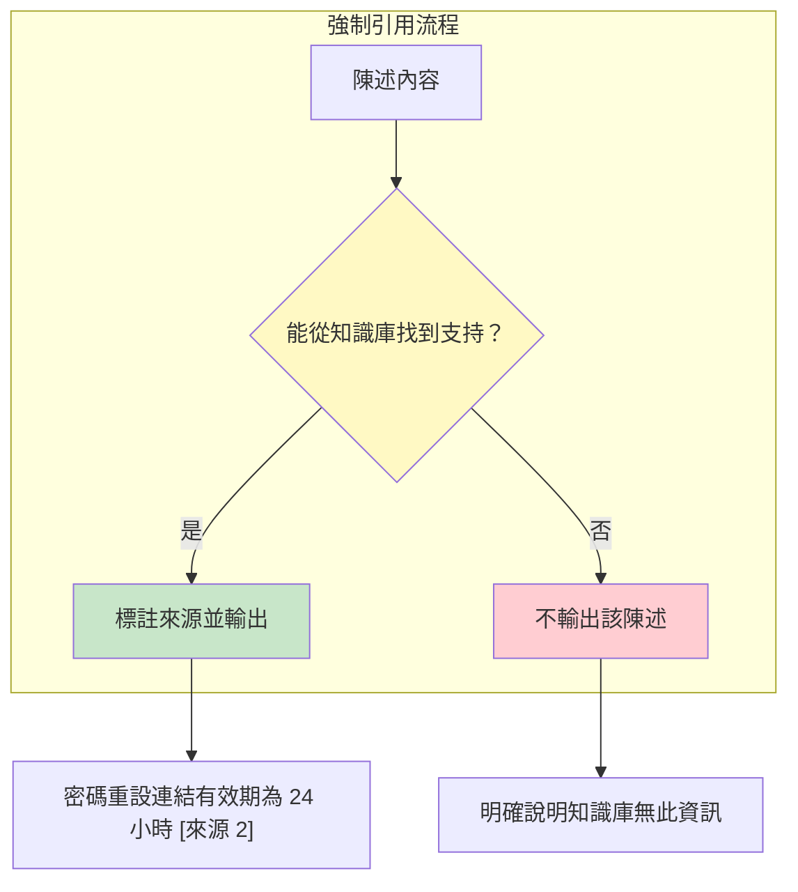
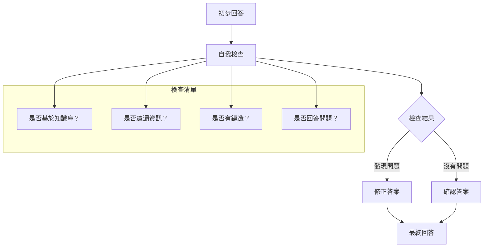
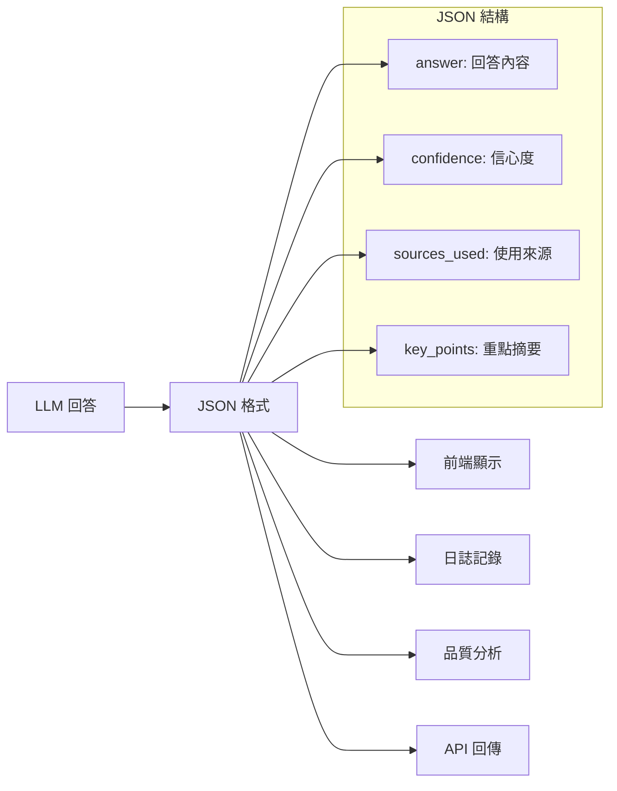
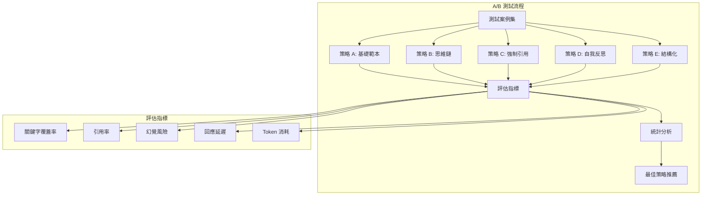
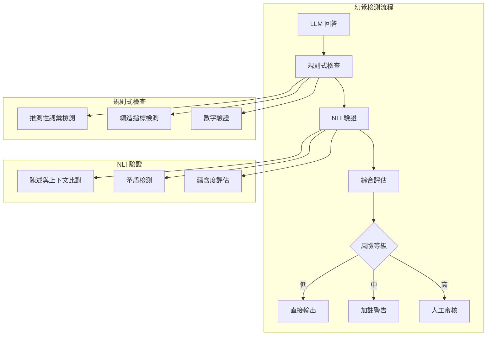
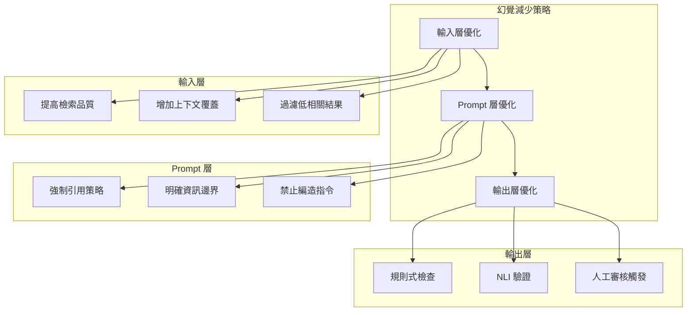

# 第 8 章：Prompt Engineering for RAG——讓 LLM 產生更可靠的答案

> **本章任務：** 設計 5 種 Prompt 範本，並透過 A/B 測試找出最佳策略。

---

## 學習目標

完成本章後，你將能夠：

- [ ] 設計適合 RAG 的 Prompt 範本
- [ ] 建立自動化的 Prompt 評估框架
- [ ] 理解並檢測 LLM 幻覺（Hallucination）
- [ ] 使用強制引用技術提高答案可信度
- [ ] 執行 Prompt A/B 測試並分析結果

---

## 核心產出物

- `prompt_templates.py` - 5 種 Prompt 策略實作
- `prompt_ab_testing.py` - Prompt A/B 測試框架
- `hallucination_detector.py` - 幻覺檢測模組
- `prompt_comparison_report.md` - 策略比較報告

---

## 8.1 RAG 專用 Prompt 設計原則

週三下午，你收到一封客戶投訴郵件：

「你們的 AI 客服說我可以申請全額退款，但客服人員告訴我公司沒有這項政策。這是怎麼回事？」

你打開 AskBot 的對話記錄，發現問題出在哪裡：

```
使用者：我對產品不滿意，可以退款嗎？

AI 助理：您好！根據我們的政策，如果您對產品不滿意，
可以在 30 天內申請全額退款。請聯繫客服人員處理。
```

但知識庫裡的實際政策是：

```
退款政策：已開封產品可在 7 天內申請 50% 退款；
未開封產品可在 30 天內申請全額退款。
```

AI 把「未開封產品」的條件漏掉了，產生了嚴重的誤導。這就是 LLM 最令人頭痛的問題——**幻覺（Hallucination）**。

### 什麼是 RAG 中的幻覺？

在 RAG 系統中，幻覺通常有四種形式：



| 類型 | 描述 | 範例 |
|------|------|------|
| **編造** | 完全憑空捏造 | 「客服專線是 0800-123-456」（知識庫沒有） |
| **扭曲** | 改變原意 | 「可以全額退款」（漏掉「未開封」條件） |
| **過度推斷** | 從有限資訊過度延伸 | 「大部分顧客都很滿意」（知識庫無此資料） |
| **矛盾** | 與上下文衝突 | 上下文說「僅限會員」，回答說「所有人都可以」 |

### RAG Prompt 的三大設計原則

經過大量實驗，我們發現有效的 RAG Prompt 必須遵循三個核心原則：

**原則一：明確界定資訊邊界**

告訴 LLM 哪些是可信資訊、哪些不是：

```
❌ 錯誤：請回答使用者的問題。
✅ 正確：請只根據「知識庫內容」回答。如果知識庫沒有相關資訊，
        請明確說明「我在知識庫中找不到這個問題的答案」。
```

**原則二：要求引用來源**

強制 LLM 標註資訊出處，讓使用者可以驗證：

```
❌ 錯誤：回答要準確。
✅ 正確：每個陳述都必須標註來源，格式為 [來源 X]。
        如果無法找到來源支持，不要寫入該內容。
```

**原則三：提供思考框架**

給 LLM 一個結構化的思考流程：

```
❌ 錯誤：仔細思考後回答。
✅ 正確：請按以下步驟回答：
        1. 分析使用者問題的核心意圖
        2. 從知識庫中找出相關資訊
        3. 整合資訊並組織答案
        4. 檢查答案是否完全基於知識庫
```

### Prompt 的基本結構

一個完整的 RAG Prompt 應該包含以下元素：



接下來，我們將實作五種不同的 Prompt 策略，並透過 A/B 測試找出最適合你業務場景的方案。

---

## 8.2 策略一：基礎範本

基礎範本是最直觀的設計，適合快速上線或資源受限的場景。

### 設計理念

基礎範本的核心思想是：**簡單直接，設定基本規則**。它不追求複雜的推理過程，而是清楚告訴 LLM：
1. 你的角色是什麼
2. 可用的資訊有哪些
3. 必須遵守的規則

### 範本實作

```python
"""
chapter-08/prompt_templates.py（基礎範本部分）

RAG Prompt 基礎範本
"""

from typing import List
from dataclasses import dataclass
from jinja2 import Template


@dataclass
class Context:
    """檢索到的上下文"""
    content: str
    source: str = ""
    score: float = 0.0


BASIC_TEMPLATE = """你是一個專業的客服助理。請根據以下知識庫內容回答使用者的問題。

## 知識庫內容


{{ ctx.content }}

---


## 使用者問題

{{ query }}

## 回答要求

1. 只根據知識庫內容回答，不要編造資訊                    # ‹1›
2. 如果知識庫沒有相關資訊，請誠實說「我在知識庫中找不到相關資訊」  # ‹2›
3. 回答要簡潔明瞭，使用繁體中文                        # ‹3›

## 你的回答"""
```

說明：
- ‹1› 設定資訊邊界，防止 LLM 使用預訓練知識
- ‹2› 處理知識庫覆蓋不足的情況，避免胡謅
- ‹3› 控制輸出風格與語言

### 使用範例

```python
def create_basic_prompt(query: str, contexts: List[Context]) -> str:
    """建立基礎 Prompt"""
    template = Template(BASIC_TEMPLATE)
    return template.render(query=query, contexts=contexts)


# 測試
contexts = [
    Context(
        content="如何重設密碼？請點擊登入頁面的「忘記密碼」連結，輸入您的電子郵件地址。",
        source="FAQ-001"
    ),
    Context(
        content="密碼重設連結有效期為 24 小時。如果連結過期，請重新申請。",
        source="FAQ-002"
    ),
]

prompt = create_basic_prompt("我忘記密碼了，該怎麼辦？", contexts)
print(prompt)
```

### 優缺點分析

| 優點 | 缺點 |
|------|------|
| 簡單直觀，易於理解 | 缺乏推理過程，可能遺漏細節 |
| Token 消耗少，成本低 | 無法追蹤資訊來源 |
| 回應速度快 | 處理複雜問題能力有限 |
| 適合簡單 FAQ 場景 | 幻覺控制能力較弱 |

**適用場景**：簡單的 FAQ 問答、資訊查詢、對延遲要求極高的場景。

---

## 8.3 策略二：思維鏈範本（Chain of Thought）

思維鏈（CoT）是 2022 年 Google 提出的技術，透過要求 LLM「一步步思考」，顯著提升複雜推理的準確性。

### 設計理念

思維鏈範本的核心思想是：**展示推理過程，讓答案有跡可循**。當使用者問一個需要整合多個資訊的問題時，CoT 會引導 LLM：
1. 先理解問題
2. 找出相關資訊
3. 逐步推理
4. 得出結論



### 範本實作

```python
CHAIN_OF_THOUGHT_TEMPLATE = """你是一個專業的客服助理。請根據知識庫內容，一步步分析並回答使用者問題。

## 知識庫內容


[文件 {{ loop.index }}]
{{ ctx.content }}



## 使用者問題

{{ query }}

## 請按照以下步驟回答

### 步驟 1：理解問題                                    # ‹1›
首先，分析使用者真正想知道什麼。

### 步驟 2：檢索相關資訊                                # ‹2›
從知識庫中找出與問題相關的關鍵資訊。

### 步驟 3：整合答案                                    # ‹3›
根據找到的資訊，組織一個完整的答案。

### 步驟 4：最終回答                                    # ‹4›
提供簡潔明瞭的最終答案。

## 開始分析"""
```

說明：
- ‹1› 確保 LLM 理解問題本質，避免答非所問
- ‹2› 明確要求從知識庫找資訊，而非自行編造
- ‹3› 整合階段允許 LLM 連結多個文件的資訊
- ‹4› 最後收斂為簡潔答案

### 實際輸出範例

```
### 步驟 1：理解問題
使用者忘記密碼，想知道如何恢復帳號存取權限。

### 步驟 2：檢索相關資訊
從文件 1 找到：點擊「忘記密碼」連結，輸入電子郵件。
從文件 2 找到：重設連結有效期為 24 小時。

### 步驟 3：整合答案
使用者需要：(1) 找到忘記密碼連結 (2) 輸入信箱 (3) 在 24 小時內點擊重設連結。

### 步驟 4：最終回答
您可以點擊登入頁面的「忘記密碼」連結，輸入電子郵件地址後，系統會發送重設連結。
請注意，這個連結只有 24 小時有效期，過期需要重新申請。
```

### 優缺點分析

| 優點 | 缺點 |
|------|------|
| 推理過程透明，可解釋性強 | Token 消耗較多 |
| 適合需要整合多個資訊的問題 | 回應時間較長 |
| 減少遺漏重要細節的機率 | 可能產生冗長的中間推理 |
| 便於人工審核和除錯 | 對簡單問題可能過度複雜 |

**適用場景**：需要整合多個知識點的複雜問題、法規政策諮詢、技術支援。

---

## 8.4 策略三：強制引用範本（Forced Citation）

強制引用是對抗幻覺最有效的策略之一。透過要求 LLM 為每個陳述標註來源，我們可以快速驗證答案的可靠性。

### 設計理念

強制引用範本的核心思想是：**沒有來源就不能說**。這個策略強迫 LLM：
1. 每個陳述都必須有出處
2. 標註使用了哪個文件
3. 無法引用時必須承認



### 範本實作

```python
FORCED_CITATION_TEMPLATE = """你是一個專業的客服助理。回答問題時，你必須引用知識庫中的具體來源。

## 知識庫內容


[來源 {{ loop.index }}] {{ ctx.source if ctx.source else "文件 " ~ loop.index }}
{{ ctx.content }}



## 使用者問題

{{ query }}

## 回答規則

1. 每個陳述都必須標注來源，格式：「...內容... [來源 X]」     # ‹1›
2. 如果多個來源支持同一陳述，標注所有相關來源              # ‹2›
3. 如果知識庫沒有相關資訊，明確說明「知識庫中沒有這方面的資訊」  # ‹3›
4. 不要編造任何不在知識庫中的資訊                        # ‹4›

## 範例格式

使用者問題：如何重設密碼？
回答：您可以點擊登入頁面的「忘記密碼」連結來重設密碼 [來源 1]。系統會發送重設連結到您的電子郵件 [來源 1]。請注意，重設連結的有效期為 24 小時 [來源 2]。

## 你的回答（請務必標注來源）"""
```

說明：
- ‹1› 強制要求每個陳述都有來源標註
- ‹2› 允許多來源交叉驗證
- ‹3› 處理知識庫覆蓋不足的情況
- ‹4› 明確禁止編造

### 實際輸出範例

```
您可以點擊登入頁面的「忘記密碼」連結，輸入您的電子郵件地址來重設密碼 [來源 1]。
系統會發送重設連結到您的信箱，這個連結有效期為 24 小時 [來源 2]。
如果連結過期，您需要重新申請 [來源 2]。
```

### 引用驗證功能

有了強制引用，我們可以自動驗證答案的可靠性：

```python
import re
from typing import List, Dict, Tuple


def verify_citations(
    answer: str,
    contexts: List[Context]
) -> Dict:
    """
    驗證答案中的引用是否有效

    Args:
        answer: LLM 的回答
        contexts: 提供的上下文列表

    Returns:
        驗證結果字典
    """
    # 找出所有引用標記
    citation_pattern = r'\[來源\s*(\d+)\]'
    citations = re.findall(citation_pattern, answer)

    # 統計
    valid_citations = []
    invalid_citations = []

    for cite_num in citations:
        idx = int(cite_num) - 1
        if 0 <= idx < len(contexts):
            valid_citations.append(cite_num)
        else:
            invalid_citations.append(cite_num)

    # 計算引用覆蓋率
    sentences = answer.split('。')
    cited_sentences = sum(1 for s in sentences if re.search(citation_pattern, s))
    coverage_rate = cited_sentences / len(sentences) if sentences else 0

    return {
        "total_citations": len(citations),
        "valid_citations": valid_citations,
        "invalid_citations": invalid_citations,
        "coverage_rate": coverage_rate,
        "is_reliable": len(invalid_citations) == 0 and coverage_rate > 0.7
    }
```

### 優缺點分析

| 優點 | 缺點 |
|------|------|
| 最強的幻覺控制能力 | 回答可能較生硬 |
| 便於使用者驗證 | 無法回答知識庫以外的問題 |
| 提高使用者信任度 | Token 消耗增加 |
| 支援自動化品質檢測 | 需要高品質的來源標示 |

**適用場景**：法律諮詢、醫療資訊、財務建議等高風險領域。

---

## 8.5 策略四：自我反思範本（Self Reflection）

自我反思策略讓 LLM 在回答後進行自我檢查，類似於人類的「覆核」過程。

### 設計理念

自我反思範本的核心思想是：**先回答，再檢查，最後修正**。這個策略模擬了專業人士的工作流程：
1. 初步回答
2. 自我檢查清單
3. 根據檢查結果修正



### 範本實作

```python
SELF_REFLECTION_TEMPLATE = """你是一個專業的客服助理。在回答問題後，你需要自我檢查答案的品質。

## 知識庫內容


[文件 {{ loop.index }}]
{{ ctx.content }}



## 使用者問題

{{ query }}

## 回答流程

### 第一步：初步回答                                    # ‹1›
根據知識庫內容，提供你的答案。

### 第二步：自我檢查                                    # ‹2›
檢查你的答案：
- [ ] 答案是否完全基於知識庫內容？
- [ ] 是否有遺漏的重要資訊？
- [ ] 是否有編造或假設的內容？
- [ ] 答案是否直接回答了使用者的問題？

### 第三步：修正與最終答案                               # ‹3›
根據檢查結果，提供修正後的最終答案。

## 開始回答"""
```

說明：
- ‹1› 先讓 LLM 自由回答，不受限制
- ‹2› 透過檢查清單觸發反思機制
- ‹3› 根據反思結果進行修正

### 實際輸出範例

```
### 第一步：初步回答
您可以透過登入頁面的「忘記密碼」功能來重設密碼。點擊後輸入電子郵件，
系統會在幾分鐘內發送重設連結。

### 第二步：自我檢查
- [✓] 答案是否完全基於知識庫內容？是
- [✗] 是否有遺漏的重要資訊？是，漏掉了 24 小時有效期
- [✗] 是否有編造或假設的內容？「幾分鐘內」是假設，知識庫沒說
- [✓] 答案是否直接回答了使用者的問題？是

### 第三步：修正與最終答案
您可以點擊登入頁面的「忘記密碼」連結，輸入您的電子郵件地址，
系統會發送重設連結。請注意，這個連結有效期為 24 小時，過期需要重新申請。
```

### 優缺點分析

| 優點 | 缺點 |
|------|------|
| 自動發現並修正錯誤 | Token 消耗最多 |
| 提高答案完整性 | 回應時間最長 |
| 減少遺漏重要資訊 | 可能過度修正 |
| 可解釋的修正過程 | 對簡單問題效益低 |

**適用場景**：重要決策支援、需要高準確度的專業諮詢。

---

## 8.6 策略五：結構化輸出範本（Structured Output）

結構化輸出策略要求 LLM 以 JSON 格式回答，便於程式自動解析和後續處理。

### 設計理念

結構化輸出範本的核心思想是：**機器友好，便於整合**。當 RAG 系統需要與其他系統整合時，JSON 格式比自然語言更容易處理：
1. 統一的輸出格式
2. 明確的欄位定義
3. 便於程式解析



### 範本實作

```python
STRUCTURED_OUTPUT_TEMPLATE = """你是一個專業的客服助理。請以結構化 JSON 格式回答問題。

## 知識庫內容


[來源 {{ loop.index }}]
{{ ctx.content }}



## 使用者問題

{{ query }}

## 輸出格式

請以下列 JSON 格式回答：

```json
{
    "answer": "你的回答內容",                            # ‹1›
    "confidence": "high/medium/low",                   # ‹2›
    "sources_used": [1, 2],                            # ‹3›
    "key_points": [                                    # ‹4›
        "要點 1",
        "要點 2"
    ],
    "follow_up_suggestions": [                         # ‹5›
        "可能的後續問題 1"
    ],
    "unable_to_answer": false,                         # ‹6›
    "reason_if_unable": ""
}
```

## 欄位說明

- answer: 完整的回答內容
- confidence: 根據知識庫覆蓋程度評估信心度
- sources_used: 使用了哪些來源（來源編號列表）
- key_points: 回答中的關鍵要點
- follow_up_suggestions: 使用者可能想進一步了解的問題
- unable_to_answer: 如果無法回答，設為 true
- reason_if_unable: 無法回答的原因

## 你的 JSON 回答"""
```

說明：
- ‹1› 主要回答內容
- ‹2› 自評信心度，便於後續處理
- ‹3› 追蹤使用了哪些來源
- ‹4› 結構化的重點摘要
- ‹5› 主動建議後續問題
- ‹6› 明確標示無法回答的情況

### 解析回應

```python
import json
from pydantic import BaseModel, Field
from typing import List, Optional


class StructuredAnswer(BaseModel):
    """結構化回答模型"""
    answer: str
    confidence: str = Field(pattern="^(high|medium|low)$")
    sources_used: List[int]
    key_points: List[str]
    follow_up_suggestions: List[str] = []
    unable_to_answer: bool = False
    reason_if_unable: str = ""


def parse_structured_response(response: str) -> Optional[StructuredAnswer]:
    """
    解析 LLM 的結構化回應

    Args:
        response: LLM 的原始回應

    Returns:
        解析後的 StructuredAnswer 或 None
    """
    try:
        # 嘗試從回應中提取 JSON
        json_match = re.search(r'\{[\s\S]*\}', response)
        if not json_match:
            return None

        data = json.loads(json_match.group())
        return StructuredAnswer(**data)
    except (json.JSONDecodeError, ValueError) as e:
        print(f"解析失敗: {e}")
        return None
```

### 實際輸出範例

```json
{
    "answer": "您可以點擊登入頁面的「忘記密碼」連結，輸入電子郵件地址後，系統會發送重設連結。這個連結有效期為 24 小時，過期需要重新申請。",
    "confidence": "high",
    "sources_used": [1, 2],
    "key_points": [
        "點擊「忘記密碼」連結",
        "輸入電子郵件地址",
        "重設連結有效期 24 小時"
    ],
    "follow_up_suggestions": [
        "如果沒有收到重設郵件怎麼辦？",
        "可以更改帳號的電子郵件地址嗎？"
    ],
    "unable_to_answer": false,
    "reason_if_unable": ""
}
```

### 優缺點分析

| 優點 | 缺點 |
|------|------|
| 便於程式解析 | 輸出可能不夠自然 |
| 統一的資料格式 | JSON 格式可能出錯 |
| 豐富的元資料 | Token 消耗較多 |
| 支援自動化處理 | 需要額外的解析邏輯 |

**適用場景**：API 服務、需要整合到其他系統、需要自動化品質監控。

---

## 8.7 建立 A/B 測試框架

有了五種 Prompt 策略，我們需要一個系統化的方法來評估哪種策略最適合你的業務場景。

### A/B 測試設計



### 測試框架實作

```python
"""
chapter-08/prompt_ab_testing.py

Prompt A/B 測試框架
"""

from typing import List, Dict
from dataclasses import dataclass, field
import time

from anthropic import Anthropic
from prompt_templates import PromptStrategy, create_prompt, Context


@dataclass
class TestCase:
    """測試案例"""
    query: str
    contexts: List[Context]
    expected_keywords: List[str] = field(default_factory=list)
    expected_answer: str = ""
    category: str = "general"


@dataclass
class TestResult:
    """單一測試結果"""
    strategy: PromptStrategy
    test_case: TestCase
    answer: str
    latency_ms: float                                  # ‹1›
    token_count: int                                   # ‹2›
    keyword_coverage: float                            # ‹3›
    has_citation: bool                                 # ‹4›
    hallucination_risk: float                          # ‹5›


@dataclass
class StrategyReport:
    """策略評估報告"""
    strategy: PromptStrategy
    total_tests: int
    avg_latency_ms: float
    avg_token_count: float
    avg_keyword_coverage: float
    citation_rate: float
    avg_hallucination_risk: float
    overall_score: float
```

說明：
- ‹1› 回應延遲，影響使用者體驗
- ‹2› Token 消耗，影響成本
- ‹3› 答案是否包含預期關鍵字
- ‹4› 是否有引用來源
- ‹5› 幻覺風險評估

### 測試執行引擎

```python
class PromptABTester:
    """Prompt A/B 測試器"""

    def __init__(
        self,
        strategies: List[PromptStrategy] = None,
        model: str = "claude-3-haiku-20240307"
    ):
        self.strategies = strategies or list(PromptStrategy)
        self.client = Anthropic()
        self.model = model
        self.results: List[TestResult] = []

    def _evaluate_answer(
        self,
        answer: str,
        test_case: TestCase
    ) -> Dict:
        """評估回答品質"""
        answer_lower = answer.lower()

        # 關鍵字覆蓋率
        if test_case.expected_keywords:
            matched = sum(
                1 for kw in test_case.expected_keywords
                if kw.lower() in answer_lower
            )
            keyword_coverage = matched / len(test_case.expected_keywords)
        else:
            keyword_coverage = 1.0

        # 是否有引用
        has_citation = any(
            marker in answer
            for marker in ["[來源", "[文件", "[參考", "來源 ", "文件 "]
        )

        # 幻覺風險（規則式檢查）
        hallucination_indicators = [
            "可能", "也許", "我認為", "通常", "一般來說",
            "根據官方", "專家表示", "研究顯示"
        ]
        indicator_count = sum(
            1 for ind in hallucination_indicators
            if ind in answer
        )
        hallucination_risk = min(indicator_count * 0.15, 1.0)

        return {
            "keyword_coverage": keyword_coverage,
            "has_citation": has_citation,
            "hallucination_risk": hallucination_risk
        }

    def run_test(self, test_cases: List[TestCase]) -> List[TestResult]:
        """執行完整 A/B 測試"""
        self.results = []

        for strategy in self.strategies:
            for test_case in test_cases:
                # 建立 Prompt
                prompt = create_prompt(
                    strategy,
                    test_case.query,
                    test_case.contexts
                )

                # 呼叫 LLM
                start = time.time()
                response = self.client.messages.create(
                    model=self.model,
                    max_tokens=1024,
                    messages=[{"role": "user", "content": prompt}]
                )
                latency = (time.time() - start) * 1000

                # 解析結果
                answer = response.content[0].text
                token_count = response.usage.output_tokens
                evaluation = self._evaluate_answer(answer, test_case)

                # 記錄結果
                self.results.append(TestResult(
                    strategy=strategy,
                    test_case=test_case,
                    answer=answer,
                    latency_ms=latency,
                    token_count=token_count,
                    **evaluation
                ))

        return self.results
```

### 綜合評分計算

```python
def generate_report(self) -> List[StrategyReport]:
    """生成策略評估報告"""
    reports = []

    for strategy in self.strategies:
        strategy_results = [
            r for r in self.results
            if r.strategy == strategy
        ]

        if not strategy_results:
            continue

        # 計算各項指標
        avg_latency = sum(r.latency_ms for r in strategy_results) / len(strategy_results)
        avg_tokens = sum(r.token_count for r in strategy_results) / len(strategy_results)
        avg_keyword = sum(r.keyword_coverage for r in strategy_results) / len(strategy_results)
        citation_rate = sum(1 for r in strategy_results if r.has_citation) / len(strategy_results)
        avg_hallucination = sum(r.hallucination_risk for r in strategy_results) / len(strategy_results)

        # 計算綜合分數（權重可調整）                        # ‹1›
        overall_score = (
            avg_keyword * 0.30 +                        # 關鍵字覆蓋
            citation_rate * 0.25 +                      # 引用率
            (1 - avg_hallucination) * 0.25 +           # 幻覺控制
            (1 - min(avg_latency / 5000, 1)) * 0.10 +  # 延遲
            (1 - min(avg_tokens / 500, 1)) * 0.10      # Token 效率
        )

        reports.append(StrategyReport(
            strategy=strategy,
            total_tests=len(strategy_results),
            avg_latency_ms=avg_latency,
            avg_token_count=avg_tokens,
            avg_keyword_coverage=avg_keyword,
            citation_rate=citation_rate,
            avg_hallucination_risk=avg_hallucination,
            overall_score=overall_score
        ))

    # 按綜合分數排序
    reports.sort(key=lambda r: r.overall_score, reverse=True)
    return reports
```

說明：
- ‹1› 綜合評分的權重設計：
  - 關鍵字覆蓋率 30%：答案是否包含重要資訊
  - 引用率 25%：是否有來源追蹤
  - 幻覺控制 25%：是否避免編造
  - 延遲 10%：使用者體驗
  - Token 效率 10%：成本控制

### 測試案例設計

```python
def create_sample_test_cases() -> List[TestCase]:
    """建立範例測試案例"""
    return [
        TestCase(
            query="我忘記密碼了，該怎麼辦？",
            contexts=[
                Context(
                    content="如何重設密碼？請點擊登入頁面的「忘記密碼」連結，輸入您的電子郵件地址。",
                    source="FAQ-001"
                ),
                Context(
                    content="密碼重設連結有效期為 24 小時。如果連結過期，請重新申請。",
                    source="FAQ-002"
                ),
            ],
            expected_keywords=["忘記密碼", "連結", "電子郵件", "24 小時"],
            category="account"
        ),
        TestCase(
            query="你們支援哪些付款方式？",
            contexts=[
                Context(
                    content="支援的付款方式包括：信用卡（Visa、MasterCard）、銀行轉帳、PayPal。",
                    source="FAQ-010"
                ),
            ],
            expected_keywords=["信用卡", "Visa", "MasterCard", "PayPal"],
            category="payment"
        ),
        TestCase(
            query="如何取消訂閱？",
            contexts=[
                Context(
                    content="如何取消訂閱？進入「訂閱管理」>「取消訂閱」。取消後仍可使用至當期結束。",
                    source="FAQ-020"
                ),
            ],
            expected_keywords=["訂閱管理", "取消", "當期"],
            category="subscription"
        ),
    ]
```

### 執行測試與分析

```python
def demo_ab_testing():
    """演示 A/B 測試"""
    # 建立測試案例
    test_cases = create_sample_test_cases()

    # 選擇要測試的策略
    strategies = [
        PromptStrategy.BASIC,
        PromptStrategy.FORCED_CITATION,
        PromptStrategy.CHAIN_OF_THOUGHT,
    ]

    # 執行測試
    tester = PromptABTester(strategies=strategies)
    tester.run_test(test_cases)

    # 生成報告
    reports = tester.generate_report()

    # 顯示結果
    print("\n=== Prompt A/B 測試報告 ===\n")
    print(f"{'策略':<20} {'分數':<8} {'延遲':<10} {'引用率':<10} {'幻覺':<10}")
    print("-" * 60)

    for r in reports:
        print(f"{r.strategy.value:<20} {r.overall_score:.3f}   "
              f"{r.avg_latency_ms:.0f}ms    "
              f"{r.citation_rate:.1%}     "
              f"{r.avg_hallucination_risk:.1%}")

    print(f"\n推薦策略：{reports[0].strategy.value}")
```

### 測試報告範例

```
=== Prompt A/B 測試報告 ===

策略                  分數     延遲        引用率      幻覺
------------------------------------------------------------
forced_citation      0.812   1245ms     100.0%      5.0%
chain_of_thought     0.756   1890ms     33.3%       10.0%
basic                0.698   856ms      0.0%        20.0%

推薦策略：forced_citation
```

---

## 8.8 幻覺檢測與減少

幻覺是 RAG 系統最棘手的問題之一。我們需要一個自動化的檢測機制來識別可疑的回答。

### 幻覺檢測策略



### 規則式幻覺檢查器

```python
"""
chapter-08/hallucination_detector.py

幻覺檢測模組
"""

from typing import List, Dict
from enum import Enum


class HallucinationType(Enum):
    """幻覺類型"""
    FABRICATION = "fabrication"       # 完全編造
    DISTORTION = "distortion"         # 扭曲原意
    EXTRAPOLATION = "extrapolation"   # 過度推斷
    CONTRADICTION = "contradiction"   # 與上下文矛盾


class SimpleHallucinationChecker:
    """
    規則式幻覺檢查器

    透過關鍵字匹配快速識別可疑回答，不需要額外的 LLM 呼叫。
    """

    # 推測性詞彙：表示不確定性
    SPECULATION_INDICATORS = [                         # ‹1›
        "可能", "也許", "大概", "應該是", "我猜", "我認為",
        "通常來說", "一般而言", "據我所知"
    ]

    # 編造指標：引用不存在的權威來源
    FABRICATION_INDICATORS = [                         # ‹2›
        "根據官方資料", "根據最新消息", "研究顯示",
        "專家表示", "數據顯示"
    ]

    def check(
        self,
        answer: str,
        contexts: List[str]
    ) -> Dict:
        """
        快速檢查幻覺風險

        Args:
            answer: LLM 回答
            contexts: 上下文列表

        Returns:
            檢查結果字典
        """
        context_text = " ".join(contexts).lower()
        answer_lower = answer.lower()

        # 檢查推測性詞彙
        speculation_found = [
            word for word in self.SPECULATION_INDICATORS
            if word in answer_lower
        ]

        # 檢查編造指標（這些詞彙不在上下文中出現）
        fabrication_found = [                          # ‹3›
            phrase for phrase in self.FABRICATION_INDICATORS
            if phrase in answer_lower and phrase not in context_text
        ]

        # 計算風險分數
        risk_score = (
            len(speculation_found) * 0.1 +
            len(fabrication_found) * 0.3
        )
        risk_score = min(risk_score, 1.0)

        return {
            "risk_score": risk_score,
            "risk_level": self._get_risk_level(risk_score),
            "speculation_indicators": speculation_found,
            "fabrication_indicators": fabrication_found,
            "recommendation": self._get_recommendation(risk_score)
        }

    def _get_risk_level(self, score: float) -> str:
        """判斷風險等級"""
        if score < 0.2:
            return "low"
        elif score < 0.5:
            return "medium"
        else:
            return "high"

    def _get_recommendation(self, score: float) -> str:
        """給出處理建議"""
        if score < 0.2:
            return "回答看起來可信，但建議人工抽查"
        elif score < 0.5:
            return "發現一些可疑指標，建議仔細核實"
        else:
            return "高風險回答，強烈建議人工審核"
```

說明：
- ‹1› 推測性詞彙表示 LLM 沒有足夠的資訊支持
- ‹2› 編造指標：引用「官方」、「專家」等權威但可能不存在
- ‹3› 只有當這些詞彙不在原始上下文中時才標記

### NLI 驗證器

Natural Language Inference（NLI）是一種判斷兩句話邏輯關係的技術，可用於驗證回答是否與上下文一致。

```python
from dataclasses import dataclass
from typing import Optional


@dataclass
class HallucinationResult:
    """幻覺檢測結果"""
    has_hallucination: bool
    confidence: float
    hallucination_type: Optional[HallucinationType]
    problematic_segments: List[str]
    explanation: str
    grounded_segments: List[str]


class HallucinationDetector:
    """
    進階幻覺檢測器

    使用 LLM 進行 NLI 風格的驗證。
    """

    def __init__(self, api_key: str = None):
        self.client = Anthropic(api_key=api_key)

    def detect(
        self,
        answer: str,
        contexts: List[str],
        query: str = None
    ) -> HallucinationResult:
        """
        檢測回答中的幻覺

        Args:
            answer: LLM 的回答
            contexts: 提供給 LLM 的上下文列表
            query: 原始查詢（可選）

        Returns:
            HallucinationResult 檢測結果
        """
        context_text = "\n\n".join(
            f"[上下文 {i+1}]\n{ctx}"
            for i, ctx in enumerate(contexts)
        )

        detection_prompt = f"""你是一個專業的事實核查專家。請判斷「回答」中的內容是否完全基於「上下文」。

## 上下文（LLM 可用的資訊）

{context_text}

## LLM 的回答

{answer}

## 檢測任務

請分析回答中的每一個陳述，判斷它是否可以從上下文中找到支持。

輸出格式：
```
整體判斷：[有幻覺/無幻覺]
信心度：[0.0-1.0]
幻覺類型：[fabrication/distortion/extrapolation/contradiction/無]

有問題的內容：
- "具體句子 1"：原因
- "具體句子 2"：原因

有根據的內容：
- "具體句子 1"：來自上下文 X

詳細說明：
[解釋為什麼判斷為有/無幻覺]
```

請開始檢測："""

        response = self.client.messages.create(
            model="claude-3-haiku-20240307",
            max_tokens=1024,
            messages=[{"role": "user", "content": detection_prompt}]
        )

        return self._parse_detection_result(response.content[0].text)
```

### 幻覺減少策略

除了檢測，我們還需要從源頭減少幻覺的產生：



### 整合到 AskBot

```python
class AskBotWithHallucinationControl:
    """帶有幻覺控制的 AskBot"""

    def __init__(self):
        self.checker = SimpleHallucinationChecker()
        self.detector = HallucinationDetector()

    def answer(
        self,
        query: str,
        contexts: List[str],
        strict_mode: bool = False
    ) -> Dict:
        """
        回答問題並進行幻覺檢測

        Args:
            query: 使用者問題
            contexts: 檢索到的上下文
            strict_mode: 是否啟用嚴格模式

        Returns:
            包含回答和幻覺分析的結果
        """
        # 使用強制引用策略生成回答
        prompt = create_prompt(
            PromptStrategy.FORCED_CITATION,
            query,
            contexts
        )

        response = self.client.messages.create(
            model="claude-3-haiku-20240307",
            max_tokens=1024,
            messages=[{"role": "user", "content": prompt}]
        )

        answer = response.content[0].text

        # 快速幻覺檢查
        quick_check = self.checker.check(answer, contexts)

        result = {
            "answer": answer,
            "hallucination_risk": quick_check["risk_level"],
            "risk_score": quick_check["risk_score"],
        }

        # 嚴格模式：進行 NLI 驗證
        if strict_mode or quick_check["risk_level"] == "high":
            detailed_check = self.detector.detect(answer, contexts, query)
            result["detailed_analysis"] = {
                "has_hallucination": detailed_check.has_hallucination,
                "problematic_segments": detailed_check.problematic_segments,
                "explanation": detailed_check.explanation
            }

            # 高風險時加註警告
            if detailed_check.has_hallucination:
                result["warning"] = "此回答可能包含未經驗證的資訊，請參考原始來源確認。"

        return result
```

---

## 8.9 本章小結

### 核心要點回顧

1. **RAG Prompt 的三大設計原則**：明確資訊邊界、要求引用來源、提供思考框架。

2. **五種 Prompt 策略比較**：

| 策略 | 優勢 | 適用場景 |
|------|------|----------|
| 基礎範本 | 簡單快速 | FAQ、低延遲需求 |
| 思維鏈 | 推理透明 | 複雜問題、多資訊整合 |
| 強制引用 | 最強幻覺控制 | 高風險領域（法律、醫療） |
| 自我反思 | 自動修正 | 需要高準確度 |
| 結構化輸出 | 便於整合 | API 服務、自動化處理 |

3. **A/B 測試的評估指標**：
   - 關鍵字覆蓋率（30%）
   - 引用率（25%）
   - 幻覺風險（25%）
   - 回應延遲（10%）
   - Token 效率（10%）

4. **幻覺檢測的雙層策略**：
   - 規則式快速檢查：成本低、速度快
   - NLI 深度驗證：準確度高、適合高風險場景

5. **實際測試結果顯示**：強制引用策略在幻覺控制方面表現最佳，推薦用於企業客服場景。

### 下一章預告

Prompt 工程讓我們的 AI 產生更可靠的答案，但在生產環境中，我們還需要持續監控系統的表現。第 9 章將建立完整的監控與可觀測性體系，讓你能夠：
- 追蹤每個請求的完整生命週期
- 監控系統健康狀況和效能指標
- 設定警報機制，及時發現異常

---

## 延伸閱讀

- Wei, J., et al. (2022). "Chain-of-Thought Prompting Elicits Reasoning in Large Language Models"
- Liu, Y., et al. (2023). "G-Eval: NLG Evaluation using GPT-4 with Better Human Alignment"
- Mündler, N., et al. (2023). "Self-contradictory Hallucinations of Large Language Models"
