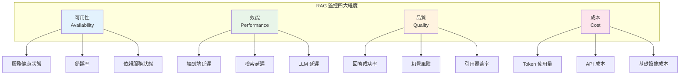
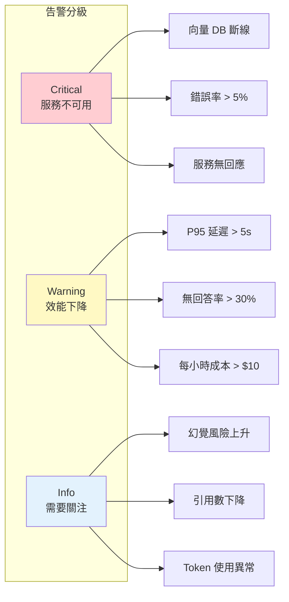
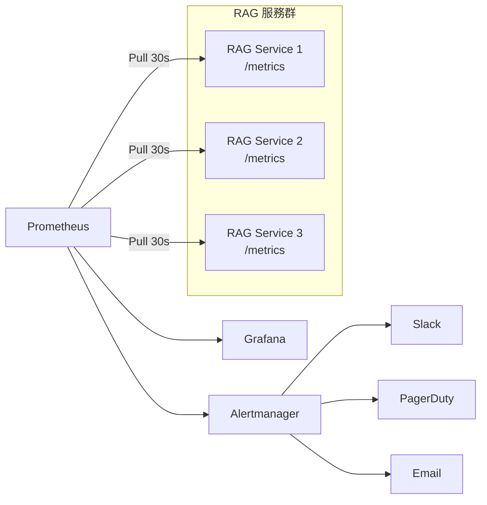
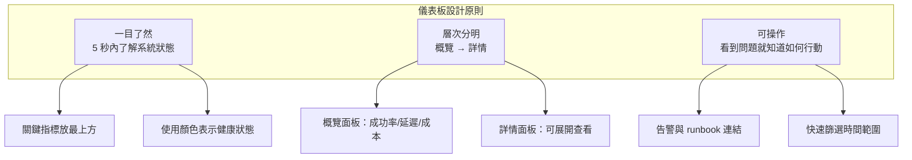
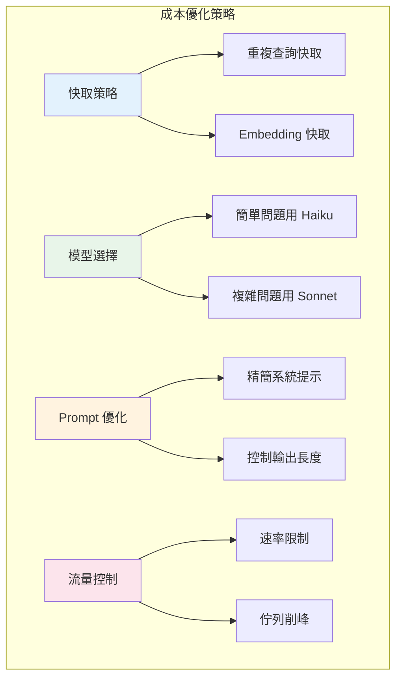

# 第 9 章：監控與可觀測性——你無法改進你無法衡量的東西

> **本章任務：** 建立完整的 RAG 監控儀表板，追蹤關鍵指標。

---

## 學習目標

完成本章後，你將能夠：

- [ ] 定義並追蹤 RAG 系統的關鍵指標
- [ ] 建立 Prometheus + Grafana 監控堆疊
- [ ] 設計即時監控儀表板
- [ ] 設定效能與成本告警
- [ ] 建立 SLI/SLO 追蹤體系

---

## 核心產出物

- `monitoring_metrics.py` - 監控指標定義
- `metrics_collector.py` - 指標收集器
- `grafana_dashboard.json` - Grafana 儀表板設定
- `alerting_rules.yml` - 告警規則設定

---

## 9.1 RAG 系統的關鍵指標

週一早上，你的手機震動了三次——三封來自不同部門的投訴郵件：

**業務部門**：「客戶說 AI 助理回應很慢，有時候要等十幾秒。」
**財務部門**：「這個月的 API 帳單怎麼比預期多了 40%？」
**客服團隊**：「AI 回答的品質好像變差了，很多問題都說找不到答案。」

你打開終端機，想查一下到底發生了什麼事，卻發現——沒有任何監控數據。你只能盲人摸象地翻閱日誌，試圖從海量文字中找出問題。

這就是為什麼監控如此重要：**你無法改進你無法衡量的東西**。

### RAG 系統的四大監控維度

RAG 系統的監控需要涵蓋四個核心維度：



### 核心指標清單

| 維度 | 指標 | 說明 | 目標值 |
|------|------|------|--------|
| **可用性** | 成功率 | 成功回應的請求比例 | > 99.5% |
| | 錯誤率 | 發生錯誤的請求比例 | < 0.5% |
| | 向量 DB 狀態 | 資料庫連線是否正常 | 100% |
| **效能** | P95 延遲 | 95% 請求的延遲上限 | < 3 秒 |
| | 檢索延遲 | 向量搜尋時間 | < 500ms |
| | LLM 延遲 | 模型推理時間 | < 2 秒 |
| **品質** | 回答率 | 能夠回答的問題比例 | > 80% |
| | 幻覺風險 | 回答可能不準確的比例 | < 10% |
| | 引用數 | 平均每個回答的引用數 | > 1.5 |
| **成本** | 每請求成本 | 單次請求的平均成本 | < $0.01 |
| | 每小時成本 | 小時 API 花費 | 可控 |

### 指標的重要性分級



---

## 9.2 指標收集架構

在設計監控系統之前，我們需要了解指標的收集架構。

### Pull vs Push 模型

Prometheus 使用 **Pull 模型**：由 Prometheus 主動抓取各服務的指標端點。



### 指標類型

Prometheus 支援四種指標類型：

```python
from prometheus_client import Counter, Gauge, Histogram, Summary

# 1. Counter（計數器）：只增不減
#    適用：請求總數、錯誤數、Token 使用量
request_total = Counter(
    'rag_requests_total',
    'Total number of RAG requests',
    ['status', 'endpoint']
)

# 2. Gauge（量表）：可增可減
#    適用：佇列深度、連線數、快取大小
queue_depth = Gauge(
    'rag_queue_depth',
    'Current request queue depth'
)

# 3. Histogram（直方圖）：分布統計
#    適用：延遲、回應大小、分數分布
request_latency = Histogram(
    'rag_request_latency_seconds',
    'Request latency in seconds',
    buckets=[0.1, 0.25, 0.5, 1.0, 2.5, 5.0, 10.0]
)

# 4. Summary（摘要）：百分位數統計
#    適用：需要精確百分位數的場景
response_size = Summary(
    'rag_response_size_bytes',
    'Response size in bytes'
)
```

### RAG 指標定義

```python
"""
chapter-09/monitoring_metrics.py

RAG 系統監控指標定義
"""

from prometheus_client import Counter, Histogram, Gauge
from prometheus_client import CollectorRegistry, generate_latest
from dataclasses import dataclass


@dataclass
class RAGRequestMetrics:
    """單次請求的指標數據"""
    query: str
    latency_ms: float
    retrieval_latency_ms: float
    llm_latency_ms: float
    retrieved_docs: int
    input_tokens: int
    output_tokens: int
    has_answer: bool
    citation_count: int
    hallucination_risk: float


class RAGMetrics:
    """RAG 系統指標收集器"""

    def __init__(self, registry: CollectorRegistry = None):
        self.registry = registry or CollectorRegistry()

        # ═══════════════════════════════════════════════════════════════
        # 請求相關指標
        # ═══════════════════════════════════════════════════════════════

        self.request_total = Counter(                  # ‹1›
            'rag_requests_total',
            'Total number of RAG requests',
            ['status', 'endpoint'],
            registry=self.registry
        )

        self.request_latency = Histogram(              # ‹2›
            'rag_request_latency_seconds',
            'Request latency in seconds',
            ['endpoint'],
            buckets=[0.1, 0.25, 0.5, 1.0, 2.5, 5.0, 10.0],
            registry=self.registry
        )

        # ═══════════════════════════════════════════════════════════════
        # 檢索相關指標
        # ═══════════════════════════════════════════════════════════════

        self.retrieval_latency = Histogram(            # ‹3›
            'rag_retrieval_latency_seconds',
            'Retrieval latency in seconds',
            ['retriever_type'],
            buckets=[0.01, 0.05, 0.1, 0.25, 0.5, 1.0],
            registry=self.registry
        )

        # ═══════════════════════════════════════════════════════════════
        # LLM 相關指標
        # ═══════════════════════════════════════════════════════════════

        self.llm_latency = Histogram(                  # ‹4›
            'rag_llm_latency_seconds',
            'LLM inference latency in seconds',
            ['model'],
            buckets=[0.5, 1.0, 2.0, 5.0, 10.0, 30.0],
            registry=self.registry
        )

        self.tokens_used = Counter(
            'rag_tokens_total',
            'Total tokens used',
            ['type', 'model'],
            registry=self.registry
        )

        self.estimated_cost = Counter(                 # ‹5›
            'rag_cost_usd_total',
            'Estimated cost in USD',
            ['model'],
            registry=self.registry
        )

        # ═══════════════════════════════════════════════════════════════
        # 品質相關指標
        # ═══════════════════════════════════════════════════════════════

        self.answer_rate = Counter(
            'rag_answers_total',
            'Total answers by status',
            ['status'],
            registry=self.registry
        )

        self.hallucination_risk = Histogram(           # ‹6›
            'rag_hallucination_risk',
            'Hallucination risk score',
            buckets=[0.1, 0.2, 0.3, 0.5, 0.7, 0.9],
            registry=self.registry
        )
```

說明：
- ‹1› 請求計數，按狀態和端點分類
- ‹2› 延遲直方圖，定義合理的 bucket 範圍
- ‹3› 檢索延遲，通常較短（< 1s）
- ‹4› LLM 延遲，可能較長（數秒）
- ‹5› 成本追蹤，便於預算控制
- ‹6› 幻覺風險分布，監控品質變化

---

## 9.3 部署 Prometheus + Grafana

現在讓我們部署完整的監控堆疊。

### Docker Compose 配置

```yaml
# chapter-09/docker-compose.yml

version: '3.8'

services:
  prometheus:
    image: prom/prometheus:v2.48.0
    container_name: prometheus
    ports:
      - "9090:9090"
    volumes:
      - ./prometheus.yml:/etc/prometheus/prometheus.yml
      - ./alerting_rules.yml:/etc/prometheus/alerting_rules.yml
      - prometheus_data:/prometheus
    command:
      - '--config.file=/etc/prometheus/prometheus.yml'
      - '--storage.tsdb.path=/prometheus'
      - '--web.enable-lifecycle'

  grafana:
    image: grafana/grafana:10.2.0
    container_name: grafana
    ports:
      - "3000:3000"
    environment:
      - GF_SECURITY_ADMIN_PASSWORD=admin
      - GF_USERS_ALLOW_SIGN_UP=false
    volumes:
      - grafana_data:/var/lib/grafana
      - ./grafana/provisioning:/etc/grafana/provisioning
    depends_on:
      - prometheus

  alertmanager:
    image: prom/alertmanager:v0.26.0
    container_name: alertmanager
    ports:
      - "9093:9093"
    volumes:
      - ./alertmanager.yml:/etc/alertmanager/alertmanager.yml

  rag-service:
    build: .
    container_name: rag-service
    ports:
      - "8000:8000"
    environment:
      - ANTHROPIC_API_KEY=${ANTHROPIC_API_KEY}

volumes:
  prometheus_data:
  grafana_data:
```

### Prometheus 配置

```yaml
# chapter-09/prometheus.yml

global:
  scrape_interval: 30s
  evaluation_interval: 30s

alerting:
  alertmanagers:
    - static_configs:
        - targets:
          - alertmanager:9093

rule_files:
  - alerting_rules.yml

scrape_configs:
  # RAG 服務
  - job_name: 'rag-service'
    static_configs:
      - targets: ['rag-service:8000']
    metrics_path: /metrics
    scrape_interval: 15s

  # Prometheus 自身
  - job_name: 'prometheus'
    static_configs:
      - targets: ['localhost:9090']
```

### 啟動監控堆疊

```bash
# 啟動所有服務
docker-compose up -d

# 檢查服務狀態
docker-compose ps

# 查看 Prometheus targets
# 瀏覽器開啟 http://localhost:9090/targets

# 查看 Grafana
# 瀏覽器開啟 http://localhost:3000
# 帳號：admin / 密碼：admin
```

---

## 9.4 設計監控儀表板

一個好的儀表板應該在 5 秒內告訴你系統的健康狀況。

### 儀表板設計原則



### 概覽區域設計

儀表板最上方應該放置關鍵健康指標：

```
┌─────────────────────────────────────────────────────────────┐
│  📊 概覽                                                     │
├──────────┬──────────┬──────────┬──────────┬──────────┬──────┤
│ 成功率   │ P95 延遲 │ 請求速率 │ 每小時成本│ 無回答率 │ DB狀態│
│  99.2%   │  1.8s    │ 12.5/s  │  $3.50   │  15%     │  ✓   │
│  ▲ 綠色  │  ▲ 綠色  │  ─ 灰色  │  ▲ 黃色  │  ▲ 黃色  │ ✓ 綠 │
└──────────┴──────────┴──────────┴──────────┴──────────┴──────┘
```

### 延遲分析區域

```
┌─────────────────────────────────────────────────────────────┐
│  ⏱️ 延遲分析                                                 │
├────────────────────────────┬────────────────────────────────┤
│  請求延遲百分位數           │  延遲組成                      │
│  ┌────────────────────┐   │  ┌────────────────────────┐    │
│  │     P99 ─────      │   │  │  ████ 檢索 (20%)       │    │
│  │     P95 ────       │   │  │  ████████████ LLM (80%)│    │
│  │     P50 ──         │   │  │                        │    │
│  │  ───────────────   │   │  │  總延遲: 1.8s          │    │
│  └────────────────────┘   │  └────────────────────────┘    │
└────────────────────────────┴────────────────────────────────┘
```

### Grafana 面板設定

```json
{
  "title": "P95 延遲",
  "type": "stat",
  "targets": [
    {
      "expr": "histogram_quantile(0.95, sum(rate(rag_request_latency_seconds_bucket[5m])) by (le))",
      "refId": "A"
    }
  ],
  "fieldConfig": {
    "defaults": {
      "thresholds": {
        "mode": "absolute",
        "steps": [
          {"color": "green", "value": null},
          {"color": "yellow", "value": 2},
          {"color": "red", "value": 5}
        ]
      },
      "unit": "s"
    }
  }
}
```

### 成本追蹤區域

```
┌─────────────────────────────────────────────────────────────┐
│  💰 成本追蹤                                                 │
├────────────────────────────┬────────────────────────────────┤
│  累計成本                   │  Token 使用量                  │
│  ┌────────────────────┐   │  ┌────────────────────────┐    │
│  │         ╱         │   │  │  輸入 ─────             │    │
│  │       ╱           │   │  │  輸出 ────              │    │
│  │     ╱             │   │  │                        │    │
│  │   ╱               │   │  │                        │    │
│  │ ╱                 │   │  │                        │    │
│  │ 今日: $42.50      │   │  │  今日: 8.5M tokens     │    │
│  └────────────────────┘   │  └────────────────────────┘    │
└────────────────────────────┴────────────────────────────────┘
```

---

## 9.5 設定告警規則

監控沒有告警就像煙霧偵測器沒有電池一樣沒用。

### 告警設計原則

1. **可操作**：每個告警都應該有明確的處理方式
2. **不疲勞**：避免過多無意義的告警
3. **分級明確**：Critical / Warning / Info

### 告警規則配置

```yaml
# chapter-09/alerting_rules.yml

groups:
  # ═══════════════════════════════════════════════════════════════
  # 可用性告警
  # ═══════════════════════════════════════════════════════════════
  - name: rag_availability
    interval: 30s
    rules:
      # 服務不可用                                        # ‹1›
      - alert: RAGServiceDown
        expr: up{job="rag-service"} == 0
        for: 1m
        labels:
          severity: critical
        annotations:
          summary: "RAG 服務不可用"
          description: "RAG 服務已停止回應超過 1 分鐘"
          runbook_url: "https://wiki.example.com/runbooks/rag-service-down"

      # 錯誤率過高                                        # ‹2›
      - alert: HighErrorRate
        expr: |
          sum(rate(rag_requests_total{status="error"}[5m])) /
          sum(rate(rag_requests_total[5m])) > 0.05
        for: 5m
        labels:
          severity: warning
        annotations:
          summary: "錯誤率超過 5%"
          description: "過去 5 分鐘的請求錯誤率為 {{ $value | humanizePercentage }}"

  # ═══════════════════════════════════════════════════════════════
  # 效能告警
  # ═══════════════════════════════════════════════════════════════
  - name: rag_performance
    interval: 30s
    rules:
      # 延遲過高                                          # ‹3›
      - alert: HighLatencyP95
        expr: |
          histogram_quantile(0.95,
            sum(rate(rag_request_latency_seconds_bucket[5m])) by (le)
          ) > 5
        for: 5m
        labels:
          severity: warning
        annotations:
          summary: "P95 延遲超過 5 秒"
          description: "過去 5 分鐘的 P95 延遲為 {{ $value | humanizeDuration }}"

  # ═══════════════════════════════════════════════════════════════
  # 成本告警
  # ═══════════════════════════════════════════════════════════════
  - name: rag_cost
    interval: 5m
    rules:
      - alert: HighHourlyCost                            # ‹4›
        expr: sum(increase(rag_cost_usd_total[1h])) > 10
        for: 5m
        labels:
          severity: warning
        annotations:
          summary: "每小時 API 成本超過 $10"
          description: "過去一小時的成本為 ${{ $value | printf \"%.2f\" }}"
```

說明：
- ‹1› 服務不可用是最嚴重的告警，需要立即處理
- ‹2› 5% 錯誤率是合理的警告閾值
- ‹3› P95 延遲超過 5 秒會嚴重影響使用者體驗
- ‹4› 成本告警幫助控制預算

### Alertmanager 配置

```yaml
# chapter-09/alertmanager.yml

global:
  slack_api_url: 'https://hooks.slack.com/services/xxx'

route:
  group_by: ['alertname', 'severity']
  group_wait: 30s
  group_interval: 5m
  repeat_interval: 4h
  receiver: 'default'
  routes:
    # Critical 告警立即發送到 PagerDuty
    - match:
        severity: critical
      receiver: 'pagerduty'
      continue: true

    # 成本告警發送到財務 channel
    - match:
        alertname: HighHourlyCost
      receiver: 'slack-finance'

receivers:
  - name: 'default'
    slack_configs:
      - channel: '#rag-alerts'
        send_resolved: true
        title: '{{ .Status | toUpper }}: {{ .CommonAnnotations.summary }}'
        text: '{{ .CommonAnnotations.description }}'

  - name: 'pagerduty'
    pagerduty_configs:
      - service_key: 'your-pagerduty-key'

  - name: 'slack-finance'
    slack_configs:
      - channel: '#finance-alerts'
```

---

## 9.6 成本追蹤與優化

LLM API 成本很容易失控。我們需要精確追蹤並優化。

### 成本計算公式

```python
def calculate_cost(
    input_tokens: int,
    output_tokens: int,
    model: str = "claude-3-haiku"
) -> float:
    """
    計算 API 成本

    Claude 3 Haiku 定價（2024）:
    - Input: $0.25 / 1M tokens
    - Output: $1.25 / 1M tokens
    """
    pricing = {
        "claude-3-haiku": {"input": 0.25, "output": 1.25},
        "claude-3-sonnet": {"input": 3.00, "output": 15.00},
        "claude-3-opus": {"input": 15.00, "output": 75.00},
    }

    rates = pricing.get(model, pricing["claude-3-haiku"])

    input_cost = input_tokens * rates["input"] / 1_000_000
    output_cost = output_tokens * rates["output"] / 1_000_000

    return input_cost + output_cost
```

### 成本優化策略



### 成本監控面板

```python
class CostTracker:
    """成本追蹤器"""

    def __init__(self, metrics: RAGMetrics):
        self.metrics = metrics
        self.daily_budget = 100.0  # 每日預算 $100
        self.hourly_limit = 10.0   # 每小時上限 $10

    def record_usage(
        self,
        input_tokens: int,
        output_tokens: int,
        model: str
    ):
        """記錄使用量並計算成本"""
        cost = calculate_cost(input_tokens, output_tokens, model)

        # 記錄到 Prometheus
        self.metrics.tokens_used.labels(type="input", model=model).inc(input_tokens)
        self.metrics.tokens_used.labels(type="output", model=model).inc(output_tokens)
        self.metrics.estimated_cost.labels(model=model).inc(cost)

        return cost

    def get_hourly_cost(self) -> float:
        """取得過去一小時的成本"""
        # 從 Prometheus 查詢
        # sum(increase(rag_cost_usd_total[1h]))
        pass

    def is_over_budget(self) -> bool:
        """檢查是否超出預算"""
        hourly = self.get_hourly_cost()
        return hourly > self.hourly_limit
```

---

## 9.7 SLI/SLO 定義

SLI（服務等級指標）和 SLO（服務等級目標）是衡量系統可靠性的關鍵。

### RAG 系統的 SLI/SLO

| SLI（指標） | 計算方式 | SLO（目標） |
|------------|----------|------------|
| 可用性 | 成功請求數 / 總請求數 | 99.5% |
| 延遲 | P95 請求延遲 | < 3 秒 |
| 品質 | 有回答的請求比例 | > 80% |
| 正確性 | 無幻覺的回答比例 | > 90% |

### SLO 告警配置

```yaml
# SLO 告警：當滾動窗口的 SLI 低於目標時觸發
- name: rag_slo
  rules:
    # 可用性 SLO（目標 99.5%）
    - alert: SLOAvailabilityBreach
      expr: |
        1 - (
          sum(rate(rag_requests_total{status="error"}[30m])) /
          sum(rate(rag_requests_total[30m]))
        ) < 0.995
      for: 5m
      labels:
        severity: critical
        slo: availability
      annotations:
        summary: "可用性 SLO 違規"
        description: "30 分鐘滾動可用性低於 99.5%"

    # 延遲 SLO（目標 P95 < 3s）
    - alert: SLOLatencyBreach
      expr: |
        histogram_quantile(0.95,
          sum(rate(rag_request_latency_seconds_bucket[30m])) by (le)
        ) > 3
      for: 5m
      labels:
        severity: critical
        slo: latency
      annotations:
        summary: "延遲 SLO 違規"
        description: "30 分鐘 P95 延遲超過 3 秒"
```

### 錯誤預算追蹤

錯誤預算 = 1 - SLO。例如 99.5% 的 SLO 代表每月可以有 0.5% 的錯誤。

```python
def calculate_error_budget(
    slo: float,
    period_hours: int = 720  # 30 天
) -> dict:
    """
    計算錯誤預算

    Args:
        slo: SLO 目標（如 0.995）
        period_hours: 計算週期（小時）

    Returns:
        錯誤預算資訊
    """
    error_budget_percent = (1 - slo) * 100
    error_budget_minutes = period_hours * 60 * (1 - slo)

    return {
        "slo": f"{slo:.1%}",
        "error_budget_percent": f"{error_budget_percent:.2f}%",
        "error_budget_minutes": f"{error_budget_minutes:.0f} 分鐘",
        "period": f"{period_hours} 小時"
    }


# 範例
budget = calculate_error_budget(0.995)
# {
#     "slo": "99.5%",
#     "error_budget_percent": "0.50%",
#     "error_budget_minutes": "216 分鐘",
#     "period": "720 小時"
# }
```

---

## 9.8 本章小結

### 核心要點回顧

1. **四大監控維度**：可用性、效能、品質、成本缺一不可。

2. **關鍵指標**：
   - 成功率 > 99.5%
   - P95 延遲 < 3 秒
   - 回答率 > 80%
   - 幻覺風險 < 10%

3. **監控堆疊**：Prometheus + Grafana + Alertmanager 是成熟的開源方案。

4. **告警設計**：
   - 可操作：每個告警都有 runbook
   - 不疲勞：設定合理閾值
   - 分級明確：Critical / Warning / Info

5. **成本控制**：
   - 精確追蹤 Token 使用量
   - 設定每小時/每日預算上限
   - 使用快取減少重複呼叫

6. **SLI/SLO**：
   - 定義明確的服務等級指標
   - 追蹤錯誤預算消耗
   - 在違規前發出預警

### 下一章預告

監控告訴我們系統的健康狀況，但要處理大規模流量，我們還需要可擴展的部署架構。第 10 章將帶你：
- 設計高可用的 RAG 服務架構
- 部署到 Kubernetes 叢集
- 實作快取層優化效能
- 完成 AskBot v3.0——生產級部署版本

---

## 延伸閱讀

- Google SRE Book: "Service Level Objectives"
- Prometheus 官方文檔: https://prometheus.io/docs/
- Grafana 最佳實踐: https://grafana.com/docs/grafana/latest/best-practices/
