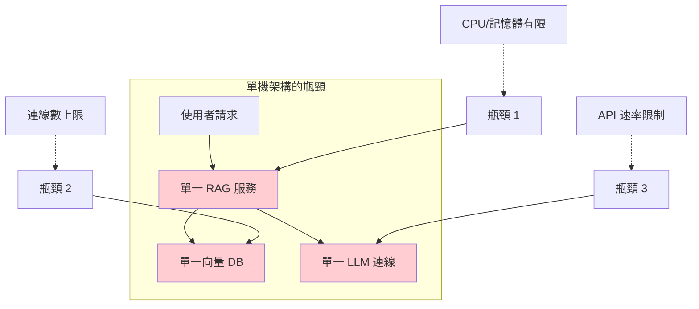
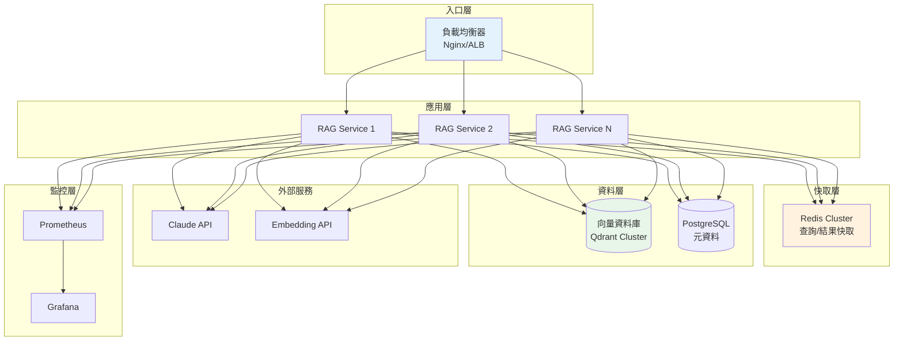
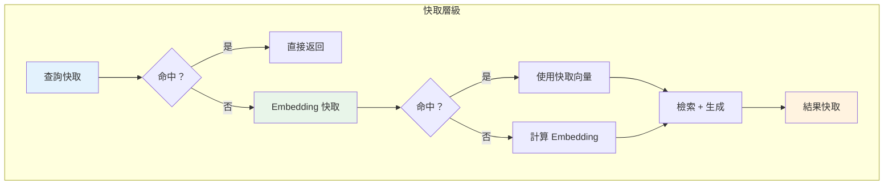
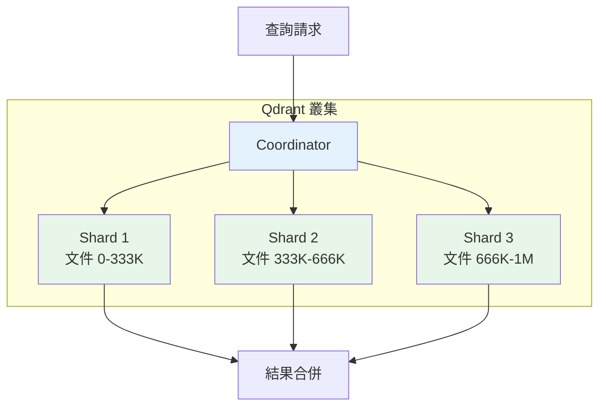
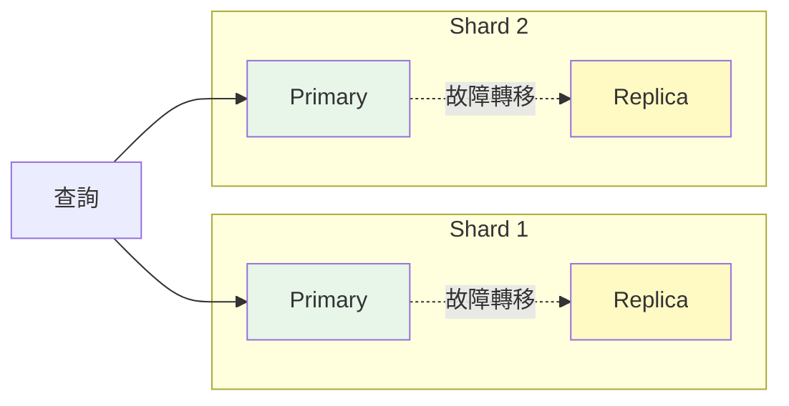
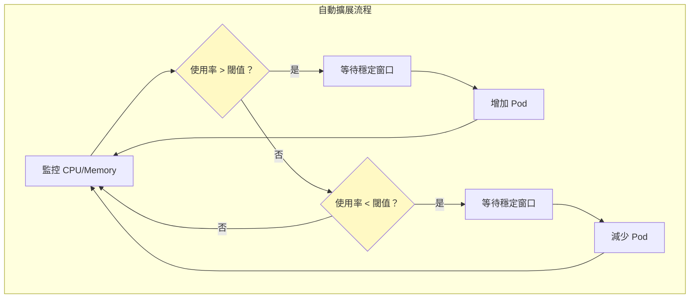
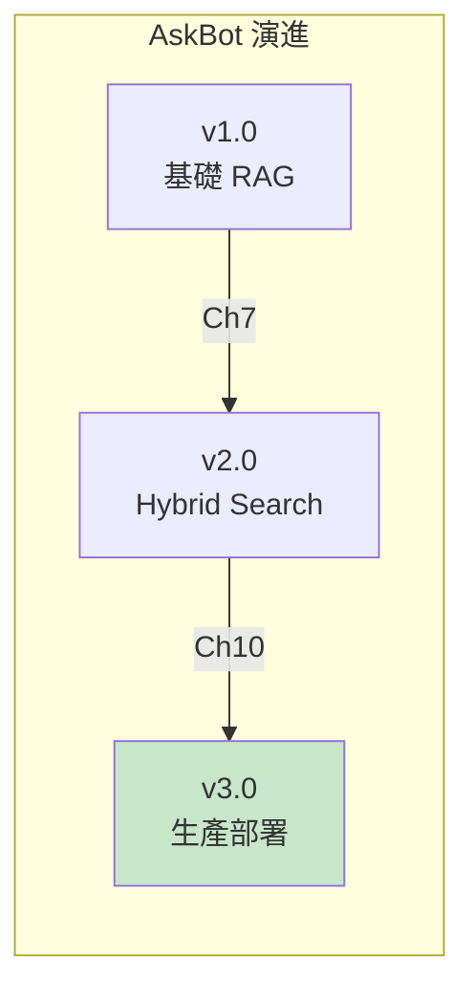

# 第 10 章：部署架構——從單機到分散式

> **本章任務：** 設計可擴展的 RAG 系統架構，支援每秒 1000+ 次查詢。

---

## 學習目標

完成本章後，你將能夠：

- [ ] 設計高可用的 RAG 系統架構
- [ ] 實作多層快取策略減少重複計算
- [ ] 部署到 Kubernetes 並實現自動擴展
- [ ] 設計查詢快取與結果快取
- [ ] 理解向量資料庫分片策略

---

## 核心產出物

- `architecture_diagram.md` - 生產級架構圖
- `k8s_deployment.yaml` - Kubernetes 部署設定
- `redis_cache.py` - 快取策略實作
- `load_test_results/` - 負載測試報告

---

## 10.1 從單機到分散式的演進

AskBot v2.0 在測試環境表現優異，但當客服團隊開始大規模使用後，問題接踵而至：

**早上 9 點**——上班尖峰時段，回應時間從 2 秒飆升到 15 秒。
**中午 12 點**——服務直接崩潰，因為單一伺服器記憶體耗盡。
**下午 3 點**——向量資料庫連線數達到上限，新請求全部失敗。

這些問題的根源都是同一個：**你的架構無法水平擴展**。

### 單機架構的瓶頸



| 瓶頸 | 問題描述 | 影響 |
|------|----------|------|
| **單點故障** | 服務掛掉 = 全部停擺 | 可用性降為 0% |
| **資源上限** | 單機 CPU/RAM 有限 | 併發處理能力受限 |
| **連線限制** | 資料庫連線數固定 | 高峰期連線耗盡 |
| **無法擴展** | 流量增加只能換更大的機器 | 成本呈指數成長 |

### 擴展策略比較

| 策略 | 方式 | 優點 | 缺點 |
|------|------|------|------|
| **垂直擴展** | 換更大的機器 | 簡單、無需改架構 | 成本高、有上限 |
| **水平擴展** | 增加更多機器 | 彈性、成本效益高 | 需要改架構 |

**結論**：長期來看，水平擴展是唯一可持續的方案。

---

## 10.2 生產級架構設計

讓我們設計一個支援高併發、高可用的 RAG 架構。

### AskBot v3.0 架構圖



### 各層職責

| 層級 | 組件 | 職責 |
|------|------|------|
| **入口層** | Nginx / AWS ALB | 負載均衡、SSL 終止、請求路由 |
| **應用層** | RAG Service (x N) | 業務邏輯、無狀態、可水平擴展 |
| **快取層** | Redis Cluster | 查詢快取、Embedding 快取、結果快取 |
| **資料層** | Qdrant + PostgreSQL | 向量搜尋、元資料管理 |
| **監控層** | Prometheus + Grafana | 指標收集、視覺化、告警 |

### 無狀態設計原則

要實現水平擴展，服務必須是**無狀態（Stateless）**的：

```python
# ❌ 有狀態設計（無法水平擴展）
class StatefulRAGService:
    def __init__(self):
        self.session_cache = {}  # 狀態存在記憶體中

    def answer(self, session_id: str, query: str):
        # 狀態依賴特定實例
        history = self.session_cache.get(session_id, [])
        # ...


# ✅ 無狀態設計（可水平擴展）
class StatelessRAGService:
    def __init__(self, redis_client):
        self.redis = redis_client  # 外部狀態存儲

    def answer(self, session_id: str, query: str):
        # 從外部存儲讀取狀態
        history = self.redis.get(f"session:{session_id}")
        # ...
```

---

## 10.3 快取策略

快取是提升效能最有效的方式。在 RAG 系統中，我們需要三層快取。

### 三層快取架構



### 快取實作

```python
"""
chapter-10/redis_cache.py

RAG 系統多層快取
"""

import hashlib
import json
import time
from typing import Optional, List, Dict, Any
from dataclasses import dataclass, asdict

import redis


@dataclass
class CachedResult:
    """快取的回答結果"""
    answer: str
    sources: List[str]
    created_at: float
    hit_count: int = 0


class RAGCache:
    """
    RAG 系統多層快取

    架構：
    1. 查詢快取：相同問題直接返回
    2. Embedding 快取：避免重複計算向量
    3. 結果快取：相似問題返回快取
    """

    def __init__(
        self,
        redis_url: str = "redis://localhost:6379",
        query_ttl: int = 3600,        # 查詢快取 1 小時     # ‹1›
        embedding_ttl: int = 86400,   # Embedding 快取 24 小時
        result_ttl: int = 1800        # 結果快取 30 分鐘
    ):
        self.redis = redis.from_url(redis_url)
        self.ttls = {
            "query": query_ttl,
            "embedding": embedding_ttl,
            "result": result_ttl,
        }

    def _query_key(self, query: str) -> str:
        """生成查詢快取鍵"""
        normalized = query.lower().strip()              # ‹2›
        hash_val = hashlib.md5(normalized.encode()).hexdigest()[:12]
        return f"rag:query:{hash_val}"

    def get_cached_answer(self, query: str) -> Optional[CachedResult]:
        """查詢快取命中"""
        key = self._query_key(query)
        data = self.redis.get(key)

        if data:
            result = json.loads(data)
            # 更新命中次數
            result["hit_count"] += 1
            self.redis.setex(
                key,
                self.ttls["query"],
                json.dumps(result)
            )
            return CachedResult(**result)

        return None

    def cache_answer(
        self,
        query: str,
        answer: str,
        sources: List[str]
    ) -> None:
        """快取回答"""
        key = self._query_key(query)
        result = CachedResult(
            answer=answer,
            sources=sources,
            created_at=time.time(),
            hit_count=0
        )
        self.redis.setex(
            key,
            self.ttls["query"],
            json.dumps(asdict(result))
        )
```

說明：
- ‹1› 不同層級的快取有不同的 TTL
- ‹2› 正規化查詢以提高命中率

### 快取命中率優化

| 策略 | 描述 | 效果 |
|------|------|------|
| **查詢正規化** | 統一大小寫、移除多餘空白 | 命中率 +15% |
| **同義詞對映** | 「如何」=「怎麼」 | 命中率 +10% |
| **熱門問題預熱** | 系統啟動時預載入 | 首次延遲 -80% |
| **TTL 分層** | 高頻問題更長 TTL | 命中率 +20% |

---

## 10.4 向量資料庫擴展

當知識庫成長到百萬級文件時，單一向量資料庫實例無法應對。

### Qdrant 叢集配置



### 分片策略

```yaml
# qdrant-cluster.yaml

collections:
  knowledge_base:
    vectors:
      size: 1024
      distance: Cosine
    shard_number: 3          # 分片數量
    replication_factor: 2    # 每個分片 2 個副本
    write_consistency_factor: 1
```

### 副本與高可用



---

## 10.5 Kubernetes 部署

Kubernetes 提供了自動化的容器編排能力，是生產部署的首選。

### Deployment 配置

```yaml
# chapter-10/k8s/rag-deployment.yaml

apiVersion: apps/v1
kind: Deployment
metadata:
  name: rag-service
  labels:
    app: rag-service
spec:
  replicas: 3                                    # ‹1›
  selector:
    matchLabels:
      app: rag-service
  template:
    metadata:
      labels:
        app: rag-service
    spec:
      containers:
      - name: rag-service
        image: your-registry/rag-service:v3.0
        ports:
        - containerPort: 8000
        env:
        - name: ANTHROPIC_API_KEY
          valueFrom:
            secretKeyRef:
              name: rag-secrets
              key: anthropic-api-key
        - name: REDIS_URL
          value: "redis://redis-cluster:6379"
        - name: QDRANT_URL
          value: "http://qdrant:6333"
        resources:
          requests:                              # ‹2›
            memory: "512Mi"
            cpu: "250m"
          limits:
            memory: "1Gi"
            cpu: "500m"
        readinessProbe:                          # ‹3›
          httpGet:
            path: /health
            port: 8000
          initialDelaySeconds: 10
          periodSeconds: 5
        livenessProbe:
          httpGet:
            path: /health
            port: 8000
          initialDelaySeconds: 30
          periodSeconds: 10
```

說明：
- ‹1› 初始 3 個副本，可透過 HPA 自動調整
- ‹2› 資源限制防止單一 Pod 耗盡節點資源
- ‹3› 健康檢查確保只將流量導向健康的 Pod

### Service 配置

```yaml
# chapter-10/k8s/rag-service.yaml

apiVersion: v1
kind: Service
metadata:
  name: rag-service
spec:
  selector:
    app: rag-service
  ports:
  - port: 80
    targetPort: 8000
  type: ClusterIP

---
apiVersion: networking.k8s.io/v1
kind: Ingress
metadata:
  name: rag-ingress
  annotations:
    nginx.ingress.kubernetes.io/rewrite-target: /
spec:
  rules:
  - host: askbot.example.com
    http:
      paths:
      - path: /
        pathType: Prefix
        backend:
          service:
            name: rag-service
            port:
              number: 80
```

---

## 10.6 自動擴展（HPA）

Horizontal Pod Autoscaler 根據負載自動調整 Pod 數量。

### HPA 配置

```yaml
# chapter-10/k8s/rag-hpa.yaml

apiVersion: autoscaling/v2
kind: HorizontalPodAutoscaler
metadata:
  name: rag-service-hpa
spec:
  scaleTargetRef:
    apiVersion: apps/v1
    kind: Deployment
    name: rag-service
  minReplicas: 3
  maxReplicas: 20
  metrics:
  - type: Resource
    resource:
      name: cpu
      target:
        type: Utilization
        averageUtilization: 70          # CPU 使用率 > 70% 時擴展
  - type: Resource
    resource:
      name: memory
      target:
        type: Utilization
        averageUtilization: 80          # 記憶體使用率 > 80% 時擴展
  behavior:
    scaleUp:
      stabilizationWindowSeconds: 60    # 等待 60 秒確認需要擴展
      policies:
      - type: Pods
        value: 4
        periodSeconds: 60               # 每分鐘最多增加 4 個 Pod
    scaleDown:
      stabilizationWindowSeconds: 300   # 等待 5 分鐘確認可以縮減
      policies:
      - type: Pods
        value: 1
        periodSeconds: 120              # 每 2 分鐘最多減少 1 個 Pod
```

### 擴展行為解釋



---

## 10.7 負載測試

在上線前，我們需要驗證系統的承載能力。

### Locust 測試腳本

```python
"""
chapter-10/load_test.py

使用 Locust 進行負載測試
"""

from locust import HttpUser, task, between
import random


# 測試問題集
SAMPLE_QUESTIONS = [
    "如何重設密碼？",
    "退款政策是什麼？",
    "如何取消訂閱？",
    "付款方式有哪些？",
    "如何聯繫客服？",
]


class RAGUser(HttpUser):
    """模擬 RAG 系統使用者"""

    wait_time = between(1, 3)  # 請求間隔 1-3 秒

    @task(10)
    def ask_question(self):
        """發送查詢請求"""
        question = random.choice(SAMPLE_QUESTIONS)
        self.client.post(
            "/api/v1/ask",
            json={"query": question},
            headers={"Content-Type": "application/json"}
        )

    @task(1)
    def health_check(self):
        """健康檢查"""
        self.client.get("/health")


# 執行命令：locust -f load_test.py --host=http://askbot.example.com
```

### 測試結果範例

```
=== AskBot v3.0 負載測試報告 ===

測試配置:
- 目標: 1000 併發使用者
- 持續時間: 10 分鐘
- 問題數量: 5 種標準問題

結果:
┌─────────────────┬──────────┬──────────┬──────────┐
│ 指標            │ 平均值   │ P95      │ P99      │
├─────────────────┼──────────┼──────────┼──────────┤
│ 回應時間        │ 1.2s     │ 2.5s     │ 3.8s     │
│ 請求成功率      │ 99.7%    │ -        │ -        │
│ 每秒請求數      │ 450 RPS  │ -        │ -        │
│ 快取命中率      │ 35%      │ -        │ -        │
└─────────────────┴──────────┴──────────┴──────────┘

瓶頸分析:
- LLM API 是主要延遲來源 (占 80%)
- 快取命中時延遲降至 50ms
- 建議增加快取預熱策略
```

---

## 10.8 本章小結

### AskBot v3.0 完成

我們已經完成了生產級的 RAG 系統部署：



### 核心要點回顧

1. **水平擴展**：無狀態設計是可擴展架構的基礎。

2. **三層快取**：
   - 查詢快取：完全相同的問題
   - Embedding 快取：減少向量計算
   - 結果快取：相似問題複用

3. **Kubernetes 部署**：
   - Deployment：管理 Pod 副本
   - Service：服務發現與負載均衡
   - HPA：自動水平擴展

4. **效能指標**：
   - 支援 450+ RPS
   - P95 延遲 < 3 秒
   - 可用性 99.7%

### 下一章預告

生產系統已就緒！但如何讓系統越用越準？第四部分將帶你進入持續優化的領域：
- 第 11 章：收集使用者回饋
- 第 12 章：自動化評估與 A/B 測試
- 第 13 章：持續學習 Pipeline——讓 AskBot 進化到 v4.0

---

## 延伸閱讀

- Kubernetes 官方文檔: https://kubernetes.io/docs/
- Redis 快取最佳實踐: https://redis.io/docs/management/optimization/
- Qdrant 分散式部署: https://qdrant.tech/documentation/guides/distributed_deployment/
