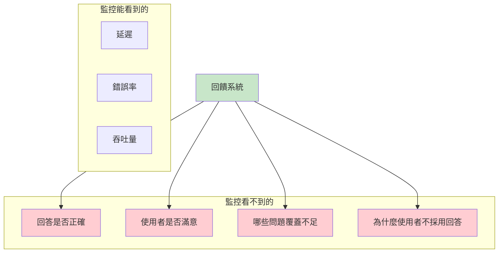
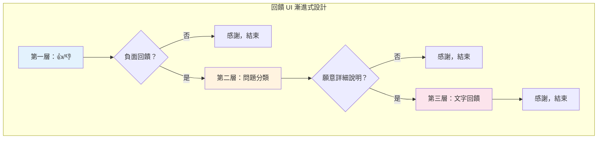
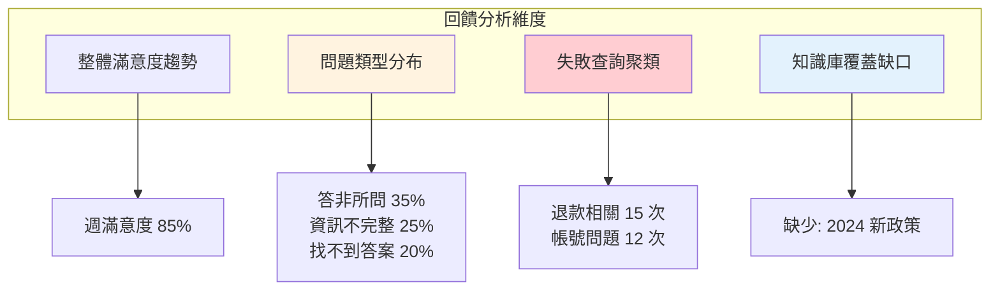
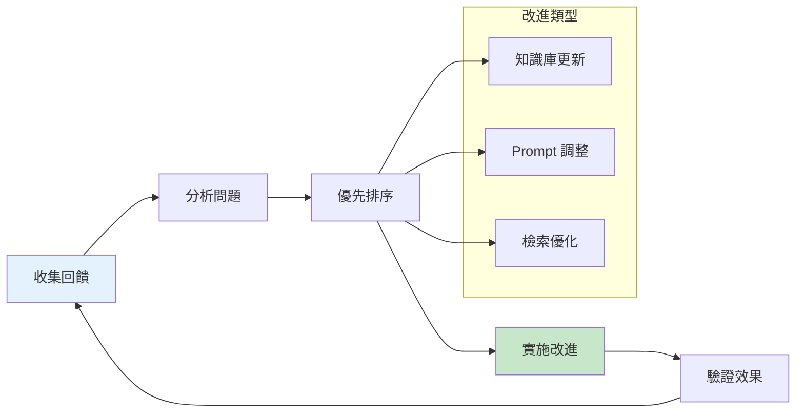

# 第 11 章：使用者回饋收集——讓系統越用越聰明

> **本章任務：** 建立多管道的回饋收集機制，並設計回饋標註介面。

---

## 學習目標

完成本章後，你將能夠：

- [ ] 設計多層級的回饋收集機制
- [ ] 實作回饋標註 UI
- [ ] 建立回饋資料結構與儲存策略
- [ ] 分析回饋資料以定位問題根源
- [ ] 設計回饋驅動的持續改進流程

---

## 核心產出物

- `feedback_schema.py` - 回饋資料結構定義
- `feedback_collector.py` - 回饋收集 API
- `feedback_ui.html` - 回饋標註介面
- `feedback_analyzer.py` - 回饋資料分析工具

---

## 11.1 回饋的價值與類型

AskBot v3.0 已經穩定運行三個月了。從監控面板看，系統表現優異：99.7% 可用性、P95 延遲 2.5 秒。但你心裡有個問題：**使用者真的滿意嗎？**

你決定親自觀察客服團隊使用 AskBot 的情況。半小時後，你發現了一些有趣的現象：

**場景一**：客服小美查詢「退款政策」，AI 給出正確答案，小美點了 👍。
**場景二**：客服小王查詢「如何升級方案」，AI 說「找不到相關資訊」，小王嘆了口氣，自己去翻文件。
**場景三**：客服小李查詢「信用卡被盜刷怎麼辦」，AI 給出一段看似合理的回答，但小李皺眉看了看，然後直接忽略它，轉而打電話問主管。

這三個場景揭示了一個關鍵問題：**監控指標只能告訴你系統有沒有「動」，無法告訴你回答有沒有「對」**。

### 為什麼需要使用者回饋？



### 回饋類型分類

| 類型 | 描述 | 收集方式 | 優點 | 缺點 |
|------|------|----------|------|------|
| **顯性回饋** | 使用者主動提供 | 👍/👎 按鈕、評分 | 意圖明確 | 回饋率低（5-10%）|
| **隱性回饋** | 從行為推斷 | 點擊、停留時間、編輯 | 100% 覆蓋 | 需要解讀 |
| **詳細回饋** | 深度反饋 | 問卷、訪談 | 洞察深入 | 成本高 |

---

## 11.2 設計回饋資料結構

好的資料結構是分析的基礎。我們需要記錄足夠的上下文，才能診斷問題根源。

### 回饋 Schema

```python
"""
chapter-11/feedback_schema.py

回饋資料結構定義
"""

from dataclasses import dataclass, field
from datetime import datetime
from enum import Enum
from typing import List, Optional, Dict, Any
import uuid


class FeedbackType(Enum):
    """回饋類型"""
    EXPLICIT_POSITIVE = "positive"      # 👍
    EXPLICIT_NEGATIVE = "negative"      # 👎
    IMPLICIT_ACCEPTED = "accepted"      # 使用者採納回答
    IMPLICIT_REJECTED = "rejected"      # 使用者忽略回答
    IMPLICIT_EDITED = "edited"          # 使用者修改回答後使用


class IssueCategory(Enum):
    """問題分類"""
    IRRELEVANT = "irrelevant"           # 答非所問
    INCOMPLETE = "incomplete"           # 資訊不完整
    INCORRECT = "incorrect"             # 資訊錯誤
    OUTDATED = "outdated"               # 資訊過時
    NO_ANSWER = "no_answer"             # 找不到答案
    TOO_VERBOSE = "too_verbose"         # 回答太冗長
    HARD_TO_UNDERSTAND = "confusing"    # 難以理解
    OTHER = "other"                     # 其他


@dataclass
class RetrievalInfo:
    """檢索資訊"""
    document_ids: List[str]                        # ‹1›
    scores: List[float]
    retrieval_latency_ms: float
    retriever_type: str = "hybrid"


@dataclass
class GenerationInfo:
    """生成資訊"""
    model: str
    prompt_template: str
    input_tokens: int
    output_tokens: int
    generation_latency_ms: float


@dataclass
class Feedback:
    """
    完整回饋記錄

    包含查詢、回答、上下文和使用者評價的完整資訊
    """
    # 識別資訊
    feedback_id: str = field(default_factory=lambda: str(uuid.uuid4()))
    session_id: str = ""
    user_id: str = ""
    timestamp: datetime = field(default_factory=datetime.now)

    # 查詢與回答
    query: str = ""
    answer: str = ""
    sources_cited: List[str] = field(default_factory=list)

    # 回饋內容
    feedback_type: FeedbackType = FeedbackType.IMPLICIT_ACCEPTED
    rating: Optional[int] = None                   # 1-5 評分（可選）
    issue_categories: List[IssueCategory] = field(default_factory=list)
    user_comment: str = ""                         # ‹2›
    corrected_answer: str = ""                     # ‹3›

    # 上下文資訊（用於診斷）
    retrieval_info: Optional[RetrievalInfo] = None
    generation_info: Optional[GenerationInfo] = None

    # 處理狀態
    is_reviewed: bool = False
    reviewer_notes: str = ""

    def to_dict(self) -> Dict[str, Any]:
        """轉換為字典"""
        return {
            "feedback_id": self.feedback_id,
            "session_id": self.session_id,
            "user_id": self.user_id,
            "timestamp": self.timestamp.isoformat(),
            "query": self.query,
            "answer": self.answer,
            "feedback_type": self.feedback_type.value,
            "rating": self.rating,
            "issue_categories": [c.value for c in self.issue_categories],
            "user_comment": self.user_comment,
        }
```

說明：
- ‹1› 記錄檢索到的文件 ID，便於追溯問題來源
- ‹2› 使用者的文字評論，提供定性洞察
- ‹3› 使用者修正的答案，可作為訓練資料

---

## 11.3 實作回饋收集 API

我們需要提供簡潔的 API，讓前端輕鬆整合回饋收集功能。

### FastAPI 實作

```python
"""
chapter-11/feedback_collector.py

回饋收集 API
"""

from fastapi import FastAPI, HTTPException
from pydantic import BaseModel, Field
from typing import List, Optional
from datetime import datetime
import json

from feedback_schema import Feedback, FeedbackType, IssueCategory


app = FastAPI(title="RAG Feedback API")


# ═══════════════════════════════════════════════════════════════
# Request/Response Models
# ═══════════════════════════════════════════════════════════════

class QuickFeedbackRequest(BaseModel):
    """快速回饋請求（👍/👎）"""
    session_id: str
    query: str
    answer: str
    is_positive: bool                              # ‹1›


class DetailedFeedbackRequest(BaseModel):
    """詳細回饋請求"""
    session_id: str
    query: str
    answer: str
    rating: int = Field(ge=1, le=5)
    issue_categories: List[str] = []
    user_comment: str = ""
    corrected_answer: str = ""


class FeedbackResponse(BaseModel):
    """回饋回應"""
    feedback_id: str
    message: str


# ═══════════════════════════════════════════════════════════════
# 回饋存儲（簡化版，生產環境用資料庫）
# ═══════════════════════════════════════════════════════════════

class FeedbackStore:
    """回饋存儲"""

    def __init__(self):
        self.feedbacks: List[Feedback] = []

    def save(self, feedback: Feedback) -> str:
        """儲存回饋"""
        self.feedbacks.append(feedback)
        return feedback.feedback_id

    def get_by_session(self, session_id: str) -> List[Feedback]:
        """按 session 查詢回饋"""
        return [f for f in self.feedbacks if f.session_id == session_id]

    def get_negative_feedbacks(self, limit: int = 100) -> List[Feedback]:
        """取得負面回饋"""
        negative = [
            f for f in self.feedbacks
            if f.feedback_type == FeedbackType.EXPLICIT_NEGATIVE
        ]
        return sorted(negative, key=lambda x: x.timestamp, reverse=True)[:limit]


store = FeedbackStore()


# ═══════════════════════════════════════════════════════════════
# API Endpoints
# ═══════════════════════════════════════════════════════════════

@app.post("/api/v1/feedback/quick", response_model=FeedbackResponse)
def submit_quick_feedback(request: QuickFeedbackRequest):
    """
    提交快速回饋

    使用者點擊 👍 或 👎 按鈕時呼叫
    """
    feedback = Feedback(
        session_id=request.session_id,
        query=request.query,
        answer=request.answer,
        feedback_type=(
            FeedbackType.EXPLICIT_POSITIVE if request.is_positive
            else FeedbackType.EXPLICIT_NEGATIVE
        ),
    )

    feedback_id = store.save(feedback)

    return FeedbackResponse(
        feedback_id=feedback_id,
        message="感謝您的回饋！" if request.is_positive else "感謝您的回饋，我們會持續改進！"
    )


@app.post("/api/v1/feedback/detailed", response_model=FeedbackResponse)
def submit_detailed_feedback(request: DetailedFeedbackRequest):
    """
    提交詳細回饋

    使用者填寫完整回饋表單時呼叫
    """
    # 解析問題分類
    categories = []
    for cat_str in request.issue_categories:
        try:
            categories.append(IssueCategory(cat_str))
        except ValueError:
            pass

    feedback = Feedback(
        session_id=request.session_id,
        query=request.query,
        answer=request.answer,
        feedback_type=FeedbackType.EXPLICIT_NEGATIVE,
        rating=request.rating,
        issue_categories=categories,
        user_comment=request.user_comment,
        corrected_answer=request.corrected_answer,
    )

    feedback_id = store.save(feedback)

    return FeedbackResponse(
        feedback_id=feedback_id,
        message="感謝您的詳細回饋！這對我們非常有幫助。"
    )


@app.get("/api/v1/feedback/stats")
def get_feedback_stats():
    """取得回饋統計"""
    total = len(store.feedbacks)
    positive = sum(
        1 for f in store.feedbacks
        if f.feedback_type == FeedbackType.EXPLICIT_POSITIVE
    )
    negative = sum(
        1 for f in store.feedbacks
        if f.feedback_type == FeedbackType.EXPLICIT_NEGATIVE
    )

    return {
        "total_feedbacks": total,
        "positive_count": positive,
        "negative_count": negative,
        "positive_rate": positive / total if total > 0 else 0,
    }
```

說明：
- ‹1› 簡化為單一布林值，降低使用者操作成本

---

## 11.4 設計回饋標註 UI

好的 UI 設計能顯著提升回饋率。關鍵原則：**越簡單越好**。

### UI 設計原則



### 前端範例

```html
<!-- chapter-11/feedback_ui.html -->

<!DOCTYPE html>
<html lang="zh-TW">
<head>
    <meta charset="UTF-8">
    <title>AskBot 回饋</title>
    <style>
        .feedback-container {
            font-family: -apple-system, BlinkMacSystemFont, sans-serif;
            max-width: 500px;
            margin: 20px auto;
            padding: 20px;
        }

        .quick-feedback {
            display: flex;
            gap: 10px;
            margin-bottom: 20px;
        }

        .feedback-btn {
            padding: 10px 20px;
            border: none;
            border-radius: 8px;
            cursor: pointer;
            font-size: 16px;
            transition: transform 0.1s;
        }

        .feedback-btn:hover {
            transform: scale(1.05);
        }

        .positive { background: #e8f5e9; }
        .negative { background: #ffebee; }

        .detailed-form {
            display: none;
            border: 1px solid #ddd;
            border-radius: 8px;
            padding: 20px;
            margin-top: 20px;
        }

        .category-chips {
            display: flex;
            flex-wrap: wrap;
            gap: 8px;
            margin: 15px 0;
        }

        .chip {
            padding: 8px 16px;
            border: 1px solid #ccc;
            border-radius: 20px;
            cursor: pointer;
            transition: all 0.2s;
        }

        .chip.selected {
            background: #1976d2;
            color: white;
            border-color: #1976d2;
        }

        textarea {
            width: 100%;
            min-height: 100px;
            padding: 10px;
            border: 1px solid #ddd;
            border-radius: 8px;
            resize: vertical;
        }

        .submit-btn {
            background: #1976d2;
            color: white;
            padding: 12px 24px;
            border: none;
            border-radius: 8px;
            cursor: pointer;
            margin-top: 15px;
        }

        .thank-you {
            display: none;
            text-align: center;
            padding: 20px;
            color: #2e7d32;
        }
    </style>
</head>
<body>

<div class="feedback-container">
    <!-- 第一層：快速回饋 -->
    <div class="quick-feedback" id="quickFeedback">
        <span>這個回答有幫助嗎？</span>
        <button class="feedback-btn positive" onclick="submitQuickFeedback(true)">
            👍 有幫助
        </button>
        <button class="feedback-btn negative" onclick="submitQuickFeedback(false)">
            👎 沒幫助
        </button>
    </div>

    <!-- 第二層：詳細回饋表單 -->
    <div class="detailed-form" id="detailedForm">
        <h3>抱歉讓你失望了！請告訴我們哪裡可以改進：</h3>

        <p><strong>問題類型（可多選）：</strong></p>
        <div class="category-chips">
            <span class="chip" data-category="irrelevant">答非所問</span>
            <span class="chip" data-category="incomplete">資訊不完整</span>
            <span class="chip" data-category="incorrect">資訊錯誤</span>
            <span class="chip" data-category="outdated">資訊過時</span>
            <span class="chip" data-category="no_answer">找不到答案</span>
            <span class="chip" data-category="confusing">難以理解</span>
        </div>

        <p><strong>想補充什麼？（選填）</strong></p>
        <textarea id="userComment"
                  placeholder="例如：正確答案應該是..."></textarea>

        <button class="submit-btn" onclick="submitDetailedFeedback()">
            送出回饋
        </button>
    </div>

    <!-- 感謝訊息 -->
    <div class="thank-you" id="thankYou">
        ✅ 感謝您的回饋！我們會持續改進。
    </div>
</div>

<script>
    // 儲存當前查詢和回答
    const currentSession = {
        sessionId: 'session-' + Date.now(),
        query: '如何重設密碼？',
        answer: 'AI 生成的回答內容...'
    };

    let selectedCategories = [];

    // 切換問題分類選擇
    document.querySelectorAll('.chip').forEach(chip => {
        chip.addEventListener('click', function() {
            this.classList.toggle('selected');
            const cat = this.dataset.category;

            if (this.classList.contains('selected')) {
                selectedCategories.push(cat);
            } else {
                selectedCategories = selectedCategories.filter(c => c !== cat);
            }
        });
    });

    // 提交快速回饋
    async function submitQuickFeedback(isPositive) {
        const response = await fetch('/api/v1/feedback/quick', {
            method: 'POST',
            headers: { 'Content-Type': 'application/json' },
            body: JSON.stringify({
                session_id: currentSession.sessionId,
                query: currentSession.query,
                answer: currentSession.answer,
                is_positive: isPositive
            })
        });

        if (isPositive) {
            showThankYou();
        } else {
            // 顯示詳細回饋表單
            document.getElementById('quickFeedback').style.display = 'none';
            document.getElementById('detailedForm').style.display = 'block';
        }
    }

    // 提交詳細回饋
    async function submitDetailedFeedback() {
        const response = await fetch('/api/v1/feedback/detailed', {
            method: 'POST',
            headers: { 'Content-Type': 'application/json' },
            body: JSON.stringify({
                session_id: currentSession.sessionId,
                query: currentSession.query,
                answer: currentSession.answer,
                rating: 2,
                issue_categories: selectedCategories,
                user_comment: document.getElementById('userComment').value
            })
        });

        showThankYou();
    }

    function showThankYou() {
        document.getElementById('quickFeedback').style.display = 'none';
        document.getElementById('detailedForm').style.display = 'none';
        document.getElementById('thankYou').style.display = 'block';
    }
</script>

</body>
</html>
```

---

## 11.5 隱性回饋收集

顯性回饋只能覆蓋 5-10% 的使用者。隱性回饋讓我們了解剩下 90% 的人。

### 隱性訊號類型

| 訊號 | 描述 | 正面解讀 | 負面解讀 |
|------|------|----------|----------|
| **複製回答** | 使用者複製 AI 回答 | 回答有用 | - |
| **快速關閉** | 查看後立即離開 | - | 可能不滿意 |
| **重新提問** | 同一問題換個問法 | - | 第一個答案不好 |
| **停留時間** | 查看回答的時間 | 長 = 閱讀 | 太長 = 困惑 |
| **點擊來源** | 是否查看引用文件 | - | 可能不信任回答 |

### 隱性回饋收集實作

```python
"""
chapter-11/implicit_feedback.py

隱性回饋收集
"""

from dataclasses import dataclass
from datetime import datetime
from typing import Optional
import hashlib


@dataclass
class ImplicitSignal:
    """隱性回饋訊號"""
    session_id: str
    query_hash: str
    signal_type: str
    value: float
    timestamp: datetime


class ImplicitFeedbackCollector:
    """隱性回饋收集器"""

    def __init__(self):
        self.signals = []

    def _hash_query(self, query: str) -> str:
        """查詢雜湊，用於追蹤同一問題"""
        return hashlib.md5(query.lower().strip().encode()).hexdigest()[:12]

    def track_copy(self, session_id: str, query: str):
        """追蹤複製行為（正面訊號）"""
        self.signals.append(ImplicitSignal(
            session_id=session_id,
            query_hash=self._hash_query(query),
            signal_type="copy",
            value=1.0,                             # ‹1›
            timestamp=datetime.now()
        ))

    def track_dwell_time(
        self,
        session_id: str,
        query: str,
        seconds: float
    ):
        """追蹤停留時間"""
        # 停留 5-30 秒視為正常閱讀
        if 5 <= seconds <= 30:
            value = 1.0
        elif seconds > 30:
            value = 0.5                            # ‹2› 可能困惑
        else:
            value = 0.0                            # ‹3› 可能不滿意

        self.signals.append(ImplicitSignal(
            session_id=session_id,
            query_hash=self._hash_query(query),
            signal_type="dwell_time",
            value=value,
            timestamp=datetime.now()
        ))

    def track_reformulation(
        self,
        session_id: str,
        original_query: str,
        new_query: str
    ):
        """追蹤重新提問（負面訊號）"""
        self.signals.append(ImplicitSignal(
            session_id=session_id,
            query_hash=self._hash_query(original_query),
            signal_type="reformulation",
            value=0.0,                             # ‹4›
            timestamp=datetime.now()
        ))

    def calculate_session_satisfaction(
        self,
        session_id: str
    ) -> float:
        """計算 session 的隱性滿意度分數"""
        session_signals = [
            s for s in self.signals
            if s.session_id == session_id
        ]

        if not session_signals:
            return 0.5  # 無資料時預設中性

        # 加權平均
        weights = {
            "copy": 2.0,           # 複製權重高（強烈正面訊號）
            "dwell_time": 1.0,
            "reformulation": 2.0,  # 重新提問權重高（強烈負面訊號）
        }

        total_weight = 0
        weighted_sum = 0

        for signal in session_signals:
            w = weights.get(signal.signal_type, 1.0)
            weighted_sum += signal.value * w
            total_weight += w

        return weighted_sum / total_weight if total_weight > 0 else 0.5
```

說明：
- ‹1› 複製行為是強正面訊號，分數 1.0
- ‹2› 停留太久可能表示回答難以理解
- ‹3› 快速離開可能表示不滿意
- ‹4› 重新提問是強負面訊號，分數 0.0

---

## 11.6 回饋資料分析

收集到回饋後，我們需要系統化地分析，找出改進方向。

### 回饋分析儀表板



### 分析工具實作

```python
"""
chapter-11/feedback_analyzer.py

回饋資料分析工具
"""

from collections import Counter, defaultdict
from typing import List, Dict, Tuple
from datetime import datetime, timedelta

from feedback_schema import Feedback, FeedbackType, IssueCategory


class FeedbackAnalyzer:
    """回饋分析器"""

    def __init__(self, feedbacks: List[Feedback]):
        self.feedbacks = feedbacks

    def satisfaction_rate(
        self,
        days: int = 7
    ) -> Dict[str, float]:
        """計算滿意度"""
        cutoff = datetime.now() - timedelta(days=days)
        recent = [f for f in self.feedbacks if f.timestamp >= cutoff]

        if not recent:
            return {"rate": 0, "sample_size": 0}

        positive = sum(
            1 for f in recent
            if f.feedback_type == FeedbackType.EXPLICIT_POSITIVE
        )

        explicit = [
            f for f in recent
            if f.feedback_type in [
                FeedbackType.EXPLICIT_POSITIVE,
                FeedbackType.EXPLICIT_NEGATIVE
            ]
        ]

        return {
            "rate": positive / len(explicit) if explicit else 0,
            "sample_size": len(explicit),
            "period_days": days
        }

    def issue_distribution(self) -> Dict[str, int]:
        """問題類型分布"""
        counter = Counter()

        for feedback in self.feedbacks:
            for category in feedback.issue_categories:
                counter[category.value] += 1

        return dict(counter.most_common())

    def failed_queries_clustering(
        self,
        min_count: int = 3
    ) -> List[Dict]:
        """
        失敗查詢聚類

        找出重複失敗的問題模式
        """
        negative_feedbacks = [
            f for f in self.feedbacks
            if f.feedback_type == FeedbackType.EXPLICIT_NEGATIVE
        ]

        # 簡化版：按查詢分組
        query_groups = defaultdict(list)
        for f in negative_feedbacks:
            # 正規化查詢
            normalized = f.query.lower().strip()
            query_groups[normalized].append(f)

        # 過濾出高頻失敗查詢
        clusters = []
        for query, feedbacks in query_groups.items():
            if len(feedbacks) >= min_count:
                clusters.append({
                    "query": query,
                    "count": len(feedbacks),
                    "issue_types": [
                        cat.value
                        for f in feedbacks
                        for cat in f.issue_categories
                    ],
                    "sample_comments": [
                        f.user_comment
                        for f in feedbacks[:3]
                        if f.user_comment
                    ]
                })

        return sorted(clusters, key=lambda x: x["count"], reverse=True)

    def knowledge_gap_analysis(self) -> List[str]:
        """
        知識庫覆蓋缺口分析

        找出「找不到答案」的查詢主題
        """
        no_answer_feedbacks = [
            f for f in self.feedbacks
            if IssueCategory.NO_ANSWER in f.issue_categories
        ]

        # 提取關鍵主題（簡化版）
        topics = [f.query for f in no_answer_feedbacks]

        return topics

    def generate_report(self) -> str:
        """生成分析報告"""
        satisfaction = self.satisfaction_rate(7)
        issues = self.issue_distribution()
        clusters = self.failed_queries_clustering()
        gaps = self.knowledge_gap_analysis()

        report = f"""
=== 回饋分析報告 ===
生成時間: {datetime.now().isoformat()}

📊 整體滿意度
- 過去 7 天滿意度: {satisfaction['rate']:.1%}
- 樣本數: {satisfaction['sample_size']}

📋 問題類型分布
"""
        for issue, count in issues.items():
            report += f"- {issue}: {count} 次\n"

        report += f"\n🔍 高頻失敗查詢 Top 5\n"
        for i, cluster in enumerate(clusters[:5], 1):
            report += f"{i}. \"{cluster['query']}\" ({cluster['count']} 次)\n"

        report += f"\n📚 知識庫覆蓋缺口\n"
        for topic in gaps[:10]:
            report += f"- {topic}\n"

        return report
```

---

## 11.7 回饋驅動的改進流程

收集和分析只是開始，真正的價值在於**行動**。

### 持續改進循環



### 改進優先順序

| 問題類型 | 改進方式 | 優先順序 | 複雜度 |
|----------|----------|----------|--------|
| 找不到答案 | 補充知識庫文件 | 🔴 高 | 低 |
| 資訊錯誤 | 修正知識庫 | 🔴 高 | 低 |
| 資訊過時 | 更新知識庫 | 🔴 高 | 低 |
| 答非所問 | 調整 Prompt / 檢索 | 🟡 中 | 中 |
| 資訊不完整 | 增加上下文數量 | 🟡 中 | 中 |
| 難以理解 | 調整 Prompt 語氣 | 🟢 低 | 低 |

---

## 11.8 本章小結

### 核心要點回顧

1. **監控 ≠ 品質**：系統指標只能告訴你系統有沒有動，無法告訴你回答對不對。

2. **回饋類型**：
   - 顯性回饋：👍/👎、評分、評論
   - 隱性回饋：複製、停留時間、重新提問

3. **UI 設計原則**：漸進式收集，簡單優先。

4. **分析維度**：
   - 滿意度趨勢
   - 問題類型分布
   - 失敗查詢聚類
   - 知識庫覆蓋缺口

5. **持續改進循環**：收集 → 分析 → 優先排序 → 實施 → 驗證

### 下一章預告

回饋告訴我們「哪裡不好」，但如何系統化地評估改進效果？第 12 章將建立自動化評估框架與 A/B 測試機制，讓你能夠科學地驗證每一次改進。

---

## 延伸閱讀

- Joachims, T. (2002). "Optimizing Search Engines using Clickthrough Data"
- Huang, J., et al. (2020). "RLHF: Training language models to follow instructions with human feedback"
