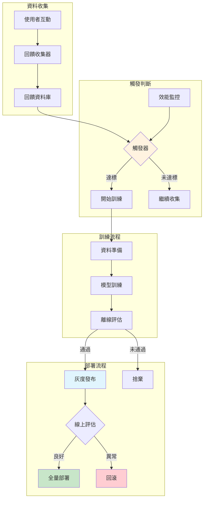
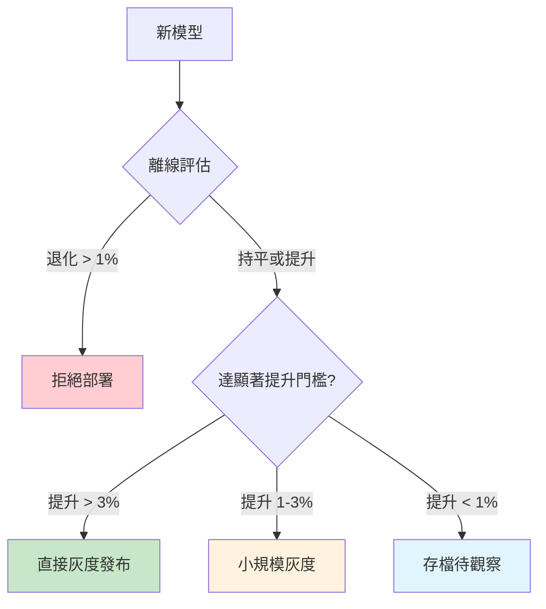
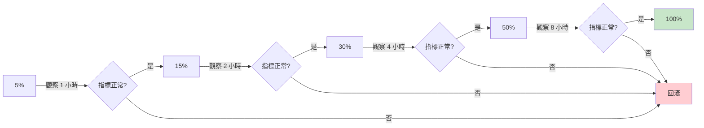
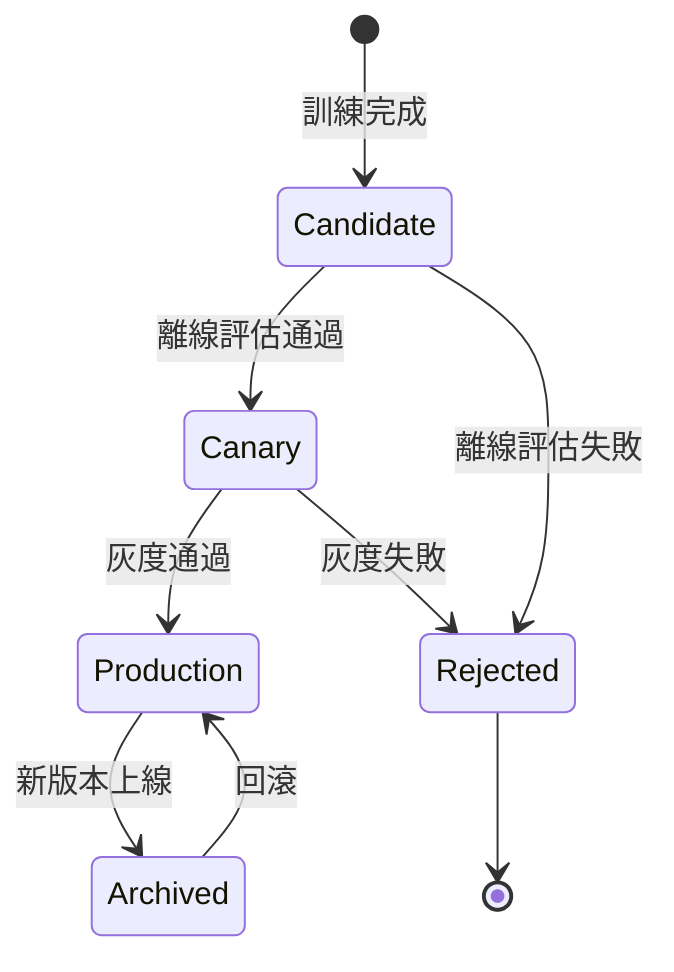
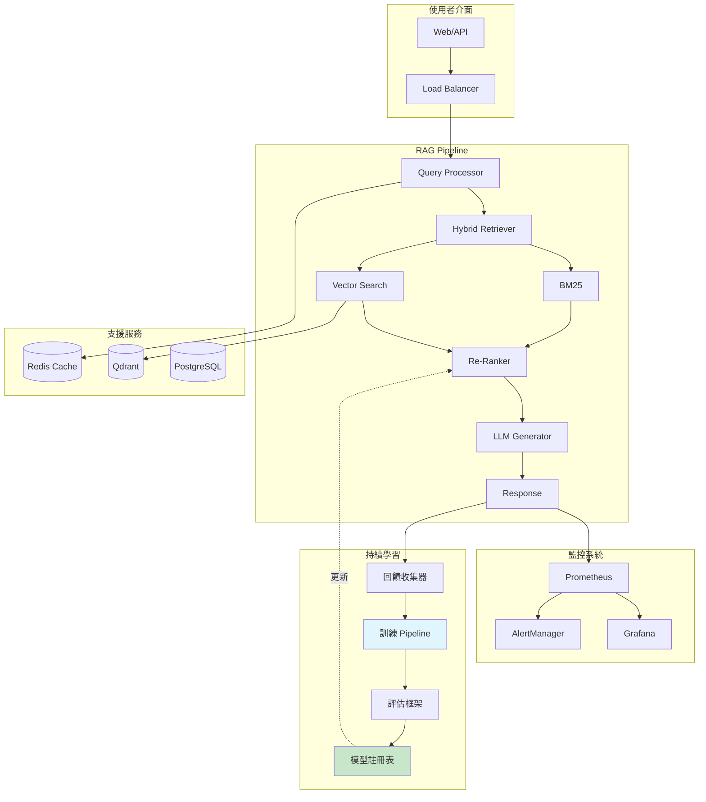

# 第 13 章：持續學習 Pipeline——讓系統自動進化

> **本章任務：** 整合回饋資料，建立自動重訓練與部署流程，完成 AskBot v4.0。

---

## 學習目標

完成本章後，你將能夠：

- [ ] 設計端到端的持續學習流程
- [ ] 實作自動化的模型重訓練與評估
- [ ] 建立安全的灰度發布機制
- [ ] 實作模型版本控制與回滾
- [ ] 處理持續學習的風險與挑戰

---

## 核心產出物

- `continuous_learning.py` - 持續學習 Pipeline
- `airflow_dag.py` - Airflow 工作流定義
- `canary_deployment.py` - 灰度發布腳本
- `model_versioning.py` - 模型版本管理

---

## 13.1 開場場景：從「跑起來」到「越跑越好」

AskBot 上線三個月了。使用者回饋源源不絕地進來，你發現了一些有趣的現象：

- 有些問題使用者反覆問，但系統總是答不好
- 使用者會用你沒想過的方式提問
- 某些專業術語在你建庫時根本沒考慮到
- 產品團隊新增了一批 FAQ，但系統似乎沒有「學會」

產品經理問你：「我們收集了這麼多回饋，能讓系統自己學習、自己進步嗎？」

你知道答案是肯定的。前面章節我們建立了回饋收集系統（第 11 章）和評估框架（第 12 章），現在是時候把它們串起來，讓 AskBot 從「被動服務」進化為「主動學習」。

這一章，我們將完成 **AskBot v4.0**——一個能夠持續進化的 RAG 系統。

---

## 13.2 持續學習架構概覽

### 13.2.1 什麼是持續學習？

傳統 ML 系統是「訓練一次，部署使用」的模式。但真實世界的資料會變化：

- **Concept Drift**：使用者提問的方式會改變
- **Data Drift**：知識庫內容會更新
- **Performance Decay**：模型效能會隨時間下降

持續學習（Continuous Learning）讓系統能夠：

1. **監控**：偵測效能變化
2. **觸發**：決定何時需要更新
3. **訓練**：用新資料改進模型
4. **評估**：確保新版本更好
5. **部署**：安全地切換到新版本

### 13.2.2 RAG 系統的持續學習目標

在 RAG 系統中，我們可以持續優化的元件有：

| 元件 | 優化目標 | 資料來源 |
|------|----------|----------|
| Re-Ranker | 更精準的排序 | 點擊、回饋 |
| Embedding 模型 | 更好的語義理解 | 成對資料 |
| Prompt 模板 | 更符合使用者期望的回答 | A/B 測試 |
| Chunking 策略 | 更適合的分割方式 | 檢索失敗案例 |

本章聚焦在**Re-Ranker 的持續學習**，因為它：
- 直接影響檢索品質
- 訓練成本相對較低
- 資料需求較小（數千筆即可）

### 13.2.3 端到端流程架構



---

## 13.3 觸發重訓練的條件

### 13.3.1 何時該重訓練？

不是「有新資料就訓練」，而是要在對的時機訓練。過於頻繁的重訓練會浪費資源，太少則無法跟上變化。

**觸發條件類型**：

| 類型 | 說明 | 優點 | 缺點 |
|------|------|------|------|
| 定期觸發 | 每週/每月固定訓練 | 可預測、資源規劃容易 | 可能不必要或太慢 |
| 效能下降觸發 | 指標低於門檻 | 及時響應問題 | 需要持續監控 |
| 資料量觸發 | 新回饋達到 N 筆 | 確保有足夠訓練資料 | 可能堆積問題 |
| 資料漂移觸發 | 偵測到分佈變化 | 主動發現問題 | 實作複雜 |

### 13.3.2 觸發器實作

```python
class TriggerCondition:
    """觸發條件配置"""
    # 定期觸發
    schedule_interval_days: int = 7

    # 效能下降觸發
    performance_threshold: float = 0.05  # 下降 5% 觸發
    performance_metric: str = "recall@5"

    # 回饋量觸發
    min_feedback_count: int = 1000

    # 資料漂移觸發
    drift_threshold: float = 0.1


class RetrainingTrigger:
    """重訓練觸發器"""

    def should_retrain(
        self,
        current_metrics: Dict[str, float],
        new_feedback_count: int
    ) -> tuple:
        """
        綜合判斷是否需要重訓練

        Returns:
            (是否觸發, 觸發類型)
        """
        # 優先級：效能下降 > 回饋量 > 定期
        if self.check_performance_trigger(current_metrics):    # ‹1›
            return True, TriggerType.PERFORMANCE_DEGRADATION

        if self.check_feedback_volume_trigger(new_feedback_count):  # ‹2›
            return True, TriggerType.FEEDBACK_VOLUME

        if self.check_scheduled_trigger():                     # ‹3›
            return True, TriggerType.SCHEDULED

        return False, None
```

說明：
- ‹1› 效能下降是最緊急的，優先處理
- ‹2› 回饋量達標代表有足夠資料訓練
- ‹3› 定期觸發作為最後保底

### 13.3.3 效能下降偵測

```python
def check_performance_trigger(
    self,
    current_metrics: Dict[str, float]
) -> bool:
    """檢查效能是否下降"""
    metric_name = self.config.performance_metric
    baseline = self.baseline_metrics.get(metric_name, 0)
    current = current_metrics.get(metric_name, 0)

    if baseline > 0:
        degradation = (baseline - current) / baseline

        if degradation >= self.config.performance_threshold:
            logger.warning(
                f"效能下降觸發：{metric_name} 從 {baseline:.3f} "
                f"降至 {current:.3f}（下降 {degradation:.1%}）"
            )
            return True

    return False
```

### 13.3.4 設定合理的觸發門檻

**經驗法則**：

| 場景 | 效能下降門檻 | 回饋量門檻 | 定期週期 |
|------|--------------|------------|----------|
| 高流量產品 | 3% | 1000 筆 | 3 天 |
| 中等流量 | 5% | 500 筆 | 7 天 |
| 低流量 | 10% | 200 筆 | 14 天 |

---

## 13.4 訓練資料準備

### 13.4.1 從回饋到訓練資料

使用者回饋是寶貴的監督訊號，但需要轉換成模型能學習的格式。

對於 Re-Ranker（Cross-Encoder），訓練資料格式是：

```
(query, document, label)
```

- `label = 1`：這個文件對這個查詢是相關的
- `label = 0`：這個文件對這個查詢是不相關的

### 13.4.2 正樣本的來源

| 回饋類型 | 正樣本定義 | 可靠度 |
|----------|------------|--------|
| 正面回饋（👍） | 回答引用的文件 | 高 |
| 負面回饋中標記的正確來源 | 使用者指定的正確文件 | 高 |
| 點擊資料 | 使用者點擊的文件 | 中 |
| 長停留時間 | 使用者閱讀較久的文件 | 低 |

### 13.4.3 負樣本的策略

負樣本品質直接影響模型效能。常見策略：

**策略一：隨機負樣本**

從文件庫隨機抽取。優點是簡單，缺點是太容易區分。

**策略二：Hard Negatives**

選擇「差點正確」的文件，讓模型學會細微差異：

```python
def _generate_negatives(
    self,
    query: str,
    positive_doc: str,
    retrieval_fn,
) -> List[str]:
    """生成負樣本（混合策略）"""
    negatives = []

    # Hard negatives：檢索結果中排名靠前但不正確的    # ‹1›
    num_hard = int(self.max_negatives * self.hard_negative_ratio)
    retrieved = retrieval_fn(query, top_k=20)

    for doc in retrieved:
        if doc != positive_doc:
            negatives.append(doc)
            if len(negatives) >= num_hard:
                break

    # Random negatives：補充隨機樣本                   # ‹2›
    # ...

    return negatives[:self.max_negatives]
```

說明：
- ‹1› Hard negatives 是模型「差點選對」的文件，訓練效果最好
- ‹2› 混入一些隨機負樣本可增加多樣性

**建議比例**：50% hard negatives + 50% random negatives

### 13.4.4 從負面回饋提取訓練資料

當使用者按下 👎 並標記「正確答案應該是 X」時，這是黃金級訓練資料：

```python
if feedback_type == "negative":
    # 使用者標記的正確答案作為正樣本
    correct_doc = fb.get("correct_source", "")

    # 原本錯誤的答案來源作為 hard negative        # ‹1›
    wrong_doc = fb.get("answer_source", "")
    negatives = [wrong_doc] if wrong_doc else []

    pairs.append(TrainingPair(
        query=query,
        positive_doc=correct_doc,
        negative_docs=negatives,
        source="feedback"
    ))
```

說明：
- ‹1› 系統原本選錯的文件是最有價值的 hard negative

### 13.4.5 資料品質檢查

訓練前要檢查資料品質：

```python
def validate_training_data(pairs: List[TrainingPair]) -> Dict[str, Any]:
    """驗證訓練資料品質"""
    issues = []

    # 檢查 1：正負樣本比例
    total_positive = len(pairs)
    total_negative = sum(len(p.negative_docs) for p in pairs)
    ratio = total_negative / total_positive if total_positive > 0 else 0

    if ratio < 2:
        issues.append("負樣本太少，建議至少 1:2")
    if ratio > 10:
        issues.append("負樣本太多，可能導致類別不平衡")

    # 檢查 2：查詢多樣性
    unique_queries = len(set(p.query for p in pairs))
    if unique_queries < len(pairs) * 0.8:
        issues.append("查詢重複率過高，可能過擬合")

    # 檢查 3：資料來源分佈
    sources = defaultdict(int)
    for p in pairs:
        sources[p.source] += 1

    return {
        "total_pairs": len(pairs),
        "positive_negative_ratio": ratio,
        "unique_queries": unique_queries,
        "source_distribution": dict(sources),
        "issues": issues
    }
```

---

## 13.5 重訓練 Re-Ranker 模型

### 13.5.1 選擇基礎模型

Re-Ranker 重訓練通常是**微調**而非從頭訓練：

| 基礎模型 | 參數量 | 適用場景 |
|----------|--------|----------|
| `ms-marco-MiniLM-L-6-v2` | 22M | 快速、資源受限 |
| `ms-marco-MiniLM-L-12-v2` | 33M | 平衡選擇 |
| `ms-marco-TinyBERT-L-6` | 15M | 極限低延遲 |
| `bge-reranker-base` | 278M | 高準確度 |

### 13.5.2 訓練流程

```python
@dataclass
class TrainingConfig:
    """訓練配置"""
    base_model: str = "cross-encoder/ms-marco-MiniLM-L-6-v2"
    epochs: int = 3                  # ‹1›
    batch_size: int = 16
    learning_rate: float = 2e-5      # ‹2›
    warmup_ratio: float = 0.1


class ReRankerTrainer:
    """Re-Ranker 重訓練器"""

    def train(
        self,
        training_pairs: List[TrainingPair],
        validation_pairs: List[TrainingPair]
    ) -> Dict[str, Any]:
        """執行訓練"""
        from sentence_transformers import CrossEncoder

        # 載入基礎模型
        model = CrossEncoder(self.config.base_model)

        # 準備訓練資料
        train_samples = self._prepare_samples(training_pairs)

        # 執行訓練
        model.fit(
            train_dataloader=train_samples,
            epochs=self.config.epochs,
            warmup_steps=int(len(train_samples) * self.config.warmup_ratio),
            output_path=model_path
        )

        return {"model_path": model_path, "metrics": {...}}
```

說明：
- ‹1› 微調通常 2-5 個 epoch 就足夠，過多會過擬合
- ‹2› 學習率要比預訓練時小，避免破壞原有知識

### 13.5.3 訓練資源估算

| 訓練資料量 | 預估時間（GPU） | 預估時間（CPU） |
|------------|-----------------|-----------------|
| 1,000 對 | 5 分鐘 | 30 分鐘 |
| 5,000 對 | 20 分鐘 | 2 小時 |
| 10,000 對 | 40 分鐘 | 4 小時 |

### 13.5.4 增量訓練 vs 完整重訓練

| 策略 | 做法 | 優點 | 缺點 |
|------|------|------|------|
| 增量訓練 | 只用新資料微調 | 快速、資源少 | 可能遺忘舊知識 |
| 完整重訓練 | 用全部資料訓練 | 穩定、全面 | 時間長、成本高 |
| 混合策略 | 新資料 + 舊資料抽樣 | 平衡 | 需要管理資料 |

**建議**：使用混合策略，新資料佔 70%，舊資料抽樣 30%。

---

## 13.6 自動化評估與決策

### 13.6.1 訓練後評估

訓練完成後，必須在離線測試集上評估：

```python
def evaluate_candidate_model(
    new_model,
    test_set: TestSet,
    baseline_metrics: Dict[str, float]
) -> Dict[str, Any]:
    """評估候選模型"""
    # 執行評估
    new_metrics = evaluator.evaluate(test_set, new_model)

    # 比較關鍵指標
    comparisons = {}
    for metric in ["recall@5", "mrr", "ndcg@5"]:
        baseline = baseline_metrics.get(metric, 0)
        current = new_metrics.get(metric, 0)
        change = (current - baseline) / baseline if baseline > 0 else 0

        comparisons[metric] = {
            "baseline": baseline,
            "new": current,
            "change": change,
            "improved": change > 0
        }

    # 決策
    decision = all(c["change"] >= -0.01 for c in comparisons.values())  # ‹1›

    return {
        "metrics": new_metrics,
        "comparisons": comparisons,
        "decision": "deploy" if decision else "reject"
    }
```

說明：
- ‹1› 允許小幅度波動（-1%），但不能明顯退化

### 13.6.2 部署決策流程



### 13.6.3 自動化決策配置

```python
class DeploymentDecision:
    """部署決策器"""

    def __init__(
        self,
        reject_threshold: float = -0.01,      # 退化超過 1% 拒絕
        cautious_threshold: float = 0.01,     # 提升 1% 小規模灰度
        confident_threshold: float = 0.03,    # 提升 3% 直接灰度
    ):
        self.reject_threshold = reject_threshold
        self.cautious_threshold = cautious_threshold
        self.confident_threshold = confident_threshold

    def decide(
        self,
        metric_change: float
    ) -> str:
        """做出決策"""
        if metric_change < self.reject_threshold:
            return "reject"
        elif metric_change >= self.confident_threshold:
            return "deploy_canary_50"   # 50% 流量灰度
        elif metric_change >= self.cautious_threshold:
            return "deploy_canary_10"   # 10% 流量灰度
        else:
            return "archive"            # 存檔不部署
```

---

## 13.7 灰度發布機制

### 13.7.1 為什麼需要灰度發布？

即使離線評估通過，線上環境可能有意外：

- 測試集無法覆蓋所有場景
- 真實流量分佈與測試集不同
- 系統整合可能有問題

灰度發布讓我們「試水溫」：先讓一小部分使用者使用新版本，觀察沒問題再逐步擴大。

### 13.7.2 灰度發布流程



### 13.7.3 灰度發布實作

```python
class CanaryDeployment:
    """灰度發布管理器"""

    def __init__(
        self,
        initial_percentage: float = 5.0,
        increment: float = 10.0,
        success_threshold: float = 0.95    # ‹1›
    ):
        self.initial_percentage = initial_percentage
        self.increment = increment
        self.success_threshold = success_threshold
        self.current_percentage = 0.0
        self.metrics_history: List[Dict] = []

    def should_increase_traffic(self) -> bool:
        """判斷是否應該增加流量"""
        if not self.metrics_history:
            return False

        # 檢查最近 3 個時間點的指標               # ‹2›
        recent = self.metrics_history[-3:]
        avg_success = np.mean([m["success_rate"] for m in recent])

        return avg_success >= self.success_threshold

    def should_rollback(self) -> bool:
        """判斷是否應該回滾"""
        recent = self.metrics_history[-3:]
        avg_success = np.mean([m["success_rate"] for m in recent])
        avg_error = np.mean([m["error_rate"] for m in recent])

        return avg_success < 0.8 or avg_error > 0.1    # ‹3›
```

說明：
- ‹1› 成功率至少要維持 95% 才能繼續擴大流量
- ‹2› 看連續 3 個時間點，避免單次波動誤判
- ‹3› 成功率低於 80% 或錯誤率超過 10% 立即回滾

### 13.7.4 流量分配機制

```python
def route_request(
    user_id: str,
    experiment_percentage: float
) -> str:
    """決定請求路由到哪個版本"""
    # 使用確定性雜湊，確保同一使用者總是路由到同一版本
    hash_value = hash(f"canary:{user_id}") % 100

    if hash_value < experiment_percentage:
        return "new_version"
    else:
        return "current_version"
```

---

## 13.8 模型版本控制

### 13.8.1 為什麼需要版本控制？

模型版本控制解決以下問題：

1. **可追溯性**：知道生產環境跑的是哪個版本
2. **可回滾性**：出問題時能快速切換回穩定版本
3. **可比較性**：比較不同版本的效能
4. **合規性**：審計時能重現歷史版本

### 13.8.2 模型版本資料結構

```python
@dataclass
class ModelVersion:
    """模型版本"""
    version_id: str
    model_path: str
    created_at: datetime
    metrics: Dict[str, float]
    status: str = "candidate"        # ‹1›
    trigger_type: Optional[TriggerType] = None
    training_samples: int = 0
```

說明：
- ‹1› 狀態流轉：`candidate` → `canary` → `production` → `archived`

### 13.8.3 模型註冊表

```python
class ModelRegistry:
    """模型註冊表"""

    def register(
        self,
        model_path: str,
        metrics: Dict[str, float],
        trigger_type: TriggerType,
        training_samples: int
    ) -> ModelVersion:
        """註冊新模型版本"""
        version_id = f"v{len(self.versions) + 1}"

        version = ModelVersion(
            version_id=version_id,
            model_path=model_path,
            created_at=datetime.now(),
            metrics=metrics,
            status="candidate",
            trigger_type=trigger_type,
            training_samples=training_samples
        )

        self.versions.append(version)
        self._save_registry()

        return version

    def promote_to_production(self, version_id: str) -> bool:
        """將版本升級為生產版本"""
        # 將當前生產版本降級
        for v in self.versions:
            if v.status == "production":
                v.status = "archived"

        # 升級目標版本
        target = self._find_version(version_id)
        target.status = "production"

        return True

    def rollback(self) -> Optional[ModelVersion]:
        """回滾到上一個穩定版本"""
        # 找到最近的歸檔版本
        archived = [v for v in self.versions if v.status == "archived"]
        archived.sort(key=lambda v: v.created_at, reverse=True)

        if archived:
            rollback_target = archived[0]
            rollback_target.status = "production"
            return rollback_target

        return None
```

### 13.8.4 版本生命週期



---

## 13.9 風險與挑戰

### 13.9.1 過擬合回饋資料

**問題**：如果只學習回饋資料，可能對特定類型的問題過擬合。

**解法**：
- 混合新舊資料訓練
- 定期在全面測試集上評估
- 監控各類別的效能分佈

```python
# 監控各類別效能
for category in ["account", "product", "order", "technical"]:
    category_metrics = evaluate_by_category(model, category)
    if category_metrics["recall@5"] < baseline[category] * 0.9:
        alert(f"類別 {category} 效能下降超過 10%")
```

### 13.9.2 回饋偏差

**問題**：願意給回饋的使用者可能不代表全體使用者。

**解法**：
- 結合隱式回饋（點擊、停留時間）
- 主動抽樣收集回饋
- 監控回饋來源分佈

### 13.9.3 模型漂移

**問題**：持續微調可能讓模型逐漸偏離原本的能力。

**解法**：
- 定期與原始 baseline 比較
- 保留原始模型作為參照
- 設定累積漂移門檻

### 13.9.4 資源與成本

**問題**：持續學習需要持續的計算資源。

**解法**：
- 設定合理的觸發門檻
- 使用增量訓練減少成本
- 在離峰時段執行訓練

---

## 13.10 使用 Airflow 編排工作流

### 13.10.1 為什麼需要工作流編排？

持續學習涉及多個步驟，需要：

- 定時觸發
- 步驟間依賴管理
- 失敗重試
- 執行記錄

Airflow 是業界標準的工作流編排工具。

### 13.10.2 DAG 定義

```python
# airflow_dag.py

from airflow import DAG
from airflow.operators.python import PythonOperator
from datetime import datetime, timedelta

default_args = {
    'owner': 'ml-team',
    'retries': 2,
    'retry_delay': timedelta(minutes=5),
}

with DAG(
    'rag_continuous_learning',
    default_args=default_args,
    schedule_interval='0 2 * * *',  # 每天凌晨 2 點
    start_date=datetime(2024, 1, 1),
    catchup=False
) as dag:

    # Step 1: 檢查觸發條件
    check_trigger = PythonOperator(
        task_id='check_trigger',
        python_callable=check_retraining_trigger
    )

    # Step 2: 準備訓練資料
    prepare_data = PythonOperator(
        task_id='prepare_data',
        python_callable=prepare_training_data
    )

    # Step 3: 訓練模型
    train_model = PythonOperator(
        task_id='train_model',
        python_callable=train_reranker
    )

    # Step 4: 評估模型
    evaluate = PythonOperator(
        task_id='evaluate',
        python_callable=evaluate_model
    )

    # Step 5: 部署決策
    deploy = PythonOperator(
        task_id='deploy',
        python_callable=deploy_if_better
    )

    check_trigger >> prepare_data >> train_model >> evaluate >> deploy
```

### 13.10.3 條件分支

```python
from airflow.operators.python import BranchPythonOperator

def decide_next_step(**context):
    """根據觸發檢查結果決定下一步"""
    should_train = context['task_instance'].xcom_pull(task_ids='check_trigger')

    if should_train:
        return 'prepare_data'
    else:
        return 'skip_training'

branch = BranchPythonOperator(
    task_id='branch',
    python_callable=decide_next_step
)
```

---

## 13.11 AskBot v4.0 完整系統總覽

經過 13 章的旅程，我們的 AskBot 已經從簡單的 MVP 進化為能夠自我進化的生產級系統。

### 13.11.1 版本演進回顧

| 版本 | 章節 | 核心能力 | 關鍵指標 |
|------|------|----------|----------|
| v1.0 | Ch3 | 基礎 RAG Pipeline | Recall@5: 0.55 |
| v2.0 | Ch7 | Hybrid Search + Re-Ranking | Recall@5: 0.78 |
| v3.0 | Ch10 | 生產級部署（K8s + 監控） | P99 Latency: 200ms |
| **v4.0** | **Ch13** | **持續學習** | **自動優化** |

### 13.11.2 完整架構圖



### 13.11.3 關鍵元件清單

| 元件 | 功能 | 章節 |
|------|------|------|
| BM25 Index | 關鍵字檢索 | Ch1 |
| Qdrant | 向量資料庫 | Ch2 |
| Sentence Transformers | Embedding 生成 | Ch5 |
| Cross-Encoder | Re-Ranking | Ch6 |
| Redis | 多層快取 | Ch10 |
| Prometheus + Grafana | 監控告警 | Ch9 |
| Feedback API | 回饋收集 | Ch11 |
| Evaluation Framework | 自動化評估 | Ch12 |
| Continuous Learning Pipeline | 自動重訓練 | Ch13 |

---

## 13.12 本章小結

### 核心要點回顧

1. **觸發機制決定何時學習**
   - 效能下降觸發最緊急
   - 回饋量觸發確保有足夠資料
   - 定期觸發作為保底

2. **資料品質決定學習效果**
   - 正樣本來自正面回饋和使用者標記
   - Hard negatives 比隨機負樣本更有價值
   - 混合新舊資料避免遺忘

3. **灰度發布確保安全上線**
   - 從小流量開始逐步擴大
   - 持續監控關鍵指標
   - 異常時立即回滾

4. **版本控制支援追溯回滾**
   - 每個版本都有完整元資料
   - 明確的狀態流轉機制
   - 支援一鍵回滾

### 持續學習 Pipeline 檢查清單

- [ ] 觸發條件配置合理
- [ ] 資料準備流程自動化
- [ ] 離線評估門檻設定
- [ ] 灰度發布流程完整
- [ ] 回滾機制經過測試
- [ ] 版本控制系統運作
- [ ] 監控告警設定完成
- [ ] 定期人工審查機制

---

## 13.13 批判與挑戰

### 13.13.1 過度依賴量化指標的陷阱

我們花了很多篇幅討論 Precision、Recall、ROUGE 等指標，但要記住：

> 「Not everything that counts can be counted, and not everything that can be counted counts.」 — Albert Einstein（存疑）

使用者滿意度不等於指標分數。一個 ROUGE 分數較低但更有人情味的回答，可能比機械式的「正確」回答更受歡迎。

**建議**：定期進行人工抽檢，不要完全依賴自動化指標。

### 13.13.2 持續學習的資源與風險成本

持續學習不是免費的：

- **計算成本**：訓練、評估、部署都需要資源
- **維護成本**：Pipeline 本身需要監控和維護
- **風險成本**：自動部署可能引入問題

對於中小規模的應用，可能「定期人工審查 + 手動部署」比全自動化更實際。

### 13.13.3 「越用越準」承諾的現實侷限

持續學習能讓系統「越用越準」，但有前提：

1. 使用者願意給回饋
2. 回饋品質足夠好
3. 問題是可學習的
4. 有足夠的計算資源

不是所有問題都能透過更多資料解決。有時候，根本性的架構改進比持續微調更重要。

---

## 13.14 總結與延伸學習

### 你獲得的核心能力

完成本書後，你已經掌握：

1. **RAG 系統設計**：從需求到架構的完整思維
2. **檢索優化**：BM25、向量搜尋、Hybrid Search、Re-Ranking
3. **生成優化**：Prompt Engineering、幻覺控制
4. **生產部署**：快取、監控、負載均衡、Kubernetes
5. **持續優化**：回饋收集、A/B 測試、自動重訓練

### 下一步學習路徑

RAG 領域還在快速發展，以下是值得關注的進階方向：

**GraphRAG**

結合知識圖譜的 RAG，能處理多跳推理問題：

```
問：「張三的老闆的公司在哪個城市？」
→ 需要先找到張三的老闆，再找到公司，再找到地點
```

**Agentic RAG**

讓 LLM 自己決定要不要檢索、檢索什麼：

```python
if llm.judge("需要查詢知識庫嗎？", query):
    docs = retriever.search(llm.generate_search_query(query))
    return llm.generate(query, docs)
else:
    return llm.generate(query)  # 直接回答
```

**多模態 RAG**

支援圖片、影片、音訊的檢索與生成：

- 產品圖片搜尋
- 技術文件中的流程圖理解
- 影片內容問答

---

## 延伸閱讀

- **MLOps 最佳實踐**：Google MLOps Whitepaper
- **模型監控**：Evidently AI, Arize
- **持續學習研究**：Continual Learning Survey (2023)
- **GraphRAG**：Microsoft GraphRAG Paper

---

**恭喜你完成本書！**

你已經從零開始，建立了一個能夠持續進化的企業級 RAG 系統。

AskBot 的旅程告一段落，但你的 RAG 之旅才剛開始。

去建造屬於你的智慧搜尋系統吧！
