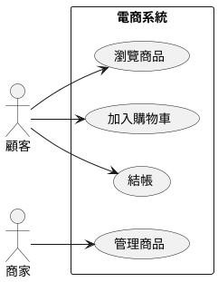
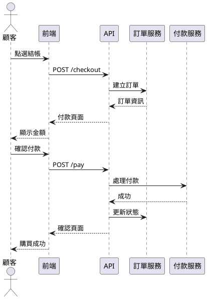
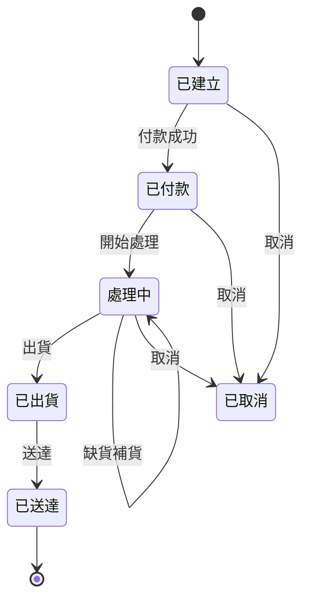

# 第8章　需求建模的推薦方法

> 「模型是用來溝通的，不是用來裝飾文件的。選擇最能幫助理解的建模方法。」

---

## 8.1 為什麼需要建模？

### 8.1.1 模型的價值

**模型**：對現實的簡化表達，強調某些面向，忽略其他面向。

模型的價值：

| 價值 | 說明 |
|------|------|
| **溝通** | 用圖形比文字更容易理解 |
| **分析** | 發現遺漏、矛盾、複雜度 |
| **驗證** | 確認理解是否正確 |
| **設計導引** | 從需求推導設計 |
| **文件** | 作為系統的紀錄 |

### 8.1.2 模型的限制

模型不是銀彈：

- **模型是簡化的**：省略細節，可能漏掉重要資訊
- **模型可能過時**：需求變了，模型沒更新
- **模型可能被誤解**：讀者的解讀和作者不同
- **模型需要維護成本**：做太多模型，維護不了

**原則**：只做必要的模型，服務溝通目的。

### 8.1.3 建模的時機

| 時機 | 適合做模型 | 不需要模型 |
|------|-----------|-----------|
| 複雜度 | 複雜流程、多角色互動 | 簡單 CRUD |
| 不確定性 | 需要釐清理解 | 已經很清楚 |
| 溝通需求 | 跨團隊、跨領域 | 小團隊、面對面 |
| 文件需求 | 合規、審計 | 敏捷、快速迭代 |

---

## 8.2 場景建模（Scenario-Based Modeling）

### 8.2.1 使用案例圖（Use Case Diagram）

**目的**：展示系統的功能邊界和參與者。

**元素**：

| 元素 | 符號 | 說明 |
|------|------|------|
| 參與者（Actor） | 人形符號 | 與系統互動的人或外部系統 |
| 使用案例（Use Case） | 橢圓 | 系統提供的功能 |
| 關聯（Association） | 線段 | 參與者與使用案例的關係 |
| 系統邊界 | 方框 | 系統的範圍 |

**範例：電商系統**：

```
┌──────────────────────────────────────────┐
│              電商系統                      │
│                                          │
│   ┌─────────┐      ┌─────────┐          │
│   │瀏覽商品 │      │ 搜尋商品│          │
│   └────┬────┘      └────┬────┘          │
│        │                │               │
│   ┌────┴────┐      ┌────┴────┐          │
│   │加入購物車│      │查看購物車│          │
│   └────┬────┘      └────┬────┘          │
│        │                │               │
│   ┌────┴────────────────┴────┐          │
│   │          結帳             │          │
│   └────┬─────────────────────┘          │
│        │                                 │
│   ┌────┴────┐      ┌─────────┐          │
│   │ 追蹤訂單│      │管理商品  │          │
│   └─────────┘      └─────────┘          │
│                                          │
└──────────────────────────────────────────┘
     ▲                        ▲
     │                        │
   顧客                     商家
```

**進階關係**：

| 關係 | 符號 | 說明 |
|------|------|------|
| Include | `<<include>>` | A 一定會用到 B |
| Extend | `<<extend>>` | A 可能會用到 B |
| 繼承 | 三角箭頭 | 特殊化的參與者或使用案例 |

### 8.2.2 活動圖（Activity Diagram）

**目的**：展示業務流程或使用案例的步驟。

**元素**：

| 元素 | 符號 | 說明 |
|------|------|------|
| 開始 | 實心圓 | 流程起點 |
| 結束 | 圓環內實心圓 | 流程終點 |
| 活動 | 圓角矩形 | 一個步驟 |
| 決策 | 菱形 | 分支條件 |
| 分支/合併 | 粗橫線 | 並行處理 |
| 泳道 | 縱向分隔 | 不同角色的責任 |

**範例：購買流程**：

```
┌───────────────┬───────────────┬───────────────┐
│    顧客        │    系統        │    倉庫       │
├───────────────┼───────────────┼───────────────┤
│      ●        │               │               │
│      ▼        │               │               │
│ ┌─────────┐   │               │               │
│ │加入購物車│   │               │               │
│ └────┬────┘   │               │               │
│      ▼        │               │               │
│ ┌─────────┐   │               │               │
│ │ 點選結帳│───►│               │               │
│ └─────────┘   │ ┌─────────┐   │               │
│               │ │ 計算金額│   │               │
│               │ └────┬────┘   │               │
│               │      ▼        │               │
│ ┌─────────┐   │ ┌─────────┐   │               │
│ │ 選擇付款│◄──│ │顯示金額 │   │               │
│ └────┬────┘   │ └─────────┘   │               │
│      ▼        │               │               │
│ ┌─────────┐   │               │               │
│ │ 確認付款│───►│               │               │
│ └─────────┘   │ ┌─────────┐   │               │
│               │ │ 處理付款│   │               │
│               │ └────┬────┘   │               │
│               │      ◇        │               │
│               │     ╱╲        │               │
│               │    ╱  ╲       │               │
│               │  成功  失敗    │               │
│               │    ╲  ╱       │               │
│               │     ╲╱        │               │
│               │      ▼        │               │
│               │ ┌─────────┐   │ ┌─────────┐   │
│               │ │建立訂單 │───►│ │準備出貨 │   │
│               │ └────┬────┘   │ └─────────┘   │
│ ┌─────────┐   │      │        │               │
│ │收到確認 │◄──│──────┘        │               │
│ └────┬────┘   │               │               │
│      ▼        │               │               │
│      ◉        │               │               │
└───────────────┴───────────────┴───────────────┘
```

### 8.2.3 泳道圖（Swimlane Diagram）

泳道圖是活動圖的變體，用縱向或橫向分隔來表示不同角色的責任。

**好處**：
- 清楚顯示責任歸屬
- 識別跨角色的互動
- 發現流程瓶頸

---

## 8.3 資料建模（Data Modeling）

### 8.3.1 實體關係圖（ER Diagram）

**目的**：展示系統的資料結構和關係。

**元素**：

| 元素 | 符號 | 說明 |
|------|------|------|
| 實體（Entity） | 矩形 | 需要儲存的物件 |
| 屬性（Attribute） | 橢圓 | 實體的特性 |
| 關係（Relationship） | 菱形 | 實體之間的關聯 |
| 基數（Cardinality） | 1, N, M | 關係的數量 |

**基數表示法**：

| 符號 | 意義 |
|------|------|
| 1 | 恰好一個 |
| 0..1 | 零或一個 |
| 0..* 或 * | 零到多個 |
| 1..* | 一到多個 |

**範例：電商系統**：

```
┌─────────────┐      ┌─────────────┐      ┌─────────────┐
│    顧客     │      │    訂單     │      │    商品     │
├─────────────┤      ├─────────────┤      ├─────────────┤
│ 顧客ID (PK) │      │ 訂單ID (PK) │      │ 商品ID (PK) │
│ 姓名        │      │ 顧客ID (FK) │      │ 名稱        │
│ 電話        │      │ 訂單日期    │      │ 價格        │
│ 地址        │      │ 總金額      │      │ 庫存量      │
│ 電子郵件    │      │ 狀態        │      │ 描述        │
└──────┬──────┘      └──────┬──────┘      └──────┬──────┘
       │                    │                    │
       │        1           │           1        │
       └───────◇────────────┴────────◇──────────┘
              下單                   包含
               │                      │
              0..*                  1..*

                      ┌─────────────┐
                      │  訂單明細   │
                      ├─────────────┤
                      │ 明細ID (PK) │
                      │ 訂單ID (FK) │
                      │ 商品ID (FK) │
                      │ 數量        │
                      │ 單價        │
                      └─────────────┘
```

### 8.3.2 類別圖（Class Diagram）

**目的**：展示系統的類別結構和關係（OOP 設計）。

**元素**：

| 元素 | 說明 |
|------|------|
| 類別名稱 | 頂部區塊 |
| 屬性 | 中間區塊 |
| 方法 | 底部區塊 |

**關係類型**：

| 關係 | 符號 | 說明 |
|------|------|------|
| 關聯 | 實線 | 一般關係 |
| 繼承 | 空心三角箭頭 | is-a 關係 |
| 實作 | 虛線空心三角 | 實作介面 |
| 組合 | 實心菱形 | has-a（強，整體消失部分也消失） |
| 聚合 | 空心菱形 | has-a（弱，整體消失部分還在） |
| 依賴 | 虛線箭頭 | uses |

**範例**：

```
┌───────────────────┐
│     <<interface>> │
│      Payable      │
├───────────────────┤
│                   │
├───────────────────┤
│ +pay(): boolean   │
└────────▲──────────┘
         │
         │ implements
         │
┌────────┴──────────┐       ┌───────────────────┐
│      Order        │       │      Customer     │
├───────────────────┤       ├───────────────────┤
│ -orderId: String  │       │ -customerId: String│
│ -orderDate: Date  │◆──────│ -name: String      │
│ -totalAmount: int │ 1   1 │ -email: String     │
├───────────────────┤       ├───────────────────┤
│ +calculate(): int │       │ +getOrders(): List │
│ +pay(): boolean   │       └───────────────────┘
└────────┬──────────┘
         │
         │ 1..*
         │
         ◆
┌────────┴──────────┐       ┌───────────────────┐
│    OrderItem      │       │     Product       │
├───────────────────┤       ├───────────────────┤
│ -quantity: int    │──────►│ -productId: String│
│ -unitPrice: int   │ *   1 │ -name: String     │
├───────────────────┤       │ -price: int       │
│ +getSubtotal(): int│      ├───────────────────┤
└───────────────────┘       │ +isInStock(): bool│
                            └───────────────────┘
```

---

## 8.4 行為建模（Behavioral Modeling）

### 8.4.1 狀態圖（State Diagram）

**目的**：展示物件的狀態變化。

**元素**：

| 元素 | 符號 | 說明 |
|------|------|------|
| 狀態 | 圓角矩形 | 物件的狀態 |
| 轉換 | 箭頭 | 狀態變化 |
| 觸發事件 | 箭頭上的文字 | 導致轉換的事件 |
| 守衛條件 | [條件] | 轉換的前提條件 |
| 動作 | /動作 | 轉換時執行的動作 |
| 初始狀態 | 實心圓 | 起始狀態 |
| 終止狀態 | 圓環內實心圓 | 結束狀態 |

**範例：訂單狀態**：

```
                    ●
                    │
                    ▼
            ┌───────────────┐
            │    已建立     │
            └───────┬───────┘
                    │ 付款成功
                    ▼
            ┌───────────────┐
            │    已付款     │
            └───────┬───────┘
                    │ 開始處理
                    ▼
            ┌───────────────┐
            │    處理中     │◄─────────┐
            └───────┬───────┘          │
                    │ 出貨             │ 缺貨補貨
                    ▼                  │
            ┌───────────────┐          │
     ┌─────►│    已出貨     │──────────┘
     │      └───────┬───────┘
     │              │ 送達
     │              ▼
     │      ┌───────────────┐
     │      │    已送達     │
     │      └───────┬───────┘
     │              │
     │              ▼
     │              ◉
     │
     │      ┌───────────────┐
     └──────│    已取消     │◄─────── 任何狀態
            └───────────────┘         [取消條件]
```

### 8.4.2 序列圖（Sequence Diagram）

**目的**：展示物件之間的互動順序。

**元素**：

| 元素 | 說明 |
|------|------|
| 生命線 | 物件的時間軸 |
| 同步訊息 | 實線實心箭頭 |
| 非同步訊息 | 實線開放箭頭 |
| 回傳 | 虛線箭頭 |
| 活化區塊 | 生命線上的矩形 |

**範例：購買流程**：

```
┌──────┐      ┌──────┐      ┌──────┐      ┌──────┐      ┌──────┐
│ 顧客 │      │ 前端 │      │ API  │      │ 訂單 │      │ 付款 │
└──┬───┘      └──┬───┘      └──┬───┘      └──┬───┘      └──┬───┘
   │              │              │              │              │
   │  點選結帳    │              │              │              │
   │─────────────►│              │              │              │
   │              │ POST /checkout               │              │
   │              │─────────────►│              │              │
   │              │              │ 建立訂單     │              │
   │              │              │─────────────►│              │
   │              │              │              │──┐            │
   │              │              │              │  │ 計算金額   │
   │              │              │              │◄─┘            │
   │              │              │ 訂單資訊     │              │
   │              │              │◄─────────────│              │
   │              │ 顯示付款頁面 │              │              │
   │              │◄─────────────│              │              │
   │  付款頁面    │              │              │              │
   │◄─────────────│              │              │              │
   │              │              │              │              │
   │  確認付款    │              │              │              │
   │─────────────►│              │              │              │
   │              │ POST /pay    │              │              │
   │              │─────────────►│              │              │
   │              │              │ 處理付款     │              │
   │              │              │─────────────────────────────►│
   │              │              │              │              │──┐
   │              │              │              │              │  │ 驗證
   │              │              │              │              │◄─┘
   │              │              │ 付款結果     │              │
   │              │              │◄─────────────────────────────│
   │              │              │ 更新狀態     │              │
   │              │              │─────────────►│              │
   │              │ 確認頁面     │              │              │
   │              │◄─────────────│              │              │
   │  購買成功    │              │              │              │
   │◄─────────────│              │              │              │
   │              │              │              │              │
```

---

## 8.5 選擇適當的建模方法

### 8.5.1 根據目的選擇

| 目的 | 推薦方法 |
|------|----------|
| 展示系統功能範圍 | 使用案例圖 |
| 展示業務流程 | 活動圖 |
| 展示資料結構 | ER 圖、類別圖 |
| 展示物件狀態變化 | 狀態圖 |
| 展示互動順序 | 序列圖 |
| 展示系統架構 | 元件圖、部署圖 |

### 8.5.2 根據受眾選擇

| 受眾 | 推薦方法 |
|------|----------|
| 業務人員 | 使用案例圖、活動圖（高層次） |
| 分析師 | 使用案例、ER 圖、狀態圖 |
| 開發者 | 類別圖、序列圖、狀態圖 |
| 測試人員 | 使用案例、狀態圖、活動圖 |
| 維運人員 | 部署圖、元件圖 |

### 8.5.3 敏捷中的建模

**原則**：

1. **夠用就好**：不需要完整的 UML，需要什麼做什麼
2. **白板優先**：先在白板上畫，需要時再正式化
3. **對話為主**：模型是對話的工具，不是目的
4. **及時建模**：需要時才做，不要預先做太多

**敏捷建模實踐**：

| 實踐 | 說明 |
|------|------|
| 模型風暴 | 5-10 分鐘的快速建模討論 |
| CRC 卡片 | 用卡片探索類別和責任 |
| 草圖 | 手繪的非正式圖表 |
| 即興建模 | 在需要時才建模 |

---

## 8.6 建模工具

### 8.6.1 工具類型

| 類型 | 例子 | 適用情境 |
|------|------|----------|
| **白板/便利貼** | 實體白板、Miro | 即時討論、腦力激盪 |
| **繪圖工具** | draw.io、Lucidchart | 快速繪圖、分享 |
| **UML 工具** | PlantUML、Enterprise Architect | 正式文件、程式碼生成 |
| **文字轉圖** | Mermaid、PlantUML | 版本控制、文件內嵌 |

### 8.6.2 PlantUML 範例

**使用案例圖**：



**序列圖**：



### 8.6.3 Mermaid 範例

**狀態圖**：



---

## 8.7 本章總結

### 核心概念

| 概念 | 一句話解釋 |
|------|-----------|
| 模型目的 | 溝通、分析、驗證、設計導引 |
| 使用案例圖 | 展示系統功能邊界和參與者 |
| 活動圖 | 展示業務流程或使用案例步驟 |
| ER 圖 | 展示資料結構和關係 |
| 類別圖 | 展示 OOP 類別結構 |
| 狀態圖 | 展示物件的狀態變化 |
| 序列圖 | 展示物件互動順序 |

### 實踐指引

1. **根據目的選擇**：不同目的用不同的圖
2. **根據受眾調整**：業務人員用高層次圖，開發者用詳細圖
3. **夠用就好**：不需要完整 UML，需要什麼做什麼
4. **版本控制**：使用文字轉圖工具（PlantUML、Mermaid）
5. **保持更新**：過時的模型比沒有模型更糟

### 下一章預告

需求建模完成後，如何開始設計？下一章我們將學習「設計的概念」——什麼是好的設計？設計的基本原則有哪些？

---

## 延伸思考

1. 你的團隊使用什麼建模方法？為什麼選擇它？

2. 你遇過因為模型過時而造成的問題嗎？如何避免？

3. 在敏捷環境中，你如何平衡「足夠的文件」和「快速交付」？

---

*下一章：第9章　設計的概念*
