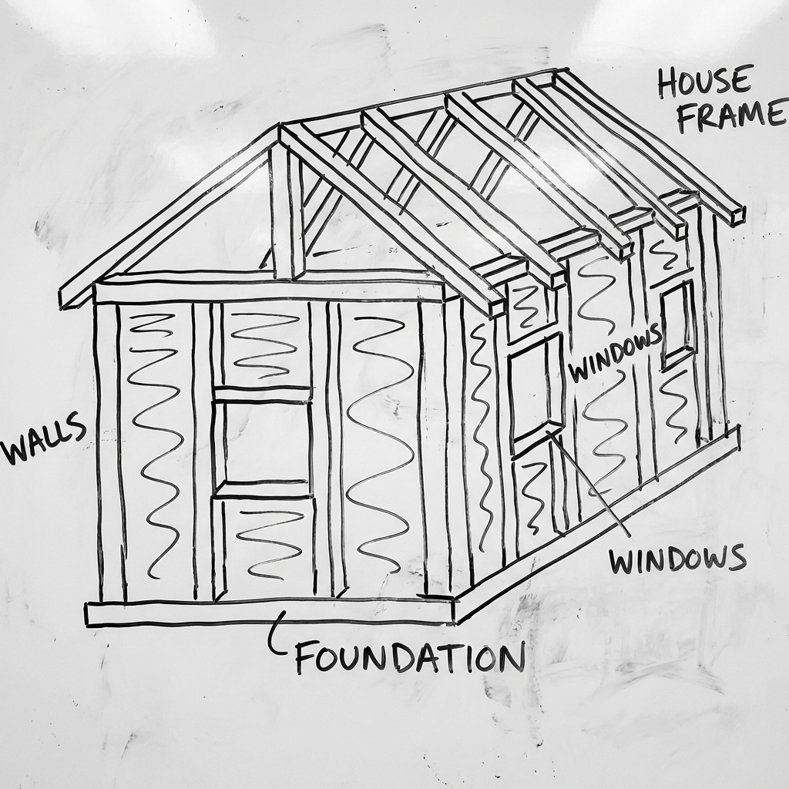

# 001 房屋是如何建造的？

> **適合年齡**: 5-9 歲
> **所需時間**: 10-15 分鐘
> **白板需求**: 小型可擦寫白板、黑色與紅色白板筆

---

## 今日主題

為什麼我們的房子不會倒下來？一棟房子從地底下的「腳」到屋頂的「帽子」，是怎麼一層一層蓋起來的？

---

## 準備工作

### 白板初始圖形
先在白板中央畫一條水平線，代表地面。

### 所需道具（可選）
- 幾塊積木或樂高（示範結構原理）
- 一張紙（示範「承重」概念：把紙平放可以放東西，但立起來就會倒）

---

## 引導問題

用這些問題開啟對話，激發孩子的好奇心：

1. 「你覺得房子最重要的部分是什麼？屋頂？牆壁？還是地板？」
2. 「如果我們用積木蓋房子，要先蓋哪裡？」
3. 「你有沒有注意過工地？他們最先做什麼？」

---

## 白板圖解步驟

### Step 1：畫出地基（房子的「腳」）

在地面線下方畫一個寬寬的長方形，用紅筆標記「地基」。

**說這些話**：
「蓋房子要從地底下開始喔！這個叫做『地基』，就像房子的腳。想像一下，如果你站在沙灘上，腳會陷進去對不對？但如果你穿上很大很大的雪靴，就不會陷進去了。地基就是房子的大雪靴，讓房子穩穩地站在土地上。」

### Step 2：畫出柱子和梁（房子的「骨頭」）

在地基上方畫幾根垂直的長方形（柱子），再用橫線連接它們（梁）。

**說這些話**：
「接下來，工人會立起這些柱子，就像房子的骨頭。你的身體有骨頭才能站起來，房子也需要骨頭。然後用橫的梁把柱子連起來，這樣房子就有了骨架。你看，像不像一個大大的框框？」

### Step 3：畫出牆壁（房子的「皮膚」）

在柱子之間畫上牆壁，可以畫幾個窗戶。

**說這些話**：
「有了骨架之後，就可以砌牆了。牆壁就像房子的皮膚，把裡面和外面分開，擋住風和雨，也不讓壞人進來。我們再畫幾個窗戶，這樣房子才看得到外面的風景！」

### Step 4：畫上屋頂（房子的「帽子」）

在最上面畫一個三角形屋頂，可以加上煙囪。

**說這些話**：
「最後戴上帽子！屋頂是斜的，你知道為什麼嗎？這樣下雨的時候，雨水就會滑下去，不會積在上面把房子壓壞。就像你戴的帽子，雨水也會從帽簷滑下去，不會流到你的臉上！」

---

## 核心原理

**一句話版本**：
房子是從下往上蓋的：地基→柱子→梁→牆壁→屋頂，每一層都在幫上面一層分擔重量。

**延伸解釋**（供家長參考）：
建築的核心概念是「力的傳遞」。屋頂的重量傳給梁，梁傳給柱子，柱子傳給地基，地基把所有重量分散到土地上。這叫做「荷重路徑」。地基做得越大越深，能分散的重量就越多，房子就越穩固。高樓大廈的地基可能深達地下 30-60 公尺，比房子高度的三分之一還要深！

---

## 互動環節

### 讓孩子動手
「現在換你來當建築師！你能在白板上畫一棟你夢想中的房子嗎？記得要從地基開始喔！你想要幾層樓？要不要游泳池？」

### 討論問題
- 「你覺得一棟 100 層的大樓，地基要挖多深？」
- 「如果地震來了，房子會怎樣？要怎麼讓房子更安全？」
- 「樹屋有地基嗎？它是怎麼站穩的？」

---

## 日常連結

下次經過工地時，一起觀察：
- 「看！他們正在挖地基，好深啊！你看那個洞比爸爸還高！」
- 「那些鐵條叫做鋼筋，會埋在水泥裡面，讓房子的骨頭更強壯，就像我們的骨頭裡面有鈣一樣。」
- 「那台黃色的大機器叫做挖土機，它的手臂好長喔！」

---

## 進階探索（給好奇寶寶）

如果孩子想知道更多：
- **「為什麼有些房子是木頭蓋的，有些是水泥？」** → 不同的材料有不同的優點。木頭輕、溫暖、容易加工；水泥重、堅固、防火。日本很多房子用木頭，因為地震時木頭會彎不會斷。
- **「101 大樓為什麼不會倒？」** → 可以延伸到第 007 篇「摩天大樓為什麼不怕強風」

---

## 常見問題

**Q: 為什麼高樓不會被風吹倒？**
A: 高樓裡面有很重很重的「防搖擺器」（阻尼器），當風吹來的時候，它會往反方向動，幫房子保持平衡，就像你走鋼索時張開手臂一樣！台北 101 裡面就有一顆超級大的金色球球，重達 660 噸，比 100 隻大象還重！

**Q: 地震的時候房子會怎樣？**
A: 地震的時候地面會搖，房子也會跟著搖。好的房子會像竹子一樣，搖一搖但不會斷掉。工程師會在房子的骨頭裡面加入特別的設計，讓房子可以「彎腰」但不會「跌倒」。

---

## 家長小抄

記住這個順序：**地基→柱梁→牆壁→屋頂**

核心比喻：
- 地基 = 大雪靴（分散重量，不會陷進土裡）
- 柱梁 = 骨頭（支撐整個結構）
- 牆壁 = 皮膚（隔離內外，擋風遮雨）
- 屋頂 = 帽子（排水保護，不讓雨積在上面）

**小技巧**：如果孩子問「為什麼不從屋頂開始蓋？」，可以讓他試著把積木從上面往下疊，他很快就會發現行不通！
