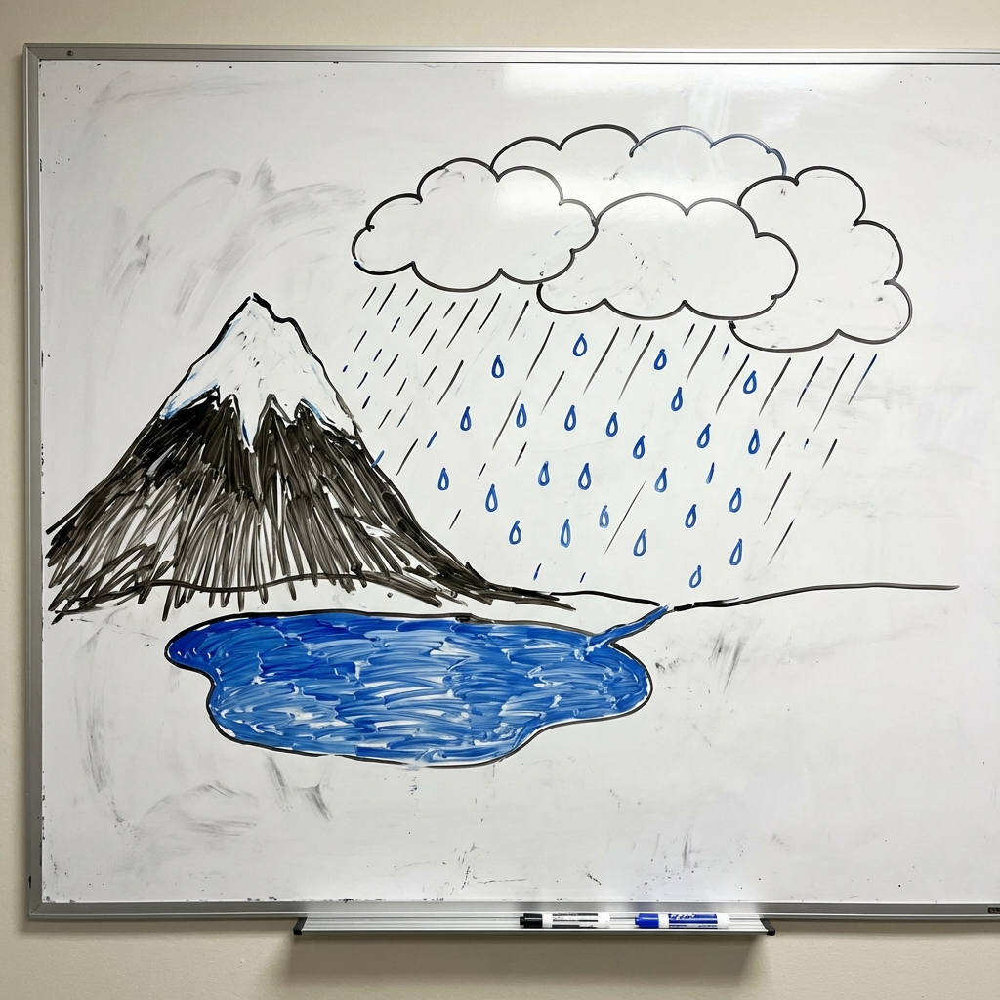
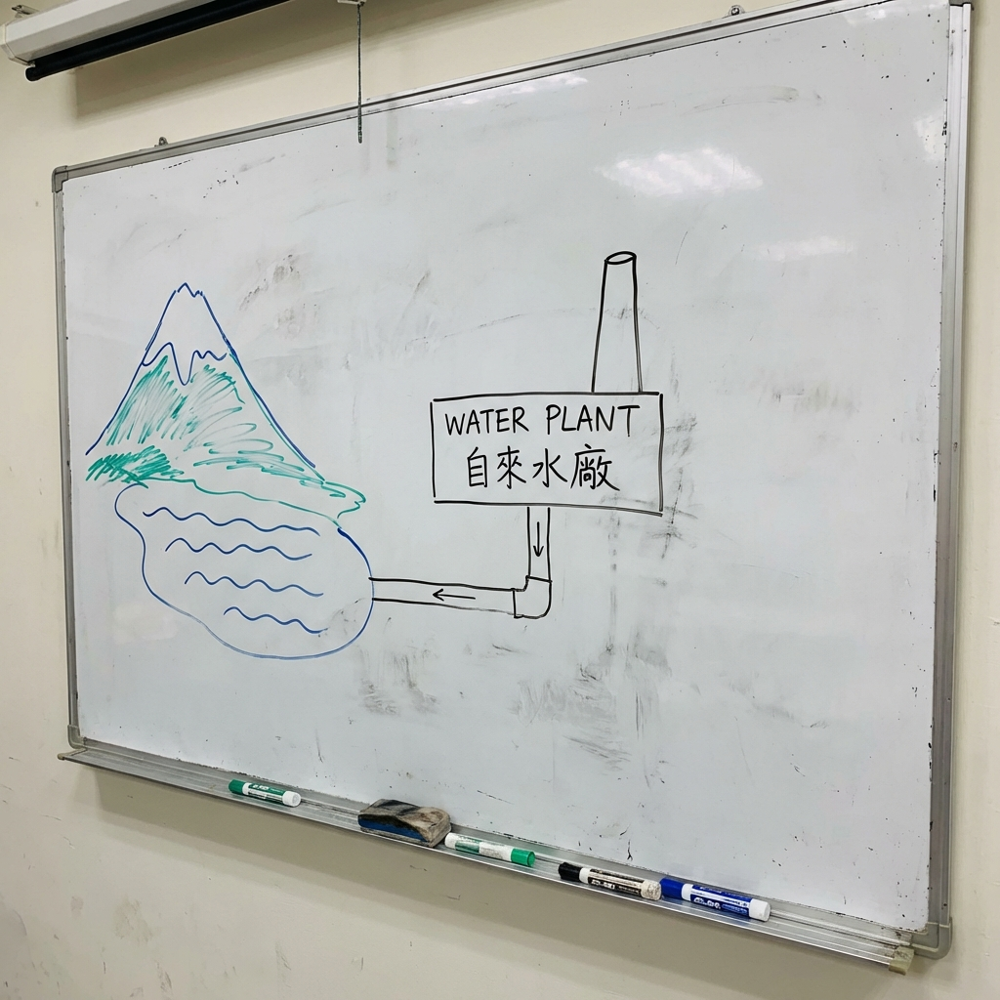
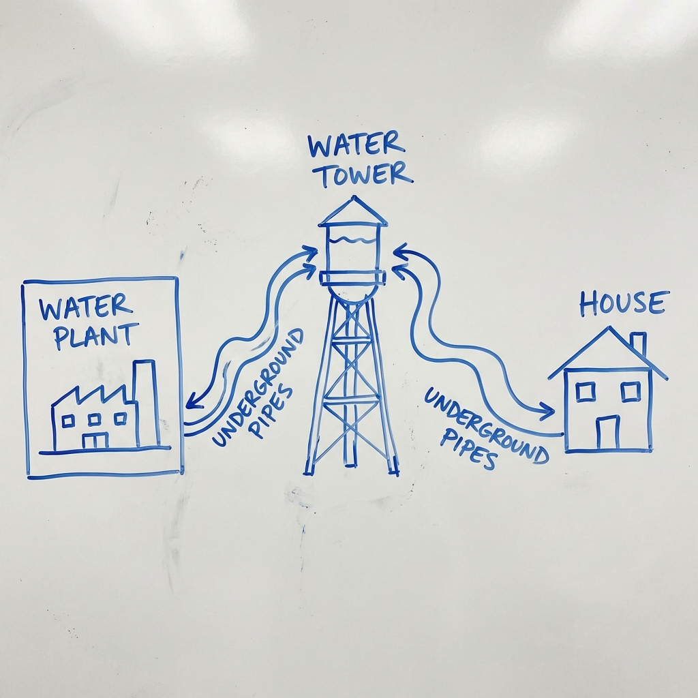
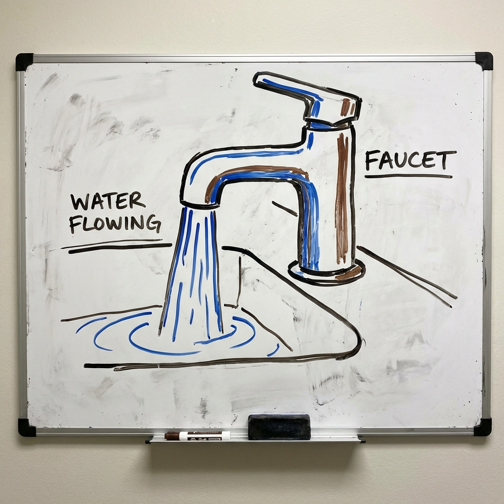

# 002 城市的水是從哪裡來的？

> **適合年齡**: 5-9 歲
> **所需時間**: 10-15 分鐘
> **白板需求**: 小型可擦寫白板、藍色與黑色白板筆

---

## 今日主題

打開水龍頭就有乾淨的水流出來，這些水是從哪裡來的？它是怎麼跑到我們家的？

---

## 準備工作

### 白板初始圖形
在白板左邊畫一座山和一個湖泊（水源），右邊畫一棟房子。

### 所需道具（可選）
- 一杯水（觀察乾淨的水）
- 咖啡濾紙（示範過濾原理）
- 小石子和沙子（如果要做簡易過濾實驗）

---

## 引導問題

用這些問題開啟對話：

1. 「你覺得水龍頭裡的水，是從哪裡來的？」
2. 「河裡的水可以直接喝嗎？為什麼？」
3. 「如果沒有水管，古時候的人怎麼喝水？」

---

## 白板圖解步驟

### Step 1：畫出水源（水的家）

把左邊的山和湖泊加上細節，用藍色筆畫水。可以加上雲和雨。

**說這些話**：
「水的旅程從這裡開始！下雨的時候，雨水會流到山上的湖泊或河流裡。這就是水的家，我們叫它『水源』。但是這些水還不能直接喝喔，裡面可能有小蟲子、泥巴，還有我們看不見的細菌。」

### Step 2：畫出自來水廠（水的洗澡間）

在湖泊和房子中間畫一個工廠建築，標示「自來水廠」。

**說這些話**：
「水要先去一個地方洗澡，就是『自來水廠』。在這裡，工人叔叔阿姨會幫水洗澡。首先，讓水靜靜地待著，重的髒東西就會沉到底下。然後讓水穿過沙子做的床，像咖啡濾紙一樣，把小小的髒東西過濾掉。最後加一點點消毒水，把細菌殺光光！」

### Step 3：畫出水管網路（水的高速公路）

從水廠畫藍色的線（水管）連到房子，在中間畫一個高高的水塔。

**說這些話**：
「洗乾淨的水要怎麼到我們家呢？就是走這些地下水管！水管就像水的高速公路，埋在馬路下面，連到每一棟房子。你看，這裡還有一個高高的水塔，水會先爬到上面去。」

### Step 4：畫出家裡的水龍頭

在房子旁邊放大畫一個水龍頭，有水流出來。

**說這些話**：
「最後，水就從水龍頭流出來啦！從山上的湖，經過自來水廠洗澡，走過地下水管的高速公路，爬上水塔，最後到你的杯子裡。是不是很神奇？這趟旅程可能要走好幾公里，比你跑操場好幾百圈還要遠！」

---

## 核心原理

**一句話版本**：
水從湖泊或河流出發，經過自來水廠過濾消毒，再透過地下水管送到每一戶人家。

**延伸解釋**（供家長參考）：
自來水處理主要有四個步驟：
1. **混凝沉澱**：加入藥劑讓髒東西結成團，沉到底部
2. **過濾**：通過沙濾池，濾掉細小雜質
3. **消毒**：加氯或用臭氧殺菌
4. **儲存輸送**：存在配水池，透過水管配送

水塔的作用是利用「位能」產生水壓。水在高處時有位能，流下來時位能轉換成動能，自然產生壓力，不需要在每戶裝水泵。

---

## 互動環節

### 讓孩子動手
「你能畫出水的旅程地圖嗎？從天上的雲開始，一路畫到你的杯子裡！」

### 討論問題
- 「如果停水了，我們要怎麼辦？」
- 「為什麼不能喝河裡的水？」
- 「沙漠裡的人要怎麼取得乾淨的水？」

---

## 日常連結

下次看到這些東西時，可以跟孩子聊聊：
- **水塔**：「看！那個高高的桶子就是水塔，水會先爬到那裡去休息，然後再流到我們家。」
- **人孔蓋**：「馬路上的圓形蓋子下面可能就有水管喔！」
- **水費帳單**：「這張紙告訴我們這個月用了多少水，還有要付多少錢給自來水公司。」

---

## 進階探索（給好奇寶寶）

如果孩子想知道更多：
- **「為什麼水塔要蓋那麼高？」** → 水從高處往下流會有壓力，這樣我們打開水龍頭水才會噴出來。如果水塔比你家矮，水就流不進來了！
- **「海水可以變成飲用水嗎？」** → 可以！這叫「海水淡化」，就像把海水煮沸，讓水蒸氣跑出來，再讓它變回水，鹽巴就會留在後面。

---

## 常見問題

**Q: 為什麼自來水有時候有消毒水的味道？**
A: 那是加進去殺細菌的「氯」。就像游泳池的水也有這個味道。把水放在杯子裡一陣子，或是煮沸後，這個味道就會跑掉了。

**Q: 我們喝的水會用完嗎？**
A: 地球上的水會一直循環！我們喝的水，上廁所沖掉後，會去污水處理廠，處理乾淨後流到河裡，蒸發到天上變成雲，再下雨回到湖泊。所以你喝的水，可能恐龍也喝過喔！

---

## 家長小抄

記住水的旅程：**水源→自來水廠→水管→水塔→你家**

核心比喻：
- 自來水廠 = 水的洗澡間（過濾消毒）
- 水管 = 水的高速公路（運輸）
- 水塔 = 水的中繼站（產生壓力）

**小實驗**：可以用咖啡濾紙過濾一杯混濁的水，讓孩子看到過濾前後的差別。但記得告訴孩子，這樣還不能喝，因為沒有消毒！
