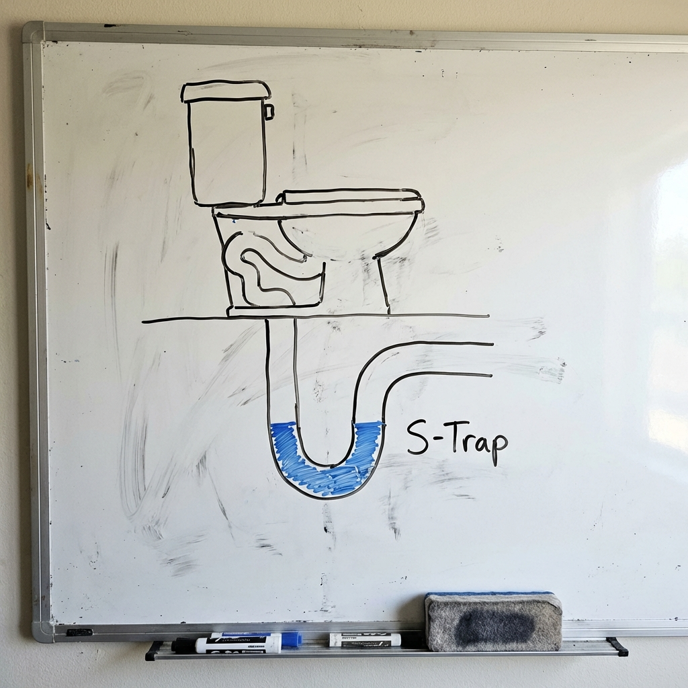
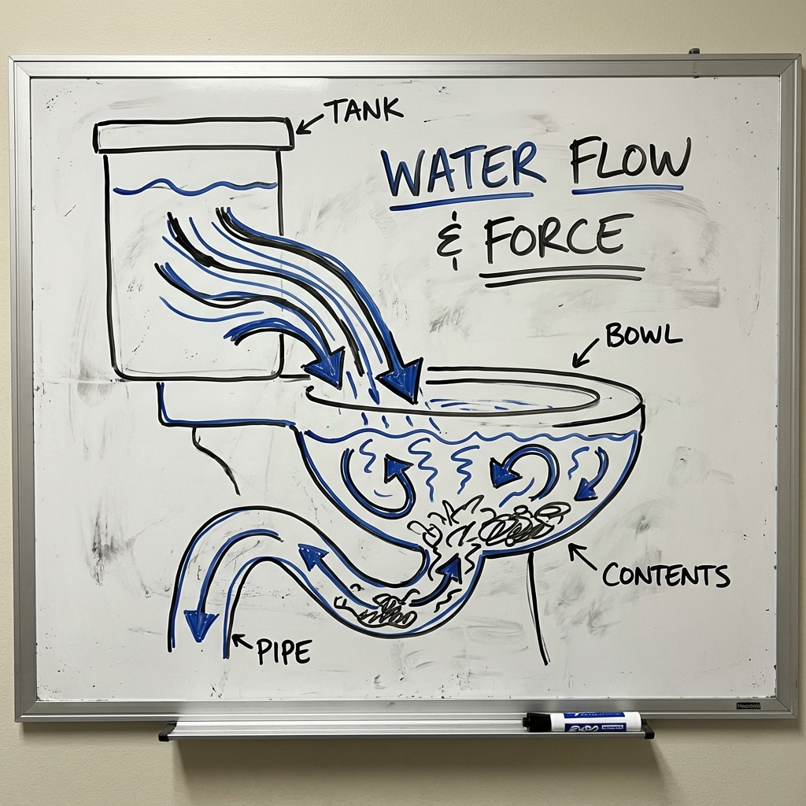
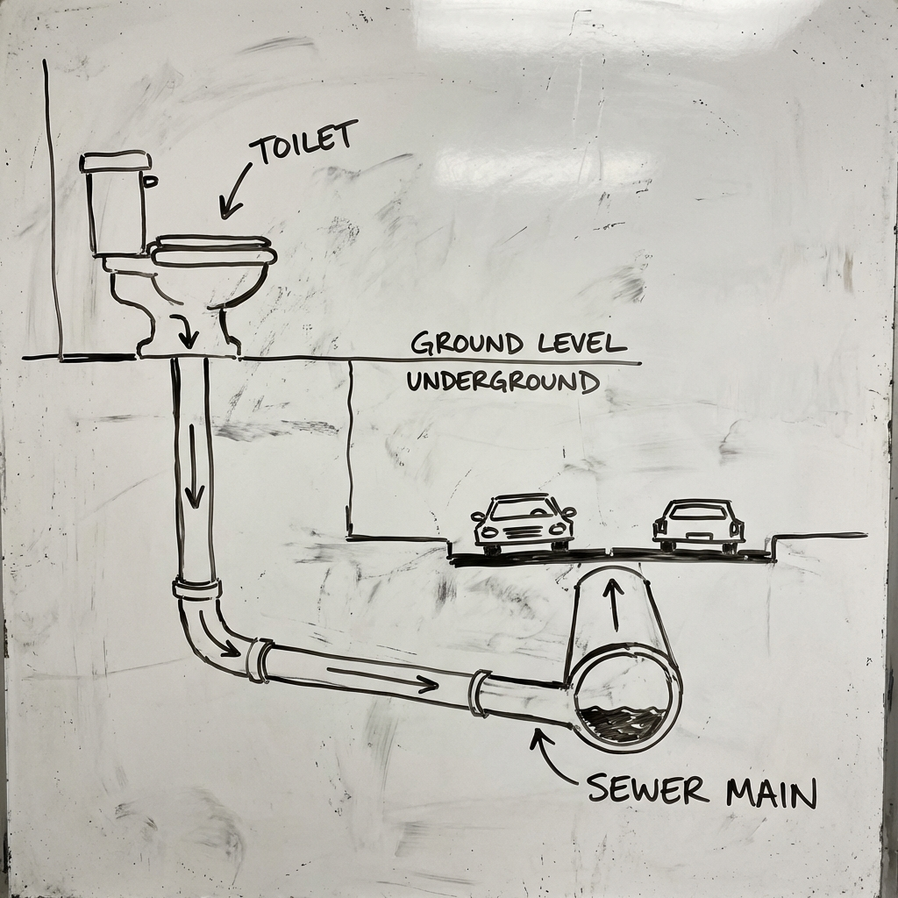
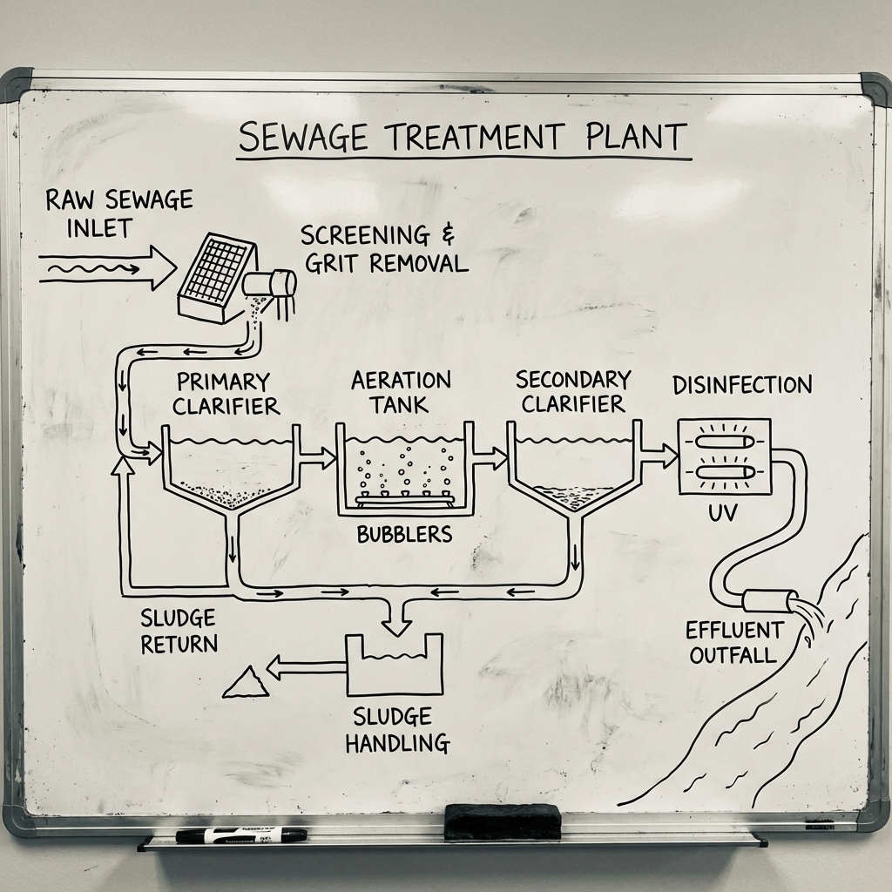

# 003 馬桶沖水後發生了什麼事？

> **適合年齡**: 5-9 歲
> **所需時間**: 10-15 分鐘
> **白板需求**: 小型可擦寫白板、藍色、棕色與黑色白板筆

---

## 今日主題

按下沖水按鈕，水和便便就消失了——但它們去了哪裡？這趟「黃金之旅」是怎麼進行的？

---

## 準備工作

### 白板初始圖形
畫一個馬桶的側面圖，旁邊畫一條彎彎的管子往下延伸。

### 所需道具（可選）
- 一根軟管或吸管（示範虹吸原理）
- 一盆水（示範沖水的力量）

---

## 引導問題

用這些問題開啟對話：

1. 「你覺得按下沖水按鈕後，便便去了哪裡？」
2. 「為什麼馬桶裡面永遠有一點水？」
3. 「如果沒有馬桶，古時候的人怎麼上廁所？」

---

## 白板圖解步驟

### Step 1：畫出馬桶的秘密——S 型水管

把馬桶下面的管子畫成 S 形狀，標示裡面有水。

**說這些話**：
「馬桶下面有一根很神奇的管子，長得像字母 S。你看，這裡彎彎的地方永遠都有水。這些水很重要喔！它就像一個『水塞子』，把下水道的臭味擋住，不讓臭味跑到我們的廁所來。」

### Step 2：畫出沖水的力量

用箭頭表示水從水箱衝下來，推動馬桶裡的東西。

**說這些話**：
「按下沖水按鈕，上面的水箱就會『嘩啦』一聲，放出很多很多水。這些水會像溜滑梯一樣衝下來，產生很大的力量，把馬桶裡的東西全部推走。就像你在游泳池潑水，可以把玩具推得遠遠的！」

### Step 3：畫出地下污水管

從馬桶往下畫一條管線，連接到馬路下面的大水管。

**說這些話**：
「便便被沖下去之後，會走進一條地下的秘密通道。這條管子埋在我們家的地底下，然後連到大馬路下面更大的管子。每一戶人家的馬桶都連到這條大水管，所以它是一條『便便高速公路』！」

### Step 4：畫出污水處理廠

在白板另一邊畫一個工廠，有水池和機器。

**說這些話**：
「便便最後會去一個特別的地方，叫做『污水處理廠』。在這裡，有很多小小的微生物——就像看不見的小蟲子——它們超愛吃便便！它們會把髒東西吃掉，把水變乾淨。處理好的水就可以放回河裡或海裡，又開始新的旅程了！」

---

## 核心原理

**一句話版本**：
便便被沖進下水道，經過地下管線送到污水處理廠，由微生物分解乾淨後才放回大自然。

**延伸解釋**（供家長參考）：
馬桶使用「虹吸原理」沖水。當水位超過 S 型彎管的最高點時，會產生虹吸效應，把整個馬桶裡的水和排泄物一起吸走。S 型彎管（稱為「存水彎」）的設計是為了隔絕下水道的臭氣。

污水處理分為三個階段：
1. **一級處理**：物理方法去除大型固體物
2. **二級處理**：生物方法，用微生物分解有機物
3. **三級處理**：化學方法，進一步去除氮磷等營養物

---

## 互動環節

### 讓孩子動手
「你能畫出便便的旅程地圖嗎？從馬桶出發，一路到污水處理廠！」

### 討論問題
- 「為什麼不能把玩具丟進馬桶沖掉？」
- 「如果全世界的人同時沖馬桶，會發生什麼事？」
- 「太空人在太空站上怎麼上廁所？」

---

## 日常連結

下次上廁所時，可以觀察：
- **沖水聲**：「你聽到那個『咕嚕咕嚕』的聲音了嗎？那就是虹吸作用把水吸走的聲音！」
- **馬桶裡的水**：「看，沖完水後，馬桶裡又有新的水了。這些水是來擋臭味的！」
- **兩段式按鈕**：「這個馬桶有大沖和小沖兩個按鈕，小沖用比較少水，上小號的時候用，可以省水喔！」

---

## 進階探索（給好奇寶寶）

如果孩子想知道更多：
- **「便便可以變成有用的東西嗎？」** → 可以！污水處理廠產生的「污泥」可以拿來發電，或是做成肥料讓植物長大。便便其實是寶貴的資源！
- **「沒有馬桶以前怎麼辦？」** → 古代人用「茅坑」，就是在地上挖一個洞。中世紀的歐洲城堡，便便會直接從城牆掉到護城河裡！

---

## 常見問題

**Q: 為什麼馬桶會塞住？**
A: 因為有些東西不該丟進馬桶！衛生紙太多、濕紙巾、玩具、頭髮......這些東西會卡在管子裡，像塞車一樣。記得只能丟「三種 P」：Pee（尿）、Poo（便便）、Paper（衛生紙）！

**Q: 為什麼廁所有時候會很臭？**
A: 通常是因為 S 型水管裡的水乾掉了，臭味就從下水道跑上來。多沖幾次水，讓水塞子補滿，臭味就會被擋住了。

---

## 家長小抄

記住便便的旅程：**馬桶→S彎管→地下污水管→污水處理廠→河流/海洋**

核心比喻：
- S 型水管 = 水做的塞子（擋臭味）
- 沖水 = 溜滑梯的力量（虹吸作用）
- 微生物 = 愛吃便便的小幫手（生物分解）

**小知識**：馬桶是 1596 年英國人約翰·哈林頓發明的，但一直到 19 世紀才普及。在那之前，人們用的是「夜壺」，每天早上把內容物倒到窗外......路人要小心！
