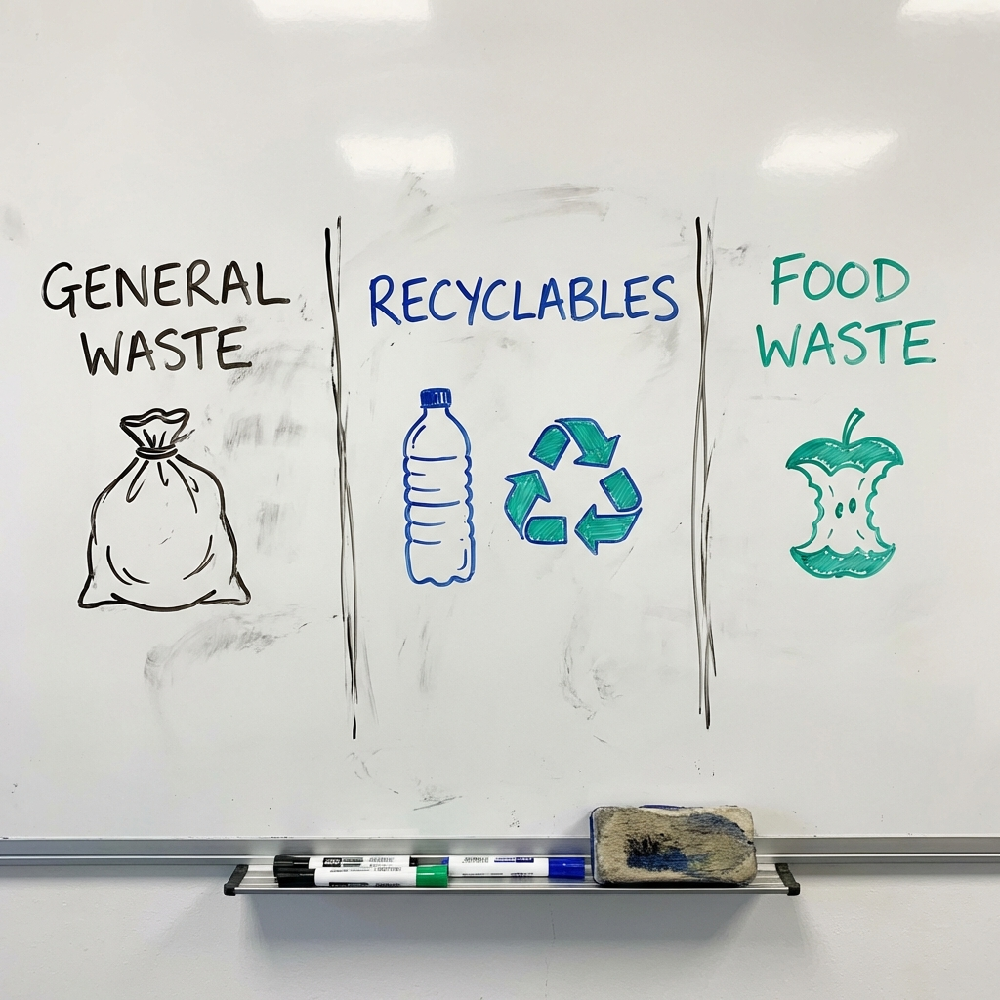

# 005 垃圾車收走垃圾後去了哪裡？

> **適合年齡**: 5-9 歲
> **所需時間**: 10-15 分鐘
> **白板需求**: 小型可擦寫白板、黑色、綠色與橘色白板筆

---

## 今日主題

垃圾車「叮叮咚」來了，把垃圾袋吃進肚子裡就開走了——這些垃圾最後去了哪裡？真的消失了嗎？

---

## 準備工作

### 白板初始圖形
畫一台垃圾車，後面畫三個不同顏色的垃圾桶（一般垃圾、回收、廚餘）。

### 所需道具（可選）
- 幾個回收物品（寶特瓶、紙盒、鋁罐）
- 家裡的垃圾分類桶

---

## 引導問題

用這些問題開啟對話：

1. 「你覺得垃圾車把垃圾吃進去之後，會帶去哪裡？」
2. 「為什麼我們要把垃圾分成三類？」
3. 「如果沒有垃圾車，垃圾會怎麼樣？」

---

## 白板圖解步驟

### Step 1：畫出垃圾的三條路（分類的意義）

把白板分成三區，畫出三種垃圾的不同命運。

**說這些話**：
「你知道嗎？垃圾也有不同的命運喔！就像我們上學、爸爸上班、媽媽去買菜，走不同的路。垃圾也要分類，才知道自己該去哪裡。讓我們畫出垃圾的三條路！」

### Step 2：畫出焚化爐（一般垃圾的終點）

在第一區畫一個有煙囪的焚化爐，火焰在燃燒。

**說這些話**：
「一般垃圾會坐垃圾車去『焚化爐』。焚化爐像一個超級大火爐，裡面的火非常非常熱，可以把垃圾燒成灰。燒垃圾產生的熱還可以用來發電呢！但是燒完會剩下灰，這些灰要埋到山裡面去，叫做『掩埋場』。」

### Step 3：畫出回收廠（回收物的新生）

在第二區畫工廠，旁邊畫舊瓶子變新瓶子的過程。

**說這些話**：
「回收物會去『回收廠』，在那裡它們會變身！寶特瓶可以變成新瓶子或衣服，舊報紙可以變成新紙張，鋁罐可以變成新的鋁罐。這叫做『再生』——讓垃圾重新變成有用的東西！是不是很神奇？」

### Step 4：畫出堆肥場（廚餘的旅程）

在第三區畫一堆土，旁邊畫蔬菜和小蟲。

**說這些話**：
「廚餘——就是吃剩的菜渣、果皮、蛋殼這些——會去『堆肥場』。那裡有很多蚯蚓和微生物，它們超愛吃這些東西！吃完之後，廚餘就會變成營養的肥料，可以讓花花草草長得更漂亮。所以廚餘不是垃圾，是植物的食物！」

---

## 核心原理

**一句話版本**：
垃圾分成三類：一般垃圾去焚化爐燒掉、回收物去工廠變成新東西、廚餘變成肥料回到土地。

**延伸解釋**（供家長參考）：
台灣的垃圾處理以焚化為主，全島有 24 座焚化爐，垃圾焚燒率超過 95%。焚化產生的熱能會用來發電（廢熱回收）。燒完的「底渣」和「飛灰」需要做安全處理後才能掩埋。

回收物會經過分選、清洗、破碎、再製等程序。台灣的資源回收率約 55%，在國際上屬於前段班。廚餘處理有兩種方式：養豬（熟廚餘）和堆肥（生廚餘）。

---

## 互動環節

### 讓孩子動手
「我手上有這些東西（寶特瓶、紙盒、果皮、用過的衛生紙），你能幫它們分類嗎？畫出它們該走的路！」

### 討論問題
- 「如果地球上到處都是垃圾山，會變成什麼樣子？」
- 「有什麼東西是沒辦法回收的？」
- 「我們可以怎麼做，讓垃圾變少一點？」

---

## 日常連結

每天丟垃圾時，可以跟孩子聊：
- **分類時**：「這是塑膠袋，要丟一般垃圾。這是寶特瓶，記得把蓋子轉下來，它們要分開回收喔！」
- **垃圾車來時**：「聽！那個音樂聲——垃圾車來了！今天是收回收的日子。」
- **回收標誌**：「你看，瓶子底下有這個三角形的標誌，代表它可以回收。」

---

## 進階探索（給好奇寶寶）

如果孩子想知道更多：
- **「燒垃圾不會污染空氣嗎？」** → 現代的焚化爐有很厲害的過濾系統，會把有毒的煙過濾掉。但是還是會排出一些二氧化碳，所以減少垃圾才是最好的方法！
- **「寶特瓶怎麼變成衣服？」** → 把寶特瓶切碎、融化、抽成細絲，再織成布料！一件 T 恤大約需要 12 個寶特瓶。

---

## 常見問題

**Q: 為什麼不能把所有垃圾都燒掉？**
A: 有些東西燒了會產生毒煙（像電池、塑膠），有些東西可以回收再利用（像玻璃、金屬），燒掉太可惜了！而且燒垃圾也需要能量，如果能回收利用，可以省下很多資源。

**Q: 以前沒有垃圾車的時候怎麼辦？**
A: 以前的人製造的垃圾比較少，大部分是可以分解的東西（像木頭、布、食物殘渣），會自然腐爛。塑膠和玻璃是近代才發明的，這些東西埋在地下幾百年也不會消失！

---

## 家長小抄

記住垃圾的三條路：
- **一般垃圾** → 焚化爐（燒掉）→ 掩埋場（埋灰）
- **回收物** → 回收廠（變身）→ 新產品
- **廚餘** → 堆肥場/養豬場 → 肥料/飼料

核心概念：
- **減量 (Reduce)**：少買、少用
- **重複使用 (Reuse)**：自備購物袋
- **回收 (Recycle)**：確實分類

**口訣**：「瓶瓶罐罐紙電1357」——指的是各類回收物，可以教孩子認識回收標誌。
