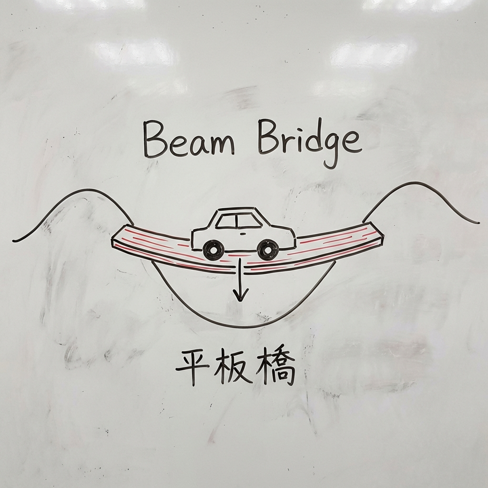
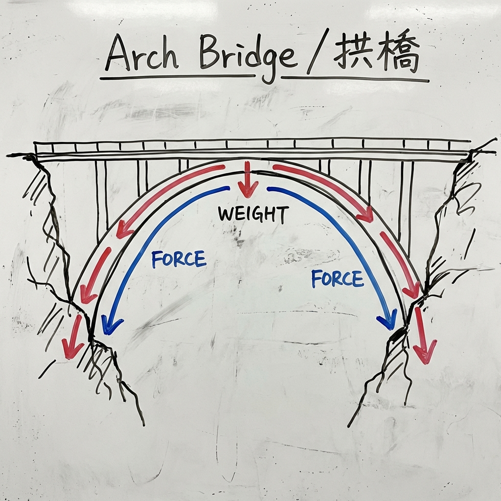
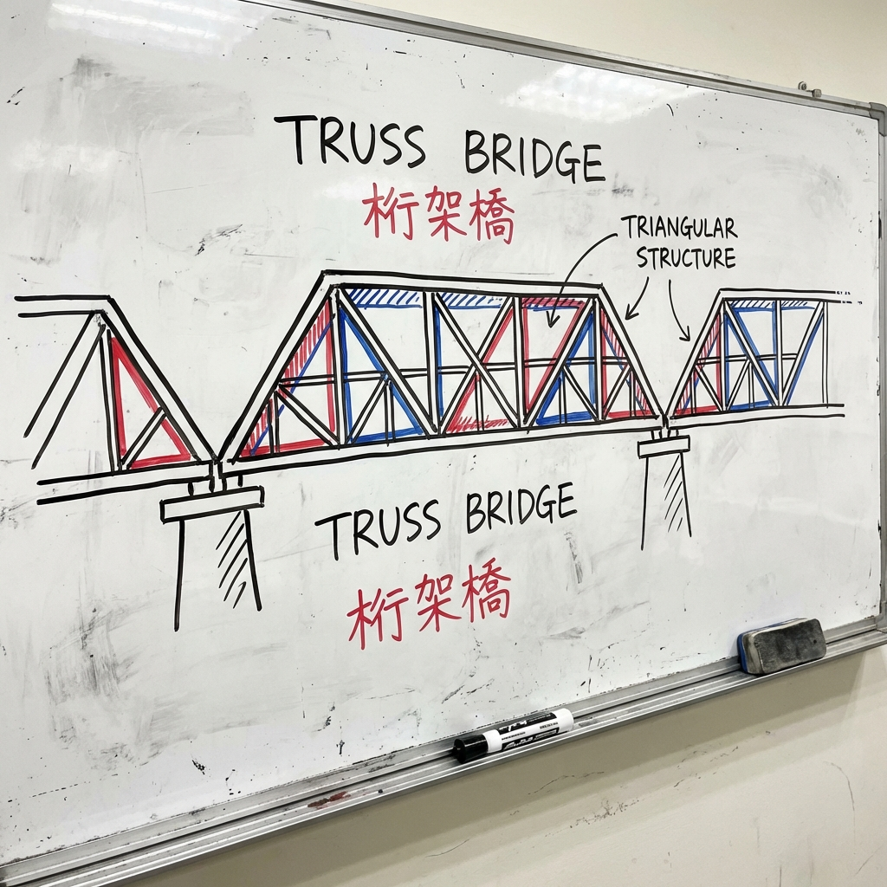
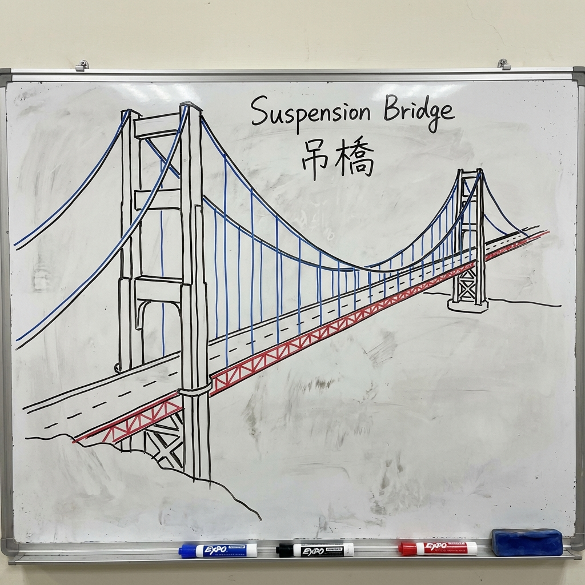

# 006 為什麼橋樑不會垮下來？

> **適合年齡**: 5-9 歲
> **所需時間**: 10-15 分鐘
> **白板需求**: 小型可擦寫白板、黑色與紅色白板筆

---

## 今日主題

那麼多車子、卡車在橋上跑，橋為什麼不會斷掉？橋的形狀藏著什麼秘密？

---

## 準備工作

### 白板初始圖形
畫兩個山坡或河岸，中間空著（需要搭橋的地方）。

### 所需道具（可選）
- 一張紙（示範不同摺法的承重力）
- 幾本書（當作橋墩）
- 小玩具車（測試橋的強度）

---

## 引導問題

用這些問題開啟對話：

1. 「如果用一張紙當橋，能撐住多重的東西？」
2. 「你有沒有注意過，橋有很多不同的形狀？」
3. 「為什麼有些橋是彎彎的弧形，有些是直直的？」

---

## 白板圖解步驟

### Step 1：畫出最簡單的橋——平板橋

在兩個山坡之間畫一條直線當橋，放一輛車在上面，橋中間往下彎。

**說這些話**：
「最簡單的橋就是一塊木板。但是你看，當重重的車子壓在中間的時候，橋會怎樣？對！會往下彎，彎太多就斷掉了。這種橋只能做短短的，不能太長。」

### Step 2：畫出拱橋——彎腰的魔法

畫一座拱形橋，用箭頭顯示力量怎麼傳到兩邊。

**說這些話**：
「古時候的人發現一個秘密：如果把橋做成彎彎的弧形，它就會變得超級強壯！你看，當車子壓在拱橋上，力量會沿著弧形傳到兩邊的山壁去。就像你用手撐在桌子兩邊做伏地挺身，力量會傳到你的手臂一樣。弧形會『推』著兩邊，把重量分散掉！」

### Step 3：畫出三角形的秘密

畫一座桁架橋（用很多三角形組成），標示三角形。

**說這些話**：
「工程師還發現另一個秘密——三角形是最穩定的形狀！你看這座橋，裡面有好多好多三角形。三角形不會變形，正方形會被壓歪，但三角形不會。所以很多橋都用很多三角形組起來，就像用很多個小超人一起撐住橋！」

### Step 4：畫出吊橋——用繩子撐住

畫一座吊橋，有高塔和鋼纜垂下來。

**說這些話**：
「還有一種超酷的橋叫『吊橋』！你看，橋面是掛在這些鋼纜上的，鋼纜連到兩邊的高塔。就像盪鞦韆，繩子把你吊起來。高塔像兩隻大手，把整座橋抓在半空中！這種橋可以做得非常非常長，跨過很寬的河流。」

---

## 核心原理

**一句話版本**：
橋靠著特殊的形狀（拱形、三角形）把重量分散掉，讓力量傳到兩邊的地面，而不是壓在橋的中間。

**延伸解釋**（供家長參考）：
橋樑承受的力量主要有兩種：壓力（compression）和拉力（tension）。不同橋型處理這些力的方式不同：
- **拱橋**：把力量轉換成沿著拱圈傳遞的壓力
- **桁架橋**：三角形結構把力量分解成多個小的力
- **吊橋**：鋼纜承受拉力，塔柱承受壓力

世界最長的吊橋是日本的明石海峽大橋（主跨 1,991 公尺）。台灣知名的橋樑包括碧潭吊橋、關渡大橋等。

---

## 互動環節

### 讓孩子動手
「我們來做實驗！拿一張紙，看看它能撐住多少硬幣。然後把紙摺成拱形，再試試看——是不是變強了？」

### 討論問題
- 「你見過最長的橋是什麼橋？」
- 「如果你是工程師，你會怎麼設計一座跨過大海的橋？」
- 「為什麼古代的石拱橋到現在還在，幾百年都不壞？」

---

## 日常連結

看到橋的時候，可以觀察：
- **過橋時**：「你看，這座橋用了什麼形狀？是直直的平板、還是彎彎的拱形？」
- **看照片**：「金門大橋是一座紅色的吊橋，你看到那些大鋼纜了嗎？」
- **玩積木時**：「試試看用三角形蓋一座橋，是不是比用正方形更穩？」

---

## 進階探索（給好奇寶寶）

如果孩子想知道更多：
- **「橋會不會太重把自己壓垮？」** → 會！所以工程師會用很輕但很強的材料，像是鋼筋混凝土、甚至碳纖維。設計橋的時候，要先算好橋自己有多重，再加上車子、人、風、地震的力量。
- **「最長的橋可以多長？」** → 中國的丹昆特大橋是世界最長的橋，全長超過 164 公里，比台北到台中還要遠！

---

## 常見問題

**Q: 橋斷掉會怎麼樣？**
A: 橋斷掉會造成很可怕的意外，所以工程師設計橋的時候會非常小心。他們會用電腦模擬各種情況（颱風、地震、很多卡車同時經過），確保橋能承受比正常情況強很多倍的力量。而且橋蓋好之後，還會定期檢查有沒有裂縫。

**Q: 為什麼有些橋底下是空的，不是實心的？**
A: 實心的橋會太重，把自己壓垮！而且空的地方其實有很多三角形和鋼架在撐著，這樣既輕又強壯。就像你的骨頭裡面也是空的，但還是很硬一樣！

---

## 家長小抄

記住橋樑的三個秘密：
- **拱形**：把力量傳到兩邊（像用手撐著）
- **三角形**：最穩定的形狀（不會變形）
- **吊掛**：用鋼纜分擔重量（像盪鞦韆）

**小實驗**：
1. 一張紙平放在兩本書之間，放幾個硬幣會垮
2. 把紙摺成 W 形或拱形，承重力大增
3. 讓孩子親手體驗「形狀改變強度」的魔法
