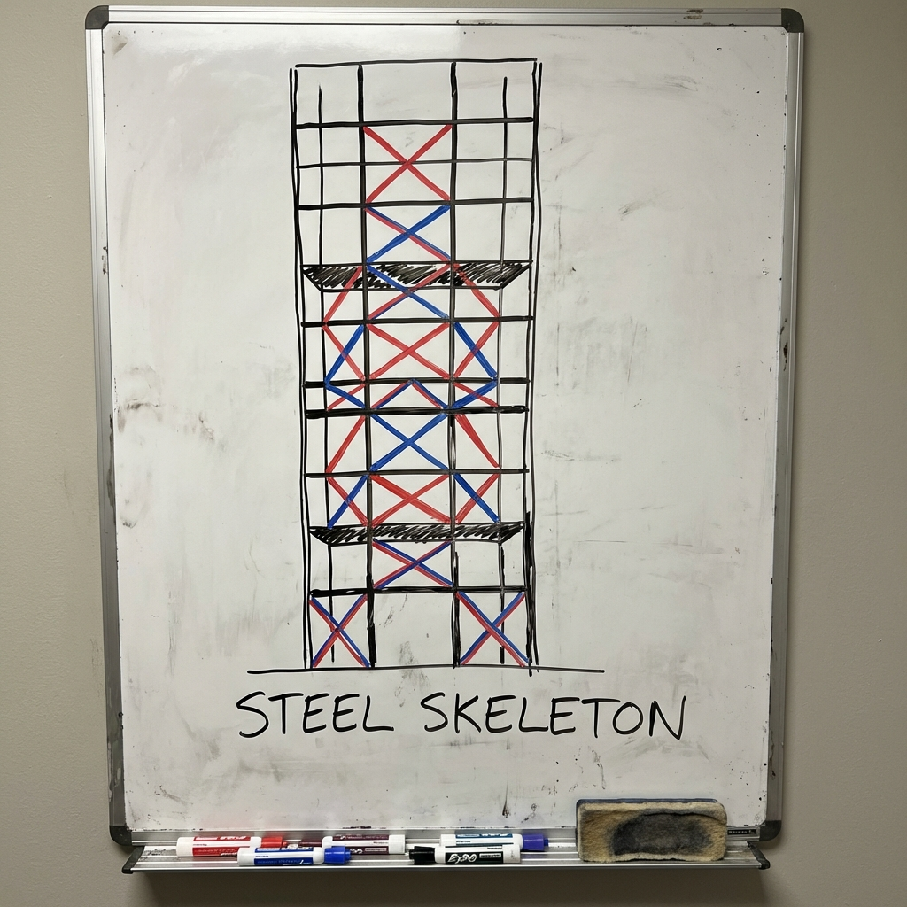
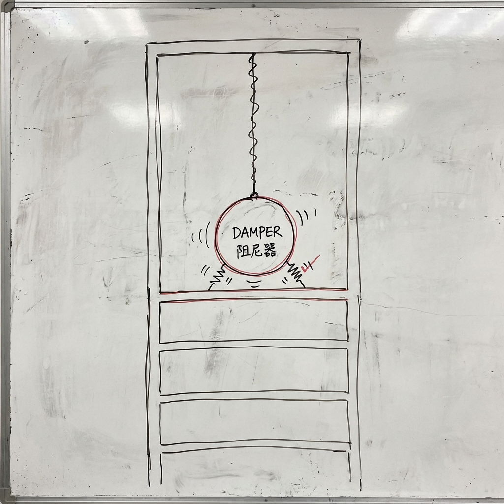
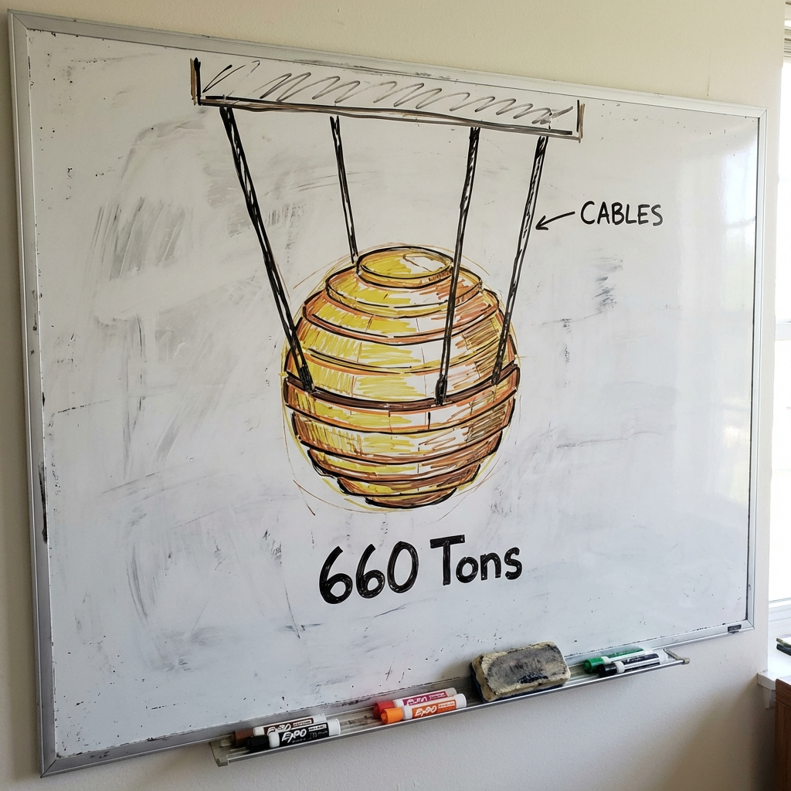

# 007 摩天大樓為什麼不怕強風？

> **適合年齡**: 6-9 歲
> **所需時間**: 10-15 分鐘
> **白板需求**: 小型可擦寫白板、黑色、紅色與藍色白板筆

---

## 今日主題

台北 101 有 508 公尺高，颱風來的時候風那麼大，為什麼它不會被吹倒？裡面藏著什麼秘密武器？

---

## 準備工作

### 白板初始圖形
畫一棟很高很高的大樓，旁邊畫風吹過來的箭頭。

### 所需道具（可選）
- 一根長尺或筷子（示範彎曲但不斷）
- 一顆球綁在繩子上（示範阻尼器原理）

---

## 引導問題

用這些問題開啟對話：

1. 「你有沒有在高樓上感覺到樓在晃？」
2. 「為什麼風箏會被風吹走，但大樓不會？」
3. 「你知道台北 101 裡面有一顆超大的金色球球嗎？」

---

## 白板圖解步驟

### Step 1：畫出風對大樓的力量

在大樓旁邊畫風的箭頭，大樓微微傾斜。

**說這些話**：
「颱風的時候，風會很用力地推大樓。你看，風從這邊吹過來，大樓會往另一邊傾斜。但是不用擔心！工程師設計大樓的時候，就已經算好大樓會晃多少了。大樓本來就是會晃的，像竹子一樣，彎一彎但不會斷。」

### Step 2：畫出大樓的骨架——鋼骨結構

在大樓裡面畫出交叉的鋼樑，像一個大籠子。

**說這些話**：
「大樓裡面有很強壯的骨架，是用超級硬的鋼鐵做的。你看，這些鋼樑交叉在一起，像一個大籠子把整棟大樓包起來。這些交叉的形狀是什麼？對！三角形！記得我們說過，三角形是最穩定的形狀。」

### Step 3：畫出阻尼器——大樓的平衡球

在大樓上層畫一顆大球，用繩子掛著。

**說這些話**：
「現在要介紹大樓的秘密武器了！這顆大球叫做『阻尼器』。當風把大樓往右邊推的時候，這顆球會往左邊晃。就像你在盪鞦韆的時候，如果有人在反方向推你，你就會停下來。這顆球就是幫大樓『剎車』的！」

### Step 4：畫出台北 101 的風阻尼器

畫一顆金色的大球，標示「660 噸」。

**說這些話**：
「台北 101 裡面就有一顆超級大的金色球球！它重達 660 噸，比 100 隻大象還重！這顆球掛在 87 到 92 樓之間，當颱風來的時候，它會往反方向晃動，幫助大樓保持平衡。下次你去參觀 101，可以親眼看到這顆球喔！」

---

## 核心原理

**一句話版本**：
摩天大樓靠著強壯的鋼骨架和會反方向晃動的「阻尼器」大球，讓風的力量被抵消，所以不會被吹倒。

**延伸解釋**（供家長參考）：
高層建築抗風設計有幾個關鍵：

1. **結構剛度**：鋼骨、斜撐、核心筒等結構讓大樓能承受側向力
2. **調諧質量阻尼器（TMD）**：利用質量塊的反向運動來減少晃動
3. **空氣動力學設計**：建築外形設計可減少風渦效應

台北 101 的風阻尼器是世界上最大的可見式阻尼器，由 41 層圓盤疊成，直徑 5.5 公尺。它可以減少約 40% 的晃動。

---

## 互動環節

### 讓孩子動手
「你能畫出一棟你設計的摩天大樓嗎？記得要畫裡面的骨架和阻尼器！你想用什麼形狀的阻尼器？」

### 討論問題
- 「如果你住在 101 樓，地震的時候會是什麼感覺？」
- 「世界上最高的大樓是哪一棟？它有多高？」
- 「為什麼不乾脆把大樓做得很矮很矮，就不怕風了？」

---

## 日常連結

看到高樓時，可以聊聊：
- **路過大樓**：「你看這棟大樓，猜猜看它有幾層樓？裡面一定也有很強的骨架！」
- **颱風天**：「今天風好大，想想看 101 的那顆大球一定在努力工作！」
- **參觀 101**：「去看看那顆金色的大球，它正在幫大樓保持平衡呢！」

---

## 進階探索（給好奇寶寶）

如果孩子想知道更多：
- **「住在最高樓的人會不會頭暈？」** → 其實阻尼器工作得很好，住在高樓的人通常感覺不到晃動。但是在超級強的颱風或地震時，還是會稍微感覺到搖晃，就像坐船一樣。
- **「大樓會不會長高？」** → 大樓不會長高，但是會「呼吸」！白天太陽曬的時候，鋼鐵會膨脹，大樓會稍微變高一點點；晚上涼了又會縮回去。

---

## 常見問題

**Q: 如果阻尼器壞掉了怎麼辦？**
A: 阻尼器只是「加分項」，就算沒有阻尼器，大樓的骨架本身就很強壯，不會倒塌。阻尼器的作用是讓住在裡面的人更舒服，不會感覺晃得太厲害。而且阻尼器會定期檢查維修。

**Q: 地震和颱風，哪個對大樓比較危險？**
A: 兩個都很危險，但危險的方式不一樣。颱風是一直推推推，地震是搖搖搖。台灣的大樓設計會同時考慮這兩種情況，確保都能安全度過。

---

## 家長小抄

記住大樓抗風的兩個秘密：
- **骨架**：鋼骨 + 三角形結構（像竹子一樣可以彎但不會斷）
- **阻尼器**：反方向晃動的大球（幫大樓「剎車」）

台北 101 小知識：
- 高度：508 公尺
- 樓層：101 層（地上）+ 5 層（地下）
- 阻尼器重量：660 噸
- 阻尼器位置：87-92 樓

**小實驗**：用繩子吊一顆球，推動球後，試著用另一顆球從反方向撞它，看看會發生什麼——這就是阻尼器的原理！
