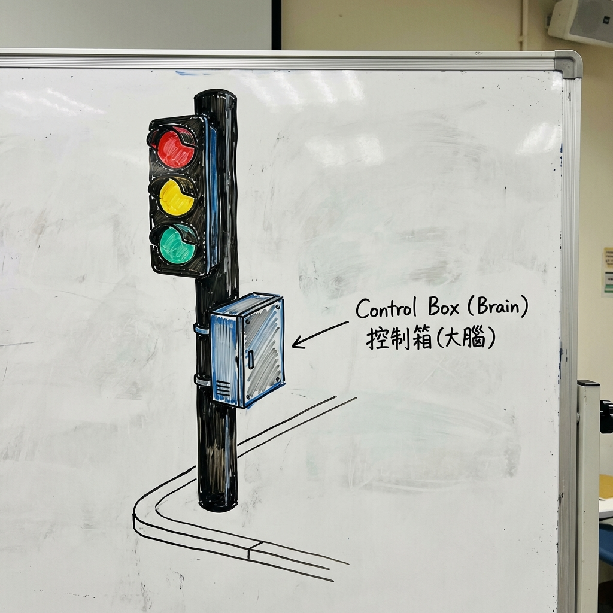
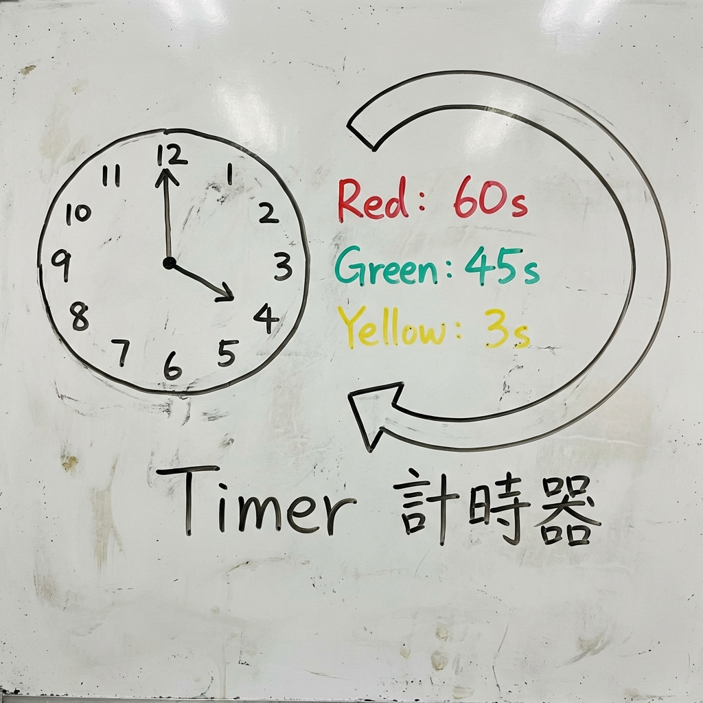
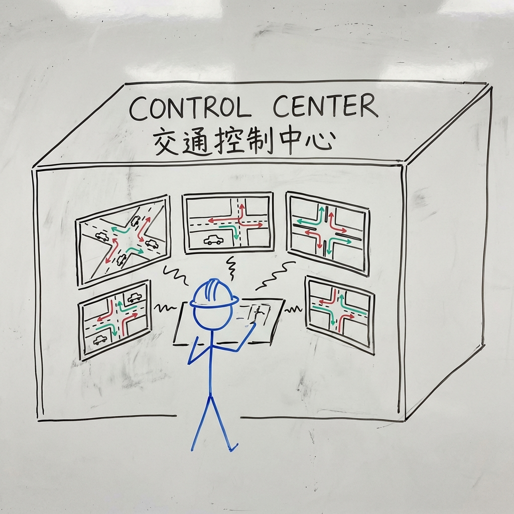

# 012 街道上的紅綠燈是誰在控制？

> **適合年齡**: 5-9 歲
> **所需時間**: 10-15 分鐘
> **白板需求**: 小型可擦寫白板、紅色、綠色、黃色與黑色白板筆

---

## 今日主題

紅燈停、綠燈行，但是誰決定什麼時候變綠燈？是有人在按按鈕嗎？

---

## 準備工作

### 白板初始圖形
畫一個十字路口，四個角落各有一組紅綠燈。

### 所需道具（可選）
- 計時器或手錶（觀察紅綠燈變換的時間）
- 紅黃綠三色卡片（模擬紅綠燈）

---

## 引導問題

用這些問題開啟對話：

1. 「你覺得是有人坐在旁邊按按鈕讓燈變色嗎？」
2. 「為什麼不是所有路口的紅綠燈都同時變？」
3. 「如果沒有紅綠燈，路口會變成什麼樣子？」

---

## 白板圖解步驟

### Step 1：畫出紅綠燈的大腦——控制箱

在路口旁邊畫一個金屬箱子，標示「控制箱」。

**說這些話**：
「每個紅綠燈旁邊都有一個灰色的箱子，你有沒有注意過？那就是紅綠燈的『大腦』！裡面有一台小電腦，它會按照設定好的時間，告訴燈什麼時候變紅、什麼時候變綠。」

### Step 2：畫出計時器的概念

畫一個時鐘，旁邊寫「紅燈 60 秒、綠燈 45 秒、黃燈 3 秒」。

**說這些話**：
「控制箱裡面有一個計時器，像鬧鐘一樣。它會算：『綠燈亮 45 秒了，該變黃燈了！黃燈 3 秒，該變紅燈了！』然後另一邊的燈就變綠，讓那邊的車可以走。這樣一直輪流、一直輪流。」

### Step 3：畫出感應器——聰明的紅綠燈

在地上畫幾個圓圈，標示「感應器」。

**說這些話**：
「有些聰明的紅綠燈還會『看路』喔！地上埋著感應器，可以感覺到有沒有車子在等。如果一邊車很多，另一邊沒有車，它就會讓多車的那邊綠燈久一點。還有的路口有攝影機，可以『看』到車流量！」

### Step 4：畫出交通控制中心

畫一棟大樓，裡面有很多螢幕和工程師。

**說這些話**：
「最厲害的是，城市裡所有的紅綠燈都可以連在一起！在一個叫『交通控制中心』的地方，有工程師叔叔阿姨看著很多螢幕，他們可以控制整個城市的紅綠燈。如果哪裡塞車了，他們可以調整燈號，讓車流動起來！」

---

## 核心原理

**一句話版本**：
紅綠燈由路口的控制箱（小電腦）按照設定的時間自動切換，有些還會用感應器偵測車流量來調整。

**延伸解釋**（供家長參考）：
現代交通號誌系統分為幾個層級：
1. **固定時制**：按預設時間循環，適合車流穩定的路口
2. **感應式控制**：使用地下線圈、紅外線或影像偵測器，根據實際車流調整
3. **適應性控制**：連接到區域交通控制中心，可即時調整整個區域的燈號

行人按鈕（觸動式號誌）讓行人可以「申請」綠燈，系統會在適當時機切換。倒數計時顯示器讓用路人知道還要等多久。

---

## 互動環節

### 讓孩子動手
「我們來設計一個路口的紅綠燈！畫出哪一邊亮綠燈、哪一邊亮紅燈。記得對面的車要一起動喔！」

### 討論問題
- 「行人按鈕按下去之後，是馬上變綠燈嗎？」
- 「深夜的時候，紅綠燈還需要一樣的時間嗎？」
- 「如果紅綠燈壞掉了，車子要怎麼通過路口？」

---

## 日常連結

過馬路時，可以觀察：
- **行人按鈕**：「按這個按鈕，系統就知道有人想過馬路。但它不會馬上變綠燈，要等另一邊的車先停下來。」
- **倒數計時**：「看！還有 15 秒綠燈就要結束了。這個倒數是讓我們知道要不要趕快走。」
- **深夜閃燈**：「半夜車子很少的時候，有些燈會一直閃黃燈，表示『注意看有沒有車，自己小心通過』。」

---

## 進階探索（給好奇寶寶）

如果孩子想知道更多：
- **「綠波帶是什麼？」** → 在大馬路上，工程師會把紅綠燈調成『波浪』狀，讓你開一定的速度，可以一路綠燈不用停！這叫做「綠波帶」，像綠色的波浪一樣推著你前進。
- **「為什麼救護車可以闖紅燈？」** → 救護車上有特別的裝置，可以發送訊號給紅綠燈，讓它變成綠燈。這叫做「緊急車輛優先號誌」，救人最重要！

---

## 常見問題

**Q: 紅綠燈壞掉怎麼辦？**
A: 如果紅綠燈壞掉或停電，會變成全部閃黃燈或全暗。這時候車子要把路口當成「停」字路口，互相禮讓，慢慢通過。如果太亂，警察叔叔會來指揮交通！

**Q: 為什麼黃燈只亮一下下？**
A: 黃燈是「準備停下來」的意思，給駕駛人一點時間反應。如果黃燈太長，有些人會覺得「黃燈可以衝過去」，反而更危險。通常黃燈只有 3-5 秒。

---

## 家長小抄

記住紅綠燈的運作：**控制箱（大腦）→ 計時器（節奏）→ 感應器（觀察）→ 控制中心（協調）**

核心比喻：
- 控制箱 = 紅綠燈的大腦
- 計時器 = 鬧鐘（到時間就換顏色）
- 感應器 = 眼睛（看有沒有車）
- 控制中心 = 交通指揮官

**交通安全口訣**：
- 紅燈停、綠燈行、黃燈要小心
- 過馬路要走斑馬線
- 綠燈亮了也要左右看
- 不要在馬路上奔跑
